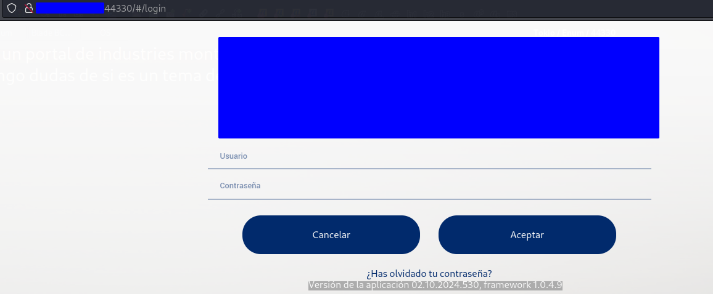
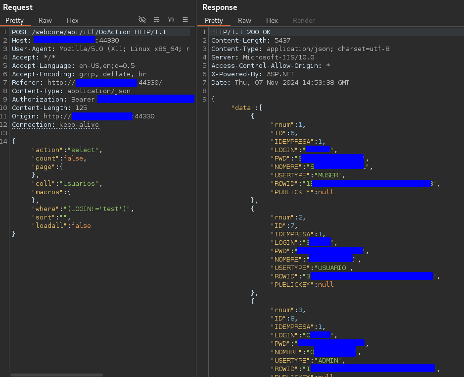
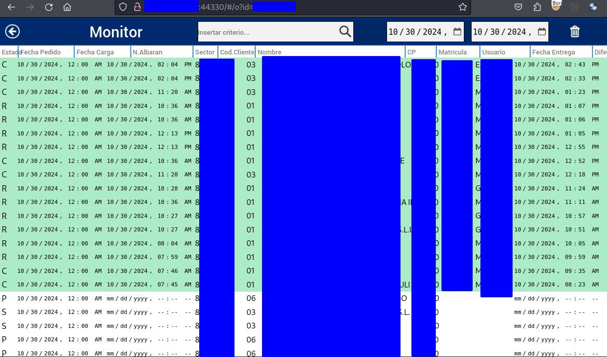
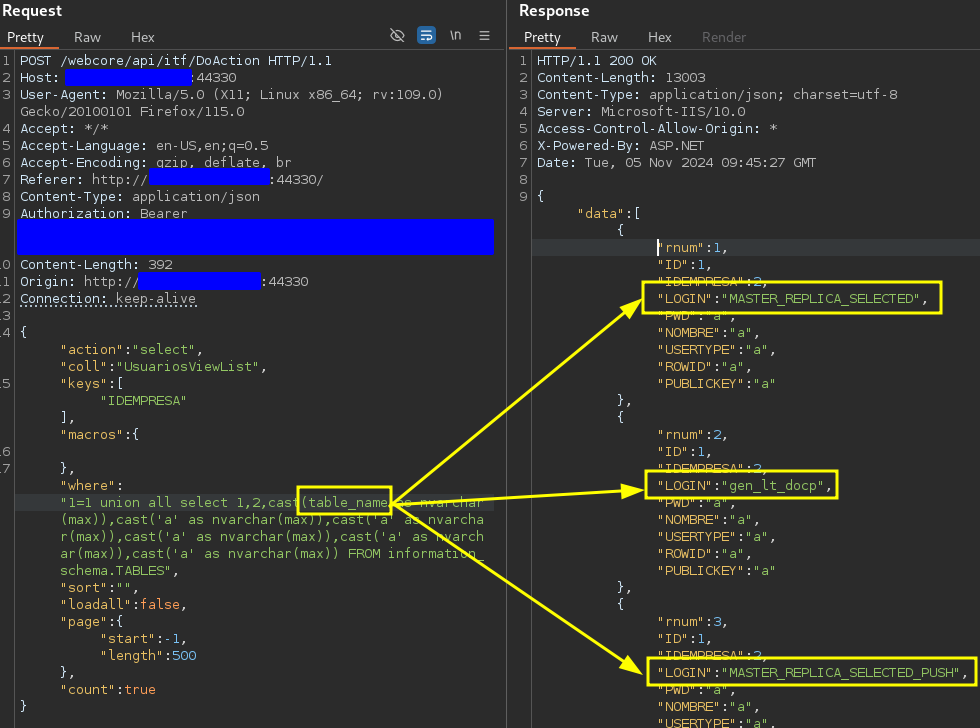
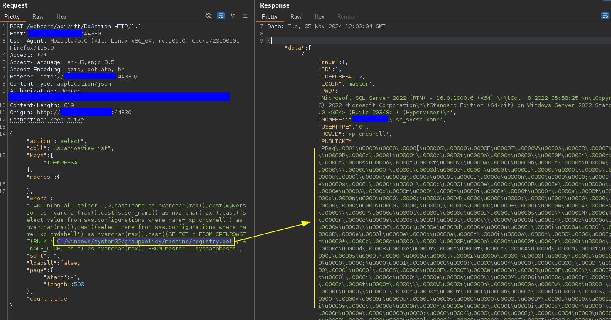

# Vulnerability: Unauthenticated SQL Injection - Clear Credentials Dump

**Author**: Javier Carabantes

**Affected Software**: `XOne Web Monitor`

**Software**: `https://xone.es/`

**Affected Version**: 02.10.2024.530 framework 1.0.4.9 


## Description
An unauthenticated SQL injection vulnerability has been discovered in the login functionality of `XOne Web Monitor` version 02.10.2024.530 framework 1.0.4.9 . This flaw allows attackers to exploit improper handling of user input during the authentication process to extract all stored usernames and passwords. Specifically, the login endpoint's design allows attackers to manipulate a `WHERE` clause through a vulnerable input parameter.

## Affected Endpoint
`/webcore/api/itf/DoAction`

## Proof of Concept
The following demonstrates how the vulnerability can be exploited using a crafted `POST` request to the vulneranle version:


When an invalid login is provided, like "test:test", the following request is sent

### Request
```http
POST /webcore/api/itf/DoAction HTTP/1.1
Host: redacted:44330
User-Agent: Mozilla/5.0 (X11; Linux x86_64; rv:109.0) Gecko/20100101 Firefox/115.0
Accept: */*
Accept-Language: en-US,en;q=0.5
Accept-Encoding: gzip, deflate, br
Referer: http://redacted:44330/
Content-Type: application/json
Authorization: Bearer redacted
Content-Length: 124
Origin: http://redacted:44330
Connection: keep-alive

{"action":"select","count":false,"page":{},"coll":"Usuarios","macros":{},"where":"(LOGIN='test')","sort":"","loadall":false}
```
Notice how the password is not send and the username is wrapped in a where property.
Changing the operator of the LOGIN field will give the full list of users and password in clear text:

### Burp Suite Example


The response reveals the list of all usernames and their corresponding passwords stored in the database.
Any user has the ability to access and get sensitive data (customers, employee position, etc).



## Additional Notes
This SQL injection vulnerability also supports the use of UNION queries in MSSQL, allowing attackers to enumerate and retrieve data from other tables in the database.



The same injection allows LFD if the attacker knows the absolute path, example of reading C:/windows/system32/grouppolicy/machine/registry.pol, a privileged file:



## Disclaimer
The vendor was notified of this vulnerability during the week of **11/11/2024**. 

The webpage shown in the PoC has been unpublished.
