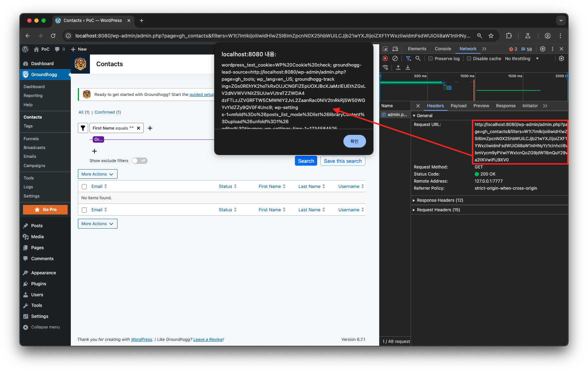
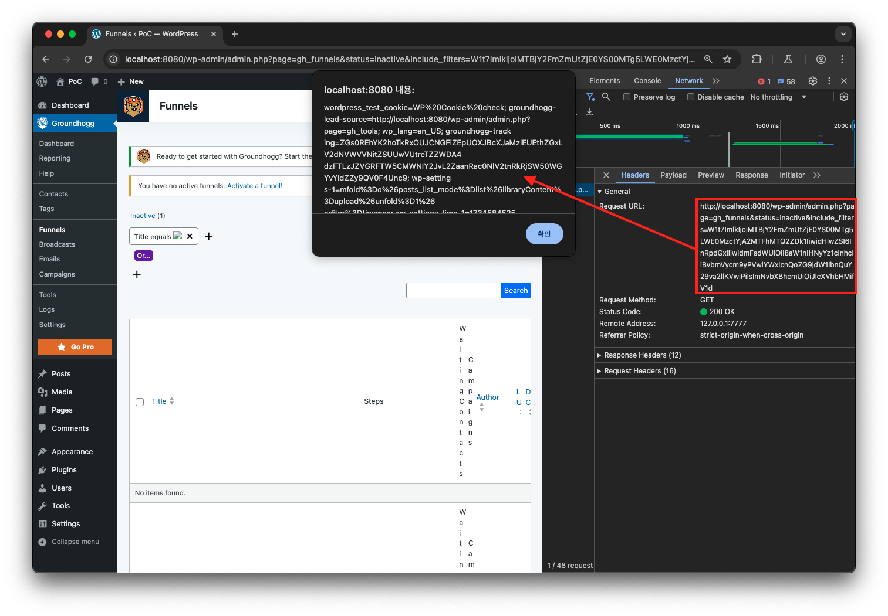
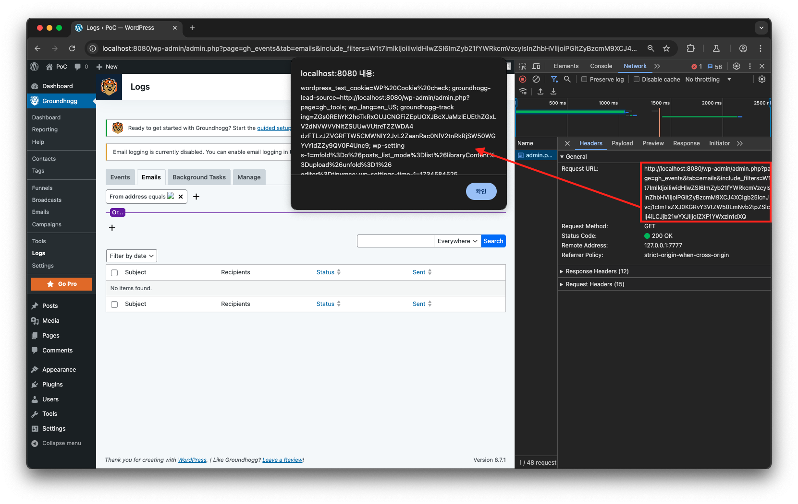
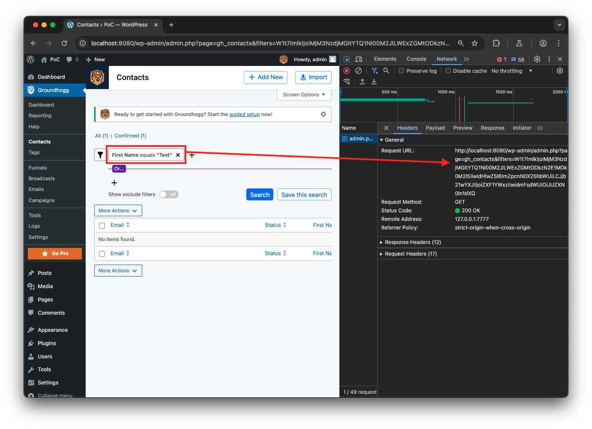
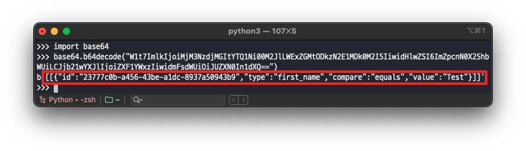
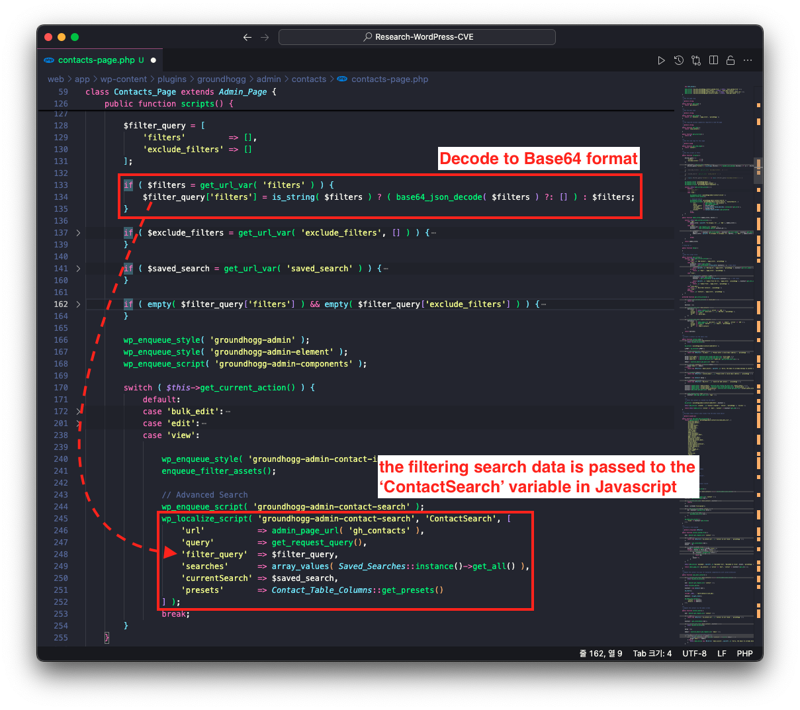
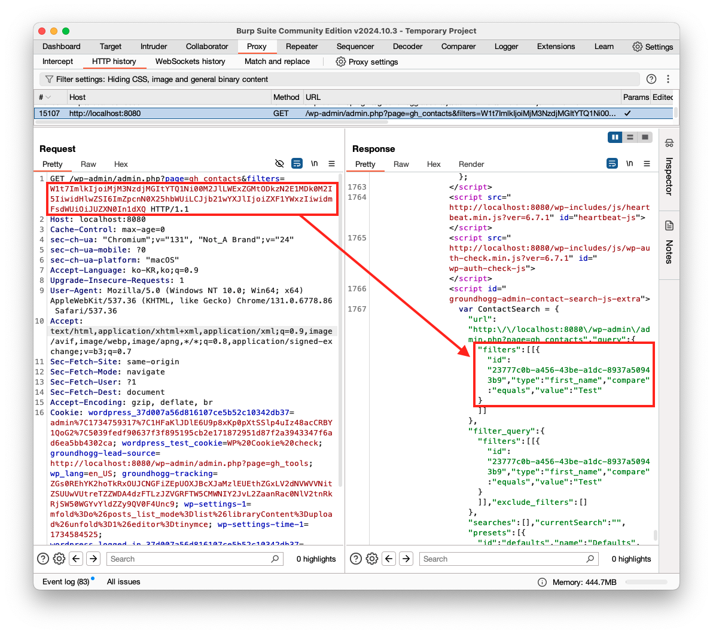
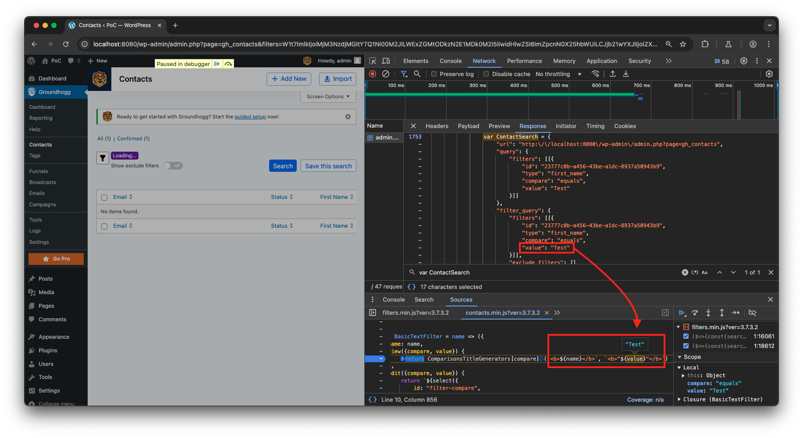
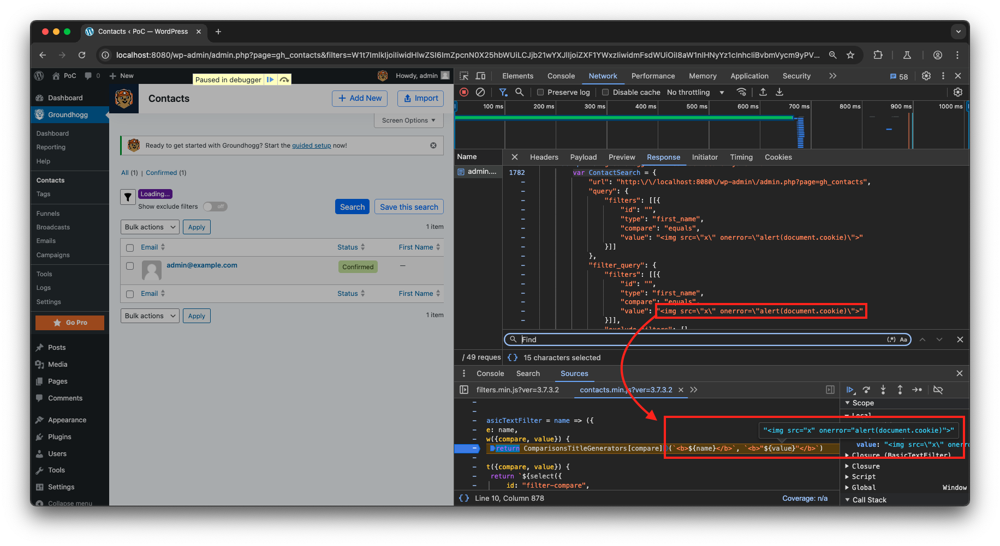
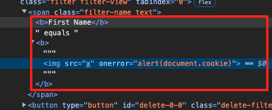

# CVE-2024-56289

## 1️⃣ Component type

WordPress plugin

## 2️⃣ Component details

`Component name` WordPress CRM, Email & Marketing Automation for WordPress | Award Winner — Groundhogg

`Vulnerable version` <= 3.7.3.2

`Component slug` groundhogg

`Component link` https://wordpress.org/plugins/groundhogg/

## 3️⃣ OWASP 2017: TOP 10

`Vulnerability class` A3: Injection

`Vulnerability type` Cross Site Scripting (XSS)

## 4️⃣ Pre-requisite

Unauthenticated

## 5️⃣ **Vulnerability details**

### 👉 **Short description**

Versions 3.7.3.3 and below of the Groundhogg plugin contain a Reflected Cross Site Scripting vulnerability due to insufficient input validation and escape processing of URL parameters. This vulnerability occurs when using the search filtering functionality in the plugin dashboard's 'Contacts', 'Funnels', and 'Logs' menus.

Through this vulnerability, an unauthenticated user can create a URL containing malicious scripts, and when other users access this URL, the script executes in their browser, potentially leading to cookie information leakage. This poses a serious security risk as it can be exploited particularly to hijack sessions of users with administrator privileges.

### 👉 **How to reproduce (PoC)**

1. Prepare a WordPress site with the 'Groundhogg' plugin <=3.7.3.2 activated.
    
    > Since this plugin uses the REST API, the Permalink must be set to `Post name`.
    > 
2. Subsequently, accessing the links for each menu below will trigger a Reflected XSS vulnerability.
    - Contacts menu(`/wp-admin/admin.php?page=gh_contacts`)
        
        ```
        http://localhost:8080/wp-admin/admin.php?page=gh_contacts&filters=W1t7ImlkIjoiIiwidHlwZSI6ImZpcnN0X25hbWUiLCJjb21wYXJlIjoiZXF1YWxzIiwidmFsdWUiOiI8aW1nIHNyYz1cInhcIiBvbmVycm9yPVwiYWxlcnQoZG9jdW1lbnQuY29va2llKVwiPiJ9XV0
        ```
        
        
        
    - Funnels menu(`/wp-admin/admin.php?page=gh_funnels`)
        
        > To reproduce the XSS vulnerability in this menu, at least 1 Funnel must exist.
        > 
        
        ```
        http://localhost:8080/wp-admin/admin.php?page=gh_funnels&status=inactive&include_filters=W1t7ImlkIjoiMTBjY2FmZmUtZjE0YS00MTg5LWE0MzctYjA2MTFhMTQ2ZDk1IiwidHlwZSI6InRpdGxlIiwidmFsdWUiOiI8aW1nIHNyYz1cInhcIiBvbmVycm9yPVwiYWxlcnQoZG9jdW1lbnQuY29va2llKVwiPiIsImNvbXBhcmUiOiJlcXVhbHMifV1d
        ```
        
        
        
    - Logs menu(`/admin.php?page=gh_events`)
        
        ```
        http://localhost:8080/wp-admin/admin.php?page=gh_events&tab=emails&include_filters=W1t7ImlkIjoiIiwidHlwZSI6ImZyb21fYWRkcmVzcyIsInZhbHVlIjoiPGltZyBzcmM9XCJ4XCIgb25lcnJvcj1cImFsZXJ0KGRvY3VtZW50LmNvb2tpZSlcIj4iLCJjb21wYXJlIjoiZXF1YWxzIn1dXQ
        ```
        
        
        

### 👉 **Additional information (optional)**

#### [Cause of Vulnerability]

When performing filtering searches in the 'Contacts', 'Funnels', and 'Logs' menus of the Groundhogg plugin dashboard, the filtering settings are Base64 encoded before being passed as URL parameters.

For example, when setting a filtering search in the 'Contacts' menu where 'First Name' is set to 'Test', the URL parameter `filters` receives the following data:

```
W1t7ImlkIjoiMjM3NzdjMGItYTQ1Ni00M2JlLWExZGMtODkzN2E1MDk0M2I5IiwidHlwZSI6ImZpcnN0X25hbWUiLCJjb21wYXJlIjoiZXF1YWxzIiwidmFsdWUiOiJUZXN0In1dXQ
```



When the value entered in the URL parameter `filters` is Base64 decoded, you can see the following data.

```
[[{"id":"23777c0b-a456-43be-a1dc-8937a50943b9","type":"first_name","compare":"equals","value":"Test"}]]
```



When a filtering search is requested, the `scripts` function of the `Contacts_Page` class in the `/wp-content/plugins/groundhogg/admin/contacts/contacts-page.php` file is executed.

At this point, the Base64 encoded URL parameter `filters` is decoded and passed to the ContactSearch variable in the Javascript area of the HTTP response.



Therefore, you can verify that in the HTTP response data, the Base64 encoded data passed to the URL parameter `filters` is decoded before being delivered.



Subsequently, the decoded data is directly inserted into the DOM elements that display the filtering search results through JavaScript logic.



Through this, the filtering search term (`&lt;img src="x" onerror="alert(document.cookie)"&gt;`) entered in the PoC is passed as a variable in the Javascript code without escape processing and is inserted and executed in DOM elements by client logic.





As a result, due to insufficient escape processing of filtering search data, values containing malicious scripts can be executed directly, and this vulnerability occurs in the same way across all 'Contacts', 'Funnels', and 'Logs' menus.

## 6️⃣ Exploit Demo

[](https://www.youtube.com/watch?v=2pWsDU9crvU)

## 7️⃣ References
- [https://nvd.nist.gov/vuln/detail/CVE-2024-56289](https://nvd.nist.gov/vuln/detail/CVE-2024-56289)