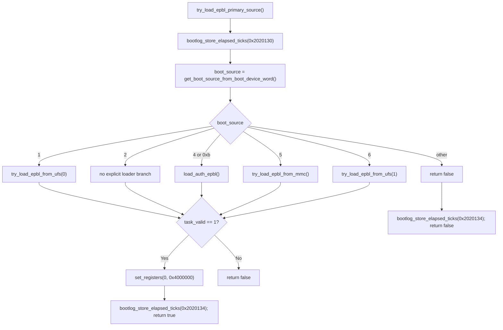
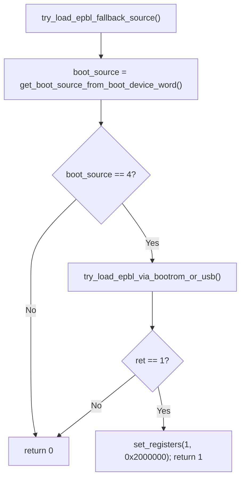
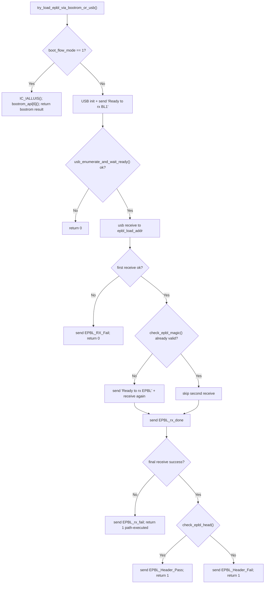
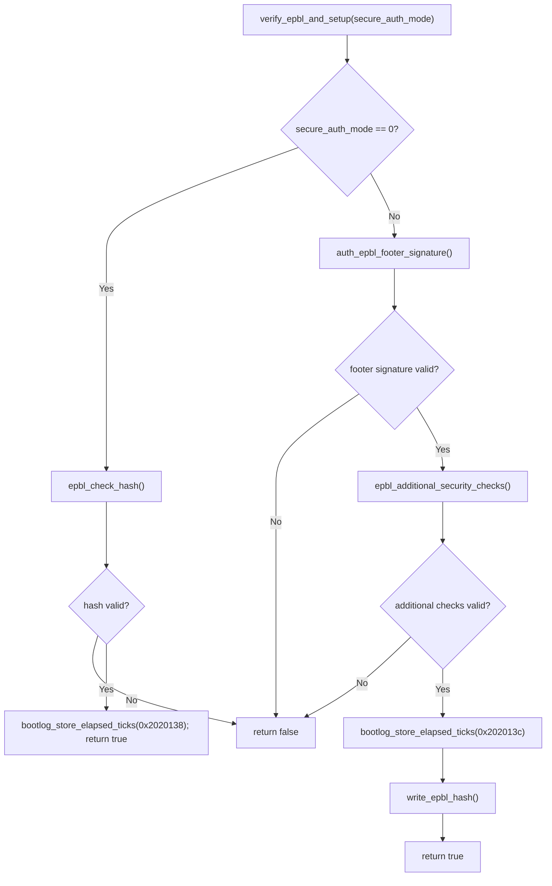
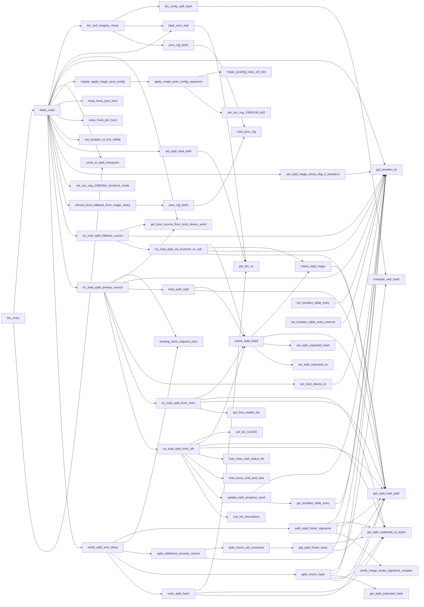

# FWBL1 Flowchart

## 1) End-to-End FWBL1 Control Flow

```mermaid
flowchart TD
    A["bl1_entry()"] --> B{"*resume_flag == 1?"}
    B -- " Yes " --> C["jump_to_epbl_entrypoint()"]
    B -- " No " --> D["Zero init range DAT_00000090..DAT_00000098"]
    D --> E["fwbl1_main()"]
    E --> E1["secure_auth_mode = DAT_020200a8()"]
    E1 --> E2["boot_dev_id = get_bootdev_id()"]
    E2 --> E3["boot_source = get_boot_source_from_boot_device_word()"]
    E3 --> E4{"boot_source == 4?"}
    E4 -- " Yes " --> E5["set_soc_reg_1586030c_bootsrc4_mode()"]
    E4 -- " No " --> E6["skip"]
    E5 --> E7
    E6 --> E7
    E7["noop_hook_post_boot(); noop_hook_pre_boot()"] --> E8["bl1_self_integrity_check()"]
    E8 --> E9["set_epbl_load_addr()"]
    E9 --> F{"should_force_fallback_from_magic_sticky()?"}
    F -- " No " --> P1["try_load_epbl_primary_source()"]
    P1 --> P2{"primary load success?"}
    P2 -- " No " --> FB0["fallback block"]
    P2 -- " Yes " --> V1["verify_epbl_and_setup(secure_auth_mode)"]
    V1 --> V2{"verify success?"}
    V2 -- " No " --> FB0
    V2 -- " Yes " --> S1["success tail"]
    F -- " Yes " --> FB0
    FB0 --> FB1["set_bootdev_id_low_nibble(boot_dev_id + 1)"]
    FB1 --> FB2{"boot_dev_id + 1 <= 2?"}
    FB2 -- " No " --> H["fatal_error_halt(0)"]
    FB2 -- " Yes " --> FB3["retry: try_load_epbl_fallback_source()"]
    FB3 --> FB4{"fallback load success?"}
    FB4 -- " No " --> FB3
    FB4 -- " Yes " --> FB5["verify_epbl_and_setup(secure_auth_mode)"]
    FB5 --> FB6{"verify before retries expire?"}
    FB6 -- " No " --> FB3
    FB6 -- " Yes " --> S1
    S1 --> S2["set_registers(0, 0x80000000)"]
    S2 --> S3["set_epbl_magic_sticky_flag_if_bootdev1()"]
    S3 --> S4{"boot_dev_id == 1?"}
    S4 -- " Yes " --> S5["maybe_apply_magic_post_config()"]
    S4 -- " No " --> J["jump_to_epbl_entrypoint()"]
    S5 --> J
```

## 2) Load-Path Subflows

### 2.1 `try_load_epbl_primary_source()` dispatcher

### 2.2 Fallback load path (`boot_source == 4` path)

### 2.3 `try_load_epbl_via_bootrom_or_usb()` internals

## 3) Verification and Security Subflow

## 4) Complete Internal Call Graph (All FWBL1 Methods)

## 5) Method Inventory (56/56)

### Entry and global control

- `bl1_entry`: entry/resume gate, zero-init, dispatch to `fwbl1_main` or direct EPBL jump.
- `fwbl1_main`: full orchestrator (boot source selection, fallback policy, verification, handoff/panic).
- `jump_to_epbl_entrypoint`: indirect jump to EPBL entry offset (`+0x10`).
- `fatal_error_halt`: panic callout + infinite halt.
- `noop_hook_pre_boot`: empty hook.
- `noop_hook_post_boot`: empty hook.

### BL1 self-integrity and PMU controls

- `bl1_self_integrity_check`: PMU bit16-gated self-hash verification.
- `bl1_verify_self_hash`: computes BL1 hash and compares against mode-dependent expected value.
- `read_pmu_cfg`: raw PMU config read.
- `pmu_cfg_bit24`: PMU bit24 extractor.
- `pmu_cfg_bit16`: PMU bit16 extractor.
- `should_force_fallback_from_magic_sticky`: PMU/sticky-bit policy for forced fallback.

### EPBL header, hash, and expected-value state

- `check_epbl_magic`: tests EPBL magic word at header offset.
- `check_epbl_head`: validates header, bounds-checks size, sets expected size/hash, clears header hash field.
- `epbl_check_hash`: recompute EPBL hash and compare against expected hash.
- `compute_real_hash`: wrapper around hash engine.
- `get_epbl_expected_hash`: getter.
- `set_epbl_expected_hash`: setter.
- `get_epbl_expected_sz_bytes`: getter.
- `set_epbl_expected_sz`: setter.
- `get_epbl_load_addr`: getter.
- `set_epbl_load_addr`: compute/set EPBL load address from BL1 size.
- `get_epbl_footer_base`: computes footer base (`epbl_load_addr + size - 0x210`).
- `write_epbl_hash`: writes hash over EPBL body (excluding footer area).

### Boot-device and table accessors

- `get_boot_source_from_boot_device_word`: decode source nibble from boot-device word.
- `get_bootdev_id`: low-nibble device ID getter.
- `set_boot_device_id`: updates selected boot device nibble in packed word.
- `set_bootdev_id_low_nibble`: direct low-nibble write.
- `get_bootdev_table_entry`: read per-device table slot.
- `set_bootdev_table_entry`: write per-device table slot.
- `set_bootdev_table_entry_internal`: internal table-slot writer variant.
- `set_epbl_magic_sticky_flag_if_bootdev1`: sets sticky flag when EPBL magic marker and bootdev1 match.

### Primary and fallback loading

- `try_load_epbl_primary_source`: dispatches by boot source to USB/MMC/UFS loaders.
- `try_load_epbl_fallback_source`: fallback dispatcher (boot-source 4 path).
- `load_auth_epbl`: USB receive path with status strings and header check.
- `try_load_epbl_via_bootrom_or_usb`: bootrom bridge mode or USB fallback receiver.
- `try_load_epbl_from_mmc`: GPT probe + EPBL header/body block reads via MMC.
- `try_load_epbl_from_ufs`: host bring-up, retries, chunked reads, progress-word updates.
- `get_first_usable_lda`: GPT helper for first usable LBA.

### UFS/USB host support

- `host_issue_cmd_and_wait`: host command issue + completion wait.
- `host_clear_wait_status_bit`: clears host wait bit and spins until clear.
- `update_epbl_progress_word`: updates packed progress/status fields in bootdev table slot 7.
- `ceil_div_0x1000`: page-count helper.
- `usb_init_descriptors`: USB descriptor/register initialization sequence.

### Verification/authentication pipeline

- `verify_epbl_and_setup`: top-level verify branch (`hash` mode vs `signature+policy` mode).
- `auth_epbl_footer_signature`: footer signature verification wrapper + register side effects.
- `verify_image_footer_signature_wrapper`: signature-engine parameter validation + callback dispatch.
- `epbl_additional_security_checks`: optional UID policy check + register side effects.
- `epbl_check_uid_constraint`: UID leading-zero count compared against footer policy.

### SoC-specific post-boot register sequences

- `set_soc_reg_1586030c_bootsrc4_mode`: boot-source 4 mode register write.
- `maybe_apply_magic_post_config`: gated post-config dispatch based on EPBL marker.
- `magic_postcfg_clear_ctrl_bits`: helper for post-config control-bit clear.
- `set_soc_reg_15861240_bit2`: bit2 toggle helper for register `0x15861240`.
- `apply_magic_post_config_sequence`: complete SoC post-config register programming sequence.

### Remaining base getter

- `get_bl1_sz`: BL1 size getter.
