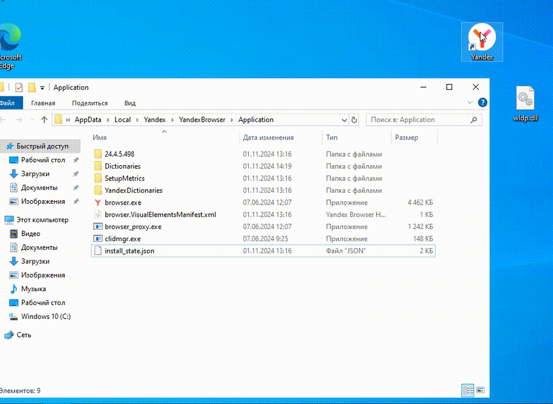

# CVE-2024-6473 PoC

**Yandex Browser** for Desktop before 24.7.1.380 has a **DLL Hijacking** Vulnerability because an untrusted search path is used.

## Vulnerable browser version

> [!IMPORTANT]
> The Internet must be turned off during installation, otherwise the browser will be updated.

You can download vulerable version from [download.cdn.yandex.net](https://web.archive.org/web/20240612102254/https://cachev2-kiv03.cdn.yandex.net/download.cdn.yandex.net/browser/exp_tablo_p2_new/24_4_5_498_59341/ru/Yandex.exe?win10pin=1&vup=1&browser=OperaChrome/64/110.0.0.0&a-type=organic&banerid=6400000000:666976fe7664416e3bdf4d3d&broexp=2&yandexuid=9440823951718187774&mongoID=666976fe7664416e3bdf4d3d&pps=installID%3D9440823951718187774_1718187774137%26mongoID%3D666976fe7664416e3bdf4d3d&hash=99d4f1953156cf8bb559f5b1b15dd5e9&download_date=1718187774&lid=321&.exe)

Or usage from archive

1. Download and unpack **Yandex_Browser_24.4.5.498.zip**
2. Start **Setup.exe**

## PoC

I used the "**LolNope**" approach from here: https://github.com/advancedmonitoring/ProxyDll

You just need to compile the DLL file and place it in the path `%LOCALAPPDATA%\Yandex\YandexBrowser\Application` and start the browser

## References

 - https://github.com/advisories/GHSA-p7m8-prjf-m93h
 - https://nvd.nist.gov/vuln/detail/CVE-2024-6473
 - https://bdu.fstec.ru/vul/2024-06704
 - https://xakep.ru/2024/09/05/ya-browser-malware/