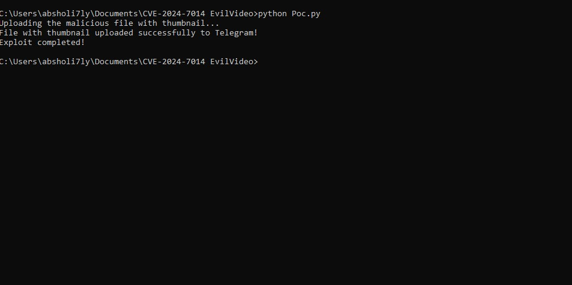
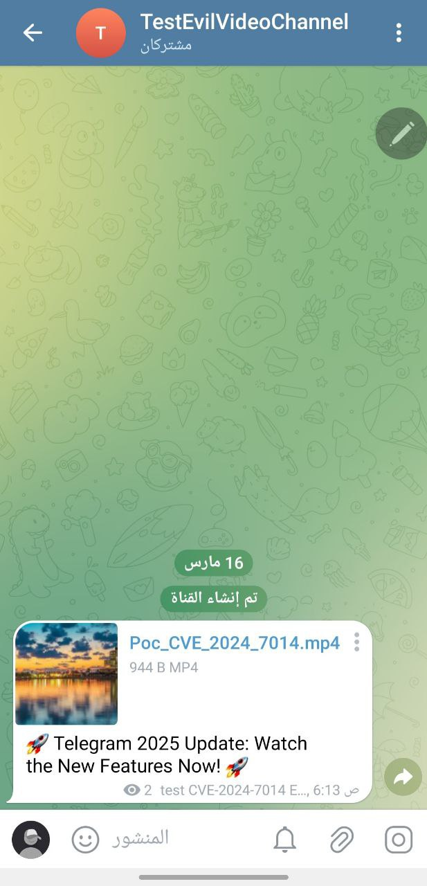

# PoC for-CVE-2024-7014 Exploit
Proof of concept for the CVE-2024-7014 (EvilVideo) vulnerability in Telegram for Android (versions 10.14.4 and earlier). The program uploads a malicious file disguised as a video to a Telegram channel, exploiting the security vulnerability to install malware or redirect users.

## Prerequisites
* Python 3.x installed on your system.
* `pyTelegramBotAPI` library (`pip install pyTelegramBotAPI`).
* A Telegram bot token 
* A Telegram channel or chat ID where the bot has posting permissions.
* The malicious file (`Poc_CVE_2024_7014.txt`) and thumbnail image (`thumbnail.jpg`) in the same directory.

## Usage
* Open Poc_CVE_2024_7014.py and update the following variables:
* BOT_TOKEN: Replace with your Telegram bot token.
* CHAT_ID: Replace with the chat ID of your target channel (e.g., @testevilvideo).
* FILE_PATH: Ensure it points to the malicious file.
* CAPTION: Customize the caption if needed

### Important: 
Start with the file `Poc_CVE_2024_7014.txt` (which contains the HTML payload). After completing your modifications (e.g., updating the APK download link), rename it to `malicious_video.mp4`. This disguises the file as a video, exploiting the vulnerability.
     - Example: Edit `Poc_CVE_2024_7014.txt`, then save as `malicious_video.mp4`.

## Optional Thumbnail:
The script can include a thumbnail image (thumbnail.jpg) to make the "video" appear more legitimate.
To change the thumbnail, replace thumbnail.jpg with your desired image (recommended size: 320x180 pixels)

|                                                                 |
|:---------------------------------------------------------------:|
|  |
------------------------------------------------------------------------------------------
|                                                                 |
|:---------------------------------------------------------------:|
|  |

