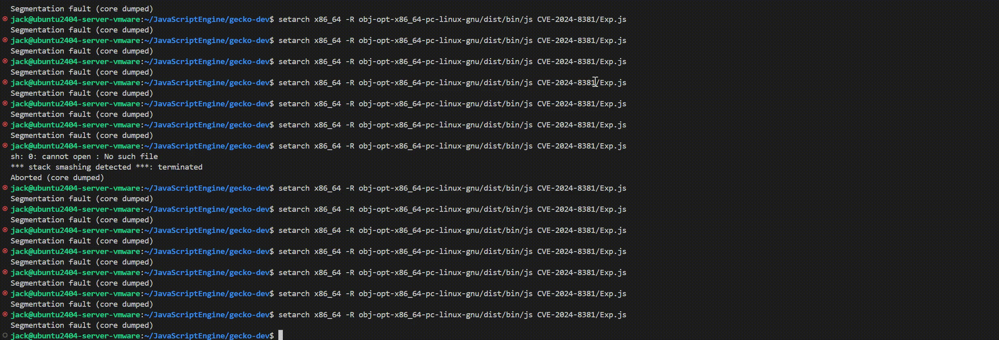

# CVE-2024-8381

A SpiderMonkey Interpreter Type Confusion Bug.

This repository contains analyses in markdown and slide forms, including root cause, PoC, and exploit.

Unfortunately, due to nature of this bug, **exploit is only applicable when ASLR is disabled**.

Slides: [Slides.pdf](Slides.pdf)

Analysis: [Analysis.md](Analysis.md)

## Demo

## Reproduce Information

- OS: Ubuntu 24.04
- GLIBC: Ubuntu GLIBC 2.39-0ubuntu8.3
- Clang: `version 18.1.7 (taskcluster-EnF59hKVRyOsVdbwyVaiug)`, Installed by `./mach bootstrap`
- Git Commit: [198d5fc1bebaaf114197a529ebdd4b9601045719](https://github.com/mozilla/gecko-dev/commit/198d5fc1bebaaf114197a529ebdd4b9601045719)
- PoC Execute Command: `obj-debug-x86_64-pc-linux-gnu/dist/bin/js PoC.js`
- Exploit Execute Command: `setarch x86_64 -R obj-opt-x86_64-pc-linux-gnu/dist/bin/js Exp.js`
- MOZConfig: Check `mozconfigs/`

## Acknowledgement

- Shoutout to [Nils Bars](https://x.com/__nils_) [@nbars](https://github.com/nbars) for finding the bug.

## References

1. https://www.cve.org/CVERecord?id=CVE-2024-8381
2. https://github.com/mozilla/gecko-dev/commit/fab7e5c28e628ddc2b873a723838562c9b41205e
3. https://github.com/mozilla/gecko-dev/commit/0ca509a3a7fbf4ff5d34cf25083a4427f3205549
4. https://developer.mozilla.org/en-US/docs/Web/JavaScript/Reference/Statements/with
5. https://developer.mozilla.org/en-US/docs/Web/JavaScript/Reference/Global_Objects/Symbol/unscopables

## Disclaimer
This repository is intended solely for educational purposes and must not be used for any malicious activities.
