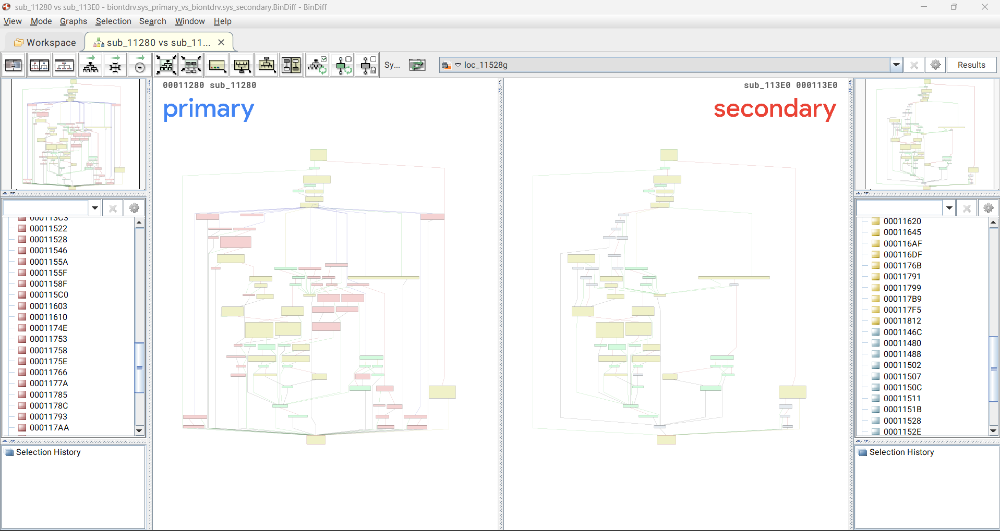

# CVE-2025-0287

This repository contains a screenshot of the vulnerable function identified during reverse engineering of a vulnerable Windows driver.

## Description
- `biontdrv.sys_Vul`: vulnerable version
- `biontdrv.sys_Secure`: patched version
- `POC_CVE-2025-0288.c`: proof-of-concept code
- `diff.png`: screenshot of the vulnerable function

## Write-up
Detailed analysis is available on my blog:
[Read the full write-up](https://meisameb.github.io/)

## Vulnerable Function

