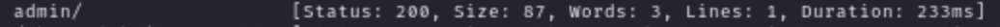
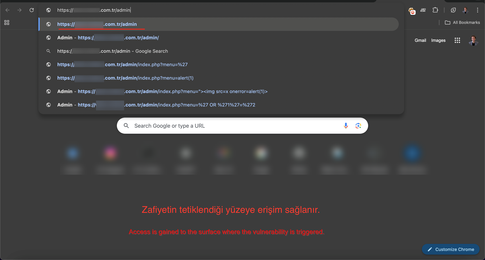
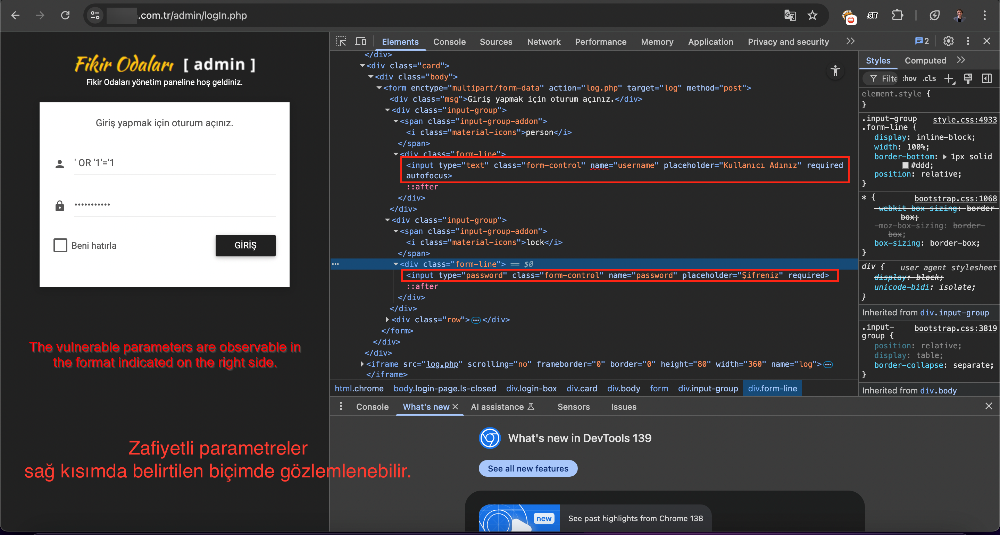
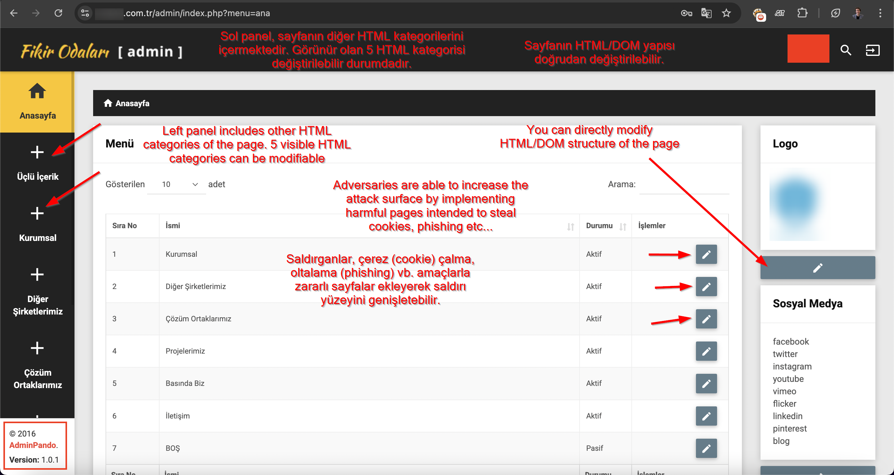
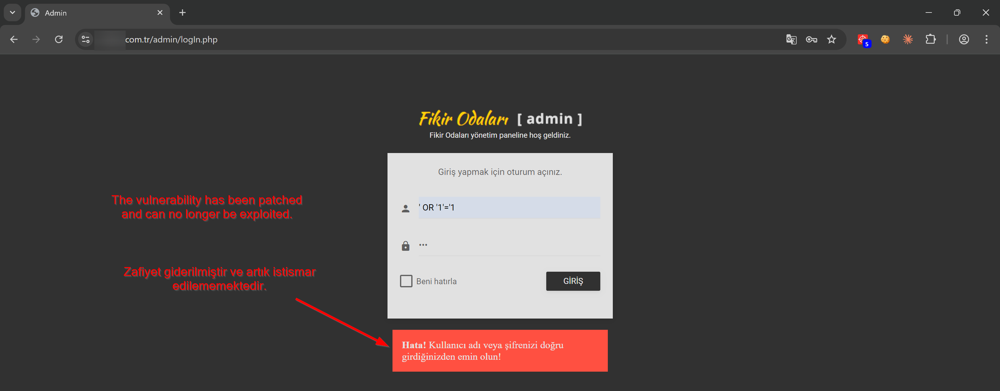

# CVE-2025-10878

## Fikir Odaları AdminPando'da SQL Kimlik Doğrulama Bypass'ı

### Özet

| Alan | Değer |
|------|-------|
| CVE ID | CVE-2025-10878 |
| Ürün | Fikir Odaları AdminPando |
| Vendor | Omran İnşaat A.Ş. |
| Zafiyetli URL | https://www.omran.com.tr/admin/logIn.php |
| Etkilenen Versiyon | v1.0.1 (ve muhtemelen önceki sürümler) |
| Zafiyet Türü | CWE-89: SQL Injection |
| CVSS v3.1 Skoru | 10.0 (Kritik) |
| CVSS Vektör | AV:N/AC:L/PR:N/UI:N/S:C/C:H/I:H/A:H |
| Yama Tarihi | 2026-01-26 |
| Araştırmacı | Onurcan Genç |

---

### Açıklama

Fikir Odaları AdminPando v1.0.1'in giriş işlevinde bir SQL injection zafiyeti bulunmaktadır. `username` ve `password` parametreleri SQL injection'a açık olup, kimlik doğrulaması yapılmamış saldırganların kimlik doğrulamayı tamamen bypass etmesine olanak tanımaktadır.

Başarılı bir exploit, uygulamaya tam yönetici erişimi sağlamakta ve kamuya açık web sitesi içeriğinin manipüle edilmesine (HTML/DOM manipülasyonu) imkan vermektedir.

---

### CVSS v3.1 Skoru

| Metrik | Değer |
|--------|-------|
| Vektör | `AV:N/AC:L/PR:N/UI:N/S:C/C:H/I:H/A:H` |
| Base Score | **10.0 (Kritik)** |
| Scope | Changed (S:C) |

**Scope: Changed (S:C) Gerekçesi:**

Zafiyet, admin paneli kimlik doğrulamasında (`/admin`) bulunmaktadır, ancak başarılı exploit tamamen farklı bir kullanıcı (kitlesini kamuya açık web sitesi ziyaretçilerini) etkilemektedir.

**Saldırı Akışı:**
1. Saldırgan `/admin` giriş sayfasında SQLi exploit eder (zafiyetli bileşen)
2. Saldırgan admin dashboard erişimi elde eder.
3. Admin dashboard, kamuya açık web sitesi üzerinde tam HTML/DOM kontrolü sağlar.
4. Kamuya açık web sitesi ziyaretçileri (etkilenen bileşen) manipüle edilmiş içerik alır.

Bu durum, bir güven sınırını (trust boundary) aşmaktadır: kimliği doğrulanmamış saldırgan → admin yetkileri → admin paneliyle hiçbir etkileşimi olmayan kamuya açık kullanıcılar üzerinde etki (HTML/DOM aracılığıyla değişime uğratılmış sayfa içeriği).

---

### Etkilenen Parametreler

- `username` (metin girdisi)
- `password` (şifre girdisi)

---

### Proof of Concept

#### 1) Keşif

Dizin keşif aracı kullanılarak `/admin` endpoint'i keşfedilmiştir. Giriş formu iki adet zafiyetli input alanı içermektedir.



Uygulama sayfasına erişim sağlanır ve zafiyetin bulunduğu parametreler keşfedilir.



#### 2) Exploit

**Payload:**
```
' OR '1'='1
```

**Yöntem:**
```
Username: ' OR '1'='1
Password: [herhangi bir şey]

VEYA

Username: [herhangi bir şey]
Password: ' OR '1'='1
```



(Gösterilen senaryoda, doğrulama amacıyla sadece username parametresi test edilmiştir; ancak zafiyet tüm input yüzeylerinde tetiklenmektedir.)

Giriş butonuna tıklanarak admin paneline erişim sağlanır.



#### 3) Sonuç

Kimlik doğrulama başarıyla bypass edilmiştir. Admin paneline erişim sağlanmıştır. Admin paneli üzerinden kamuya açık web sitesinin tam HTML/DOM manipülasyonu mümkündür:

- Anasayfa logosu değiştirilebilir
- Sayfa içeriği manipüle edilebilir
- Tam HTML/DOM kontrolü sağlanabilir

---

### Etki

- Tam kimlik doğrulama bypass'ı
- Yetkisiz yönetici erişimi
- Kamuya açık web sitesinin tam HTML/DOM manipülasyonu
- Ziyaretçilere kötü amaçlı içerik dağıtımı
- Marka/itibar zararı
- Potansiyel kullanıcı veri sızıntısı

---

### Zaman Çizelgesi

| Tarih | Olay |
|-------|------|
| 2025-09-23 | Zafiyet USOM'a (TR-CERT) raporlandı, CVE atandı |
| 2025-09 - 2026-01 | Vendor/CNA'dan yanıt yok (4+ ay) |
| 2026-01-02 | MITRE escalation gönderildi |
| 2026-01-23 | MITRE, USOM ile iletişime geçti |
| 2026-01-26 | USOM, CVE'yi "tekil durum" olarak reddetti |
| 2026-01-26 | Zafiyet yamalandı (araştırmacı tarafından doğrulandı) |
| 2026-01-29 | MITRE, CVE'yi CNA of Last Resort yetkisiyle kabul etti |

---

### Düzeltme

Zafiyet 2026-01-26 tarihinde yamalanmıştır. Kullanıcıların yazılımın en son sürümünü çalıştırdığından emin olmaları gerekmektedir.



---

### Referanslar

- [MITRE CVE Kaydı](https://cve.mitre.org/cgi-bin/cvename.cgi?name=CVE-2025-10878)
- [NVD Kaydı](https://nvd.nist.gov/vuln/detail/CVE-2025-10878)

---

### Dokümantasyon

- [İngilizce PoC](README.md)
- [Türkçe Orijinal Rapor](ORIGINAL_REPORT_TR.md) (bu dosya)

---

### Sorumluluk Beyanı

Bu zafiyet, sorumlu açıklama (responsible disclosure) prensipleri çerçevesinde keşfedilmiş ve raporlanmıştır. Herhangi bir veri çıkarılmamış, değiştirilmemiş veya sistemin bütünlüğünü tehlikeye atacak herhangi bir işlem yapılmamıştır.

---

### Kredi

Keşfeden: **Onurcan Genç**

- GitHub: [@onrcngnc](https://github.com/onrcngnc)
- LinkedIn: [Onurcan Genç](https://linkedin.com/in/onurcangenc)
- Kişisel Sayfa: [Onurcan Genç](https://onurcangenc.com.tr)
- CVE-2025-10878 Hakkında Blog: [Onurcan Genç](https://onurcangenc.com.tr/posts/cve-2025-10878-sql-authentication-bypass-in-fikir-odalar%C4%B1-adminpando/)