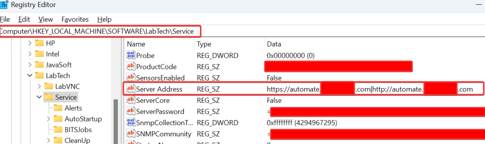
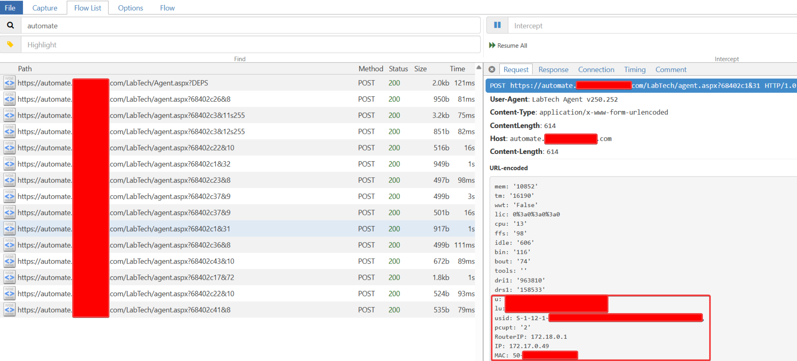
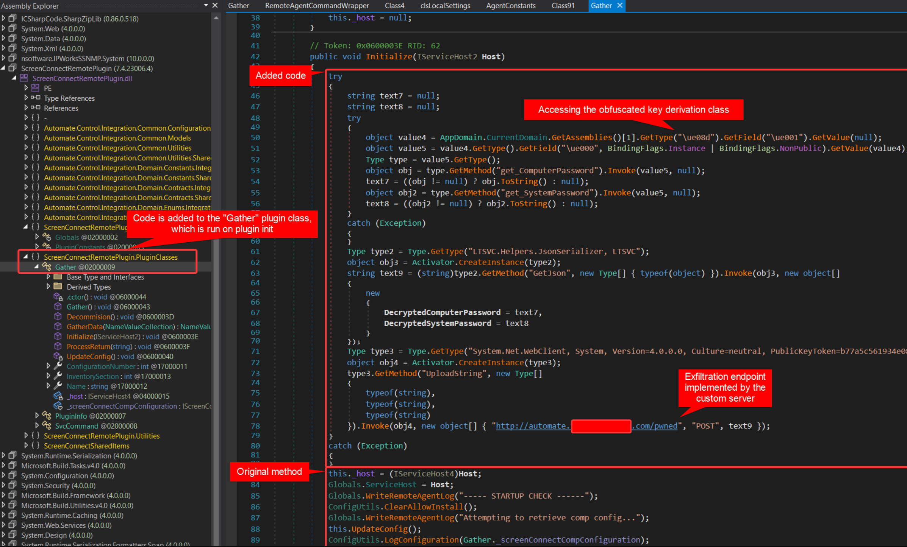
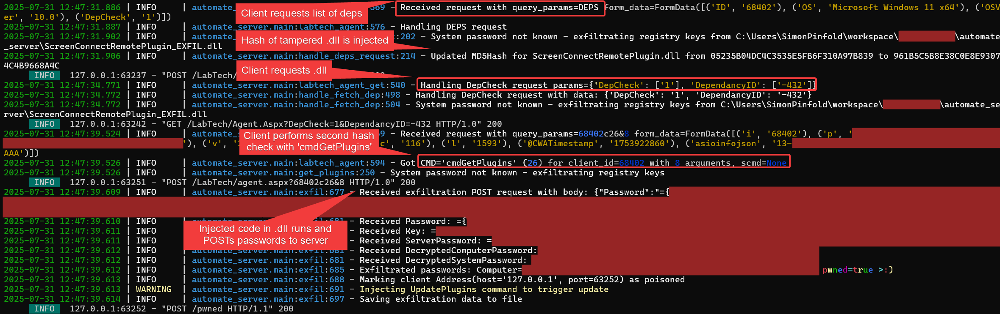
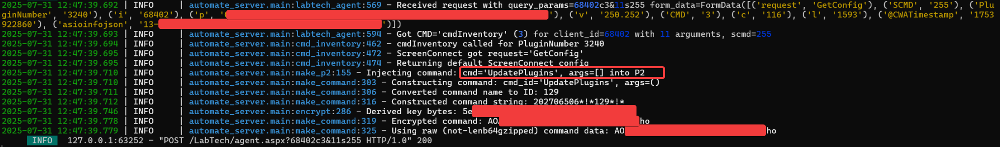
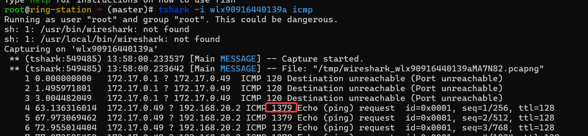

# ConnectWise Automate Adversary-in-the-Middle Remote Code Execution

## Table of Contents

- [Background](#background)
- [Timeline](#timeline)
- [Thoughts and Learnings](#thoughts-and-learnings)
- [Responsible Disclosure](#responsible-disclosure)
- [PoC Code](#poc-code)
- [Report Provided to ConnectWise](#report-provided-to-connectwise)
  - [Summary](#summary)
  - [Vulnerable Configuration](#vulnerable-configuration)
  - [Impact](#impact)
  - [Technical Details](#technical-details)
    - [1. HTTP Transport](#1-http-transport)
    - [2. Insufficient Protocol Security (missing encryption and validation)](#2-insufficient-protocol-security-missing-encryption-and-validation)
      - [2.1 Insufficient Validation on Dependency Checks and Downloads](#21-insufficient-validation-on-dependency-checks-and-downloads)
      - [2.2 Lack of Replay Protection](#22-lack-of-replay-protection)
      - [2.3 Insufficient Validation on Self‑Update](#23-insufficient-validation-on-selfupdate)
    - [3. RMM Command‑and‑Control Takeover](#3-rmm-command-and-control-takeover)
  - [Mitigation](#mitigation)

## Background

As part of a Pentation Test, I discovered multiple vulnerabilities in the ConnectWise Automate Remote Monitoring and Management (RMM) agent. 
ConnectWise is used by many Managed Service Providers (MSPs) to manage and monitor client devices.
These vulnerabilities enabled remote code execution if an attacker could establish network Adversary-in-the-Middle, or could be used as local privilege escalation and stealthy persistence if an attacker obtained code execution or physical access to a device running the ConnectWise Automate agent.

The vulnerabilities were reported to ConnectWise on 20 August 2025. ConnectWise assigned CVE IDs and released a patch in version `2025.9` on 16 October 2025.

ConnectWise Bulletin: 
- https://www.connectwise.com/company/trust/security-bulletins/connectwise-automate-2025.9-security-fix

CVE IDs:
- https://nvd.nist.gov/vuln/detail/CVE-2025-11492 - 9.6 CVSS:3.1/AV:A/AC:L/PR:N/UI:N/S:C/C:H/I:H/A:H
- https://nvd.nist.gov/vuln/detail/CVE-2025-11493 - 8.8	CVSS:3.1/AV:A/AC:L/PR:N/UI:N/S:U/C:H/I:H/A:H

## Timeline

- 2025-08-20: Initial report to ConnectWise, including PoC, technical details and suggested mitigations (report below), along with request for CVE IDs.
- 2025-08-20: ConnectWise acknowledges receipt
- 2025-08-21: ConnectWise responds they are investigating, and confirm they can assign CVE IDs and support public disclosure (once resolved).
- 2025-08-29: ConnectWise confirm internal triage and validation of vulnerabilities.
- 2025-09-03 - 2025-09-19: ConnectWise and I discuss how to best assign/split CVEs and CVSS scoring.
- 2025-09-26: ConnectWise confirm the primary mitigation will be removal of HTTP fallback, and they are currently testing this. Release is expected for early October.
- 2025-10-16: ConnectWise release Automate `2025.9` and publish security bulletin and CVEs.

## Thoughts and Learnings

I appreciated ConnectWise's swift responses and their collaborative approach to remediation and willingness to engage in discussion on how best to approach classification, and remediation.

Classifying these vulnerabilities was an interesting challenge. While switching to HTTPs resolves practically all of the scenarios in this report, it was evident that this was originally a design choice (to support HTTP) to improve reliability of agent-server communication. The encryption scheme seemed to partially acknowledge/attempt to mitigate the risk of AiTM, but was not applied consistently. Digging into this involved trying to classify whether the weakness was *http itself* or the lack of encryption on-top of HTTP as well as replay prevention, plugin validation, etc. were all their own vulnerabilities. At one point ConnectWise was considering 5+ separate CVEs for different aspects of the vulnerabilities.

Additionally, the scope and attack vector changed depending on whether the vulnerability was considered from an AiTM e.g. coffee shop Wi-Fi or LPE/physical access perspective. An alternate approach would be to consider each scenario as a separate vulnerability, e.g. AiTM RCE, LPE, Persistence takeover, etc.

A final learning is that even in 2025, we still struggle to share files effectively :D (email security did not like me emailing .dll files or .zips containing them).

## Responsible Disclosure

This report is being published following ConnectWise's release of a patch and disclosure of the CVEs, and with their agreement that such disclosure does not harm their users. Furthermore, I believe that public disclosure of these vulnerabilities and their mitigations will help other vendors and security professionals better understand and mitigate risks in both ConnectWise Automate, and other RMM systems.

The content is intended for lawful, authorized security research and educational purposes only. Unauthorized use of this information to compromise systems, networks, or data is illegal and unethical. The content is provided as-is and without warranties of any kind. The author(s) disclaim all liability for any damages resulting from the use or misuse of this information.

If using this code or information for further research, practice responsible disclosure by reporting any discovered vulnerabilities to the affected vendor(s).

## PoC Code

As well as the report below, this repository contains PoC code to demonstrate the vulnerabilities. See [automate_server/README.md](./automate_server/README.md) for details on the fake server implementation and usage instructions.

This code could also be used to perform further (ethical) security research on ConnectWise Automate.

&nbsp;

---

The following report (or a version close to it), and PoC python code in this repository, was provided to ConnectWise, along with recommended mitigations.

The removed mitigations section goes into more detail on changes that could be made to the Automate agent to harden it in several ways against these vulnerabilities.

As some of these changes are still under consideration by ConnectWise, that section has been removed from this public disclosure.

# Report Provided to ConnectWise


## Summary

The ConnectWise Automate Remote Monitoring and Management (RMM) agent (tested on latest version as of August 2025, version string 250.252) is vulnerable to network-based Remote Code Execution in certain configurations. If the agent is configured to use an unencrypted HTTP transport (either primarily or as a fallback) for its `Server Address` and an attacker can perform a adversary-in-the-middle (AiTM) attack, then they can remotely execute code as `SYSTEM`. This configuration has been observed in the wild from multiple Managed Service Providers (MSPs).

Exploitation is also possible if the attacker gains physical access to the device as a non-admin or can otherwise connect the device to an attacker‑controlled network (i.e. the vulnerability can be used as a Local Privilege Escalation). Although Automate employs an encryption system to encrypt and validate most RMM commands, its plugin system lacks adequate protection and remains susceptible to Remote Code Execution.

By implementing a custom server mimicking Automate's control server, the Automate agent can be coerced into downloading and executing a malicious plugin.

The compromised agent can also serve as an attractive form of persistence. Using the RCE to extract the agent's symmetric encryption keys, the custom server can send arbitrary commands to the agent using the standard RMM channel. In the AiTM scenario, this allows the attacker to execute arbitrary RMM commands, including file extraction, credential dumping, command execution, and changing configuration. The attacker could also modify the RMM's `Server Address` to the attacker's own server, achieving stealthy persistence even post-AiTM. Alternatively, the RCE can be leveraged to run system-level commands directly.

## Vulnerable Configuration

1. The agent uses a `Server Address` including an `http://` endpoint. Vulnerable configurations have been observed from two distinct MSPs (actual MSP domains and IPs replaced):
   - `https://automate.msp-one.com|http://automate.msp-one.com`
   - `https://msp.msp-two.com|http://msp.msp-two.com|http://12.346.6.78`
   - In both cases, the `http://` endpoint is used as a fallback if the `https://` connection fails, but an attacker can simulate this by blocking `https`.
   - It is understood that this http fallback is (or was) *default configuration*.
2. An attacker has some way to establish a network-AiTM scenario.
    - This could be achieved by compromising the network the device is connected to, e.g., a home‑network compromise scenario. Home networks are trivially vulnerable to AiTM if a compromised device is connected to the same network, and users typically connect their work devices to them.
    - Alternatively, an attacker with (brief) physical access to the device could connect it to a malicious network—even if the device is locked or powered off (and does not require a BitLocker key), it is possible to join Wi‑Fi networks from the login/lock screen. This could be a stolen device or simply a device left unattended in a public place.
    - Finally, this vulnerability also serves as a privilege escalation for an attacker with physical access to the device, as they can connect it to a malicious network or plug in a malicious Ethernet cable (e.g., a Raspberry Pi running the attack).
3. The network AiTM needs to be in place when the Automate agent fetches its plugin configuration. Rebooting the device is the easiest way to achieve this, but other methods may also work.
    - This requirement minimizes the risk of exploitation on public Wi‑Fi; however, such possibilities should not be ruled out—reboots on public Wi‑Fi are still possible, and potential ways to achieve exploitation without reboot were not thoroughly explored.
    - In home‑network scenarios, the attacker can simply wait. In physical access scenarios, the attacker can boot/reboot the device at will.
    - If the attacker can capture a plugin configuration request, they can replay this to the agent to trigger the RCE conditions.

## Impact

- Full administrative control over affected (AiTM'd) devices without requiring user interaction or credentials.
- Ability to execute arbitrary code remotely.
- Persistent remote admin of the device undetected by Endpoint Detection and Response (EDR) solutions.
- Potential for lateral movement within the network (e.g., over ZTNA tunnels).
- Ability to exfiltrate data and credentials from the device.

## Technical Details

### 1. HTTP Transport

The Automate agent can be configured to use an `http://` URL as the server address. This configuration is likely set by the installer script/package, but can be validated by checking the registry key `HKLM\SOFTWARE\LabTech\Service\Server Address`.



Utilizing both the HTTPS and HTTP endpoints, separated by a pipe `|`, ensures that, in theory, if the HTTPS connection encounters an issue, the Automate agent will revert to the HTTP connection.

If an attacker gains Adversary-in-the-Middle (AiTM) access to the network traffic between the Automate agent and the server, they can intentionally disrupt the HTTPS connection, causing it to revert to HTTP. This allows the attacker to intercept, monitor, and alter the traffic exchanged between the agent and server. An attacker can then reverse proxy traffic to `https://automate.msp-one.com`, resulting in "standard operation" of the agent, but with the attacker able to eavesdrop on the data. Additionally, they may inject or modify responses or even set up a completely fraudulent Automate server that responds to requests from the Automate agent.

This was achieved by setting up a "rogue" Wi‑Fi access point (`hostapd`, `dnsmasq`, IP forwarding + NAT) and using `iptables` rules for traffic redirection and a `mitmproxy` script for the reverse proxy.



Other, more sensitive data including running programs, full network configuration, and document paths have at times been observed in the Automate agent responses.

#### iptables:
```bash
iptables -t nat -A PREROUTING -i wlx90916440139a -p tcp --dport 80 -j REDIRECT --to-port 8080
iptables -A FORWARD -i wlx90916440139a -p tcp --dport 443 -j DROP
```
#### mitmproxy script:
```python
# run with AiTMweb --mode transparent@8080 -s automate_AiTM.py

def request(flow: http.HTTPFlow):
    if flow.request.pretty_host == 'automate.msp-one.com':
        flow.request.url = 'https://automate.msp-one.com' + flow.request.path
```

ZTNA solutions can slightly complicate this interception, but these were reliably bypassed by further mitmproxy scripts to conditionally detect and block ZTNA, resulting in fallback to non‑tunneled HTTP.

### 2. Insufficient Protocol Security (missing encryption and validation)

The Automate agent uses a custom protocol on top of HTTP to communicate with the server.

The RMM agent on the device periodically sends HTTP(S) requests to the server's `/LabTech/agent.aspx` endpoint. The relevant request types are:

Note that the inconsistent capitalization of the paths is not a typo; it is how the Automate agent sends these requests. All endpoint paths are wrapped in code ticks for clarity.

- Dependency checks
    - The RMM agent requests `/LabTech/Agent.aspx?DEPS` and receives an XML response containing a list of dependency files, their version numbers, and their checksums.
- Dependency downloads
    - The RMM agent requests `/LabTech/Agent.Aspx?DepCheck=1&DependancyId=<id>` and receives an obfuscated binary file containing the dependency disguised as an image file (presumably the obfuscation is intended to prevent content filters from blocking the download).
- Agent Commands
    - The RMM agent requests `/LabTech/agent.aspx?<id>?c<CMD id>&<arg count>` and receives a custom-packed response containing command-specific data.
    - There are ~40 "agent commands". These "commands" are used to fetch config, fetch "remote commands" to run (including `InitialCommandRetrieve`), return results of commands, and perform chat.
- Self‑update
    - The RMM agent has the ability to update itself by downloading a new version of the Automate agent from the server.

Sensitive "remote commands" are often encrypted using a DES3-based encryption scheme with custom key derivation from a preset `system password` and `computer password`. Without the correct passwords, an attacker cannot view/inject/modify legitimate commands sent to the agent; however, command responses are unencrypted and have been observed to frequently include sensitive plaintext data including open files, paths, usernames, installed programs, etc.

#### 2.1 Insufficient Validation on Dependency Checks and Downloads

The Dependency check (`/LabTech/Agent.aspx?DEPS`) and downloads (`/LabTech/Agent.Aspx?DepCheck=1&DependancyId=<id>`) are not encrypted or signed, meaning that an attacker can modify the response to include malicious dependencies that will be downloaded and loaded by the RMM agent. If the Dependency check is forged to include a different checksum, the RMM agent will perform a fresh download for the mismatched dependency file and load it (provided the newly downloaded file matches the forged checksum). Plugins are .NET assemblies that implement a specific interface, and the Automate agent will load any .NET assembly that matches the expected plugin interface then call the plugin's interface resulting in code execution.

There is a second level of validation for downloaded plugin dependencies, where the agent sends a `cmdGetPlugins` command and also validates that the checksum matches here, but this command does not use the encryption scheme.

Using dnSpy, it was possible to inject malicious code into the legitimate `ScreenConnectRemotePlugin.dll` used by the agent. A custom Automate server with the `DEPS`, `DepCheck`, and `cmdGetPlugins` command functionality was created. The fake server replicated the expected plugins and dependencies, but modified the hash for the `ScreenConnectRemotePlugin.dll` to a computed hash for the maliciously modified plugin. The fake server also provided the maliciously modified `ScreenConnectRemotePlugin.dll` in response to the `DepCheck` request (in the obfuscated fake-image format) and implemented `cmdGetPlugins` also with the manipulated hash. Finally, the `mitmproxy` script was updated to direct the Automate agent to the fake server instead of the legitimate (HTTPS) server.

Upon connection, the malicious plugin is downloaded and loaded by the agent. The injected code exfiltrates the "system" and "computer" passwords to the fake server. The `system` and `computer` passwords are stored in the registry but are decoded by a heavily obfuscated C# and native library. Rather than extracting the registry values, the patched plugin uses reflection to obtain the decoded values, saving the effort of reverse engineering the obfuscation. Alternatively, the entire contents of the registry key `HKLM\SOFTWARE\LabTech\Service` could be exfiltrated and used with a copy of the RMM agent in a controlled environment to extract the passwords at runtime using a .NET debugger.





Alternatively, the plugin can be used to run system-level commands directly; however, extracting the secrets enabled using the RMM agent itself as command‑and‑control and meant that the persistent channel was undetected by EDR. Persistence can be obtained by updating the `Server Address` to an attacker‑controlled server, which can optionally forward commands to the legitimate server to avoid the device showing as missing. See [3. RMM Command‑and‑Control Takeover](#3-rmm-command-and-control-takeover) for more details.

It is expected that even if the default configuration came with no plugins installed, a blank plugin (matching the C# interfaces required for plugins) could have been compiled and inserted into the `DEPS` and `cmdGetPlugins` responses for the same effect.

#### 2.2 Lack of Replay Protection

It was further observed that a "remote command" called `UpdatePlugins` can be returned by the server, triggering the agent to initiate a plugin update. Because commands do not include replay protection, if an attacker can observe the command being sent by a legitimate server, they can replay this to any other agents to trigger the update. This enables the RCE vulnerability to be exploited in additional scenarios, increasing the impact of this vulnerability.

#### 2.3 Insufficient Validation on Self‑Update

Self‑update was also observed to be unencrypted and unsigned. Demonstration of remote code execution via self‑update was not performed, but it is believed to be similarly vulnerable. Malicious modification of self‑update would be more difficult to perform stealthily and has more risk of breaking the Automate agent; however, it is likely a similar approach of injecting .NET code into the executables/DLLs would work. The self‑update process was not further explored as the plugin RCE was sufficient and deemed more reliable.

It is also possible that exploiting the self‑update process would be a viable solution to the only-exploitable-on-reboot limitation (e.g., if a response could be injected or replayed to trigger a self‑update).

### 3. RMM Command‑and‑Control Takeover

Using the approach in 2.1 to extract the `system password` and `computer password`, it was possible to create arbitrary "remote command" payloads and responses. Rather than fully reverse engineer and reimplement the key derivation scheme, it was possible to simply import `LabTechCommonBase.dll` and use `Utilities.LabTechHash.ComputeHash` to generate the DES3 key from the "computer password". Using the computed DES key and hardcoded IV extracted from the DLL, it was then possible to respond with arbitrary commands to the RMM agent.

```python
    # IV extracted from decompiled LabTechSecurity.cs:
    # this._initializationVector = new byte[] { 240, 3, 45, 29, 0, 76, 173, 59 };
    iv = [240, 3, 45, 29, 0, 76, 173, 59]

    # Helper functions for pythonnet, clr_loader, clr to load LabTechCommonBase.dll into python
    labtech_net.setup_paths_and_references(str((Path(__file__).parent.parent / 'LTSvc').resolve()))
    from LabTechCommonBase import Utilities

    labtech_hash = Utilities.LabTechHash()
    labtech_hash.ComputeHash(computer_password.encode('ascii'))  # Use the exfiltrated computer password
    byts = bytes(labtech_hash.GetDigestBytes())

    cipher = DES3.new(byts, DES3.MODE_CBC, bytes(iv))
    padded_data = pad(data.encode('utf-8'), DES3.block_size)
    encrypted_data = cipher.encrypt(padded_data)
    return base64.b64encode(encrypted_data).decode('utf-8')
```

Handlers for a variety of "Agent Command" types were implemented in the fake Automate server, allowing it to send "Remote Commands" back to the agent. These commands can be used to run arbitrary code on the device, such as downloading and executing a payload, or establishing network tunnels onto the device (e.g., setting up a SOCKS proxy that could be used to pivot through the device's ZTNA access).

For immediate clean-up from 2.1, the server can send the encrypted `UpdatePlugins` command and serve the original legitimate plugin to override the maliciously modified plugin. The attacker can still interact with the agent (assuming the passwords have been extracted) and can maintain persistence by updating the `Server Address` to an attacker‑controlled server.



Arbitrary execution of commands was also demonstrated using the `Execute` command to run a ping, which was successfully executed on the device under an administrator context. This can be served as the `InitialCommandRetrieve` command or returned in response to other "agent commands"/check-ins.

```python
# Extract the RemoteCommandIDs enum from LabTechCommonBase.Constants using pythonnet
REMOTE_CMD_IDS = get_RemoteCommandIDs()
REMOTE_CMD_IDS_r = {str(v): k for k, v in REMOTE_CMD_IDS.items()}

# `register_cmd_handler` registers a command handler for the `/LabTech/agent.aspx?c<id>` endpoint.
# The string 'InitialCommandRetrieve' is mapped back to ID `36`.
# The full set of "Agent Command" and their IDs can be extracted from `LabTechCommonBase.Constants.modEnums.AgentCommandIDs`
@register_cmd_handler('InitialCommandRetrieve')
async def initial_command_retrieve(_req: dict) -> str:
    cmd = '*!*'.join([
        '202706506',
        str(REMOTE_CMD_IDS_r['Execute']),
        '!!!'.join([
            'CMD.exe',
            '/c ping -t -l 1337 192.168.20.2'
        ])
    ])
    encrypted_cmd = encrypt(cmd)
    return '|||'.join([
        len_b64_gzip(  # Simple helper to return '{len(data)}-{base64(gzip(data))}'
            encrypted_cmd
        ),

        # Generate common [latest-version, FILETIME(), queued command(s), MD5 hashes] encoding string expected in "agent command" responses
        make_p2(),
    ])
```



The use of `-l 1337` instructs ping to use a payload size of 1337 bytes, which is then observed in the second screenshot (1337 payload bytes + 42 header bytes = 1379 total bytes) as a "canary".

## Mitigation

*Section removed from public disclosure.*
