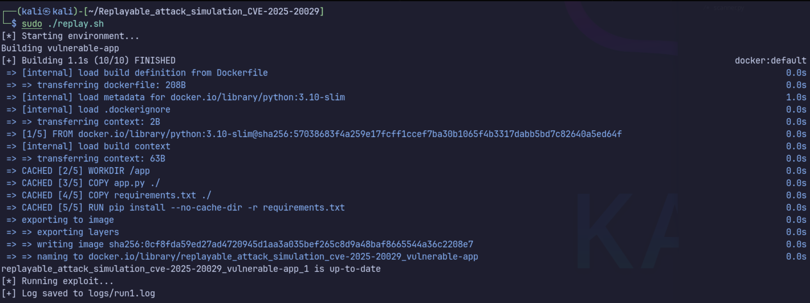

# 🔐 Replayable Attack Simulation – CVE-2025-20029


> ⚠️ This repository simulates CVE-2025-20029 in a **safe and controlled environment**.  
> It does **not** interact with real F5 BIG-IP systems or exploit any production service.  
> The goal is educational: to study the vulnerability pattern and test payloads safely.

## 🛠 About CVE-2025-20029

CVE-2025-20029 is a high-severity command injection vulnerability affecting F5 BIG-IP systems.  
The issue resides in the **iControl REST API**, which, under certain configurations, allows an authenticated user to execute arbitrary system commands via the `/mgmt/tm/util/bash` endpoint.

- **Impact:** Remote Code Execution (RCE) as root
- **Authentication Required:** Yes (standard user is sufficient)
- **CVSS v3.1 Score:** 8.8
- **Attack Vector:** HTTP POST to iControl REST with crafted JSON payload

> This simulation demonstrates how the vulnerability could be exploited in a controlled, containerized environment.

## 🧪 Exploit Script Overview

The `exploit/exploit.py` script simulates a remote code execution scenario by sending a crafted JSON payload to the vulnerable F5 BIG-IP endpoint `/mgmt/tm/util/bash`.

**Key functionalities:**

- Sends a POST request with a JSON payload like `{"command": "id"}`  
- Emulates real-world misconfiguration where user-supplied input is passed directly to `bash`  
- Prints server responses to confirm execution

This script is intentionally minimal to make the exploit path transparent and easily modifiable.  
It is ideal for testing, replaying the attack vector, or incorporating into training labs.

## 🧯 PoC Limitations

This project does not:

- Include the actual vulnerable F5 codebase
- Use unsafe or unauthorized access to any real infrastructure
- Reproduce the exact serialization vulnerability from CVE-2025-20029

Instead, it focuses on:

- Understanding the attack logic
- Reproducing post-exploitation behavior safely
- Teaching others how such attacks are structured

## 🐳 Features

- Reproducible PoC in a Docker-contained lab
- One-command replay (`replay.sh`)
- Auto-generated report (`report.md`)
- CVSS/metadata tagging via `meta.yaml`

## 🖥️ How to Use

### 1. Prerequisites

- Docker + Docker Compose
- Python 3.8+

### 2. Run Simulation
```sh
cd CVE-2025-20029

# Make scripts executable
chmod +x replay.sh

# Run the exploit + generate Markdown report
sudo ./replay.sh
```



## 📁 Directory Structure

```yaml
.
├── app.py               # Flask mock app simulating vulnerable endpoint
├── Dockerfile
├── docker-compose.yml
├── replay.sh
├── report.md /         # Auto-generated report
├── exploit/
│   └── exploit.py
├── logs/
│   └── run1.log
├── meta.yaml
├── detection.md
├── remediation.md
├── utils/
│   ├── report_generator.py
```

## 📄 Meta
CVE: CVE-2025-20029
- Severity: High
- CVSS: 8.8
- Tags: command-injection, rest-api, auth-required
- Safe to Run? ✅ Yes — fully isolated via Docker.

## 📚 PoC Reference

This simulation was inspired by public research on CVE-2025-20029:

- 🔗 [CyberSecurityNews – PoC Exploit Released for F5 BIG-IP CVE-2025-20029](https://cybersecuritynews.com/poc-exploit-released-for-f5-big-ip/?utm_source=chatgpt.com)

> 💡 **Note**
> The implementation here is **not a 1:1 copy of any production environment**,  but a minimal, educational mock-up using Flask and Docker to safely demonstrate the core logic of the vulnerability.
