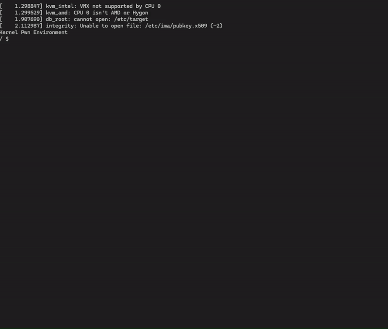

# CVE-2025-21756

This is an exploit for [CVE-2025-21756](https://nvd.nist.gov/vuln/detail/CVE-2025-21756). It is written for linux kernel 6.6.75.

## Writeup

A full writeup on the exploitation process is linked [here](https://hoefler.dev/articles/vsock.html).

