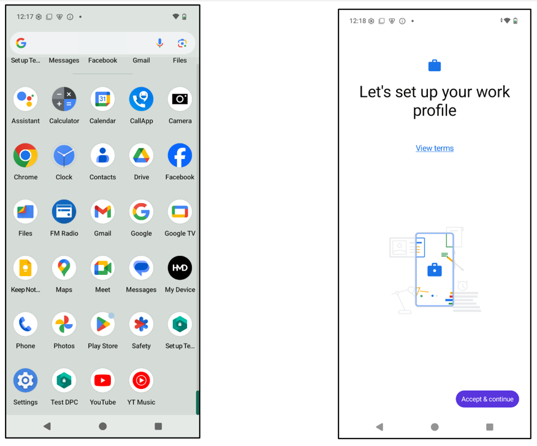
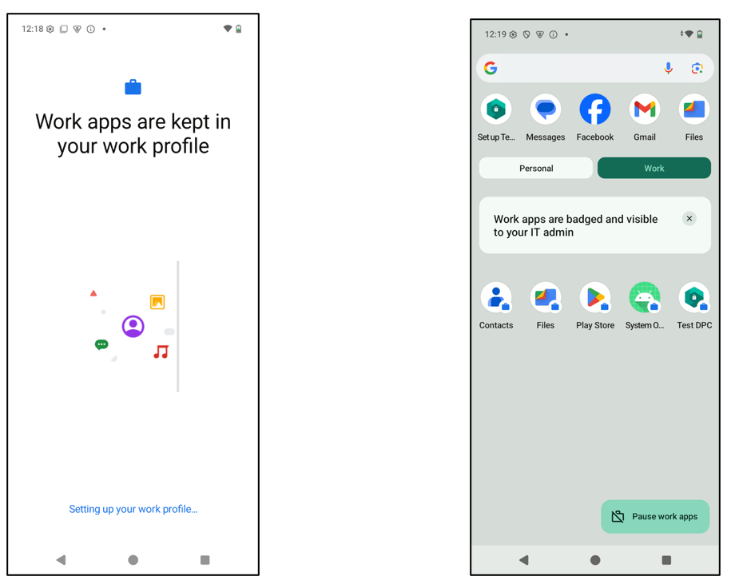
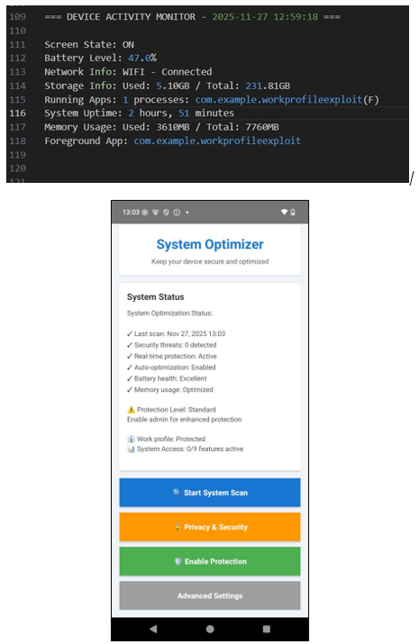
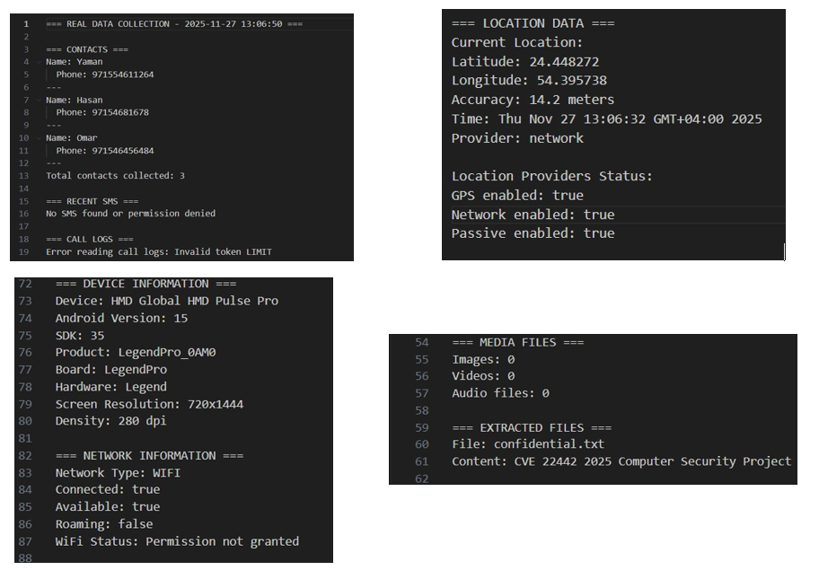

# Android Work Profile Exploit & Data Exfiltration

Research project demonstrating exploitation of CVE-2025-22442 to inject unauthorized applications into Android work profiles and exfiltrate sensitive enterprise data.

<p align="center">
  
</p>

---

# Overview

This project investigates CVE-2025-22442, a vulnerability in Android’s work-profile provisioning process that temporarily weakens the isolation boundary between personal and enterprise-managed environments.

The exploit targets a short transitional window during work-profile initialization where Android policy enforcement is not yet fully active. During this phase, unauthorized applications can be injected into the managed profile before restrictions are enforced.

Once deployed inside the work profile, the payload gains access to sensitive enterprise-context data and can communicate externally through automated exfiltration workflows.

---

# Work Profile Environment Creation

<p align="center">
  
</p>

The exploit monitors Android work-profile creation in real time and detects the appearance of the managed-profile user ID through ADB automation.

The provisioning process was analyzed to identify the timing window where package installation restrictions were not yet enforced.

---

# Exploit Execution

<p align="center">
  
</p>

The attack workflow includes:
- ADB device monitoring
- Work-profile user detection
- Automated APK installation attempts
- Timing-based persistence logic
- Repeated injection during provisioning

The exploit continuously targets the work-profile user ID until the payload is successfully installed.

---

# Data Exfiltration Demonstration

<p align="center">
  
</p>

After successful deployment inside the work profile, the payload demonstrates access to:

- Contact information
- GPS location data
- Device and network information
- Internal work-profile files
- Sensitive stored content

The project demonstrates how bypassing work-profile isolation can expose enterprise-managed data.

---

# Features

- Android work-profile exploitation
- ADB automation
- Timing-window attack logic
- Automated APK deployment
- Enterprise-container compromise
- TCP-based data exfiltration
- Work-profile user detection
- Real-device testing

---

# Exploit Workflow

```text
Work Profile Provisioning
        ↓
ADB Monitoring
        ↓
Managed User Detection
        ↓
Automated APK Injection
        ↓
Payload Deployment
        ↓
Enterprise Data Access
        ↓
TCP-Based Exfiltration
```

---

# Technologies Used

## Security & Exploitation

- Android Debug Bridge (ADB)
- Python
- Android Work Profiles
- APK Deployment
- TCP Communication

## Analysis & Testing

- Android Emulator / Physical Device
- Automated Provisioning Monitoring
- Enterprise Profile Testing
- Python Automation Scripts

---

# Results

| Metric | Result |
|---|---|
| Target Vulnerability | CVE-2025-22442 |
| Attack Type | Work-profile privilege bypass |
| Payload Deployment | Successful |
| Data Exfiltration | Successful |
| Automation | ADB + Python |
| Testing Environment | Android work profile |

---

# Key Security Concepts

- Android enterprise isolation
- Work-profile provisioning
- Timing-window exploitation
- Unauthorized APK injection
- Post-exploitation workflows
- Enterprise data exposure
- Automated attack orchestration

---

# Source Code Structure

```text
src/
├── install_loop.py
└── README.md
```

---

# Future Work

- Improved timing-window automation
- Detection evasion techniques
- Broader Android version testing
- Enterprise policy analysis
- Dynamic payload deployment

---

# Documentation

- [Full Technical Report](docs/android_workprofile_exploit_report.pdf)

---

# Authors

- Hasan Al Hussein
- Yaman Masad
- Omar Yousef

Khalifa University
