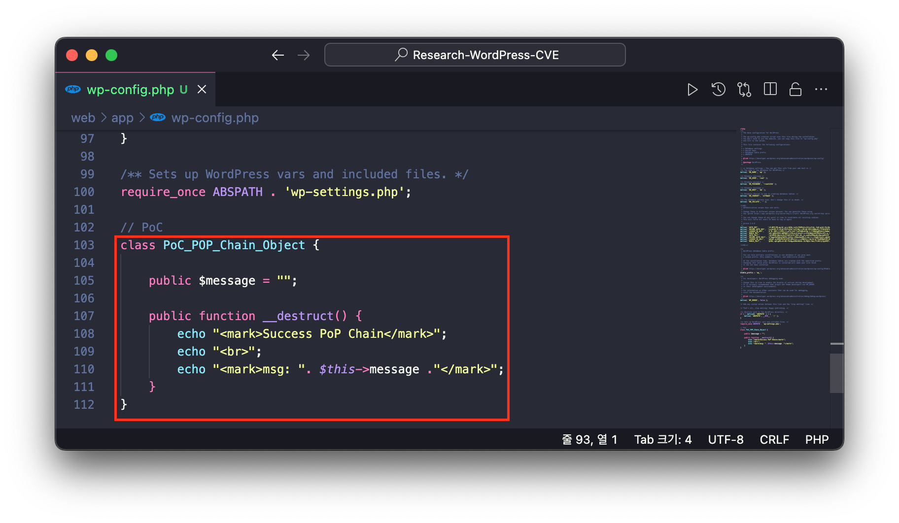
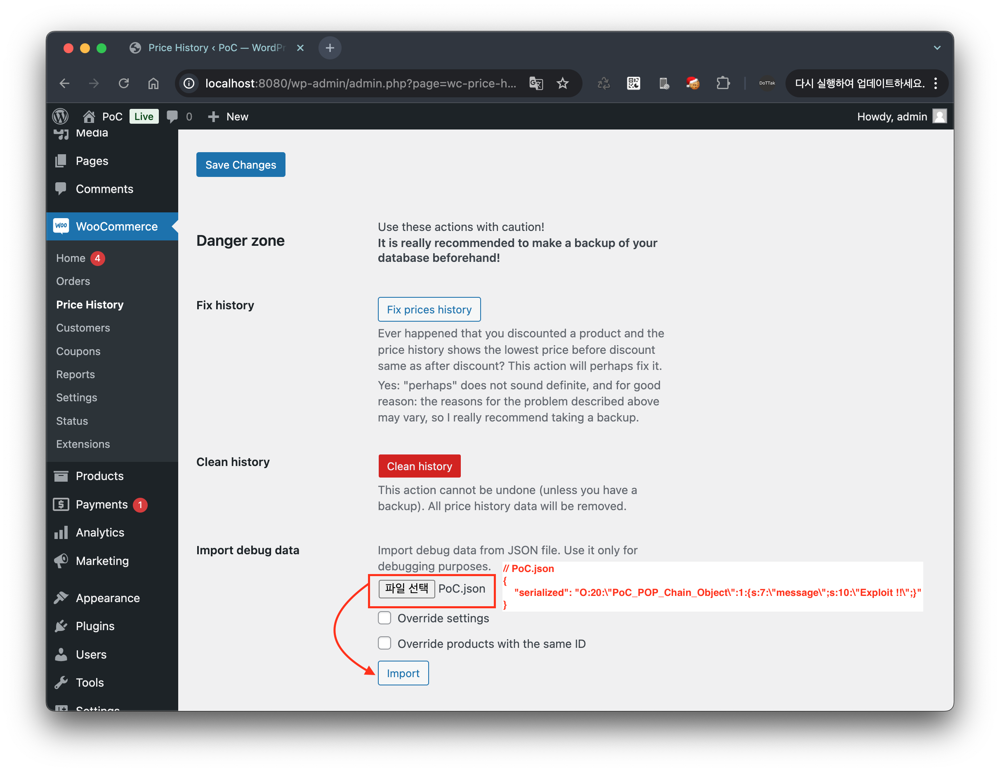
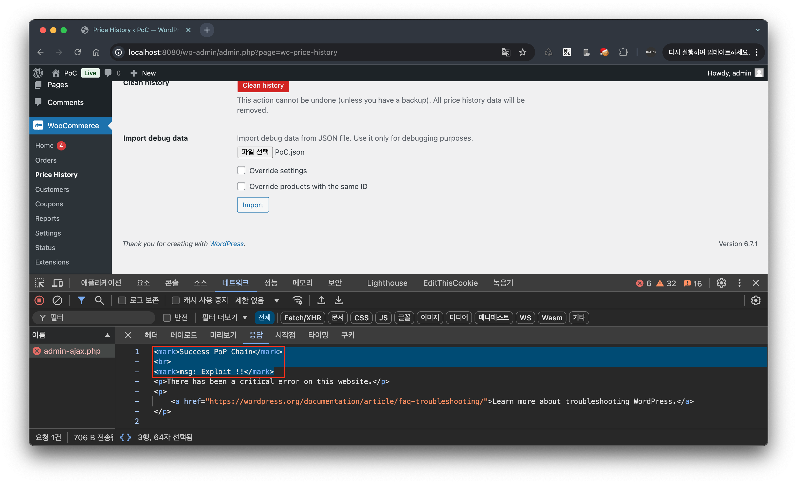
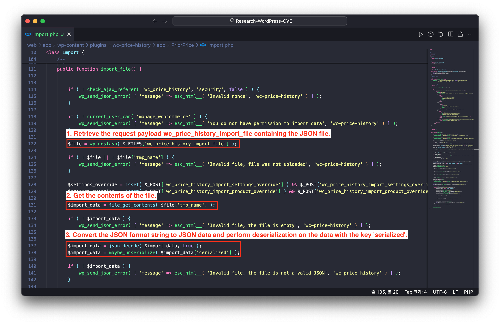

# CVE-2025-22510

## 1️⃣ Component type

WordPress plugin

## 2️⃣ Component details

`Component name` WC Price History for Omnibus

`Vulnerable version` <= 2.1.4

`Component slug` wc-price-history

`Component link` https://wordpress.org/plugins/wc-price-history/

## 3️⃣ OWASP 2017: TOP 10

`Vulnerability class` A3: Injection

`Vulnerability type` PHP Object Injection

## 4️⃣ Pre-requisite

Shop manger(Administrator +)

## 5️⃣ **Vulnerability details**

### 👉 **Short description**

In WC Price History for Omnibus plugin version 2.1.4 and below, JSON files can be uploaded through the 'Import debug data' section in the WooCommerce dashboard's 'Price History' menu (`/wp-admin/admin.php?page=wc-price-history`). The uploaded JSON file is sent as a `wc_price_history_import_file` payload, and a PHP Object Injection vulnerability occurs in the 'serialized' key value of the JSON data. Through this vulnerability, an attacker with Shop Manager privileges can inject PHP objects.

While the plugin itself does not have any known POP Chains, if POP chains are discovered in other plugins or themes on the target WordPress site, attackers can perform arbitrary file deletion, sensitive information theft, and code execution.

### 👉 **How to reproduce (PoC)**

1. Prepare a WordPress site with WC Price History for Omnibus plugin version 2.1.4 or lower installed and activated.
    
    > To activate this plugin, the WooCommerce plugin must first be installed and activated.
    > 
2. To test the PHP Object Injection vulnerability, add the following class `PoC_POP_Chain_Object` to the bottom of the `wp-config.php` file.
    
    ```php
    class PoC_POP_Chain_Object {
    	
    	public $message = "";
    
    	public function __destruct() {
    		echo "<mark>Success PoP Chain</mark>";
    		echo "<br>";
    		echo "<mark>msg: ". $this->message ."</mark>";
    	}
    }
    ```
    
    
    
3. Next, create a file with the following JSON data.
    
    > In this JSON data, the data entered in the `serialized` key is in PHP serialized object format, which creates an instance of the `PoC_POP_Chain_Object` class previously added to the `wp-config.php` file and assigns the string 'Exploit !!' to the message property.
    > 
    
    ```json
    {
        "serialized": "O:20:\"PoC_POP_Chain_Object\":1:{s:7:\"message\";s:10:\"Exploit !!\";}"
    }
    ```
    
4. Next, navigate to the 'Price History' menu (`/wp-admin/admin.php?page=wc-price-history`) in the WooCommerce dashboard. In the 'Import debug data' section, select the previously created JSON file through the file upload form and click the 'Import' button to upload it.
    
    
    
5. As a result of the upload request, in the response data, you can see that the magic method `__destruct()` of the class `PoC_POP_Chain_Object` added to `wp-config.php` is executed, displaying the following message.
    
    ```html
    <mark>Success PoP Chain</mark>
    <br>
    <mark>msg: Exploit !!</mark>
    ```
    
    
    

### 👉 **Additional information (optional)**

#### [Cause of Vulnerability]

When you upload JSON data through the 'Import debug data' section in the WooCommerce dashboard's 'Price History' menu (`/wp-admin/admin.php?page=wc-price-history`) and click the 'Import' button,

The `import_file()` function defined in the `Import` class of the `/wp-content/plugins/wc-price-history/app/PriorPrice/Import.php` file is executed. This function retrieves the request payload `wc_price_history_import_file` containing the JSON file, then retrieves the data with key `serialized` from that JSON data and performs deserialization through the `maybe_unserialize` function.



Therefore, the request payload `wc_price_history_import_file` is in JSON format, and a PHP Object Injection vulnerability occurs during the process of deserializing the serialized data with key `serialized` without validation.

### 6️⃣ Exploit Demo

[](https://www.youtube.com/watch?v=z-sMi8K1Q0E)

### 7️⃣ References
- [https://nvd.nist.gov/vuln/detail/CVE-2025-22510](https://nvd.nist.gov/vuln/detail/CVE-2025-22510)