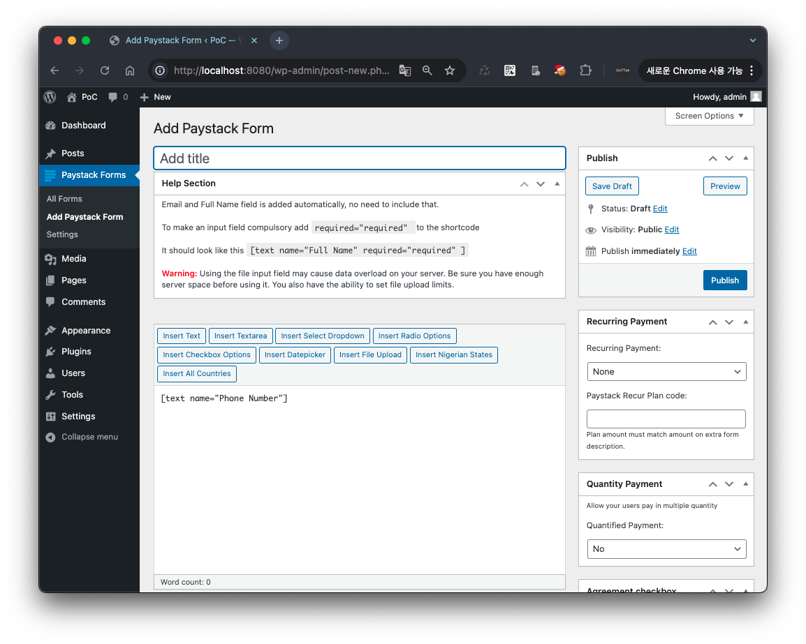
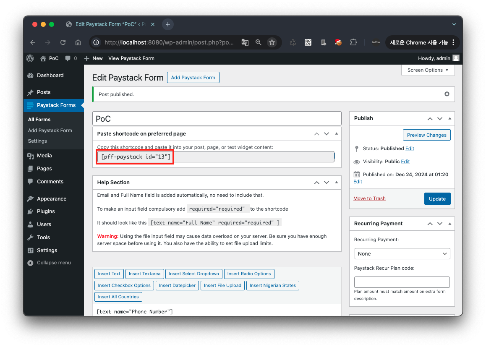
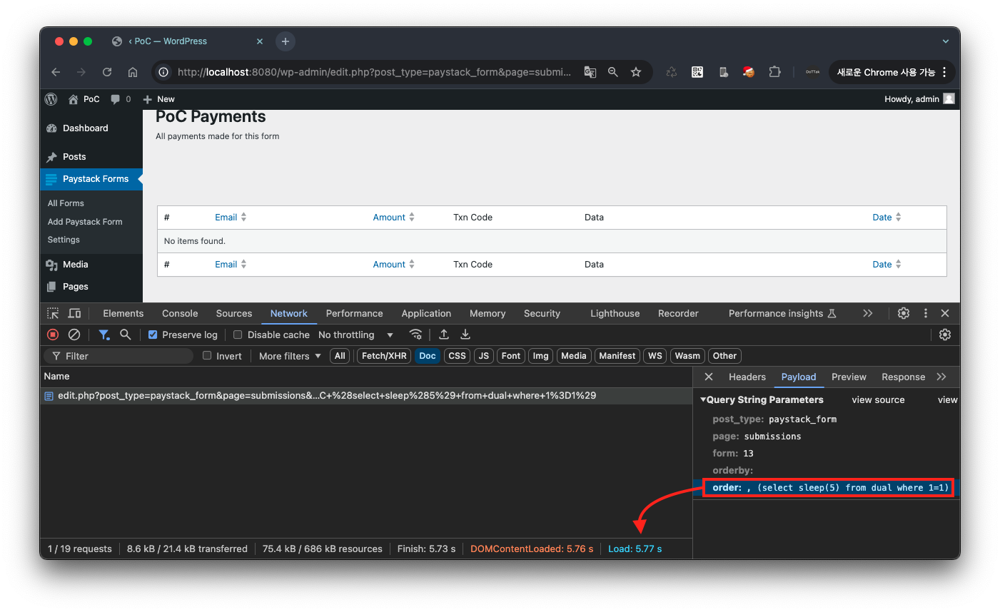
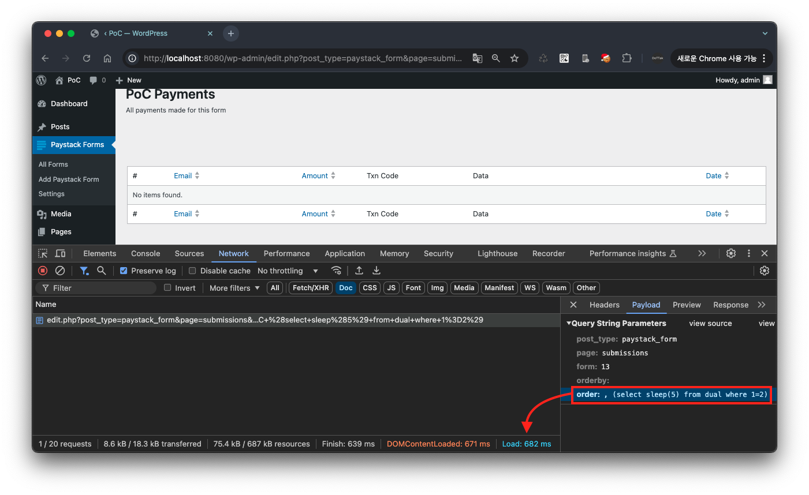
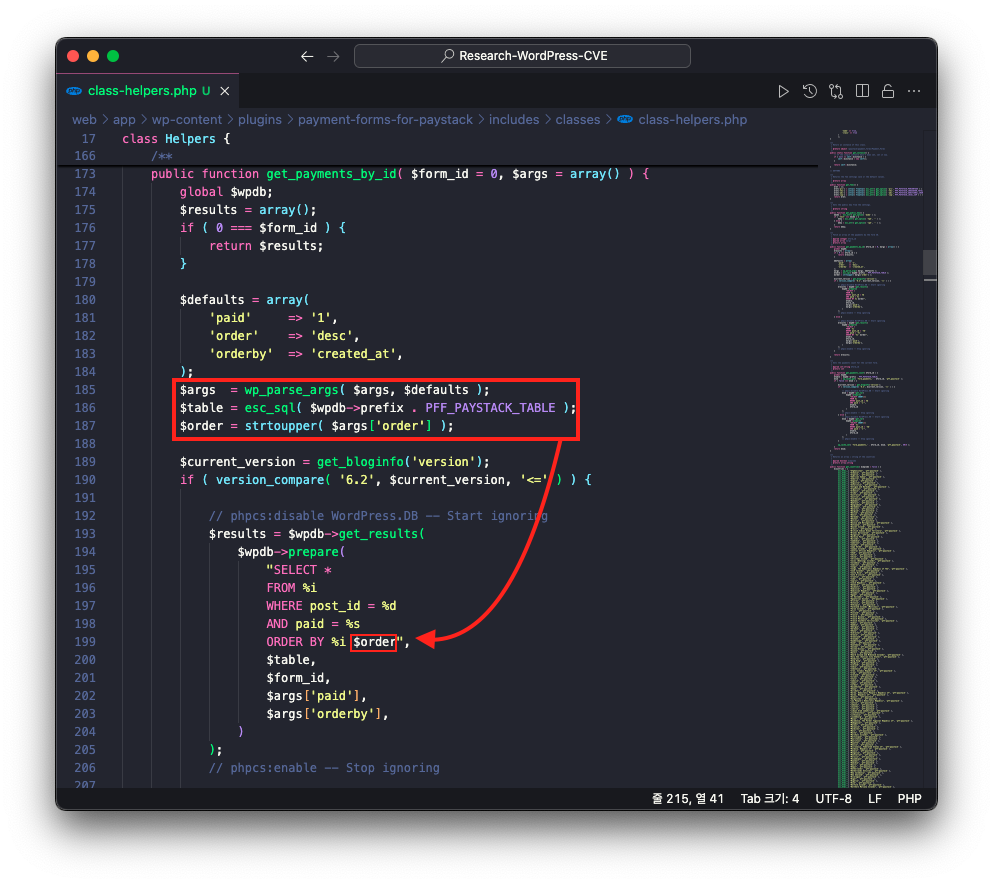
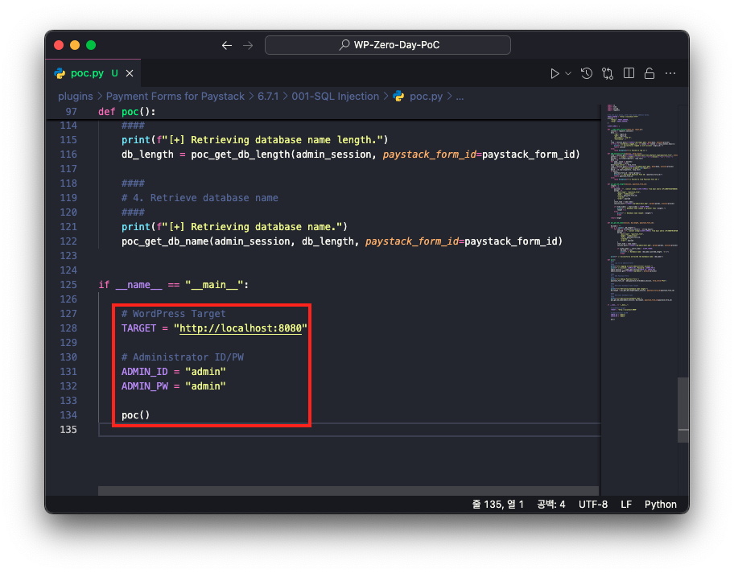
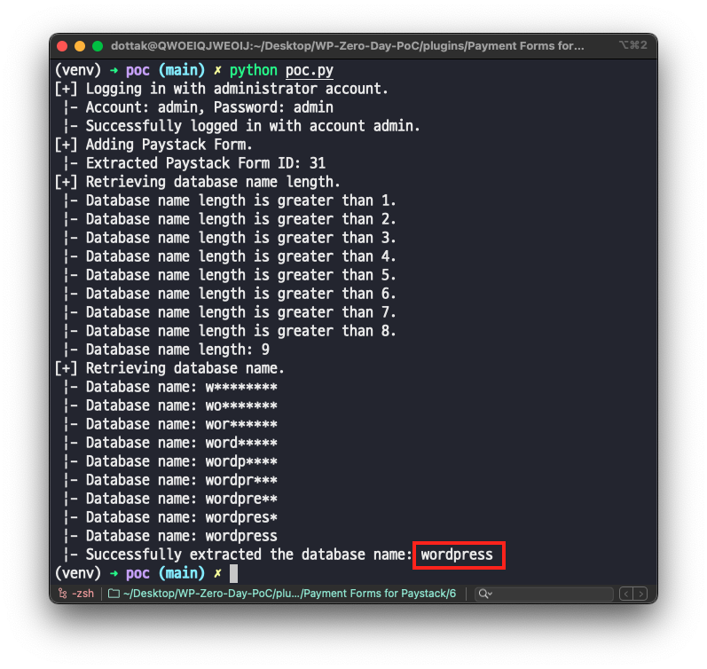

# CVE-2025-22652

## 1️⃣ Component type

WordPress plugin

## 2️⃣ Component details

`Component name` Payment Forms for Paystack

`Vulnerable version` <= 4.0.1

`Component slug` payment-forms-for-paystack

`Component link` https://wordpress.org/plugins/payment-forms-for-paystack/

## 3️⃣ OWASP 2017: TOP 10

`Vulnerability class` A3: Injection

`Vulnerability type` SQL Injection

## 4️⃣ Pre-requisite

Administrator

## 5️⃣ **Vulnerability details**

### 👉 **Short description**

In Payment Forms for Paystack plugin version 4.0.1 and below, there is an SQL Injection vulnerability due to insufficient input validation and escape processing for the URL parameter `order` when viewing the payment list in payment forms. Through this, an attacker with administrator privileges can extract all information from the target site's database.

While this vulnerability does not allow direct data querying, data can be extracted using Time-based SQL Injection techniques.

### 👉 **How to reproduce (PoC)**

1. Prepare a WordPress site with Payment Forms for Paystack plugin installed version 4.0.1 or below.
2. Since you need to add a Paystack form to perform the lookup, add a form from the Paystack form add menu (`wp-admin/post-new.php?post_type=paystack_form`).
    
    
    
3. After adding the form, you can check the ShortCode, and insert the attribute ID of that ShortCode into the URL parameter `form` in the URL below before accessing it.
    
    ```
    http://localhost:8080/wp-admin/edit.php?post_type=paystack_form&page=submissions&form=<Insertion Point>&orderby=&order=,+(select+sleep(5)+from+dual+where+1=1)
    ```
    
    For example, if `[pff-paystack id="13"]`, access `http://localhost:8080/wp-admin/edit.php?post_type=paystack_form&page=submissions&form=13&orderby=&order=,+(select+sleep(5)+from+dual+where+1=1)`
    
    
    
4. As a result, since the condition clause `where 1=1` in the SQL Injection payload inserted into the URL parameter `order` is always true, you can confirm that the `sleep(5)` function is executed and the response arrives after 5 seconds.
    
    
    
5. On the other hand, if you change the condition clause in the SQL Injection payload inserted into `order` to `where 1=2`, you can confirm that the response arrives immediately.
    
    ```
    http://localhost:8080/wp-admin/edit.php?post_type=paystack_form&page=submissions&form=<Insertion Point>&orderby=&order=,+(select+sleep(5)+from+dual+where+1=2)
    ```
    
    For example, if `[pff-paystack id="13"]`, access `http://localhost:8080/wp-admin/edit.php?post_type=paystack_form&page=submissions&form=13&orderby=&order=,+(select+sleep(5)+from+dual+where+1=2)`
    
    
    

### 👉 **Additional information (optional)**

#### [Cause of Vulnerability]

When requesting the URL where the vulnerability occurs, the `get_payments_by_id` function in the file `/wp-content/plugins/payment-forms-for-paystack/includes/classes/class-helpers.php` is called.

At this point, the URL parameter `order` is directly inserted into the SQL query and executed on the database without any input validation or escape processing.



Therefore, when the SQL Injection payload `, (select sleep(5) from dual where 1=1)` is inserted into the URL parameter `order`, the SQL query shown below is executed. At this point, depending on whether the condition clause in the payload is true or false, there is a difference in response time, and this time difference can be used to extract data from the database.

```sql
SELECT * FROM %i WHERE post_id = %d AND paid = %s ORDER BY %i , (select sleep(5) from dual where 1=1)
```

#### [PoC Code Implementation and Execution]

1. Open the PoC code in an editor and enter the WordPress site address and administrator credentials.
    
    
    
2. 2. Then enter the following command to run the PoC code.
    
    > `Required module`  requests
    >
    
    ```bash
    python poc.py
    ```
    
    

## 6️⃣ Exploit Demo

[](https://www.youtube.com/watch?v=6MRjjQL4F34)

## 7️⃣ References

- [https://nvd.nist.gov/vuln/detail/CVE-2025-22652](https://nvd.nist.gov/vuln/detail/CVE-2025-22652)