# CVE-2025-22710

## 1️⃣ Component type

WordPress plugin

## 2️⃣ Component details

`Component name` WooCommerce Advanced Bulk Edit Products, Orders, Coupons, Any WordPress Post Type – Smart Manager

`Vulnerable version` <= 8.50.0

`Component slug` smart-manager-for-wp-e-commerce

`Component link` https://wordpress.org/plugins/smart-manager-for-wp-e-commerce/

## 3️⃣ OWASP 2017: TOP 10

`Vulnerability class` A3: Injection

`Vulnerability type` SQL Injection

## 4️⃣ Pre-requisite

Administrator

## 5️⃣ **Vulnerability details**

### 👉 **Short description**

The WooCommerce Advanced Bulk Edit Products, Orders, Coupons, Any WordPress Post Type – Smart Manager (hereafter Smart Manager) plugin is a plugin that allows bulk editing and viewing of all post types in WordPress.

In Smart Manager plugin version 8.50.0 and below, when using the advanced search function for viewing posts, an SQL Injection vulnerability occurs because filtering values are passed to database queries without escape processing.

However, while the direct results of SQL Injection attacks cannot be seen on the screen, Blind SQL Injection is possible through differences in response values based on true/false conditions.

### 👉 **How to reproduce (PoC)**

> ⚠️ At least one post must exist to observe the difference in response values based on true/false conditions.
>

1. Prepare a WordPress site with the Smart Manager plugin installed, log in with an administrator account, and navigate to the Smart Manager plugin's dashboard page (`/wp-admin/admin.php?page=smart-manager`).

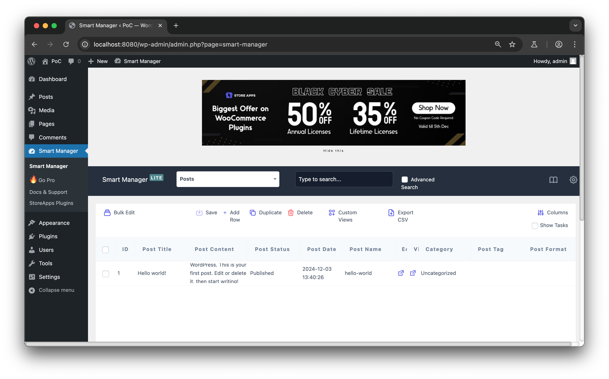

2. Click the 'Advanced Search' checkbox on the right side of the search bar to open the advanced search window.

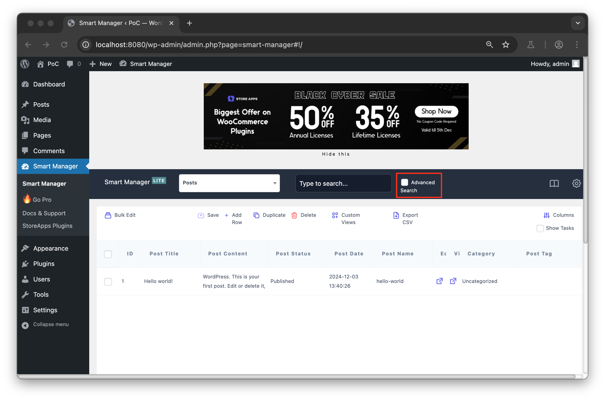

3. In the advanced search filtering, select 'Post Title' and 'is', then enter the payload `' OR 1=1 )) #` in the text input form. After that, click the search button at the top.

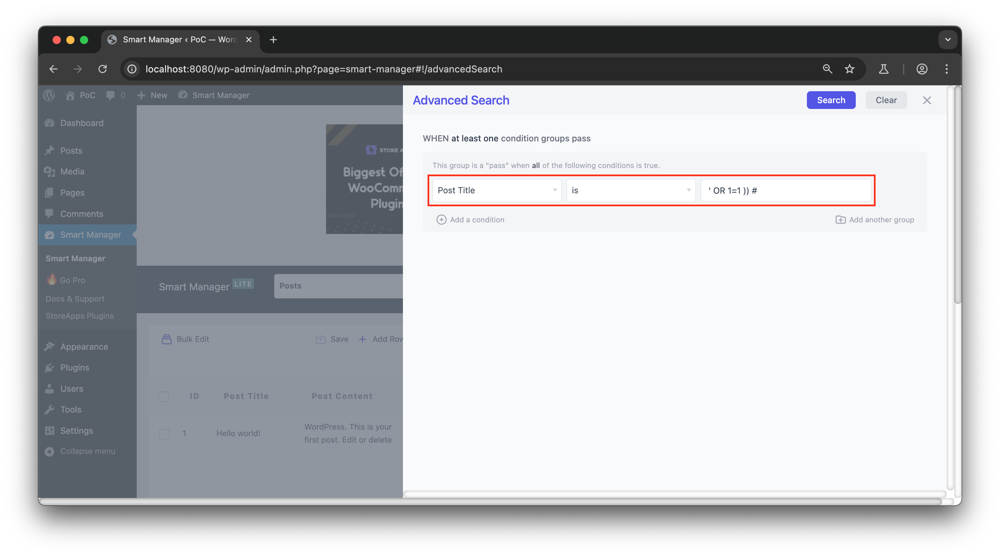

4. When checking the search results, since the payload's condition is always true (OR 1=1), all posts are retrieved.

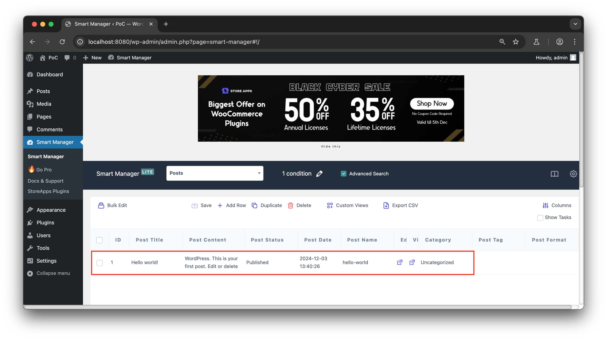

5. On the other hand, if you select 'Post Title' and 'is' in the advanced search filtering and enter `' OR 1=2 )) #` in the text input form, no posts will be retrieved because the condition is always false (OR 1=2).


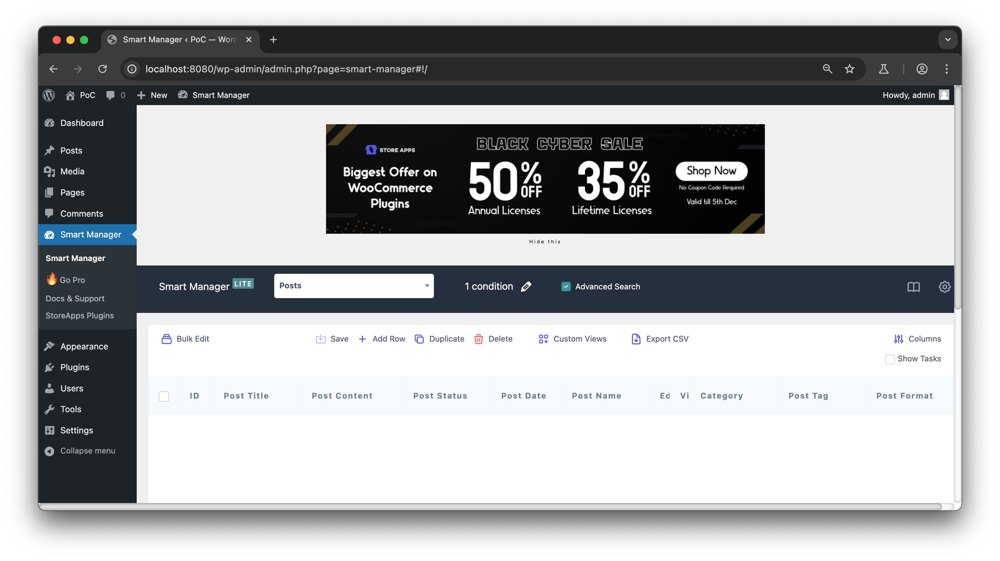

### 👉 **Additional information (optional)**

### [Cause of Vulnerability]

When executing the 'Advanced Search' function requested in the PoC description above, the following packet is generated, and the filtering values (`Post Title`, `is`, `' OR 1=1 )) #`) entered in the advanced search are input into the request data `advanced_search_query`.

```json
advanced_search_query=[{"condition":"OR","rules":[{"condition":"AND","rules":[{"type":"wp_posts.post_title","operator":"is","value":"' OR 1=1 )) #"}]}]}]
```

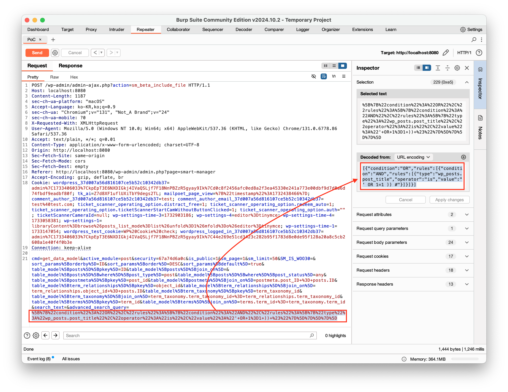

When this packet is requested, the `get_data_model` function in the `/wp-content/plugins/smart-manager-for-wp-e-commerce/classes/class-smart-manager-base.php` file is called, and performs database queries in the following order.

1. If the request data `advanced_search_query` exists, it calls the `process_search_cond` function. At this time, the request data `advanced_search_query` is passed to the value with key `search_query` in the key-value pair argument.
    
    ```json
    search_query=[{"condition":"OR","rules":[{"condition":"AND","rules":[{"type":"wp_posts.post_title","operator":"is","value":"' OR 1=1 )) #"}]}]}]
    ```

    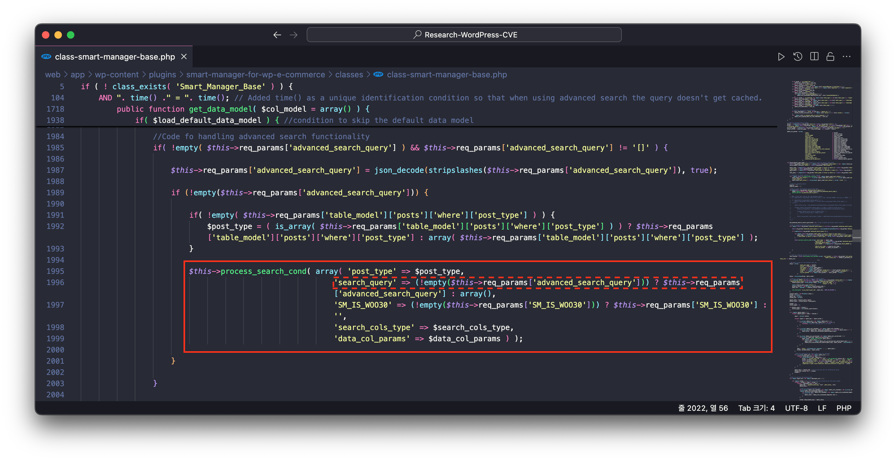

2. The called function `process_search_cond` iterates through the value with key `search_query`, initializes the filtering value Post Title(`post_tile`) in the variable `$search_col`, and initializes the filtering value `' OR 1=1 )) #` containing the SQL Injection payload in the variable `$search_value`.

    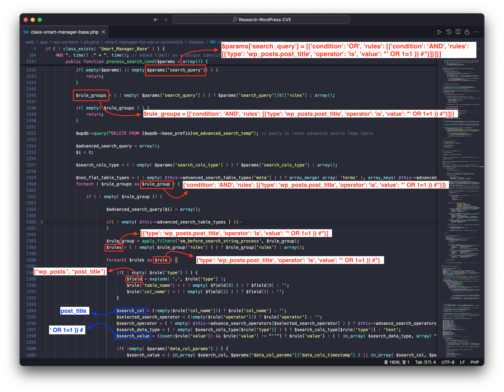

3. The variables `$search_col` and `$search_value` are passed to the `$search_params` array's keys `search_col`(=`post_title`) and `search_value`(=`' OR 1=1 )) #`) respectively. Subsequently, this `$search_params` variable is passed as a value with key `search_params` to the function `create_flat_table_search_query`.

    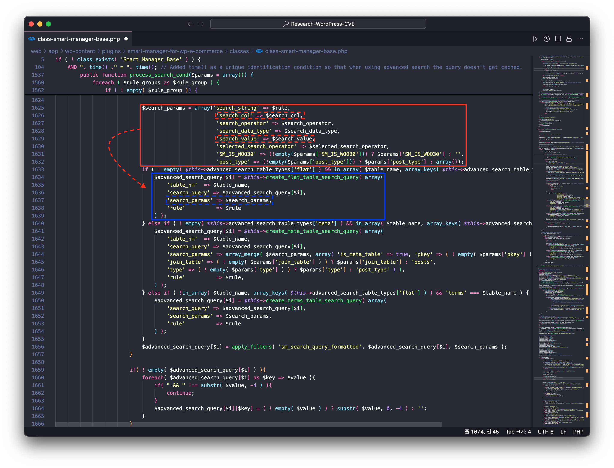

4. Subsequently, the `create_flat_table_search_query` function defines the SQL query's WHERE clause, and at this point, the `search_value`(=`' OR 1=1 )) #`) of the key `search_params` passed as an argument is included in the WHERE clause without any escape processing.

    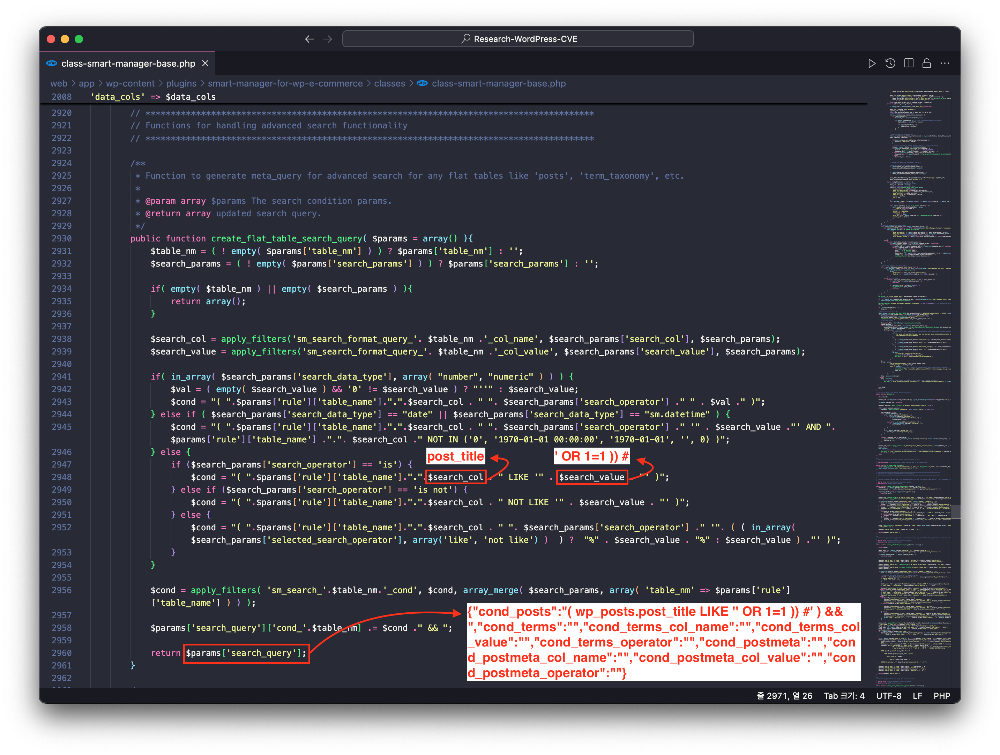

5. Then, the return value of the function `create_flat_table_search_query` (containing the SQL Injection payload) is passed as an argument to the function `process_flat_table_search_query`.

    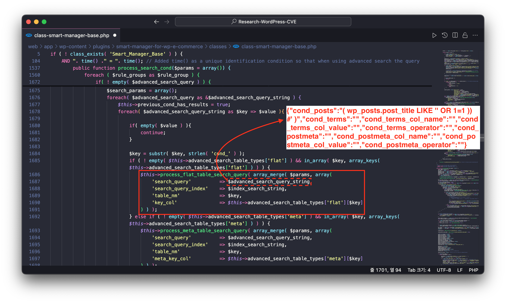

6. The function `process_flat_table_search_query` constructs a database query using the received argument, initializing the variables `$select`, `$from`, and `$where`. Here, we can see that the SQL Injection payload is passed directly to the variable `$where` without any validation.

    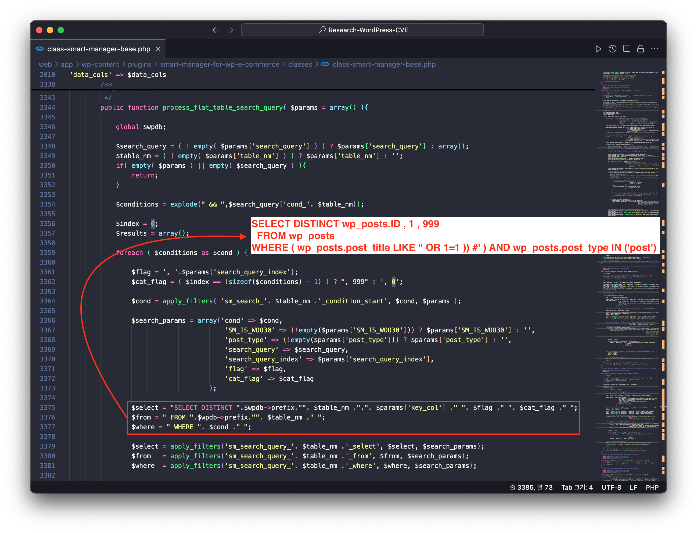

7. The variables `$select`, `$from`, `$where` are directly assigned to the variable `$query_posts_search`, and this variable is ultimately passed as an argument to the function that performs the database query.

    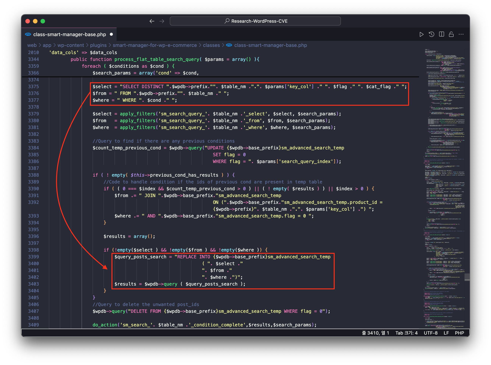

In the advanced search function, user input (`' OR 1=1 )) #`) is directly included in the database query without escape processing, resulting in an SQL Injection vulnerability. This vulnerability allows attackers to execute arbitrary SQL queries, potentially leading to serious security risks such as leaking or manipulating sensitive information from the database.

#### [PoC Code Implementation and Execution]

> ⚠️ The PoC code implementation queries the database name by exploiting the SQL Injection vulnerability.
>

1. Open the PoC code in an editor and enter the WordPress site address and administrator credentials.

    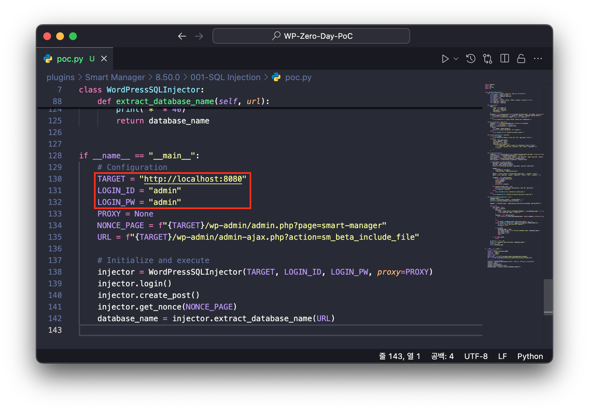

2. Then enter the following command to run the PoC code.
    
    > `Required module`requests
    > 
    
    ```bash
    python poc.py
    ```
    
    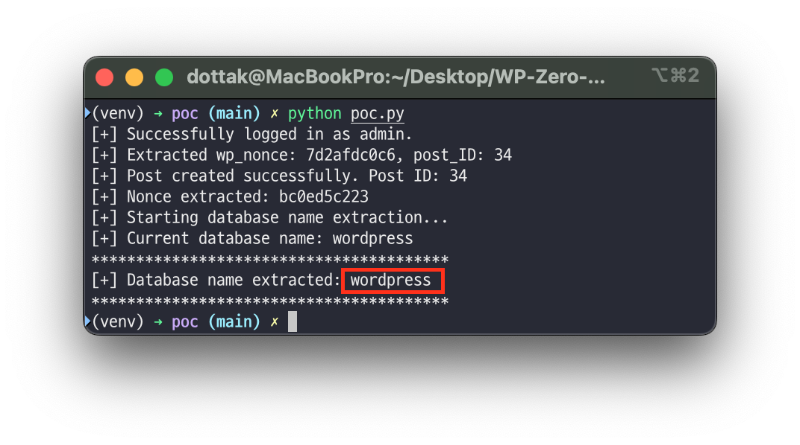

## 6️⃣ Exploit Demo

[](https://www.youtube.com/watch?v=yr9tvuSDmFw)

## 7️⃣ References

- [https://nvd.nist.gov/vuln/detail/CVE-2025-22710](https://nvd.nist.gov/vuln/detail/CVE-2025-22710)

