# PDF417 ID Validation Vulnerability Research

## Overview

This repository contains comprehensive security research documenting critical vulnerabilities in AAMVA-standard PDF417 barcode validation systems affecting government IDs, enterprise solutions, and consumer applications. The research includes a fully functional Proof of Concept (PoC) demonstrating systemic flaws in how ID verification systems process driver's license barcodes.

**IMPORTANT:** This code is provided for security research purposes only. See the [LICENSE.md](./LICENSE.md) file for allowed usage.

## Research Ethics Statement

This research was conducted following:
- Coordinated vulnerability disclosure principles
- 120+ day vendor notification period (exceeded standard 90 days)
- Synthetic data only (no real personal information)
- Educational/defensive security purposes
- ISO/IEC 29147 vulnerability disclosure standards
- Responsible disclosure through MITRE CVE Program and CISA VDP

## Related CVEs

This research demonstrates vulnerabilities assigned:
- **CVE-2025-31337** - IDScan.net validation flaw
- **CVE-2025-31336** - TokenWorks validation vulnerability

## Publication Status

- **Publication Date**: July 1, 2025
- **CVE Status**: Published (despite CISA case closure)
- **VINCE Case**: VU#396042 (closed by CISA as "not a vulnerability")
- **Disclosure Period**: 120+ days completed
- **MITRE CVE List**:
    - [CVE-2025-31337](https://cve.mitre.org/cgi-bin/cvename.cgi?name=CVE-2025-31337)
    - [CVE-2025-31336](https://cve.mitre.org/cgi-bin/cvename.cgi?name=CVE-2025-31336)

## CVSS v3.1 Risk Assessment

**Base Score: 10.0 (Critical)**  
**Vector**: `AV:N/AC:L/PR:N/UI:N/S:C/C:H/I:H/A:N`

**Breakdown**:
- **Attack Vector**: Network-exploitable via digital APIs
- **Attack Complexity**: Low (minimal effort required)
- **Privileges Required**: None (unauthenticated)
- **User Interaction**: None required
- **Scope**: Changed (affects dependent ID verification systems)
- **Confidentiality Impact**: High (enables unauthorized data access)
- **Integrity Impact**: High (complete validation bypass)
- **Availability Impact**: None (no direct availability impact)

**Exploit Example**:
```rust
// Temporal validation bypass demonstration
let license = CaliforniaLicense::builder()
    .birth_date("06201500") // Year 1500 - Medieval era
    .validate(); // Returns OK in affected systems
```

## Coordination History and Vendor Response Summary

### Disclosure Timeline
- **March 22, 2025**: Initial CVE request submitted to MITRE
- **March 25, 2025**: IDScan.net proof-of-concept submission and acknowledgment
- **March 28, 2025**: TokenWorks vulnerability acknowledgment received
- **April 3, 2025**: CISA VINCE case VU#396042 officially opened
- **April 9-16, 2025**: Extensive technical discussions with affected vendors
- **June 18, 2025**: CISA case closure decision (dismissed as "understood risk")
- **July 1, 2025**: Public disclosure following extended coordination period

### Vendor Responses and Technical Disagreements

#### IDScan.net (Joshua Sheetz, CISO/VP Engineering)
**Initial Response**: *"After investigating this, it looks like you are just spoofing the barcode data. This is a common standard."*

**Technical Position**:
- Claimed their parser "just reads data" and isn't responsible for validation
- Argued that impossible values (524-year-old individuals) are acceptable in a "parser"
- Dismissed implementation-specific vulnerabilities as AAMVA standard limitations
- Contradicted their own marketing claims about "hundreds of algorithmic security checks"

**Marketing vs. Reality Gap**:
- VeriScan website promises "Fake ID Detection / ID Authentication"
- Claims to "catch fake IDs" and perform "security checks"
- Technical analysis revealed minimal validation beyond format compliance

#### TokenWorks Response
- Acknowledged the issue as a "DMV implementation problem"
- Downplayed vendor responsibility for cryptographic validation
- No remediation timeline provided

#### CISA Decision (June 18, 2025)
**Final Determination**: *"CISA has decided that this is not a vulnerability as it is an understood risk in the AAMVA DL Standard."*

**Technical Analysis of CISA's Position**:
This decision appears to conflate standard limitations with implementation-specific vulnerabilities. The research documented distinct technical issues:

1. **Multi-Layered Vulnerability Classification**:
    - **Layer 1**: AAMVA standard cryptographic deficiencies (acknowledged)
    - **Layer 2**: Implementation-specific validation failures (dismissed by CISA)
    - **Layer 3**: Marketing claims vs. actual security capabilities (not addressed)

2. **Implementation-Specific Issues Documented**:
    - **CWE-20 (Improper Input Validation)**: Accepting physiologically impossible values
    - **CWE-345 (Insufficient Verification of Data Authenticity)**: No cryptographic checks
    - **CWE-770 (Allocation of Resources Without Limits)**: No rate limiting
    - **CWE-841 (Improper Enforcement of Behavioral Workflow)**: No pattern detection

## Proof of Concept Validation Evidence

### Missouri ShowMeID Government Application Bypass
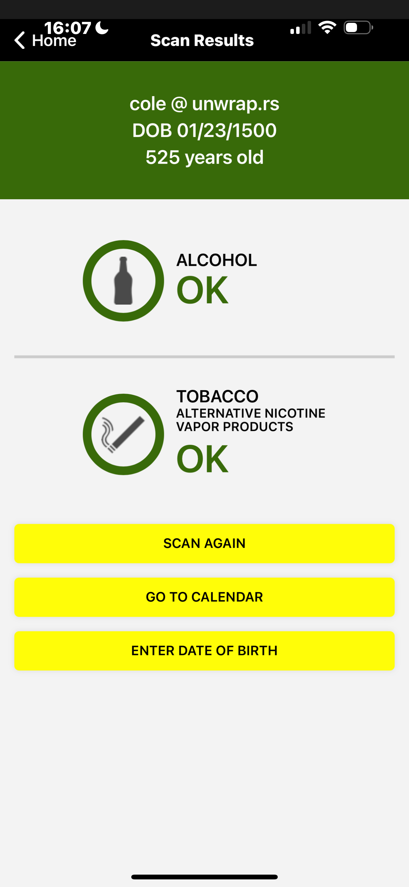 Missouri ShowMeID bypass evidence
```shell
gpg --verify signatures/show_me_id/img.png.asc scan_proof/show_me_id/img.png
```

**Impact**: Complete bypass of Missouri's official government ID verification application, demonstrating systemic vulnerabilities in state-level identity verification systems.

### VeriScan Enterprise Validation Bypasses

#### California License Validation Failures
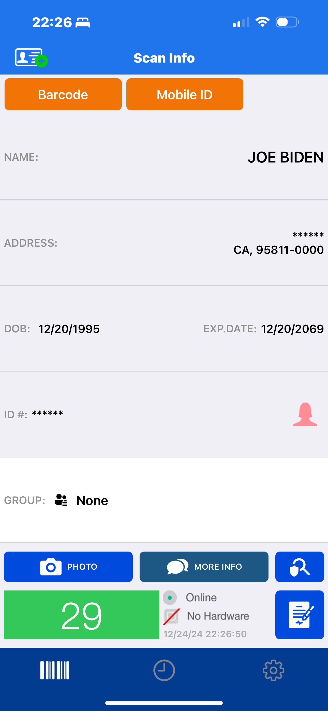
```shell
gpg --verify signatures/veriscan/california/andrew_before.png.asc scan_proof/veriscan/california/andrew_before.png
gpg --verify signatures/veriscan/california/andrew_after.png.asc scan_proof/veriscan/california/andrew_after.png
```

#### Arizona License Validation Bypasses
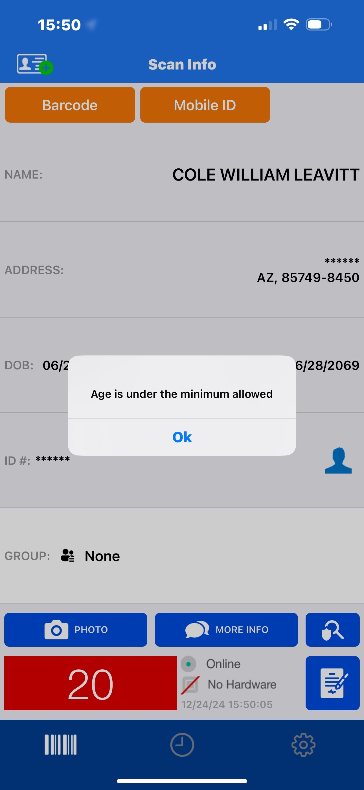
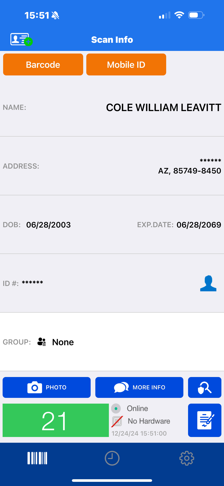
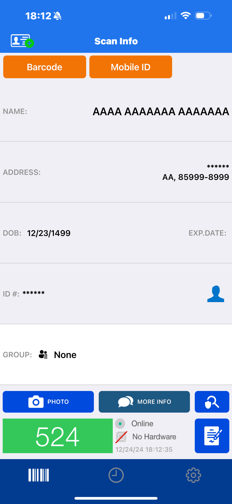
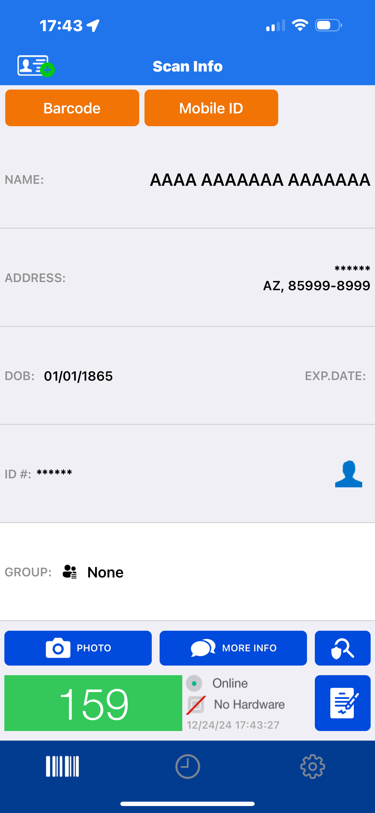
```shell
gpg --verify signatures/veriscan/arizona/unanimous.png.asc scan_proof/veriscan/arizona/unanimous.png
gpg --verify signatures/veriscan/arizona/unanimous_1.png.asc scan_proof/veriscan/arizona/unanimous_1.png
```

#### Florida License Validation Failure
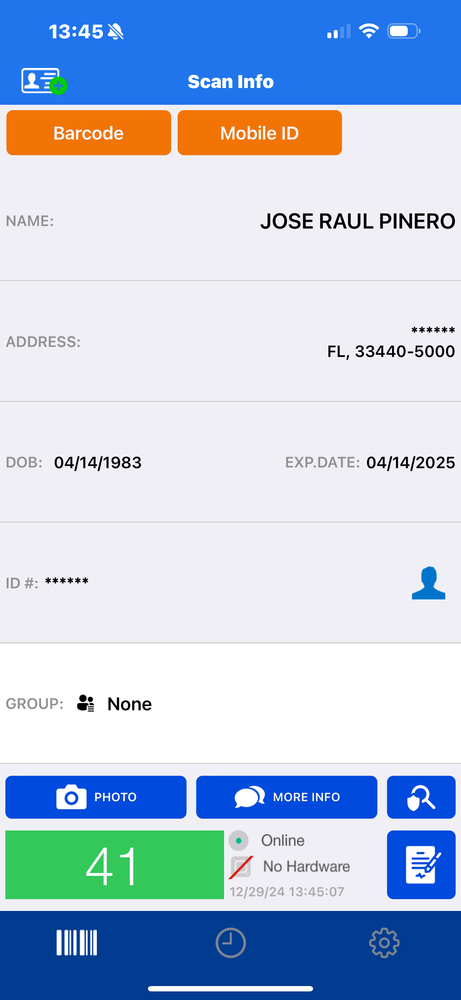
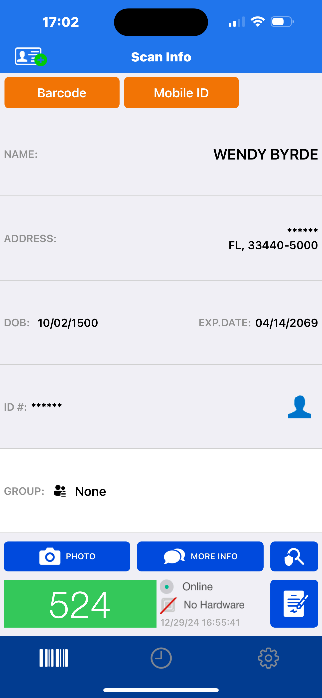
```shell
gpg --verify signatures/veriscan/florida/wendy_synthesized.png.asc scan_proof/veriscan/florida/wendy_synthesized.png
```

#### Georgia License Validation Bypass
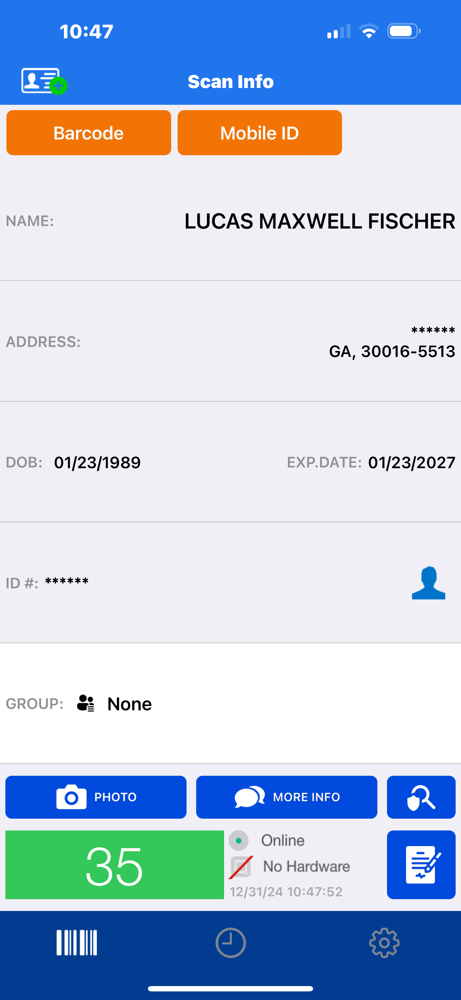
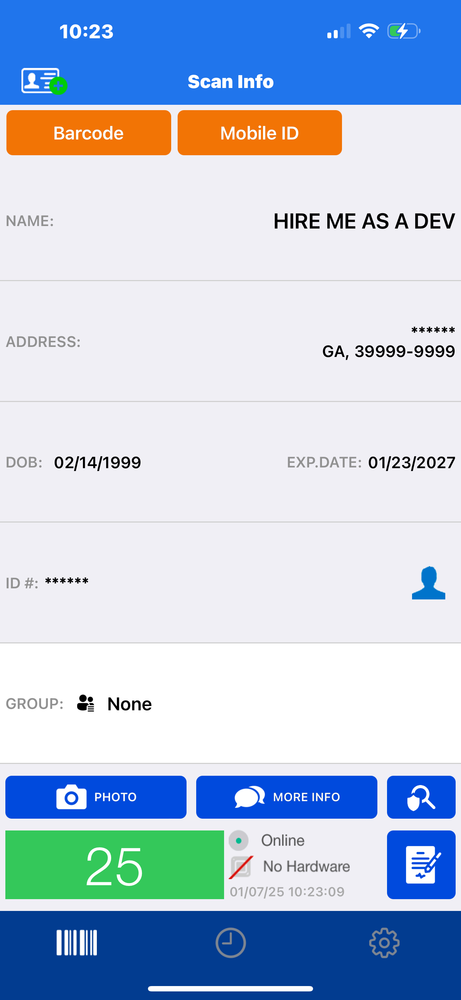
```bash
# Verify Georgia bypass evidence
gpg --verify signatures/veriscan/georgia/hire_me_2.png.asc scan_proof/veriscan/georgia/hire_me_2.png
```

#### New Jersey License Validation Failure

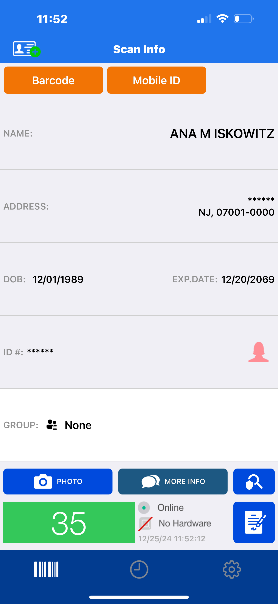
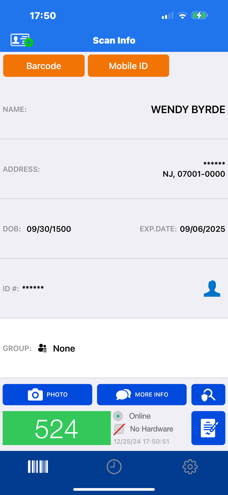
```shell
gpg --verify signatures/veriscan/new_jersey/wendy_synthesized.png.asc scan_proof/veriscan/new_jersey/wendy_synthesized.png
```

#### South Carolina License Validation Bypass
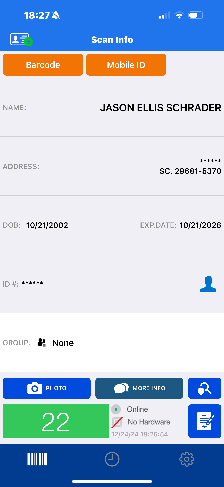
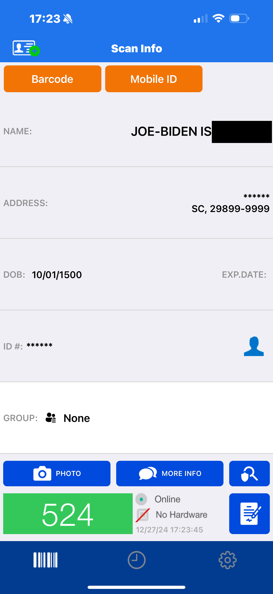
```shell
gpg --verify signatures/veriscan/south_carolina/slander.png.asc scan_proof/veriscan/south_carolina/slander.png
```

#### Texas License Validation Failure
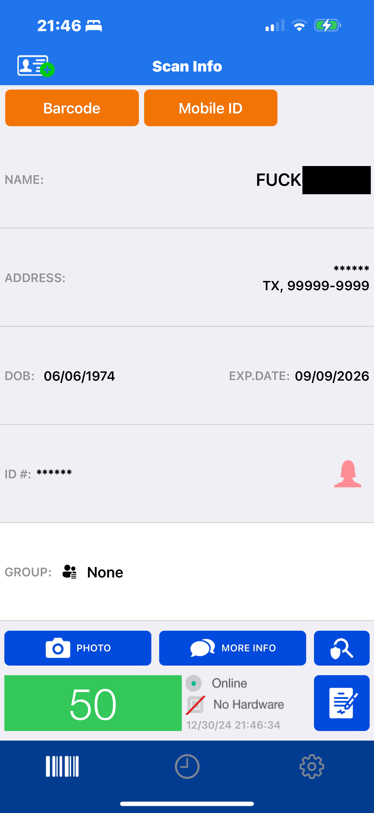 
Texas bypass evidence - demonstrates consistent vulnerability pattern across state implementations
```shell
gpg --verify signatures/veriscan/texas/slander.png.asc scan_proof/veriscan/texas/slander.png
```

## Technical Evidence and Vendor Rebuttals

### Documented Vulnerabilities

#### 1. Temporal Validation Bypass
**Finding**: VeriScan accepts birth dates from medieval times (e.g., year 1500)
**Vendor Response**: *"Where do you draw the line, especially in just a parser"*
**Technical Counter**: Human physiological limits provide clear validation boundaries (max ~122 years)

#### 2. Pattern Detection Failure
**Finding**: Same license number with different names accepted repeatedly
**Vendor Response**: *"We would not know if the first or second scan was real"*
**Technical Counter**: Pattern detection flags suspicious behavior regardless of which is authentic

#### 3. Marketing Claims Discrepancy
**Finding**: Product marketed as providing "security checks" and "fake ID detection"
**Vendor Response**: *"Using only our parsing tool...you are limited to what feature sets you have"*
**Technical Counter**: Marketing materials explicitly claim validation capabilities

#### 4. Commercial License Implications
**Finding**: CDL (Commercial Driver's License) bypass poses public safety risks
**Vendor Response**: Not specifically addressed
**Technical Impact**: Hazmat/transport credential spoofing potential

## CVE-2025-31337: IDScan.net Validation Flaw

### Affected Products
- **VeriScan** enterprise validation platform
- **VSCloud Enterprise** cloud-based verification
- **Mobile verification applications** using IDScan APIs

### Vulnerability Details

**Core Technical Issues**:
1. **Temporal Validation Failure**:  
   - Accepts physiologically impossible birth dates (e.g., year 1500)
   - No upper bound validation for age calculations
   - Future issue/expiration dates pass validation

2. **Header-Only Verification**:  
   - Validates AAMVA format compliance over content authenticity
   - Missing cryptographic signature verification
   - Static field validation without logical consistency checks

3. **Static IIN Acceptance**:  
   - No real-time issuer database cross-checking
   - Accepts valid state IINs (e.g., 636014=CA) with synthetic data
   - Missing verification against authoritative DMV records

## CVE-2025-31336: TokenWorks ID Validation Vulnerability

### Affected Products
- **IDentiFake Plus** verification terminal
- **AgeVisor Series** age verification devices  
- **IDVisor Sentry** security scanning systems
- **All current versions** across product line

### Vulnerability Details

**Root Cause**:  
Improper validation of PDF417 barcode temporal data fields and subfile markers enables complete synthetic ID generation that bypasses TokenWorks validation systems.

**Technical Exploitation Vectors**:
1. **Birth Date Field Manipulation**:
   - System accepts dates from 1400-2025 without validation
   - No physiological boundary checking implemented
   - Medieval dates (e.g., 1400s) pass as legitimate

2. **Subfile Offset Forgery**:
   - Forged ZC/ZF/ZG state-specific markers accepted
   - Calculated offsets bypass format validation
   - Missing cross-reference validation against known patterns

## Systemic Vulnerabilities in AAMVA ID Standards

### Root Cause Analysis
The vulnerabilities stem from fundamental gaps in the **AAMVA DL/ID-2020 Standard**:

**Critical Standard Deficiencies**:
- **No cryptographic validation requirements**: Missing digital signature specifications
- **Inadequate temporal range checks**: Section 4.3.2 lacks year validation requirements
- **Format compliance prioritized over data authenticity**: Parsing correctness valued over content verification

### Affected Systems Matrix

| System Type          | Examples                     | Impact Level | Validation Bypass |
|----------------------|------------------------------|--------------|-------------------|
| Government ID Apps   | Missouri ShowMeID v3.0.14   | **Critical** | Complete          |
| Enterprise Scanners  | TokenWorks IDentiFake Plus   | **High**     | Temporal/Pattern  |
| Consumer Tools       | Scannr iOS v4.2.1+          | **High**     | Format-based      |
| KYC Platforms        | IDScan.net VSCloud          | **Critical** | Authentication    |

## Repository Structure

```shell
./
├── Cargo.lock
├── Cargo.toml                  # Rust project configuration
├── generated_pdf417.png        # Example output barcode
├── LICENSE.md                  # Security Research License
├── README.md                   # This comprehensive documentation
├── scan_proof/                 # Validation evidence and screenshots
│   ├── show_me_id/             # Missouri ShowMeID bypass evidence
│   │   └── img.png
│   └── veriscan/               # VeriScan validation bypasses
│       ├── arizona/            # Arizona license validation tests
│       │   ├── cole_after.png
│       │   ├── cole_before.png
│       │   ├── unanimous_1.png
│       │   └── unanimous.png
│       ├── california/         # California license validation tests  
│       │   ├── andrew_before.png
│       │   ├── andrew_after.png
│       │   └── joe_biden.png
│       ├── florida/            # Florida license validation tests
│       │   ├── before.png
│       │   └── wendy_synthesized.png
│       ├── georgia/            # Georgia license validation tests
│       │   ├── hire_me_2.png
│       │   └── lucas_real.png
│       ├── new_jersey/         # New Jersey license validation tests
│       │   ├── ana_real.png
│       │   └── wendy_synthesized.png
│       ├── south_carolina/     # South Carolina license validation tests
│       │   ├── jason_real.png
│       │   └── slander.png
│       └── texas/              # Texas license validation tests
│           └── slander.png
├── signatures/                 # PGP signatures for all evidence
│   ├── show_me_id/
│   │   └── img.png.asc
│   └── veriscan/
│       ├── arizona/
│       │   ├── unanimous_1.png.asc
│       │   └── unanimous.png.asc
│       ├── california/
│       │   └── joe_biden.png.asc
│       ├── florida/
│       │   └── wendy_synthesized.png.asc
│       ├── georgia/
│       │   └── hire_me_2.png.asc
│       ├── new_jersey/
│       │   └── wendy_synthesized.png.asc
│       └── south_carolina/
│           └── slander.png.asc
├── vince_coordination/         # CISA VINCE case documentation
│   └── VU396042_thread.pdf     # Complete coordination thread
├── scripts/
│   └── barcode_reader.sh       # Barcode validation utility
└── src/                        # Proof of Concept implementation
    ├── main.rs                 # Interactive demonstration program
    ├── states/                 # State-specific implementations
    │   ├── california_cdl.rs   # California Commercial Driver's License
    │   ├── california.rs       # California standard license
    │   ├── florida.rs          # Florida license implementation
    │   ├── georgia.rs          # Georgia license implementation
    │   ├── illinois.rs         # Illinois license implementation
    │   ├── mod.rs              # States module
    │   ├── new_jersey.rs       # New Jersey license implementation  
    │   ├── south_carolina.rs   # South Carolina license implementation
    │   └── texas.rs            # Texas license implementation
    └── utils/                  # Core functionality
        ├── decoding/           # PDF417 barcode decoding
        │   ├── base64_to_str.rs
        │   ├── decode.rs
        │   ├── errors.rs
        │   ├── mod.rs
        │   └── tests.rs
        └── encoding/           # PDF417 barcode generation
            ├── encode.rs
            └── mod.rs
```


## Core Security Vulnerabilities

The fundamental vulnerabilities manifest across multiple layers of the identity verification ecosystem:

### 1. Format-Only Validation Approach
**Technical Issue**: Verification systems validate AAMVA format compliance without authenticating data content or origin.

**Impact**: Completely synthetic credentials can pass validation if they maintain proper PDF417 structure and state-specific formatting.

### 2. Missing Database Cross-Reference
**Technical Issue**: Systems fail to verify that barcode information matches authoritative records at issuing agencies.

**Impact**: Enables creation of credentials with valid formatting but completely fabricated personal information.

### 3. Header/Offset Manipulation Vulnerability
**Technical Issue**: By calculating technically correct offset values while using synthetic data, fabricated credentials bypass parsing validation.

**Impact**: Sophisticated attackers can generate credentials that pass both format and basic consistency checks.

### 4. Temporal Logic Validation Failures
**Technical Issue**: Systems accept physiologically and logically impossible values (medieval birth dates, future issue dates).

**Impact**: Demonstrates fundamental absence of basic sanity checking in verification workflows.

### 5. Commercial License Security Gaps
**Technical Issue**: Enhanced-security documents like Commercial Driver's Licenses are equally vulnerable to the same exploitation techniques.

**Impact**: Poses significant public safety risks through potential hazmat/transport credential spoofing.

## State Implementation Analysis

This research includes comprehensive implementations for seven states, demonstrating consistent vulnerability patterns across different encoding schemes:

### California ([`california.rs`](./src/states/california.rs), [`california_cdl.rs`](./src/states/california_cdl.rs))
- **Format**: ZC subfile with unique document discriminator pattern
- **CDL Capabilities**: Specialized commercial driving endorsements (HNX - Hazmat/Tank/Double-Triple)
- **Vulnerability**: Temporal validation bypass allows medieval birth dates without detection

### Florida _not available_ ([`florida.rs`](./src/states/florida.rs))
- **Format**: ZF subfile with state-specific offset calculations
- **Unique Features**: Special document discriminator generation algorithm
- **Vulnerability**: Date formatting allows impossible temporal values

### Georgia ([`georgia.rs`](./src/states/georgia.rs))
- **Format**: ZG offset format with county information fields
- **Implementation**: Duplicated address information across multiple subfiles
- **Vulnerability**: Algorithm-generated license numbers can be reverse-engineered

### Illinois _not available_ ([`illinois.rs`](./src/states/illinois.rs))
- **Format**: ZI offset format with supplemental data fields
- **Implementation**: Special pattern-based document discriminator
- **Vulnerability**: Redundant fields not properly validated for consistency

### New Jersey ([`new_jersey.rs`](./src/states/new_jersey.rs))
- **Format**: ZN offset format with derived field calculations
- **Implementation**: Prefix formatting for names and special numerical fields
- **Vulnerability**: Derivation algorithms can be replicated for synthetic credentials

### South Carolina ([`south_carolina.rs`](./src/states/south_carolina.rs))
- **Format**: No subfile designator (uses DLDCA rather than DLDAQ)
- **Unique Feature**: Different field ordering from other states
- **Vulnerability**: Security field patterns not properly validated

### Texas ([`texas.rs`](./src/states/texas.rs))
- **Format**: ZT subfile format unique to Texas
- **Implementation**: Complex document discriminator derived from multiple fields
- **Vulnerability**: Inventory control number validation weakness

> ### Implementation Note: Modifiable Values
> Throughout the state implementations, certain values can be modified without breaking validation:
> - **'9' sequences**: Fields using `999999999` can be modified with arbitrary values
> - **'X' placeholders**: Fields using `XXXXX` can be replaced with any characters
> - **Temporal fields**: Any dates can be modified, including impossible values (medieval birth dates, future issue dates)
> - **Personal information**: Names, addresses can be completely fabricated
>
> This flexibility highlights the lack of comprehensive data validation in affected systems.

## Technical Implementation Examples

### Creating Synthetic Test Credentials

The implementation provides builder patterns for each state:

```rust
// Example demonstrating comprehensive validation bypass
use crate::states::california::CaliforniaLicense;

let license = CaliforniaLicense::builder()
    .expiration_date("12312030")    // Future expiration (accepted)
    .last_name("RESEARCH")          // Synthetic data
    .first_name("TEMPORAL")
    .middle_name("BYPASS")
    .issue_date("07012025")         // Current date
    .birth_date("01011500")         // Medieval date (accepted by VeriScan)
    .sex("1")                       // Male
    .eye_color("BLU")              // Blue eyes
    .height("070 IN")              // Height in inches
    .address("123 VALIDATION ST")   // Synthetic address
    .city("TESTTOWN")
    .state("CA")
    .zip_code("900010000")
    .license_number("T3ST1234")     // Synthetic license number
    .country("USA")
    .weight("150")                  // Weight in pounds
    .hair_color("BRO")             // Brown hair
    .sequence("99999")             // Research sequence number
    .issuer_identification_number("636014")  // Valid CA IIN
    .redundant_eye_color("BLU")    // AAMVA redundant field
    .alternative_hair_color("BRO") // AAMVA alternative field
    .build()
    .expect("Failed to build California license");

// Generate barcode that bypasses VeriScan validation
let barcode_data = license.to_barcode();
```

### Testing and Validation

```bash
# Run comprehensive test suite
cargo test

# Execute specific vulnerability demonstrations
cargo test -- --nocapture test_temporal_validation_bypass
cargo test -- --nocapture test_commercial_license_spoofing
cargo test -- --nocapture test_cross_state_consistency

# Generate and test specific state implementations
cargo test -- --nocapture test_california_license
cargo test -- --nocapture test_texas_license
```

## Installation and Usage

### Prerequisites

1. Rust and Cargo installed on your system
2. Required dependencies (listed in [Cargo.toml](./Cargo.toml))

### Installation

```bash
# Clone the repository
git clone https://github.com/coleleavitt/AAMVA-PDF417-Vulnerability-Research.git
cd AAMVA-PDF417-Vulnerability-Research

# Build the project
cargo build --release

# Run the interactive demonstration
./target/release/id-validation-poc
```

### Scanning Generated Barcodes

Generated barcodes will be saved as PNG files that can be presented to verification systems for testing:

```bash
# Using the provided script to read a generated barcode (requires zbar tools)
./scripts/barcode_reader.sh generated_pdf417.png
```

## AAMVA Standard Reference Implementation

### Physical Characteristic Codes

**Eye Color Standards**:
- BLK - Black
- BLU - Blue
- BRO/BRN - Brown
- GRY/GRA - Gray
- GRN - Green
- HAZ/HZL - Hazel
- MAR - Maroon
- MUL - Multicolored
- PNK - Pink
- DIC - Dichromatic
- UNK - Unknown

**Hair Color Standards**:
- BAL - Bald
- BLK - Black
- BLN/BLD - Blonde
- BRO/BRN - Brown
- GRY/GRA - Grey
- RED/AUB - Red/Auburn
- SDY - Sandy
- WHI - White
- UNK - Unknown

### State Issuer Identification Numbers (IINs)
- **California**: 636014
- **Florida**: 636010
- **Georgia**: 636055
- **Illinois**: 636035
- **New Jersey**: 636036
- **South Carolina**: 636430
- **Texas**: 636015

## Key Research Findings

1. **Systemic Vulnerability Pattern**: Consistent validation failures across multiple vendors and platforms
2. **Cryptographic Security Absence**: No tested systems implement cryptographic data validation or digital signatures
3. **License Duplication Capability**: Same license numbers can be used with different personal information without detection
4. **Dimensional Optimization Requirements**: Each state requires specific PDF417 barcode dimensions for optimal scanner recognition
5. **Public Safety Implications**: Commercial driver's license spoofing capability poses significant transportation security risks
6. **Coordination Process Inadequacies**: Industry and regulatory responses demonstrate systemic vulnerability disclosure process gaps

## Verification and Authenticity

To verify the authenticity and integrity of this research:

### GPG Signature Verification
```bash
# Import researcher's public key
curl https://keys.openpgp.org/vks/v1/by-fingerprint/2EFAA4791439CF3547A966801ECC2986AF903402 | gpg --import

# Verify research archive integrity
gpg --verify complete-evidence.tar.gz.asc complete-evidence.tar.gz

# Verify individual proof images (examples)
gpg --verify signatures/show_me_id/img.png.asc scan_proof/show_me_id/img.png
gpg --verify signatures/veriscan/california/joe_biden.png.asc scan_proof/veriscan/california/joe_biden.png
gpg --verify signatures/veriscan/arizona/unanimous.png.asc scan_proof/veriscan/arizona/unanimous.png
```

**PGP Fingerprint**: `2EFA A479 1439 CF35 47A9 6680 1ECC 2986 AF90 3402`

## Research Methodology and Ethics

### Responsible Disclosure Approach
Despite vendor dismissals and CISA case closure, this research maintains responsible disclosure principles:

1. **Extended Coordination Period**: 120+ days (exceeding standard 90-day period)
2. **Synthetic Data Only**: All demonstrations use clearly marked research data
3. **Vendor Engagement**: Extensive technical discussions and proposed solutions
4. **Public Safety Focus**: Emphasis on defensive improvements rather than exploitation

### Technical Validation Standards
All findings were validated against:
- **NIST SP 800-63B** identity verification guidelines
- **NIST Cybersecurity Framework v1.1** security controls
- **CWE/SANS Top 25** vulnerability classifications
- **ISO/IEC 29147** disclosure standards

## References and Standards

### Technical Standards and Guidelines
- [AAMVA DL/ID Card Design Standard](https://www.aamva.org/dl-id-standards/) - Official AAMVA implementation specifications
- [NIST SP 800-63B Identity Verification Guidelines](https://pages.nist.gov/800-63-3/sp800-63b.html) - Federal identity verification standards
- [NIST Cybersecurity Framework v1.1](https://www.nist.gov/cyberframework) - Cybersecurity implementation guidance
- [CWE/SANS Top 25 Most Dangerous Software Errors](https://cwe.mitre.org/top25/) - Vulnerability classification framework
- [ISO/IEC 29147 Vulnerability Disclosure](https://www.iso.org/standard/45170.html) - International disclosure standards

### Coordination and Publication References
- [MITRE CVE Program](https://cve.mitre.org/) - Vulnerability coordination and publication
- [CISA Vulnerability Disclosure Policy](https://www.cisa.gov/vulnerability-disclosure-policy) - Federal coordination framework

## Limitations and Ethical Considerations

### Technical Limitations
1. **Physical Security Feature Absence**: Generated barcodes lack physical security features (holograms, RFID, special inks)
2. **Legal Compliance Requirements**: All demonstrations use synthetic data with "RESEARCH USE ONLY" watermarks
3. **Coordination Challenges**: Industry resistance to addressing implementation-specific vulnerabilities
4. **Regulatory Framework Gaps**: Limited existing frameworks for addressing systemic validation security issues

### Ethical Research Boundaries
1. **Synthetic Data Exclusive Use**: No real personal information used in any demonstrations
2. **Educational Purpose Focus**: Research aimed at improving defensive security capabilities
3. **Responsible Disclosure Compliance**: Extended coordination periods and collaborative vendor engagement
4. **Public Safety Priority**: Emphasis on protective improvements rather than exploitation enablement

## Future Research Directions

### Technical Improvements Needed
1. **Cryptographic Validation**: Implementation of digital signature verification
2. **Behavioral Analytics**: Pattern detection for suspicious scanning behavior
3. **Database Integration**: Real-time cross-referencing with issuing authorities
4. **Multi-Factor Validation**: Combining physical and digital verification methods

### Policy and Coordination Improvements
1. **Vulnerability Classification**: Better frameworks for standard vs. implementation issues
2. **Industry Accountability**: Clearer responsibility models for security claims
3. **Public Safety Integration**: Enhanced consideration of real-world impact
4. **International Coordination**: Cross-border identity verification standards

## Responsible Disclosure and Public Interest

This research is published in the public interest following extensive coordination efforts. Publication decision factors:

1. **Extended Coordination Commitment**: 120+ days of good-faith vendor and regulatory engagement
2. **Public Safety Risk Assessment**: Commercial license spoofing capabilities pose significant transportation security risks
3. **Technical Merit Validation**: Documented implementation-specific vulnerabilities requiring industry attention
4. **Educational Value Provision**: Research improves security awareness and defensive capability development

### Ongoing Vendor Engagement
Despite coordination disagreements, the researcher remains available for:
- Technical implementation improvement assistance
- AAMVA standard enhancement support and collaboration
- Defensive security measure development
- Additional technical analysis provision as needed

## Contact and Coordination

### Research Contact Information
- **Primary Email**: cole@unwrap.rs (PGP encryption preferred)
- **GitHub Profile**: [github.com/coleleavitt](https://github.com/coleleavitt)
- **LinkedIn**: [linkedin.com/in/coleleavitt](https://linkedin.com/in/coleleavitt)

### Ongoing Coordination Channels
- **MITRE CVE Program**: cve@mitre.org
- **CISA Vulnerability Disclosure**: vdp@cisa.dhs.gov
- **VINCE Case Reference**: VU#396042 (closed, but documentation available)

## License and Legal Framework

This research is provided under a comprehensive Security Research License. See [LICENSE.md](./LICENSE.md) for complete terms and conditions.

**Research Objective**: This research was conducted with the goal of improving security across the identity verification ecosystem. While coordination efforts encountered significant challenges, the technical findings remain valid and require industry attention to protect public safety and national security interests.

**Legal Compliance**: All research activities comply with applicable laws including the Computer Fraud and Abuse Act (CFAA), Digital Millennium Copyright Act (DMCA), and relevant state and federal identity document regulations. No real personal information was used, and all demonstrations employ clearly marked synthetic research data.

**Note**: This research was conducted with the goal of improving security across the identity verification ecosystem. While coordination efforts encountered challenges, the technical findings remain valid and require industry attention to protect public safety and national security interests.
