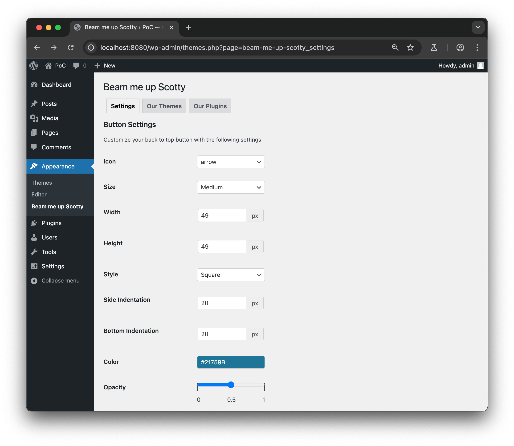
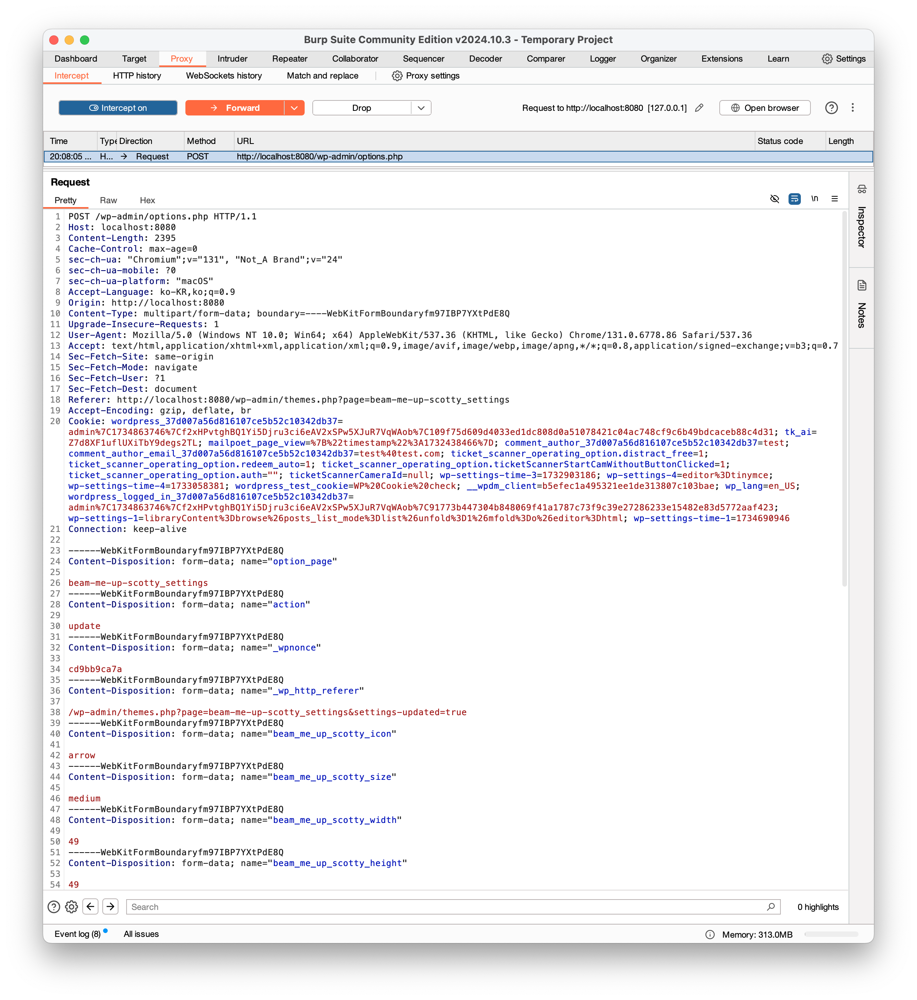
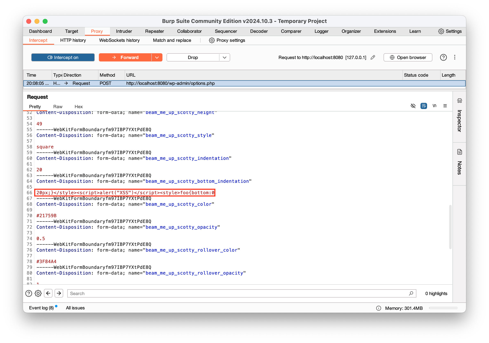
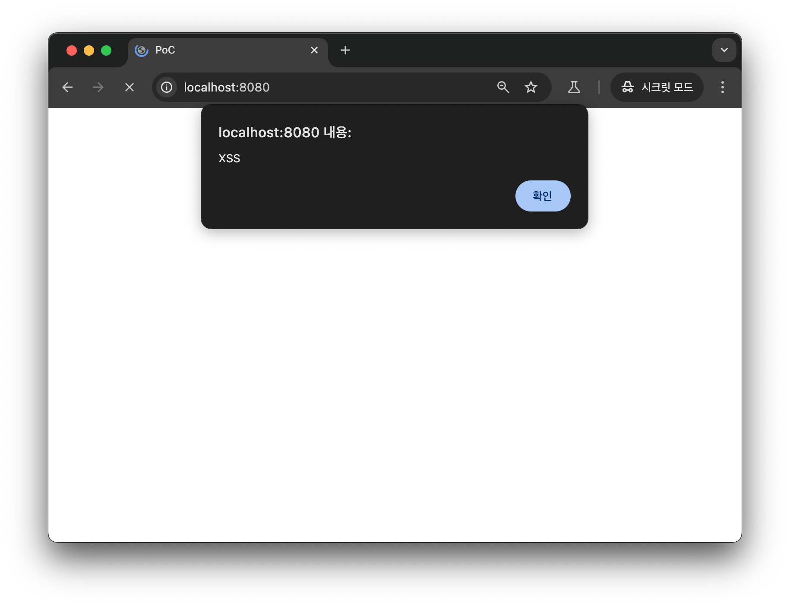
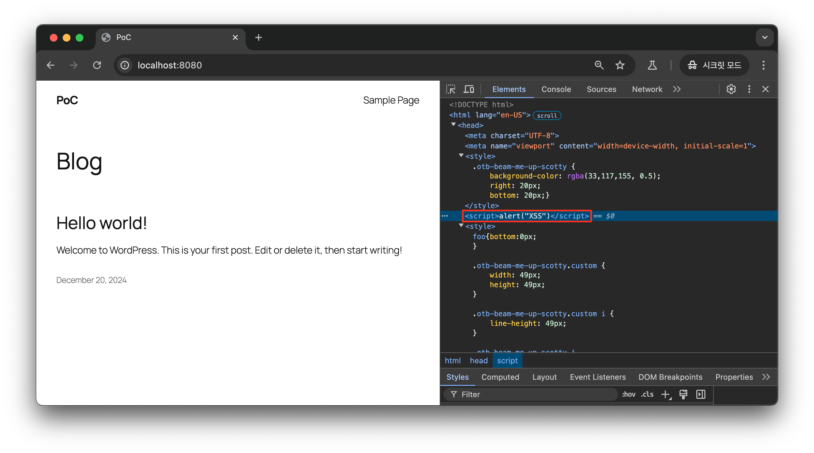
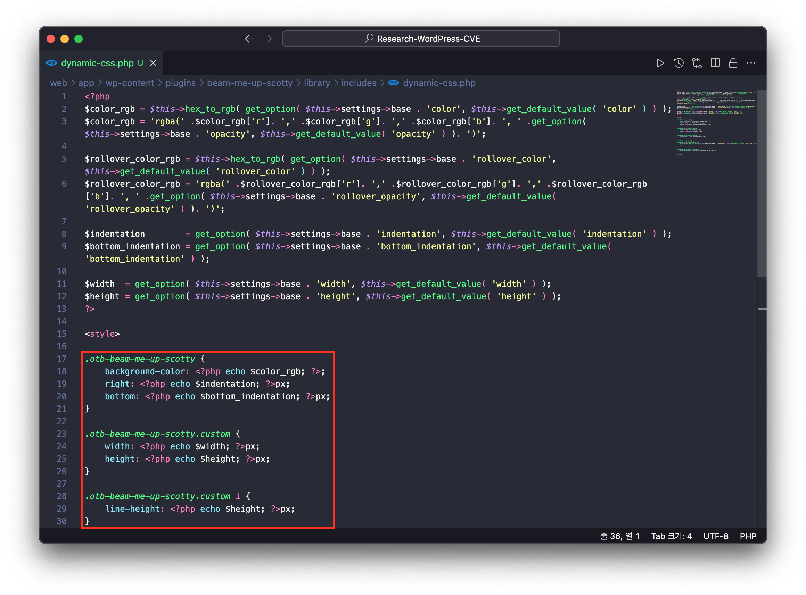
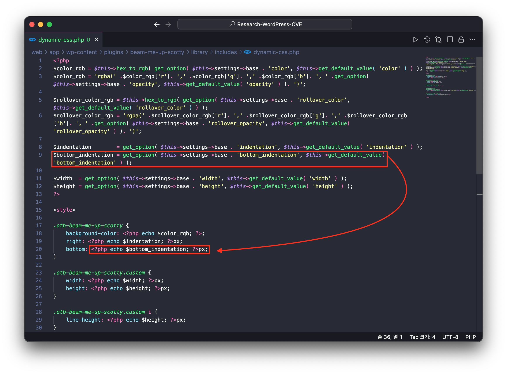
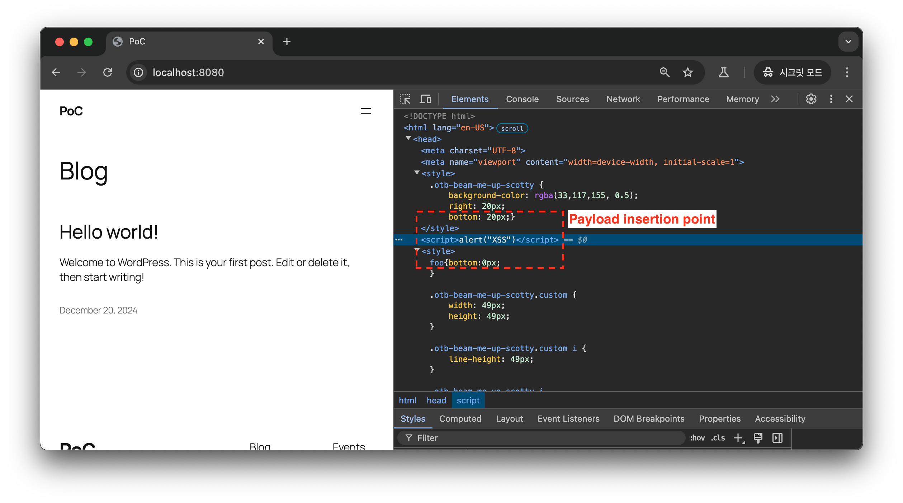

# CVE-2025-31864

## 1️⃣ Component type

WordPress plugin

## 2️⃣ Component details

`Component name` Beam me up Scotty – Back to Top Button

`Vulnerable version` <= 1.0.23

`Component slug` beam-me-up-scotty

`Component link` https://wordpress.org/plugins/beam-me-up-scotty/

## 3️⃣ OWASP 2017: TOP 10

`Vulnerability class` A3: Injection

`Vulnerability type` Cross Site Scripting (XSS)

## 4️⃣ Pre-requisite

Administrator

## 5️⃣ **Vulnerability details**

### 👉 **Short description**

In versions 1.0.23 and below of the Beam me up Scotty plugin, there exists a stored cross-site scripting vulnerability due to insufficient data type validation and escape processing for the ‘back to top button’ customization settings.

These customization settings are only accessible to users with administrator privileges, and if an attacker with administrator rights exploits this vulnerability, visitors to all pages where the ‘back to top button’ is displayed will be exposed to cross-site scripting attacks.

### 👉 **How to reproduce (PoC)**

1. Prepare a WordPress site with Beam me up Scotty plugin version 1.0.23 or lower installed and activated.
2. Navigate to the menu for customizing the ‘back to top button’(`/wp-admin/themes.php?page=beam-me-up-scotty_settings`).
    
    
    
3. With a proxy tool (e.g., BurpSuite) Intercept enabled, click the 'Save' button at the bottom of the ‘back to top button’ settings menu to intercept the request packet that saves the ‘back to top button’ customization settings.



1. Change the value of the payload `beam_me_up_scotty_bottom_indentation` in the request payload to the following, then perform Forward.
    
    ```jsx
    20px;}</style><script>alert("XSS")</script><style>foo{bottom:0
    ```
    
    
    
2. After accessing the WordPress site, you can confirm that the XSS vulnerability occurs.
    
    
    
    
    

### 👉 **Additional information (optional)**

#### [Root Cause of Vulnerability]

The Beam me up Scotty plugin executes the file `/wp-content/plugins/beam-me-up-scotty/library/includes/dynamic-css.php` to apply the customization settings for the ‘back to top button’.

This file sets the customization settings as style attribute values for the ‘back to top button’ within the style tag. At this point, you can verify that the customization settings for the ‘back to top button’ are referenced in the style tag without any escape processing.



Therefore, as shown in the PoC, we can confirm that when the payload `beam_me_up_scotty_bottom_indentation` containing the XSS attack script is input, the script executes because its value is referenced as the style attribute value of the ‘back to top button’ without any escape processing.



As a result, when accessing the WordPress site, you can verify the following HTML code.



## 6️⃣ Exploit Demo

[](https://www.youtube.com/watch?v=qoYc1ruhyA8)

## 7️⃣ References

- [https://nvd.nist.gov/vuln/detail/CVE-2025-31864](https://nvd.nist.gov/vuln/detail/CVE-2025-31864)