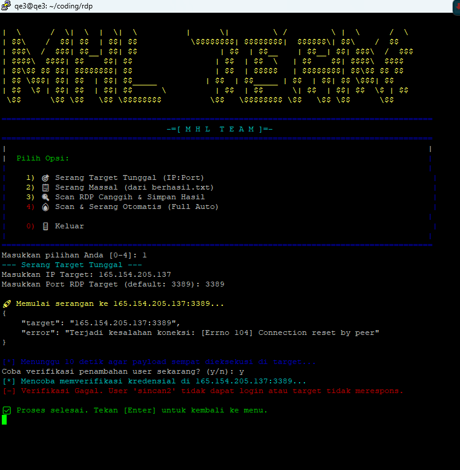
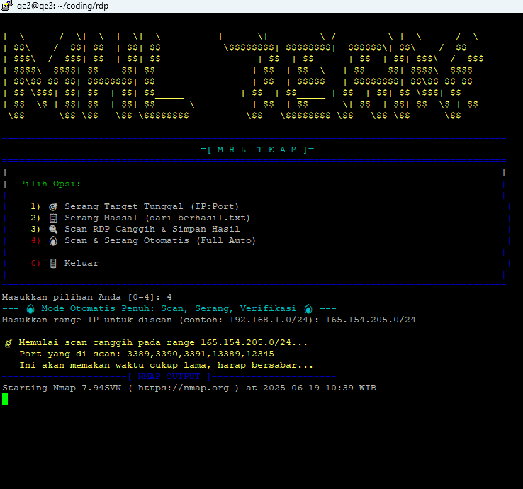
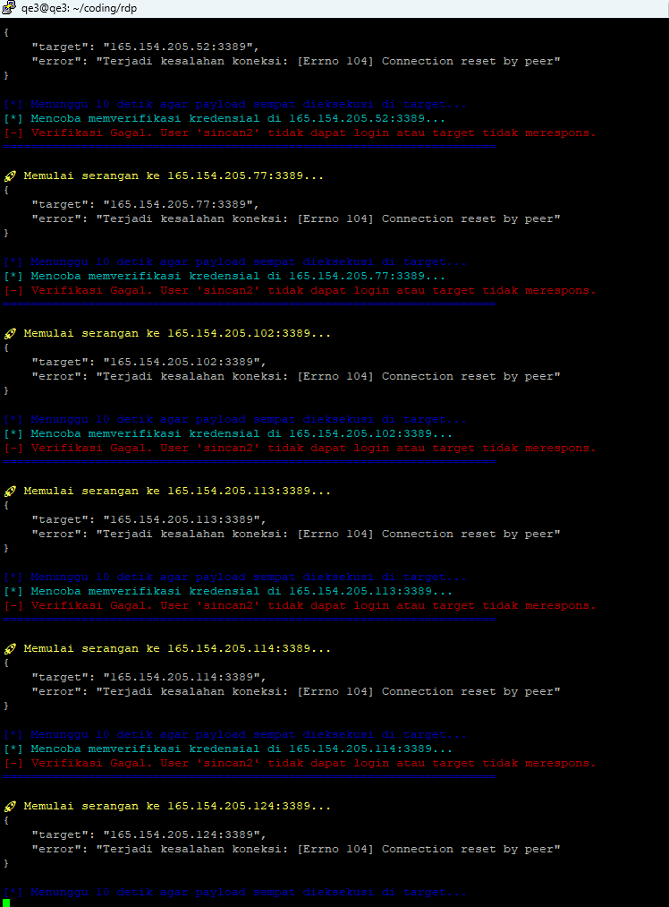

# RCE-CVE-2025-32710
Windows Remote Desktop Services Vulnerability Allows Remote Code Execution





---

````markdown
# 💥 RDP Auto-Pwn (RCE-CVE-2025-32710)

> **Eksploitasi Otomatis untuk Layanan RDP yang Rentan (BlueKeep & Beyond)**  
> 🔓 Membuat akun admin • 🪟 Mengaktifkan RDP • 📶 Verifikasi akses otomatis

---

## ⚠️ Peringatan Penting & Disclaimer

> 🚨 **PERINGATAN:**  
> Alat ini hanya untuk **penelitian keamanan**, **pembelajaran**, dan **pengujian penetrasi yang sah**.  
> Menggunakan alat ini tanpa izin eksplisit dari pemilik sistem adalah **ilegal** dan melanggar hukum.  
> Penulis tidak bertanggung jawab atas segala penyalahgunaan.  
> 🛑 **Gunakan dengan risiko Anda sendiri.**

---

## ✨ Fitur Utama

✅ **Menu Interaktif:** UI terminal berwarna & ramah pengguna  
🔐 **Payload Kustom:** Membuat akun `sincan2:koped123` dengan hak admin  
🧩 **Aktivasi RDP Otomatis:** Modifikasi registry & firewall secara otomatis  
🔎 **RDP Scanner Canggih:** Pakai Nmap + NSE + -sV untuk mendeteksi port RDP  
📡 **Verifikasi Otomatis:** Gunakan `xfreerdp` untuk cek apakah exploit sukses  
⚡ **Full Auto Mode:** Sekali klik untuk menjalankan semua tahapan  
📄 **Manajemen Laporan:** Otomatis menyimpan hasil ke `cok.txt` dan `scan_lengkap.txt`

---

## ⚙️ Prasyarat & Dependensi

💻 Direkomendasikan OS: **Kali Linux / Ubuntu / Debian**  
🔧 Perangkat lunak wajib:

- Python 3
- Nmap
- FreeRDP (`xfreerdp`)

---

## 🚀 Instalasi & Setup

1. 🔽 **Clone Repositori**

```bash
git clone https://github.com/Sincan2/RCE-CVE-2025-32710.git
cd RCE-CVE-2025-32710
````

2. 📦 **Install Dependensi**

```bash
sudo apt update && sudo apt install python3 nmap freerdp2-x11 -y
```

3. 🔓 **Beri Izin Eksekusi**

```bash
chmod +x run.sh
```

---

## 🛠️ Cara Penggunaan

▶️ Jalankan skrip:

```bash
./run.sh
```

Anda akan melihat menu utama. Pilih sesuai kebutuhan:

### 🎯 Opsi 1: Serang Target Tunggal

🔹 Masukkan IP\:PORT → eksploitasi langsung → tawarkan verifikasi

### 📋 Opsi 2: Serang Massal (berhasil.txt)

🔹 Gunakan hasil dari Opsi 3 → eksploitasi per target → verifikasi otomatis

### 🔍 Opsi 3: Scan RDP Canggih

🔹 Masukkan IP Range → hasil ke `scan_lengkap.txt` & `berhasil.txt`

### 🔥 Opsi 4: Scan & Serang Otomatis

🔹 Full otomatis: `Scan -> Attack -> Verify -> Save -> Cleanup`

### 🚪 Opsi 0: Keluar

🔹 Keluar dari aplikasi

---

## 📂 Struktur File Output

| File               | Keterangan                                                  |
| ------------------ | ----------------------------------------------------------- |
| `berhasil.txt`     | 💠 Target potensial hasil scan                              |
| `scan_lengkap.txt` | 📄 Output mentah dari Nmap                                  |
| `cok.txt`          | 🏆 Daftar target yang berhasil dieksploitasi & diverifikasi |

---

## 💡 Contoh Alur Kerja (Workflow)

🎯 **Target:** Eksploitasi otomatis semua server RDP di `10.10.0.0/16`

1. Jalankan: `./run.sh`
2. Pilih: **Opsi 4: Full Auto**
3. Masukkan range IP: `10.10.0.0/16`
4. Tunggu proses `scan → exploit → verifikasi`
5. Periksa hasil di file: `cok.txt` ✅

---

## 🧠 Catatan Tambahan

* Anda dapat memodifikasi payload untuk tujuan spesifik di file `sodok.py`
* Disarankan menggunakan VPS yang tidak terkait identitas Anda untuk pengujian
* Untuk bypass antivirus, pertimbangkan obfuscation payload

---

## 📫 Kontak

👤 Author: [Sincan2](https://github.com/Sincan2)

---

## ⭐ Dukung & Beri Bintang!

Jika Anda merasa proyek ini bermanfaat, jangan lupa beri ⭐ di [GitHub Repo](https://github.com/Sincan2/RCE-CVE-2025-32710) untuk mendukung pengembangan lebih lanjut.

```
