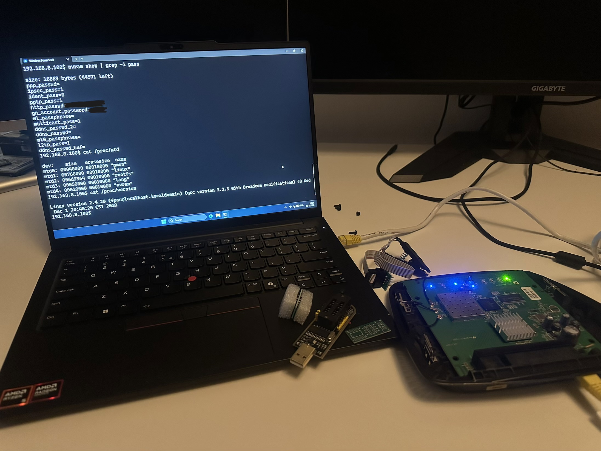

# CVE-2025-34037
Python port of the Linksys tmUnblock.cgi RCE exploit

For educational use only. Run against your own devices.

## Vulnerability

The ```tmUnblock.cgi``` endpoint on several Linksys router models accept POST requests without validating the Authorization header. the ```ttcp_ip``` parameter is passed directly to a shell command, allowing unauthenticated remote code execution via command injection.

Affects, among others, E4200 E3200 E3000 E2500 E2100L E2000 E1550 E1500 E1200 E1000 E900 E300 WRT610N WRT400N WRT320N WRT160N

## Usage

Edit the 'HOST' and 'PORT' at the top of the script. Then run ```python3 exploit.py```

If succesful, the script stages a MIPS bind shell onto ```/tmp/c0d3z``` and connects on port 4444. It might not work on the first try; try disconnecting the ethernet cable and replugging.

### References

https://www.exploit-db.com/exploits/31683


