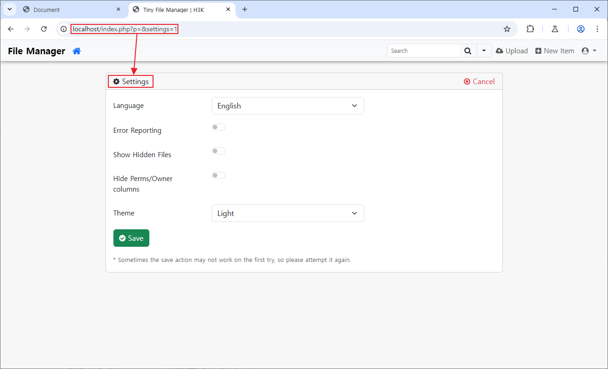
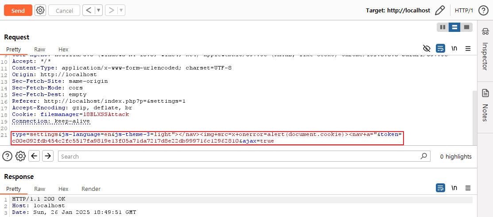
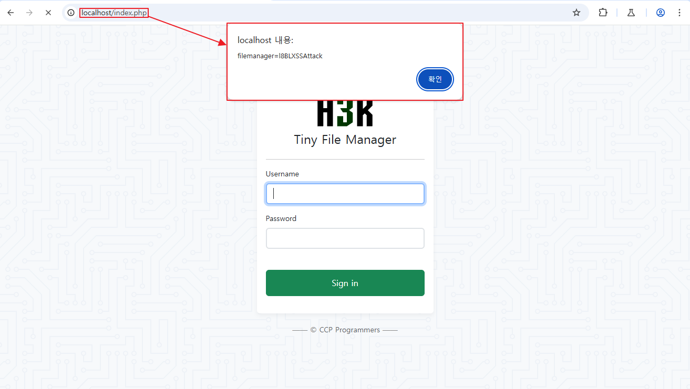
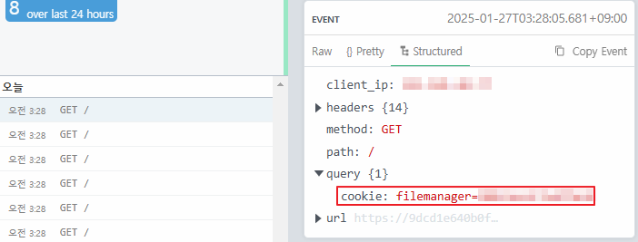
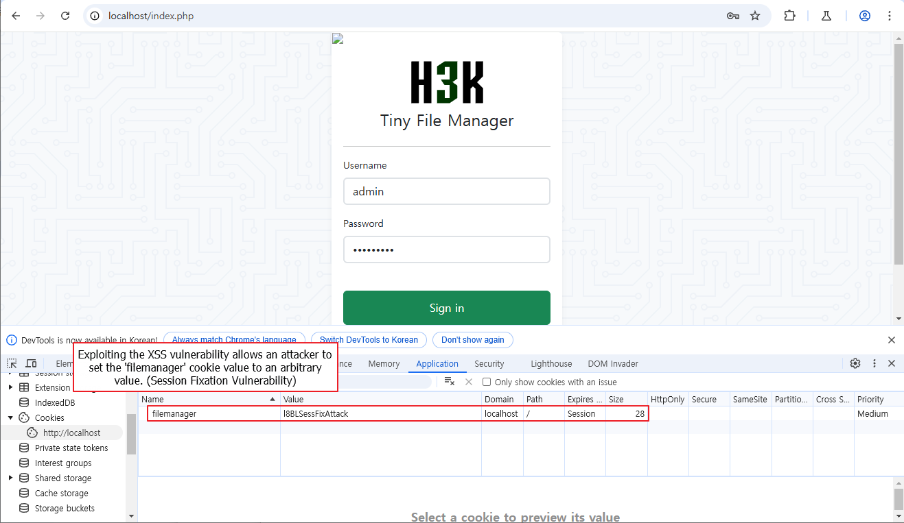

## CVE-2025-44998

### Summary
A stored cross-site scripting (XSS) vulnerability in the component `/tinyfilemanager.php` of TinyFileManager v2.4.7 allows attackers to execute arbitrary JavaScript or HTML via injecting a crafted payload into the `js-theme-3` parameter.

### PoC
- To check for vulnerabilities, go to the Settings page (url: http://localhost/index.php?p=&settings=1).

- While sending the request, modify the value of the `js-theme-3` parameter to the following payload: `light“></nav><nav+a=” `

- The injected script will then execute and can run throughout the page, including the login screen.

### Impact
- The `filemanager` cookie, which is used as the session ID, does not have the httpOnly flag set, making it vulnerable to HTTP session cookie hijacking.

- Combined with the previously reported session fixation vulnerability(CVE-2022-40916), this could allow an attacker to log in as any user by using a fixed 'filemanager' cookie value every time they log in.
