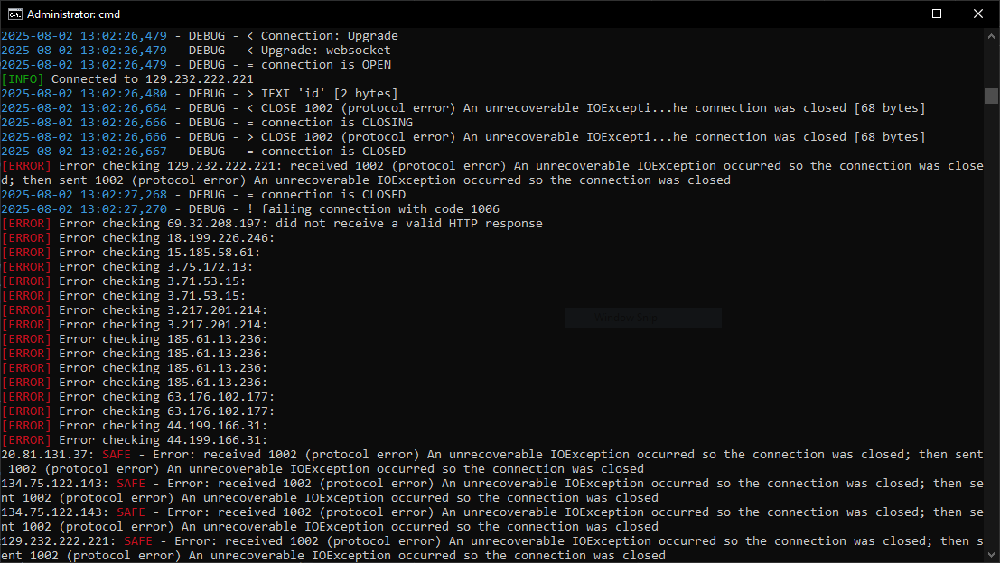

<h1 align="center">SUSE Manager Exploit Toolkit</h1>

  <strong>CVE-CVE-2025-46811 Scanner & Exploiter</strong> 
  
  

<h2>🚀 Features</h2>
<ul>
  <li>Multi-threaded vulnerability scanning</li>
  <li>Interactive root shell via WebSocket</li>
  <li>Single command execution mode</li>
  <li>Colored debug output</li>
  <li>Batch processing of targets</li>
</ul>

<h2>📦 Installation</h2>
<pre><code>git clone https://github.com/yourusername/suse-manager-exploit.git
cd suse-manager-exploit
pip install -r requirements.txt</code></pre>

<h2>🛠 Usage</h2>
<h3>Scan Mode</h3>
<pre><code>python3 exploit.py scan -i targets.txt -o vulnerable.txt --debug</code></pre>

<h3>Exploit Mode</h3>
<pre><code># Single command
python3 exploit.py exploit 10.0.0.5 -c "cat /etc/passwd"

# Interactive shell
python3 exploit.py exploit vulnerable.com --debug</code></pre>

<h2>🎯 Screenshot</h2>

<h2>⚙ Technical Details</h2>
<table>
  <tr>
    <th>Component</th>
    <th>Description</th>
  </tr>
  <tr>
    <td>WebSocket Endpoint</td>
    <td><code>/rhn/websocket/minion/remote-commands</code></td>
  </tr>
  <tr>
    <td>Vulnerability Check</td>
    <td>Verifies root command execution via <code>id</code></td>
  </tr>
  <tr>
    <td>SSL Handling</td>
    <td>Bypasses certificate verification</td>
  </tr>
</table>

<h2>⚠ Disclaimer</h2>

<em>This tool is for authorized penetration testing and educational purposes only. Usage against systems without prior permission is illegal.</em>

<h2>📜 License</h2>

MIT - Copyright (c) 2023

