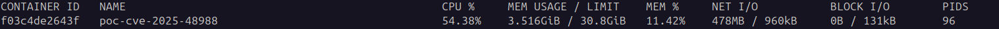

# CVE-2025-48988 & CVE-2025-48976
## About
This project runs a simple file upload endpoint with Tomcat 10.1.41 and a Jakarta Servlet.

The exploit runs, by default, 1000 parallelized multipart requests with 1000 parts and 50 headers by part, from 50 workers.

## Run POC
Build and run the Docker container:

```docker build -t poc-cve-2025-48988 .```

```docker run -p 8080:8080 poc-cve-2025-48988```

Launch the exploit:

```python3 exploit-cve-2025-48988.py```

Monitor container resource usage:

```docker stats```

You will observe a significant increase in CPU usage:


## Remediation
Change docker image in dockerfile from `tomcat:10.1.41-jdk17` to `tomcat:10.1.42-jdk17`

With its default configuration, Tomcat will now respond with a 500 status code and CPU usage will remain stable, as per [fix](https://github.com/apache/tomcat/commit/667ddd76e2a0e762f3a784d86f0d25e7fd7cdb86#diff-1c3529b11adf91d5683a4d5394264b2f71383677ff4fb07f30f3e70c11b8e585R488-R877) introduced in Tomcat 10.1.42.