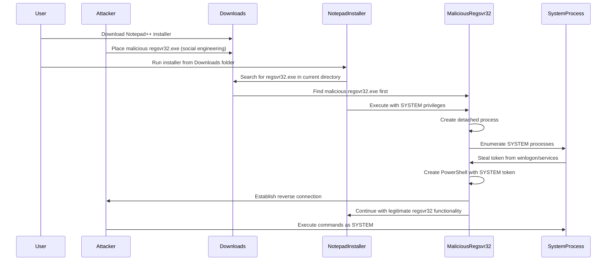

# Notepad++ Binary Planting PoC (CVE-2025-49144)

> **⚠️ EDUCATIONAL PURPOSE ONLY**  
> This code is designed for educational and research purposes to understand binary planting vulnerabilities. Use only in controlled environments with proper authorization.

## 📋 Overview

This Proof of Concept demonstrates the binary planting vulnerability in Notepad++ installer (CVE-2025-49144) referenced in [GHSA-9vx8-v79m-6m24](https://github.com/notepad-plus-plus/notepad-plus-plus/security/advisories/GHSA-9vx8-v79m-6m24). The vulnerability allows an attacker to gain SYSTEM-level privileges by placing a malicious executable named `regsvr32.exe` in the same directory as the Notepad++ installer.

## 🎯 Vulnerability Details

- **Target**: Notepad++ installer (all versions before v8.8.2)
- **Method**: Binary planting via malicious `regsvr32.exe` 
- **Root Cause**: Notepad++ installers invoke system binaries like regsvr32 without specifying absolute paths
- **Impact**: When a user runs the installer, the system automatically loads the malicious file with SYSTEM privileges, granting an attacker complete control over the target machine
- **Attack Vector**: Social engineering or clickjacking to trick users into downloading both the legitimate installer and a malicious executable to the same directory (typically Downloads folder)

## 🏗️ Architecture

The PoC consists of multiple components working together:

```
┌─────────────────┐    ┌──────────────────┐    ┌─────────────────┐
│ Notepad++       │    │ Malicious        │    │  Reverse Shell  │
│ Installer       │───▶│ regsvr32.exe     │───▶│   (PowerShell)  │
│ (searches for   │    │ (CGO binary)     │    │  with SYSTEM    │
│  regsvr32.exe)  │    │                  │    │  privileges     │
└─────────────────┘    └──────────────────┘    └─────────────────┘
```

### Core Components

| File | Purpose | Lines |
|------|---------|-------|
| `main.go` | Entry point, handles regsvr32 execution | ~80 |
| `winbind.h` | Main header with function declarations | ~45 |
| `main.c` | Core reverse shell launcher and detached process creation | ~75 |
| `shell.c` | Shell handler with obfuscated PowerShell execution | ~120 |
| `process.c` | Token acquisition and SYSTEM process creation | ~195 |
| `socket.c` | Network connection with TCP keep-alive | ~85 |
| `threads.c` | I/O threading between socket and pipes | ~60 |
| `utils.c` | Input validation and rate limiting | ~35 |
| `obfuscate.c` | PowerShell path obfuscation techniques | ~70 |

## 🔧 Technical Features

### 🛡️ Evasion Techniques
- **String Obfuscation**: PowerShell path is XOR-encoded to avoid static detection
- **Detached Processes**: Creates independent processes that survive parent termination
- **Token Impersonation**: Escalates privileges by stealing SYSTEM tokens
- **Process Hollowing**: Injects code into legitimate Windows processes

### 🌐 Network Capabilities
- **TCP Keep-Alive**: Maintains persistent connections through firewalls
- **Connection Retry**: Automatic reconnection with configurable delays
- **Timeout Handling**: Non-blocking socket operations with proper timeouts
- **Rate Limiting**: Prevents connection spam and detection

### 💻 System Integration
- **CGO Integration**: Seamless Go-to-C interoperability for system calls
- **Executable Masquerading**: Mimics legitimate regsvr32.exe behavior
- **Multi-threading**: Separate threads for stdin/stdout/stderr handling
- **Error Recovery**: Graceful handling of connection failures and process exits
- **Resource Management**: Proper cleanup of handles, sockets, and memory

## 🚀 Build Instructions

### Prerequisites
```bash
# Install Go (1.24+)
# Install MinGW-w64 for CGO compilation
# Install Git for version control
```

### Compilation
```bash
# Clone the repository
git clone https://github.com/Vr00mm/CVE-2025-49144
cd CVE-2025-49144

# Build as executable (masquerading as regsvr32.exe)

# For maximum stealth (strip debug info)
go build -ldflags="-s -w" -o regsvr32.exe

# For development (with debug symbols)
go build -o regsvr32_debug.exe
```

## 📖 Usage

### Binary Planting (Primary Attack Vector)
```bash
# 1. Place malicious regsvr32.exe in same directory as Notepad++ installer
# Usually the Downloads folder where users download the installer
copy regsvr32.exe "C:\Users\%USERNAME%\Downloads\"

# 2. User downloads official Notepad++ installer to Downloads folder
# 3. When user runs the installer, it searches for regsvr32.exe in current directory first
# 4. Installer finds and executes our malicious regsvr32.exe with SYSTEM privileges

# 5. Listen for incoming reverse shell connection
ncat -tlnp 4445
```

## 🔍 Attack Flow



## 🎓 Educational Aspects

### Security Concepts Demonstrated

1. **Binary Planting**
   - Insecure executable search path behavior
   - Privilege escalation through installer vulnerabilities
   - Social engineering attack vectors

2. **Privilege Escalation**
   - Token impersonation methods
   - Process token stealing
   - SYSTEM-level access acquisition

3. **Persistence Mechanisms**
   - Detached process creation
   - Service process mimicry
   - Connection retry logic

4. **Network Programming**
   - Reverse shell implementation
   - Socket programming in C
   - Cross-platform networking

5. **CGO Programming**
   - Go-to-C interoperability
   - System-level programming in Go
   - Cross-language integration

### Learning Objectives

- Understand how binary planting vulnerabilities work
- Learn about insecure executable search paths in installers
- Explore Windows privilege escalation via installer flaws
- Study social engineering attack vectors
- Practice CGO programming and cross-language integration
- Practice secure coding and vulnerability analysis

## 🛡️ Detection and Mitigation

### Detection Methods
```powershell
# Monitor for suspicious regsvr32 usage
Get-WinEvent -FilterHashtable @{LogName='Microsoft-Windows-PowerShell/Operational'; ID=4104}

# Check for unusual network connections
netstat -ano | findstr ":4445"

# Monitor process creation
Get-WinEvent -FilterHashtable @{LogName='Security'; ID=4688}
```

### Mitigation Strategies
- **Immediate Action**: Upgrade to Notepad++ v8.8.2 or later which explicitly sets absolute paths when invoking executables like regsvr32
- **Application Whitelisting**: Use tools like AppLocker or Windows Defender Application Control
- **Executable Verification**: Implement digital signature verification for all executables
- **Path Validation**: Ensure applications use full paths to system utilities
- **Least Privilege**: Run applications with minimal required permissions
- **Network Monitoring**: Monitor for unusual outbound connections
- **Endpoint Detection**: Deploy EDR solutions to detect process hollowing
- **Configuration Check**: Avoid executing installers from user-writable locations like the Downloads folder

## ⚖️ Legal and Ethical Considerations

### ⚠️ Important Disclaimers

- **Authorization Required**: Only use in environments you own or have explicit permission to test
- **Educational Purpose**: This code is designed for learning and security research
- **No Malicious Intent**: Not intended for unauthorized access or illegal activities
- **Responsible Disclosure**: Report any vulnerabilities found through proper channels

### Ethical Guidelines

1. **Responsible Use**: Use only for legitimate security testing and education
2. **No Unauthorized Access**: Never deploy against systems without permission
3. **Proper Attribution**: Credit original researchers and vulnerability discoverers
4. **Knowledge Sharing**: Share findings responsibly with the security community

## 🔧 Troubleshooting

### Common Issues

**Connection Failures**
```bash
# Check if port is available
netstat -ano | findstr ":4445"

# Verify firewall settings
netsh advfirewall firewall show rule name=all | findstr "4445"
```

**Build Errors**
```bash
# Ensure CGO is enabled
set CGO_ENABLED=1

# Check MinGW installation
gcc --version

# Verify Go installation supports CGO
go env CGO_ENABLED
```

**Token Acquisition Failures**
- Ensure the program runs with sufficient privileges
- Check if SYSTEM processes are available for token stealing
- Verify Windows version compatibility
- Note: This vulnerability affects all Notepad++ versions before v8.8.2, so the PoC should work on a wide range of installations

## 📚 References

- [CVE-2025-49144 Repository](https://github.com/Vr00mm/CVE-2025-49144)
- [Notepad++ Security Advisory GHSA-9vx8-v79m-6m24](https://github.com/notepad-plus-plus/notepad-plus-plus/security/advisories/GHSA-9vx8-v79m-6m24)
- [NVD CVE-2025-49144](https://nvd.nist.gov/vuln/detail/CVE-2025-49144)
- [MITRE ATT&CK T1574.007 - Path Interception by PATH Environment Variable](https://attack.mitre.org/techniques/T1574/007/)
- [MITRE ATT&CK T1134 - Access Token Manipulation](https://attack.mitre.org/techniques/T1134/)
- [Microsoft Documentation - Secure Binary Loading](https://docs.microsoft.com/en-us/windows/win32/dlls/dynamic-link-library-security)

## 📄 License

This project is released under the MIT License for educational purposes. See LICENSE file for details.

---

**Remember**: This tool is for educational and authorized testing purposes only. Always follow responsible disclosure practices and respect legal boundaries.