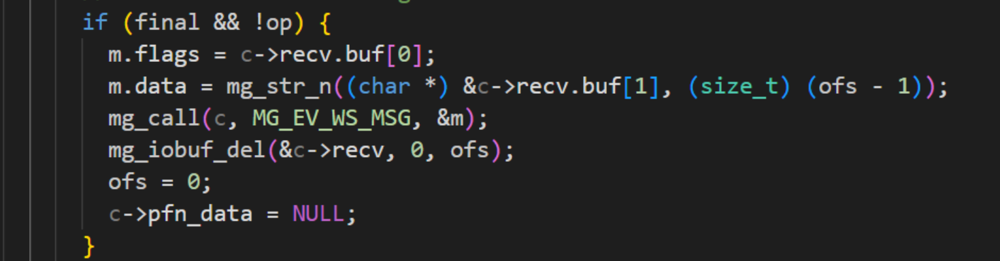
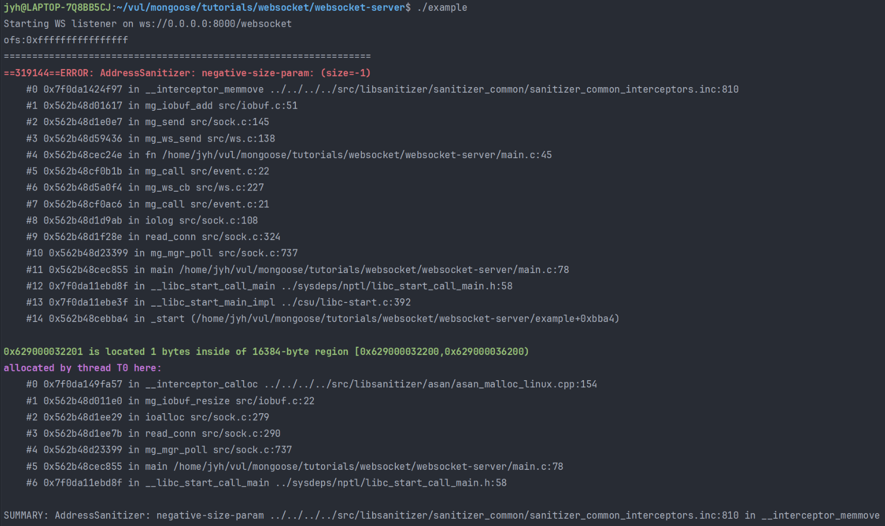
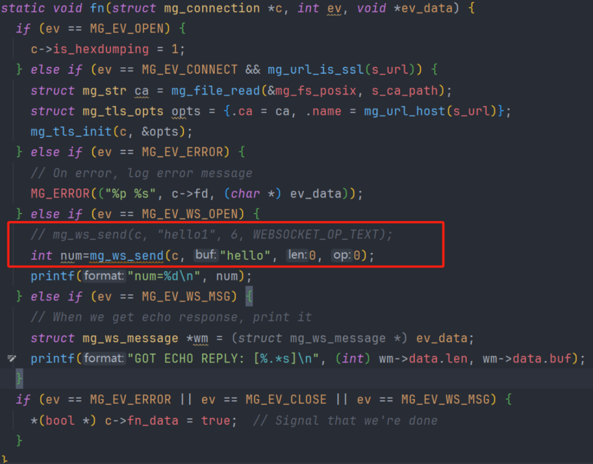

I would like to report a security vulnerability identified in the latest release of Mongoose (v7.17). The issue resides in the WebSocket module, specifically within the mg_ws_cb function responsible for handling incoming WebSocket frames.

The function is vulnerable to an integer overflow, which may lead to out-of-bounds memory access under certain crafted inputs. This condition could potentially be exploited by a remote attacker to cause memory corruption or crash the application.

Due to different vendors implementing WebSocket business logic differently, this vulnerability could potentially lead to remote code execution.  

Details:

The root vulnerability lies in the mg_ws_cb function:

A specially crafted WebSocket packet sent by the client can set ofs=0 at this point, which will cause an integer overflow when calculating ofs-1, resulting in a value much larger than the length of recv.buf.

In subsequent WebSocket processing functions, this buf may be used, and since its length is greater than the actual length, it can lead to out-of-bounds access or program crashes.

Vulnerability trigger :

For the sake of demonstration, I chose the existing websocket example named "websocket-server" in the project. I made no changes to the code except for adding ASAN checks during compilation.
When running the program and sending a specific websocket packet, it directly causes a crash.

poc:

I also chose the existing "websocket-client" in the project as the client, and made modifications only to the two parameters in the fn function of main.c for sending the request.

Running the modified program will cause the server to crash.