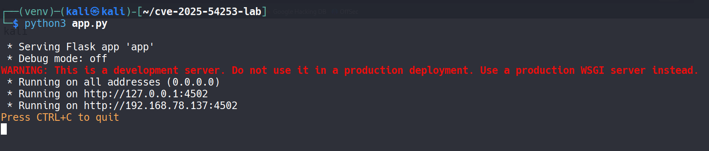
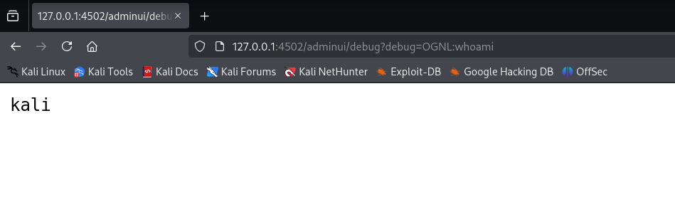
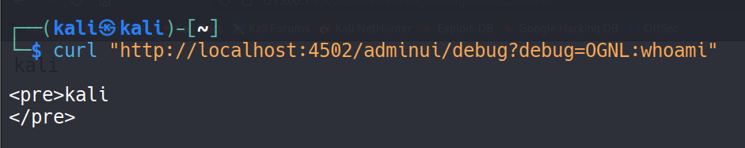
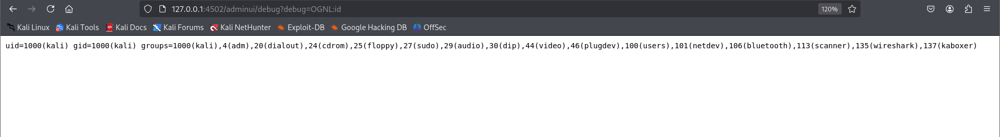
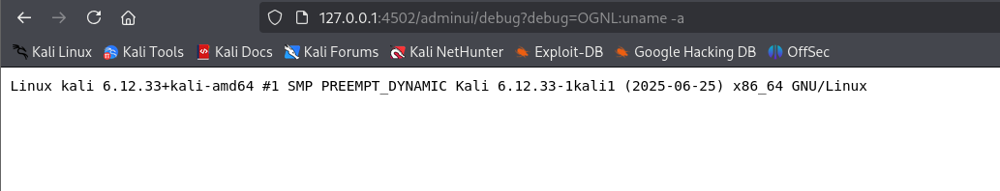
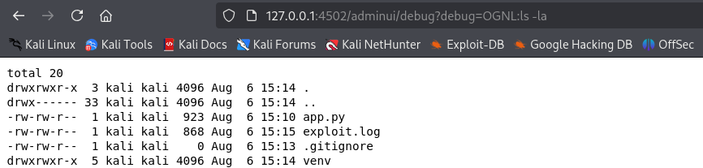
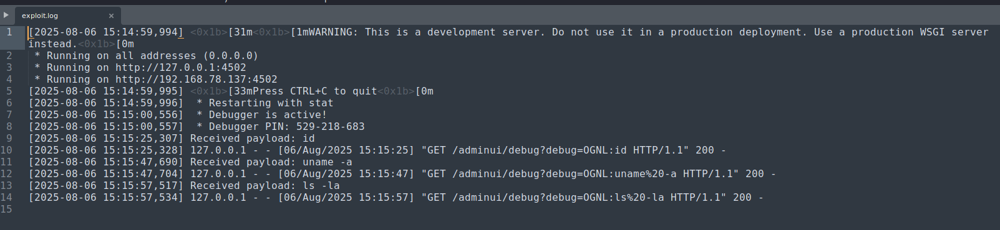
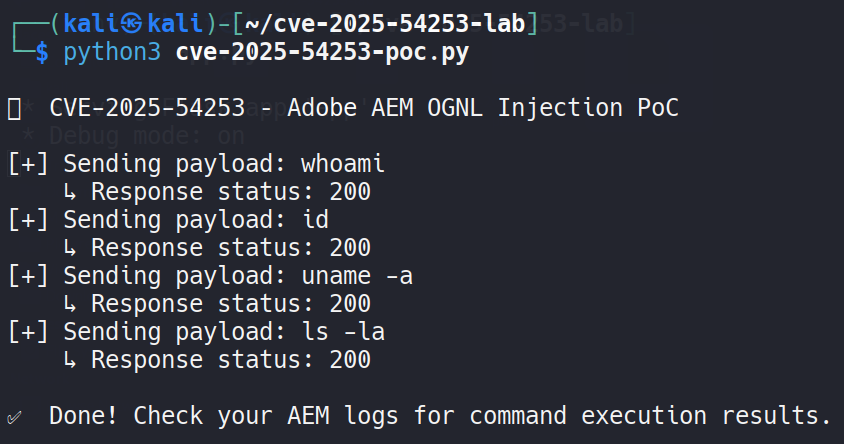
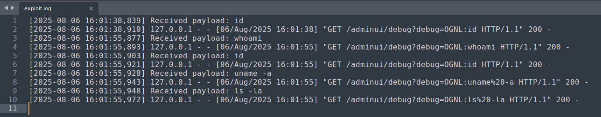

# 🚨 CVE-2025-54253 – Adobe AEM Forms on JEE OGNL Injection to RCE

## 🔎 Overview

**CVE-2025-54253** is a critical OGNL injection vulnerability in **Adobe AEM Forms on JEE**. It allows unauthenticated attackers to execute arbitrary operating system commands via the `/adminui/debug?debug=OGNL:` endpoint.

- **Severity:** Critical
- **CVSS Score:** 9.8 (Pending)
- **Attack Vector:** Remote
- **Authentication Required:** No
- **Affected Product:** Adobe AEM Forms on JEE (<= 6.5.23.0)
- **Status:** Confirmed exploitability

---

## 🧠 Technical Details

This vulnerability lies in an exposed debugging interface that evaluates user-controlled OGNL expressions without proper sanitization or authentication. Exploiting it can lead to remote code execution under the context of the application server.

> 📝 **Note:** This vulnerability affects installations that expose `/adminui/debug` endpoint publicly or internally without proper access control.

---

## 🧪 Proof of Concept (PoC)

### 🔸 HTTP Payload Vector

Simple OGNL expressions demonstrate command execution via browser or curl.

```bash
curl "http://localhost:4502/adminui/debug?debug=OGNL:whoami"
```

### 📄 PoC Script

[`cve-2025-54253-poc.py`](./poc/cve-2025-54253-poc.py)

```bash
python3 poc/cve-2025-54253-poc.py --url http://127.0.0.1:4502 --cmd "whoami"
```

### 🧾 Sample Exploit Log

The script logs command execution output to `exploit.log`:

[`exploit.log`](./logs/exploit.log)

---

## 🛠️ Steps to Reproduce

1. Set up a vulnerable Adobe AEM instance (<= 6.5.23.0).
2. Start Flask server (if simulating locally):  
   

3. Execute OGNL in browser:  
   

4. Execute via curl:  
   

5. Output from commands:  
     
     
   

6. Flask logging view:  
   

7. PoC script run:  
   

8. Verbose log view:  
   

---

## 🧰 Tools & Technologies Used

- Python (PoC scripting)
- Flask (simulated server)
- Kali Linux
- curl & browser
- GitHub (PoC publishing)

---

## ✅ Mitigation

- Restrict access to `/adminui/debug`
- Apply vendor patches as available
- Monitor for unauthorized OGNL expressions in access logs
- Use WAF or proxy filtering to block such patterns

---

> ⚠️ **Disclaimer:**  
> This PoC is for educational purposes only. Do **not** use it against systems you do not own or have explicit permission to test.

---

## 👨‍💻 Author

**Shivshant Patil**  
Certified Ethical Hacker (CEH v13)  
B.Tech Computer Engineering Graduate  
🔗 [LinkedIn](https://www.linkedin.com/in/shivshant-patil-b58aaa281)  
🔗 [GitHub](https://github.com/Shivshantp)

---

## 📚 References

- 🔗 [Adobe Security Advisory (placeholder)](https://helpx.adobe.com/security.html)
- 🔗 [NVD Entry - CVE-2025-54253](https://nvd.nist.gov/vuln/detail/CVE-2025-54253)
- 🔗 [Exploit Database](https://www.exploit-db.com)
