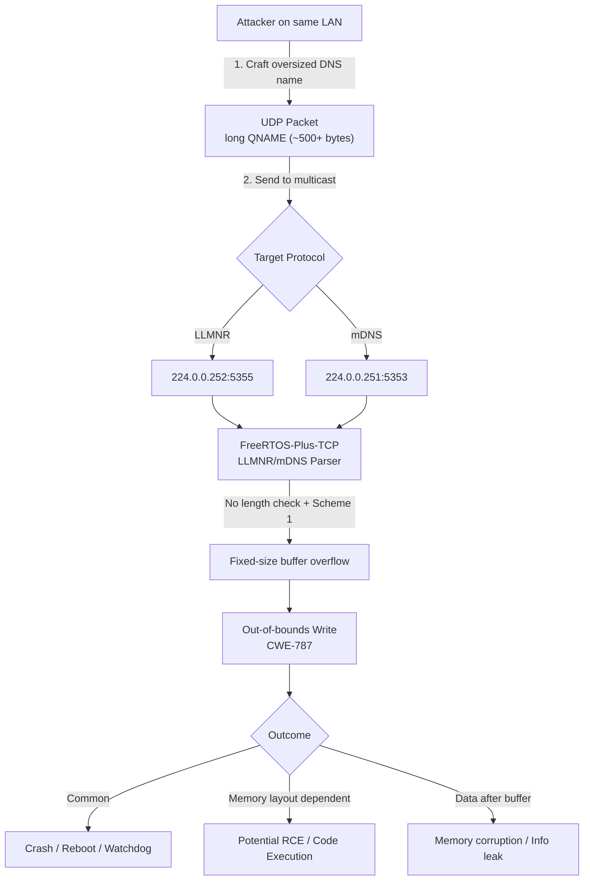

# CVE-2025-5688 – FreeRTOS-Plus-TCP Out-of-Bounds Write Exploit

[](https://nvd.nist.gov/vuln/detail/CVE-2025-5688)
[](https://nvd.nist.gov/vuln-metrics/cvss/v3-calculator?vector=AV:A/AC:L/PR:N/UI:N/S:C/C:L/I:L/A:H)
[](https://www.python.org/)
[](https://opensource.org/licenses/MIT)
[](https://github.com/FreeRTOS/FreeRTOS-Plus-TCP/security/advisories/GHSA-5x4f-fvv8-wr65)

**Remote memory corruption / DoS / potential RCE trigger** in FreeRTOS-Plus-TCP when processing overly long DNS names in LLMNR or mDNS queries (Buffer Allocation Scheme 1).

> **Exploit Author:** Mohammed Idrees Banyamer  
> **Country:** Jordan  
> **Instagram:** [@banyamer_security](https://www.instagram.com/banyamer_security/)  
> **Date:** December 26, 2025

## Overview

This PoC sends a specially crafted UDP multicast packet containing an excessively long DNS name to trigger an **out-of-bounds write (CWE-787)** in vulnerable versions of **FreeRTOS-Plus-TCP** (v2.3.4 – v4.3.1 with LLMNR/mDNS + Scheme 1).

Common symptoms on affected devices:
- Immediate crash / reboot
- Watchdog reset
- LED blink loop / freeze
- In rare memory-layout cases → possible code execution

**Affected Devices (examples)**  
- Sonoff RF Bridge (unpatched firmware)  
- Many cheap IoT gateways, bridges, embedded controllers using FreeRTOS-Plus-TCP

**Fixed in:** FreeRTOS-Plus-TCP 4.3.2 (strict length validation added)

**References**  
- [AWS Security Bulletin AWS-2025-012](https://aws.amazon.com/security/security-bulletins/AWS-2025-012/)  
- [GitHub Advisory GHSA-5x4f-fvv8-wr65](https://github.com/FreeRTOS/FreeRTOS-Plus-TCP/security/advisories/GHSA-5x4f-fvv8-wr65)  
- [NVD CVE-2025-5688](https://nvd.nist.gov/vuln/detail/CVE-2025-5688)

## Attack Flow Diagram

## Requirements

- Python 3.6+
- Standard library only (`socket`, `sys`) – no external packages

## Usage

```bash
# LLMNR attack (default multicast)
python3 exploit.py LLMNR

# mDNS attack
python3 exploit.py mDNS

# Custom multicast IP (rarely needed)
python3 exploit.py LLMNR 224.0.0.252
python3 exploit.py mDNS 224.0.0.251
```

**Expected output:**
```
[+] Sending 523-byte LLMNR query → target 224.0.0.252:5355
[+] Sent. Watch for immediate crash, reboot, LED blink loop, or freeze.
```

## How to Test Safely

1. Use a **vulnerable** Sonoff RF Bridge or custom FreeRTOS device in an **isolated lab network**.
2. Confirm LLMNR/mDNS is enabled (UDP 5355 or 5353 open).
3. Run the script from another machine on the same LAN.
4. Observe crash/reboot within seconds.

## Disclaimer – Legal & Ethical Notice

> This code is provided **for educational, research, and vulnerability demonstration purposes only**.  
> Do **NOT** use this exploit against any system or network without explicit written permission from the owner.  
> Unauthorized use may violate laws (computer fraud & abuse acts, etc.).  
> The author is **not responsible** for any misuse or damage.

## License

MIT License – see [LICENSE](LICENSE) file (or add one if missing).

---
